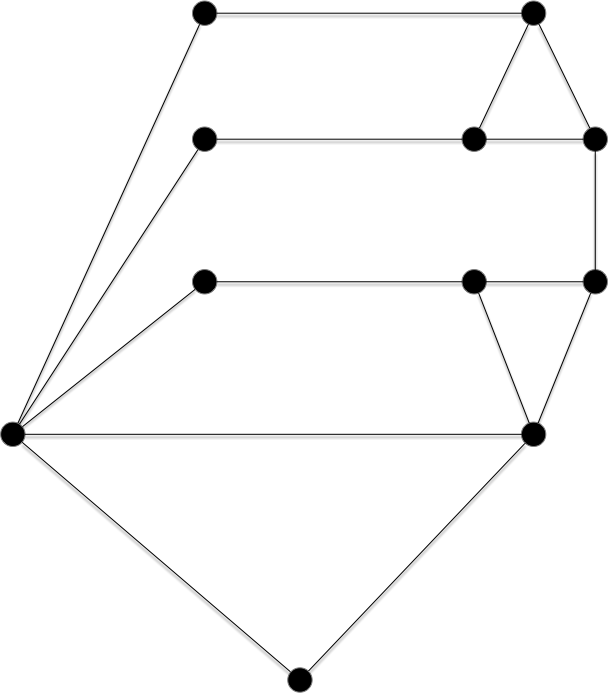
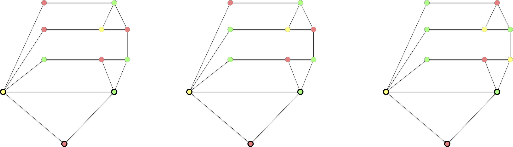
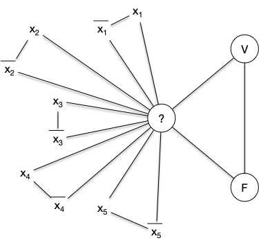

Certainement la plus populaires des colorations de graphes.

La coloration des sommets d'un graphe étant lié aux arêtes commençons par une proposition qui va nous permettre de ne considérer par la suite que des graphes connexes :


Pour tout graphe $G$, son nombre chromatique est égal au plus grand nombre chromatique maximum de ses parties connexes.



En coloriant chaque partie connexe $G_i$ avec des entiers de 1 à $\chi(G_i)$, on a bien le résultat demandé.


Cet proposition toute simple montre que l'on peut parfois utiliser des coloration de sous-graphes pour trouver une solution sur le graphe tout entier. On y reviendra.

Attention cependant, cela ne marche pas toujours. Il n'est par exemple pas possible de se restreindre (comme on en aurait envie) à une clique de taille maximum de $G$ (puisque $\omega(G) \leq \chi(G)$ pour tout graphe $G$) puis d'étendre sa coloration à tout le graphe. Cela ne marche pas : il existe des graphes sans triangles (donc avec $\omega(G) = 2$) dont le nombre chromatique peut être aussi grand qu'on veut !

> TBD théorème 8.6 <https://www-sop.inria.fr/members/Frederic.Havet/Cours/coloration.pdf>. prendre M4 et voir que sa coloration est grande. Dire qu'il en existe d'autres.
>
> TBD [graphe de Mycielski](https://fr.wikipedia.org/wiki/Graphe_de_Mycielski)
>

Mais voyons quelques exemples ou on peut décomposer la coloration d'un graphe en sous-parties de lui–même.

## Coloration et composition de graphes

La coloration de graphe peut se faire _plus ou moins_ par parties en  utilisant la [composition de graphes](../../structure/#composition-graphes){.interne} :


Pour deux graphes $G_1=(V_1, E_1)$ et $G_2=(V_2, E_2)$ on a :

- $\chi(G_1 + G_2) = \max(\\{\chi(G_1), \chi(G_2) \\})$
- $\chi(G_1 \lor G_2) = \chi(G_1) + \chi(G_2)$
- $\chi(G_1 \square G_2) = \max(\\{\chi(G_1), \chi(G_2) \\})$


Les deux premières propositions sont triviales.

Pour montrer la troisième, soient $c_1$ et $c_2$ des colorations de $G_1$ et $G_2$ respectivement et on pose $m = \max(\\{\chi(G_1), \chi(G_2) \\})$.

La fonction $c: V_1 \times V_2 \to \\{0, \dots, m-1\\}$ telle que $c((x, y)) = c_1(x) + c_2(y) \bmod m$ est une coloration de $G_1 \square G_2$. En effet si $\\{(x_1, y_1), (x_2, y_2)\\}$ est une arête de $G_1 \square G_2$ on a soit :

- $x_1 = y_1$ et $\vert c((x_1, y_1)) - c((x_2, y_2)) \vert = \vert c_2(x_2) - c_2(y_2) \vert > 0$ puisque $x_2y_2$ est une arête de $G_2$
- $x_2 = y_2$ et $\vert c((x_1, y_1)) - c((x_2, y_2)) \vert = \vert c_1(x_1) - c_1(y_1) \vert > 0 $ puisque $x_1y_1$ est une arête de $G_1$



> TBD exemples du cours papier.

Cela ne règle cependant pas le problème de trouver une coloration d'une des composante élémentaire. Commençons par essayer de trouver une coloration avec un algorithme glouton.

## Un algorithme glouton



- [Algorithme glouton](https://fr.wikipedia.org/wiki/Coloration_gloutonne)
- [Algorithme glouton en action](https://www.youtube.com/watch?v=L2csXWQMsNg)



L'algorithme est tout simple :

Les couleurs sont des entiers. On associe à chaque sommet la couleur valant le plus petit entier strictement positif non encore affecté à un de ses voisins (ceux étant avant lui dans l'ordre).

Ce qui donne le code :

```text
Soit v_1, ... v_n un ordonnancement des sommets de G


pour chaque i de 1 à n:
    c(vi) = min N^+ \ { { c(vj) | vivj  E, j < i} }
```

Bien sur, selon l'ordre choisi on peut trouver un bon coloriage comme un coloriage moins bon. Exemple

> complexité O(m). On garde un tableau avec les sommets dont la couleur vaut l'index.
> on parcours tous les voisins et on met T[i] = id noeud courant.
> puis on regarde si T[1] vaut l'id du noeud courant, si oui  on passe à 2 et sinon on met 1 comme couleur au noeud courant.

> TBD pas de performance garantie. Il peut être aussi mauvais qu'on veut. Mais trouver un mauvais ordre est...NP-complet.
> ca donne donc une façon de choisir l'ordre qui marche : au hasard !
> Nais certains ordre vont marcher plus souvent que d'autres. On va en donner deux.

### Algorithme de Welch-Powel


<https://fr.wikipedia.org/wiki/Coloration_de_graphe#Algorithme_de_Welsh_et_Powell>


> TBD exemple

> Ordre décroissant .
> TBD ajouter : <https://m6colorationgraphes.wordpress.com/2015/11/30/partie-iii-la-coloration-par-welsh-powel/>

> TBD cours papier :  glouton + améliorations en classant par ordre décroissant de degré (nb couleur dépend uniquement du nombre de voisins déjà placées).
>
### Algorithme DSATUR


<https://fr.wikipedia.org/wiki/DSATUR>


> TBD parler de [dsatur](https://en.wikipedia.org/wiki/DSatur) et leur faire montrer qu'il fonctionne sur les cycles, les graphes bi-parti et les roues.

## Majorations de la colorabilité

L'algorithme glouton permet immédiatement de dire :


Pour tout graphe $G$ on a :

<div>
$$
\chi(G) \leq \Delta(G) +1
$$
</div>



On a vu que chaque couleur associée dépendait du nombre de voisins déjà placés. On a alors pour un ordonnancement des sommets $v_1, \dots v_n$ :

<div>
$$
\chi(G) \leq \max(\{ \min(\{\delta(v_i), i-1\}) \vert 1\leq i \leq n\}) + 1
$$
</div>

ce qui donne immédiatement la borne voulue.



Cette borne est atteinte, on l'a vue, pour les graphes complets et les cycles impair... Et c'est la seule fois. Pour le démontrer on aura besoin de la proposition suivante :



Un graphe 2-connexe et $k$-régulier avec $3\leq k < \vert V(G)\vert - 1$ admet trois sommets $u$ et $v$ et $w$  tels que :

- $vw$ n'est pas une arête de $G$,
- $uv$ et $uw$ sont deux arêtes de $G$,
- supprimer $v$ et $w$ de $G$ ne le déconnecte pas.



L'existence de ces trois sommets est garantie car :

1. comme $G$ n'est pas complet il existe $x$ et $y$ tels que $xy$ n'est pas une arête
2. comme $G$ est connexe il existe un chemin entre $x$ et $y$ et on prend :
   - $x'$ comme étant le sommet le plus éloigné de $x$ sur ce chemin tel que $xy'$ soit une arête de $G$,
   - $z$ comme étant le sommet juste après $x'$ sur ce chemin.
3. On a alors $xz$ qui n'est pas une arête alors que $xx'$ et $x'z$ en sont.

Si le graphe $G$ privé de $x$ et de $z$ n'est pas connexe alors pour chaque partie connexe $G_i = (V_i, E_i)$ il existe $x_i, z_i \in V_i$ tels que $x_ix$ et $z_iz$ soient des arêtes de $G$. Comme en supprimant $x_i$ ou $z_i$ de $G$, le graphe reste connexe : pour tout $i$ il existe $y_i \in V_i \backslash \\{x_i\\}$ tel que $y_ix$ ou $y_iz$ soit une arête de $G$. On en déduit que :

- $G$ privé de $x_1$ et $x_2$ est connexe
- $xx_1$ et $xx_2$ sont des arêtes de $G$.

Et on a prouvé un triplet de point qui correspond à ce que l'on cherche.

> TBD des dessins.



On peut maintenant démontrer le théorème :


Pour tout graphe $G$ qui n'est pas un graphe complets ni un cycle impair on a :

<div>
$$
\chi(G) \leq \Delta(G)
$$
</div>

Et $\chi(G) = \Delta(G) + 1$ pour les graphes complets et les cycles impairs.



Il existe ne nombreuses preuves de cette proposition, nous en présentons une qui utilise un ordonnancement astucieux de l'algorithme glouton.

La preuve est construite en examinant plusieurs cas :

**Cas Zéro :** $G$ est un cycle pair.

La proposition est vérifiée puisque $G$ est bi-parti, donc 2-colorable.

**Premier cas :** Il existe $x^\star$ tel que $\delta(x^\star) < \Delta(G)$.

On ordonne alors les $n$ sommets du graphe de telle sorte que $x^\star = v_n$ et on ordonne en suivant l'algorithme :

```text
k = n
i = n-1

tant que i > 0:
  si k > i et qu'il existe un voisin x de vk non encore placé alors:
    vi = x
    i = i- 1
  sinon:
    k = -1 
```

Si le graphe est connexe, il est clair que cet ordre va placer tous les sommets par ordre décroissant en commençant par tous les voisins de $x_n$, puis tous les voisins de $x_{n-1}$ non encore placés, et ainsi de suite jusqu'à avoir placé tout le monde.

Cet ordre va nous permettre d'obtenir la borne recherchée car lors de l'affectation des couleurs, il faudra toujours autant de couleurs que le nombre de ses voisins déjà placé plus 1. Comme l'ordre assure qu'il va exister pour tout $i$ un $j > i$ tel que $v_iv_j$ est une arête, ce nombre sera toujours inférieur à $\Delta(G)$. Une récurrence immédiate nous assure qu'il faudra au total moins de $\Delta(G)$ couleurs (au moins un nombre entre 1 et $\Delta(G)$ sera disponible puisqu'il y aura au plus $\Delta(G)-1$ nombres déjà affectés).

**Second cas :** le graphe est régulier mais il existe $x^\star$ tel que si on le supprime on déconnecte $G$.

En supprimant $x^\star$ de $G$ il y aura $p>1$ composantes connexes $G_i = (V_i, E_i)$ le sommet $x^\star$ du graphe $G$ restreint à $V_i \cup \\{x^\star\\}$ aura strictement moins que $\Delta(G)$ sommets et on est ramené au cas 1 pour les $p$ graphes $G_i$. On peut ensuite en déduire un coloriage de $G$ en donnant à $x^\star$ la même couleur pour chaque coloriage.

**Troisième cas :** le graphe est régulier et il n'existe pas de sommets tel que si on le supprime on déconnecte $G$. On se retrouve dans le cadre de la proposition précédente (car on a forcément $k>2$ puisque $G$ e peut être un cycle de longueur impair) et il existe $u$ et $v$ et $w$ trois sommets de $G$ tels que :

- $vw$ n'est pas une arête de $G$,
- $uv$ et $uw$ sont deux arêtes de $G$,
- supprimer $v$ et $w$ de $G$ ne le déconnecte pas.

On peut alors utiliser l'ordre entre sommets : $v_1 = v$, $v_2 = w$, $u = v_n$ et trouver les autres éléments en utilisant l'algorithme du cas 1.



> TBD à séparer en plusieurs sous propositions et un exemple par cas.

## Colorabilité d'un graphe

L'algorithme glouton précédent ne permet de trouver qu'un majorant du nombre chromatique. Nous allons étudier la complexité algorithmique du calcul du nombre chromatique d'un graphe. Commençons par définir le problème :



- **Nom** : $k$-coloriable
- **Entrée** : un graphe $G$
- **Sortie** : Oui si $G$ admet une $k$-coloration, Non sinon.



Notez que cette définition peut s'écrire dans le formalisme [des graphes $k$-parti](../../graphe-biparti/#définition-k-parti){.interne} :


Un graphe $G$ est $\chi(G)$-parti et n'est pas $(\chi(G)-1)$-parti.


On en déduit donc immédiatement :


Un graphe est $k$-colorable si et seulement si il est $k$-parti.


On remarque que $k$ fait parti du problème, ce n'est pas une entrée. Il existe donc un problème de reconnaissance différent pour chaque $k$. Il est clair qu'ils sont tous dans NP :



Le problème $k$-colorable est dans NP pour tout $k\geq 1$




Si l'on se donne une solution possible sous la forme d'une partition en $k$ classes de l'ensemble des sommets, il est facile de vérifier si ce sont des stables.



Et il est clair que Le problème de la 2-colorabilité est donc Polynomial et même linéaire puisque :


Un graphe est 2-colorable si et seulement si il est bi-parti.


Cela se gâte pour $k>2$. On va maintenant montrer la NP-complétude du problème de $k$-colorabilité pour $k>2$.

### $k>2$-colorabilité

On a vu précédemment que le problème de reconnaissance est polynomial (et même linéaire) pour les graphes 2-colorable et pour les graphes 1-colorable (c'est le graphe discret). De plus, vous aller le montrer, on peut facilement réduire la reconnaissance d'un graphe $k$-parti à un cas particulier de la reconnaissance d'un graphe $(k+1)$-parti :


Montrez que pour tout $k\geq 1$ on a : `k-colorable` $\leq$ `(k+1)-colorable`.



Soit $G=(V, E)$ dont on cherche à savoir s'il est $k$-colorable. Soit alors $G'=(V \cup \\{x\\}, E \cup \\{xy \vert y\in V\\})$. On a clairement (le seul stable contenant $x$ c'est lui-même) :

- les stables de $G$ sont les stables de $G'$ privé du stable contenant uniquement $x$.
- $G$ est $k$-colorable si et seulement si $G'$ est $(k+1)$-colorable



### 3-coloraiable

Pour terminer, il nous reste à montrer que `3-colorable` est NP-complet. Nous allons pour cela utiliser un gadget sous la forme du graphe ci-dessous :



L'intérêt de ce graphe est qu'il est trois colorable, et de plein de façons différente :



Sauf une seule, lorsque les 3 sommets ne faisant pas parti d'un triangle sont de la même couleur que celle du sommet formant le bas du dernier triangle :


C'est cette propriété que l'on va utiliser pur prouver la NP-complétude de la 3 coloration d'un graphe.

<span id="3-colorable-NPC"></span>



Le problème de la reconnaissance d'un graphe $3$-colorable est NP-complet.




On part de 3-SAT. Soient :

- $(x_i)_{1\leq i \leq n}$ les $n$ variables d'une instance de 3-SAT
- $c_j = l_j^1 \lor l_j^2 \lor l_j^3$  pour $1\leq j \leq m$ les $m$ clauses formés des littéraux $l_j^k \in \\{x_1, \dots, x_n, \overline{x_1}, \dots, \overline{x_1}\\}$ pour $1\leq k \leq 3$ et $1\leq j \leq m$
- $C = \land_{j} c_j$ la conjonction de clauses.

On va associer à tout ceci, de façon polynomiale, un graphe qui sera 3-parti si et seulement si la conjonction de clause $C$ est satisfiable.

On commence par créer un graphe permettant de rendre compte de la véracité des variables : $G_1 = (V_1 \cup V_2, E)$ où :

- $V_1 = \\{x_1, \dots, x_n, \overline{x_1}, \dots, \overline{x_1}\\}$
- $V_2 = \\{ V, F, ?\\}$
- $E = \\{\\{V, ?\\}, \\{F, ?\\}, \\{V, F\\} \\}\cup \\{\\{x_i, ?\\} \vert 1\leq i \leq n \\} \cup \\{\\{\overline{x_i}, ?\\} \vert 1\leq i \leq n \\}$


Le graphe $G_1$ est clairement 3-parti avec :

- les 3 sommets $V$, $F$ et $?$ dans 3 stables différents,
- les sommets $x_i$ et $\overline{x_i}$ sont dans le stable ne contenant pas $?$,
- si $x_i$ est dans le stable contenant $V$ alors $\overline{x_i}$ est dans le stable contenant $F$ et réciproquement pour tout $1\leq i \leq n$.

Il faut maintenant ajouter à ce graphes les clauses qui vont permettre de placer des valeurs de vérité aux variables via des stables (le stable de V ou le stable de F). Soit alors le graphe $C_j = (V'_1 \cup V_2 \cup V_j, E_j)$ tel que :

- $V_j = \\{a_j, b_j, c_j, d_j, e_j \\}$
- $V'_1 = \\{l^1_j, l^2_j, l^3_j \\} \subseteq V_1$
- $E_j$ correspondant au graphe ci-dessous


On remarque que les graphes $C_j$ sont 3-partis et que tous leurs stables sont tels que $l^1_j$, $l^2_j$ et $l^3_j$ ne sont pas tous les 3 dans la classe de $F$.

On en conclut donc que le graphe $G = (V_1 \cup V_2 \cup (\cup_j V_j), E \cup (\cup_j E_j))$ est triparti si et seulement si la conjonction de clause $C$ est satisfiable.



La réduction de la preuve de la proposition précédente est plus complexe que toutes celles que l'on a fait jusqu'à présent, [Le gadget utilisé](https://fr.wikipedia.org/wiki/Gadget_(informatique)) n'étant pas trivial. Montrons ce qu'il donne sur [notre exemple fil rouge des réduction depuis 3-SAT](/cours/algorithmie/problème-SAT/#3-sat-exemple){.interne} :

- $G_1$ : 
- $C_1$ : 
- $C_2$ : 
- $C_3$ : 
- $C_4$ : 

Ce qui donne le graphe final :


Ce graphe est 3-colorable (on a associé une couleur à chaque stable) :


On voit que, comme pour le problème SAT, le problème est simple pour 1 et 2 mais NP-complet à partir de 3.

## Colorabilité et isomorphisme de graphe

> TBD test heuristique d'isomorphisme de graphe <https://en.wikipedia.org/wiki/Colour_refinement_algorithm> et <https://en.wikipedia.org/wiki/Weisfeiler_Leman_graph_isomorphism_test>
