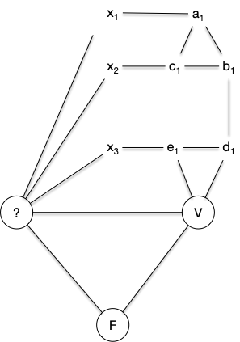

> TBD chromatic number et graph exclu : <https://www.youtube.com/watch?v=YAo1sd4kuOQ&list=PLUl4u3cNGP62qauV_CpT1zKaGG_Vj5igX&index=2> (<https://fr.wikipedia.org/wiki/In%C3%A9galit%C3%A9_arithm%C3%A9tico-g%C3%A9om%C3%A9trique>)
>

> TBD <https://perso.liris.cnrs.fr/nicolas.pronost/UCBL/CapesInfo/PrepaEcrit/Graphe/feuilleReductions.pdf> NP-c
> TBD ajouter : <https://m6colorationgraphes.wordpress.com/2015/11/30/partie-iii-la-coloration-par-welsh-powel/>

Il existe deux notion de colorabilité dans les graphes : la coloration de sommets et la coloration d'arêtes. Dans les deux cas, on veut colorier avec deux couleurs différentes des éléments (sommets ou arêtes respectivement) qui se touches (via une arête ou un sommet, respectivement).

Bien que ces deux façons de colorer des graphes soient liées, elles possèdent chacune des propriétés et théorèmes intéressants, nous en verront quelques uns.

Enfin, ces deux types de colorations ont des applications pratiques nombreuses et différentes. Par exemple :

- comment organiser un plan de table ou résoudre un sudoku pour la coloration des sommets (voir par exemple [cette video](https://www.youtube.com/watch?v=y4RAYQjKb5Y))
- comment organiser un tournoi sportif pour la coloration des arêtes (via l'algorithme de [round robin scheduling](https://nrich.maths.org/articles/tournament-scheduling). On verra plus tard que c'est optimal)



[cours sur la coloration](https://www-sop.inria.fr/members/Frederic.Havet/Cours/coloration.pdf)



## Coloration des sommets

Certainement la plus populaires des colorations de graphe.


Soit $G=(V, E)$ un graphe. Une **_$k$-coloration_** de $G$ est une fonction $c: V \to \\{1,\dots, k\\}$ telle que pour toute arête $xy \in E$, $c(x) \neq c(y)$.


> TBD exemples :
>
> - discret
> - arbre
> - cycle pair
> - cycle impair C5
> - clique K6
>

Les exemples précédent le montre, il existe une borne minimum pour tout graphe :

<span id="definition-notation-coloration-minimum"></span>


Soit $G=(V, E)$ un graphe. On note $\chi(G)$ le nombre minimum de couleurs qu'il faut pour colorier ses sommets et on l'appelle **_nombre chromatique de $G$_**.



Entraînons-nous à trouver $\chi$ pour des classes de graphes connus :


Montrer que :

- $\chi(G) = 2$ si $G$ est un chemin ou un cycle de longueur pair,
- $\chi(G) = 3$ si $G$ est un chemin ou un cycle de longueur impair,



> TBD



Le nombre chromatique est lié aux cliques :


Montrer que :

- $\chi(K_n) = n$



> TBD



On peut facilement prouver une première proposition :


Pour tout graphe $G = (V, E)$, on a :

<div>
$$
\omega(G) \leq \chi(G) \leq \vert V \vert
$$
</div>


Les inégalités peuvent être strictes, comme pour les cycles de longueur impair par exemple. Ou encore en prenant les [graphe de Mycielski](https://fr.wikipedia.org/wiki/Graphe_de_Mycielski) qui sont sans triangles mais dont le nombre chromatique peut être aussi grand que l'on veut.

> TBD faire la preuve de <https://www-sop.inria.fr/members/Frederic.Havet/Cours/coloration.pdf>. Dire qu'il en existe d'autres.

Le lecteur attentif aura remarqué que la notion de colorabilité est équivalente à la notion [de graphes $k$-parti](../graphe-biparti/#k-parti){.interne} :


Un graphe $G$ est $\chi(G)$-parti et n'est pas $(\chi(G)-1)$-parti.


On en déduit donc immédiatement :


Le problème de savoir si un graphe est $k$-colorable, avec $k\geq 3$ est NP-complet.


Clair puisque c'est exactement [le problème `Rec-3-parti`](../graphe-biparti/#Rec-3-parti-NPC){.interne} qui est NP-complet et que `Rec-k-parti ≤ Rec-(k+1)-parti`


### Coloration et composition de graphes

La coloration de graphe peut se faire _plus ou moins_ par parties en  utilisant la [composition de graphes](../structure/#composition-graphes){.interne} :


Pour deux graphes $G_1=(V_1, E_1)$ et $G_2=(V_2, E_2)$ on a :

- $\chi(G_1 + G_2) = \max(\\{\chi(G_1), \chi(G_2) \\})$
- $\chi(G_1 \lor G_2) = \chi(G_1) + \chi(G_2)$
- $\chi(G_1 \square G_2) = \max(\\{\chi(G_1), \chi(G_2) \\})$


Les deux premières propositions sont triviales.

Pour montrer la troisième, soient $c_1$ et $c_2$ des colorations de $G_1$ et $G_2$ respectivement et on pose $m = \max(\\{\chi(G_1), \chi(G_2) \\})$.

La fonction $c: V_1 \times V_2 \to \\{0, \dots, m-1\\}$ telle que $c((x, y)) = c_1(x) + c_2(y) \mathbin{\small\\%} m$ est une coloration de $G_1 \square G_2$. En effet si $\\{(x_1, y_1), (x_2, y_2)\\}$ est une arête de $G_1 \square G_2$ on a soit :

- $x_1 = y_1$ et $\vert c((x_1, y_1)) - c((x_2, y_2)) \vert = \vert c_2(x_2) - c_2(y_2) \vert > 0$ puisque $x_2y_2$ est une arête de $G_2$
- $x_2 = y_2$ et $\vert c((x_1, y_1)) - c((x_2, y_2)) \vert = \vert c_1(x_1) - c_1(y_1) \vert > 0 $ puisque $x_1y_1$ est une arête de $G_1$



> TBD exemples du cours papier.

### Heuristique gloutonne



- [Algorithme glouton](https://fr.wikipedia.org/wiki/Coloration_gloutonne)
- [Algorithme glouton en action](https://www.youtube.com/watch?v=L2csXWQMsNg)



> TBD cours papier :  glouton + améliorations en classant par ordre décroissant de degré (nb couleur dépend uniquement du nombre de voisins déjà placées).
>
> TBD parler de [dsatur](https://en.wikipedia.org/wiki/DSatur) et leur faire montrer qu'il fonctionne sur les cycles, les graphes bi-parti et les roues.

### Majorations de la colorabilité

L'algorithme glouton permet immédiatement de dire :


Pour tout graphe $G$ on a :

<div>
$$
\chi(G) \leq \Delta(G) +1
$$
</div>



On a vu que chaque couleur associée dépendait du nombre de voisins déjà placés. On a alors pour un ordonnancement des sommets $v_1, \dots v_n$ :

<div>
$$
\chi(G) \leq \max(\{ \min(\{\delta(v_i), i-1\}) \vert 1\leq i \leq n\}) + 1
$$
</div>

ce qui donne immédiatement la borne voulue.



Cette borne est atteinte, on l'a vue, pour les graphes complets et les cycles impair... Et c'est la seule fois. Pour le démontrer on aura besoin de la proposition suivante :



Un graphe 2-connexe et $k$-régulier avec $3\leq k < \vert V(G)\vert - 1$ admet trois sommets $u$ et $v$ et $w$  tels que :

- $vw$ n'est pas une arête de $G$,
- $uv$ et $uw$ sont deux arêtes de $G$,
- supprimer $v$ et $w$ de $G$ ne le déconnecte pas.



L'existence de ces trois sommets est garantie car :

1. comme $G$ n'est pas complet il existe $x$ et $y$ tels que $xy$ n'est pas une arête
2. comme $G$ est connexe il existe un chemin entre $x$ et $y$ et on prend :
   - $y'$ comme étant le sommet le plus éloigné de $x$ sur ce chemin tel que $xy'$ soit une arête de $G$,
   - $z$ comme étant le sommet juste après $y'$ sur ce chemin.
3. On a alors $xz'$ qui n'est pas une arête alors que $xy'$ et $y'z$ en sont.

Si le graphe $G$ privé de $x$ et de $z$ n'est pas connexe alors pour chaque partie connexe $G_i = (V_i, E_i)$ il existe $x_i, z_i \in X_i$ tels que $x_ix$ et $z_iz$ soient des arêtes de $G$. Comme en supprimant $x_i$ ou $z_i$ de $G$, le graphe reste connexe : pour tout $i$ il existe $y_i \neq x_i$ tel que $y_ix_i$ ou $y_iz_i$ soit une arête de $G$. On en déduit que :

- $G$ privé de $x_1$ et $x_2$ est connexe
- $xx_1$ et $xx_2$ sont des arêtes de $G$.

Et on a prouvé un triplet de point qui correspond à ce que l'on cherche.



On peut maintenant démontrer le théorème :


Pour tout graphe $G$ qui n'est pas un graphe complets ni un cycle impair on a :

<div>
$$
\chi(G) \leq \Delta(G)
$$
</div>



Il existe ne nombreuses preuves de cette proposition, nous en présentons une qui utilise ici un ordonnancement astucieux de l'algorithme glouton.

La preuve est construite en examinant plusieurs cas :

**Premier cas :** Il existe $x^\star$ tel que $\delta(x^\star) < \Delta(G)$.

On ordonne alors les $n$ sommets du graphe de telle sorte que $^\star = v_n$ et on ordonne en suivant l'algorithme :

```python
k = n
i = n-1

tant que i > 0:
  si k > i et qu'il existe un voisin x de vk non encore placé alors:
    vi = x
    i = i- 1
  sinon:
    k = -1 
```

Si le graphe est connexe, il est clair que cet ordre va placer tous les sommets par ordre décroissant en commençant par tous les voisins de $x_n$, puis tous les voisins de $x_{n-1}$ non encore placés, et ainsi de suite jusqu'à avoir placé tout le monde.

Cet ordre va nous permettre d'obtenir la borne recherchée car lors de l'affectation des couleurs, il faudra toujours autant de couleurs que le nombre de ses voisins déjà placé plus 1. Comme l'ordre assure qu'il va exister $j > i$ tel que $v_iv_j$ est une arête, ce nombre sera toujours inférieur à $\Delta(G)$. Une récurrence immédiate nous assure qu'il faudra au total moins de $\Delta(G)$ couleurs (au moins un no,bre entre 1 et $\Delta(G)$ sera disponible puisqu'il y aura au plus $\Delta(G)-1$ nombres déjà affectés).

**Second cas :** le graphe est régulier mais il existe $x^\star$ tel que si on le supprime on déconnecte $G$.

En supprimant $x^\star$ de $G$ il y aura $p>1$ composantes connexes $G_i = (v_i, E_i)$ le sommet $x^\star$ du graphe $G$ restreint à $X_i \cup \\{x^\star\\}$ aura strictement moins que $\Delta(G)$ sommets et on est ramené au cas 1 pour les $p$ graphes $G_i$. On peut ensuite en déduire un coloriage de $G$ en donnant à $x^\star$ la même couleur pour chaque coloriage.

**Troisième cas :** le graphe est régulier et il n'existe pas de sommets tel que si on le supprime on déconnecte $G$. On se retrouve dans le cadre de la proposition suivant et il existe $u$ et $v$ et $w$ trois sommets de $G$ tels que :

- $vw$ n'est pas une arête de $G$,
- $uv$ et $uw$ sont deux arêtes de $G$,
- supprimer $v$ et $w$ de $G$ ne le déconnecte pas.

On peut alors utiliser l'ordre entre sommets : $v_1 = v$, $v_2 = w$, $u = v_n$ et trouver les autres éléments en utilisant l'algorithme du cas 1.



### Colorabilité et isomorphisme de graphe

> TBD test heuristique d'isomorphisme de graphe <https://en.wikipedia.org/wiki/Colour_refinement_algorithm> et <https://en.wikipedia.org/wiki/Weisfeiler_Leman_graph_isomorphism_test>

## Coloration des arêtes


Soit $G=(V, E)$ un graphe. Une **_$k$-coloration des arêtes_** $G$ est une fonction $c: E \to \\{1,\dots, k\\}$ telle que pour triplet de sommets $x \neq y \neq z \in E$ si $xy, xz \in E$ alors $c(xy) \neq c(xz)$.


> TBD exemples :
>
> - discret
> - arbre
> - cycle pair
> - cycle impair C5
> - clique K6
>

Les exemples précédent le montre, il existe une borne minimum pour tout graphe :

<span id="definition-notation-coloration-arête-minimum"></span>


Soit $G=(V, E)$ un graphe. On note $\chi'(G)$ le nombre minimum de couleurs qu'il faut pour colorier ses arêtes et on l'appelle **_nombre chromatique des arêtes de $G$_**.



Le lecteur attentif aura remarqué que la notion de colorabilité des arêtes se rapproche de la notion [de couplage](../couplages) : la $k$ colorabilité des arêtes correspond à une partition en couplages de $G$. Ce qui donne immédiatement une borne minimum à notre problème :


Pour tout graphe $G$ on a :

<div>
$$
\Delta(G)\leq \chi'(G)
$$
</div>



clair



On a montré en introduction que l'on peut le faire en $n-1$ couplages de $n/2$ arêtes pour $K_n$ on a donc :


<div>
$$
\chi'(K_n) = n-1
$$
</div>



On utilise un algorithme [round robin scheduling](https://nrich.maths.org/articles/tournament-scheduling) comme on l'a fait en introduction.



cas particulier du [Théorème de Baranyai](https://en.wikipedia.org/wiki/Baranyai%27s_theorem).

> TBD en DM. C'est ds flots. <https://math.stackexchange.com/questions/1827816/proof-of-baranyais-theorem> et p20 <http://discretemath.imp.fu-berlin.de/DMII-2018-19/connectivity-flows-baranyai.pdf>



> TBD NP-complet. exercice 8.16 de <https://www-sop.inria.fr/members/Frederic.Havet/Cours/coloration.pdf>

### Lien avec la colorabilité des sommets

Via le [line graph](https://en.wikipedia.org/wiki/Line_graph).

> TBD définition line graph
> TBD passage de l'un à l'autre et équivalence du nombre de couleurs. On peut peut utiliser l'algo glouton pour résoudre le problème

> TBD ici juste dire que l'on peut le faire et renvoyer à un DM sur le line graphe. C'est des jolis preuve d'isomorphisme qui fonctionnent.

- line graph edge veterx coloring <=>  edge coloring. Mais tout n'est pas un line graph (demo par comfiguration exclue) <https://www.labri.fr/perso/mbonamy/917U/3-Edge-Colouring.pdf>
> preuve par sous graphe exclus : <https://core.ac.uk/download/pdf/82132835.pdf>
> <https://en.wikipedia.org/wiki/Line_graph>

> TBD : Harary theorem 8.3 unique line graph et thm 1.7.4 de <https://faculty.etsu.edu/gardnerr/5340/notes-Godsil-Royle/Algebraic-GT-GR-1-7.pdf> pour démontrer les graphes interdits.

> TBD line graph exercices : <https://faculty.etsu.edu/gardnerr/5340/notes-Godsil-Royle/Algebraic-GT-GR-1-7.pdf>
>
> - line graph de graphes réguliers sont eulériens lemma 1.7.1
> - line graph d'un graph eulérien est eulérien et hamiltonien
> - <https://www.cambridge.org/core/services/aop-cambridge-core/content/view/96BA451CF0099F38C1B3FA867EC1A835/S0008439500054989a.pdf/div-class-title-on-eulerian-and-hamiltonian-graphs-and-line-graphs-div.pdf>

### Bornes la colorabilité des arêtes


Pour tout graphe $G$ on a :

<div>
$$
\Delta(G) \chi'(G) \leq \Delta(G) +1
$$
</div>



Le théorème va se prouver en utilisant [des chaînes de Kempe](https://en.wikipedia.org/wiki/Kempe_chain) appliquées à la coloration d'arêtes.

On suppose que $G$ admet une coloration de ses arêtes $f$ et on note $F(u) = \\{f(ux) \vert x \in V, ux \in E \\}$. Une chaîne de Kempe est une suite $uv_0, \dots, uv_k$ de $k+1$ arêtes de $G$ telle que la couleur $c_i = f(uv_{i+1})$ n'est pas dans $F(v_i)$ pour tout $0 \leq i <k$

Pour toute chaîne de Kempe, il est clair que l'on peut remplacer les couleurs de $uv_{i}$ par $c_i$. Enfin, s'il existe $c$ une couleur qui n'est ni dans $F(u)$ ni dans $F(v_k)$ on peut également changer la couleur de $uv_k$ en $c$.

On va construire une coloration des arêtes de $G$ en $\Delta(G) + 1$ couleurs en commençant par le graphe discret et ajoutant une arête à la fois. Supposons que l'on ait une coloration d'un graphe partiel $G'$ de $G$ en $\Delta(G) + 1$ couleurs et on ajoute l'arête $uv_0$. Comme on a à notre disposition $\Delta(G) + 1$ couleurs, il existe forcément une couleur qui n'est pas dans
$F(u)$ et une couleur qui n'est pas dans $F(v_0)$ ce qui permet d'initialiser une chaîne de Kempe que l'on peut itérativement faire grossir construire (la couleur $c_i = f(uv_{i+1})$ n'est pas dans $F(v_i)$ pour tout $0 \leq i <k$) jusqu'à :

- soit arriver à un point où il existe $c$ une couleur qui n'est ni dans $F(u)$ ni dans $F(v_k)$ et l'on peut colorier l'arête $uv_0$ en utilisant la propriété des chaînes de Kempe
- soit arriver à un point où toutes les couleurs qui ne sont pas dans $F(v_k)$ ont déjà été utilisées.

Dans ce deuxième cas, soit $c_k$ une des couleurs qui n'est pas dans $F(v_k)$ et $l$ le plus petit indice tel que $f(uv_l) = c_k$. On peut maintenant construire une autre chaîne $w_0\dots w_p$ telle que $w_0 = u$, $w_1 = v_l$ et telle que si $f(w_iw_{i+1}) = c_k$, alors $f(w_{i+1}w_{i+2}) = c_0$. Cette chaîne ne peut revenir sur ces pas : on va arriver à un moment où la chaîne ne peut être prolongée.

On peut alors :

1. changer les couleurs de la chaîne $uv_0, \dots, uv_l$
2. échanger les couleurs sur la chaîne $w_0\dots w_p$

Ce qui donne une coloration en $\Delta(G) + 1$ couleurs de $G'$ auquel on a ajouté l'arête $uv_0$.

> TBD rendre la preuve plus clair




[Vizing's Theorem](https://www.youtube.com/watch?v=OZWZpQmGp0g)


Notez que la preuve donne un algo pour edge colorier avec delta+1 couleurs.

> TBD :
>
> - C'est NP-complet de savoir si le graphe est de classe 1 ou 2. On le verra plus tard (graphe aléatoires) qu'un graphe est presque sûrement de type 1.
> - c'est une illustration de ce qu'est NP-complet. Presque tout le temps facile, sauf quelques exemples qui sont inextricables.

> TBD exo graphe biparti type 1. TBD preuve générale sur edge coloring <https://mathweb.ucsd.edu/~gptesler/154/slides/154_graphcoloring_20-handout.pdf>

> TBD fun fact. Graphes réguliers avec un nombre impair de sommet sont de classe 2.
> TBD la NP-complétude se niche donc uniquement sur les graphes 3-réguliers avec un nombre pair de sommets

## <span id="k-parti"></span>Graphes $k$-partis

> TBD refaire avec des couleurs.
> 
Une généralisation possible des graphes biparti est d'augmenter le nombre de stables :


Un graphe est **_$k$-parti_** s'il existe une partition $V_1, \dots, V_k$ de $V$ en $k\geq 1$ [stables](../structure/#definition-stable){.interne}.



Il est clair qu'un graphe $k$-parti est $k'$-parti pour tout $k'\geq k$. La réciproque n'est pas vraie puisque qu'u cycle à 5 éléments est 3-parti mais pas biparti.

Le problème de cette généralisation est que le problème de reconnaissance devient NP-complet pour $k\geq 3$.



- **Nom** : Reconnaissance d'un graphe $k$-parti (`Rec-k-parti`)
- **Entrée** : un graphe $G$
- **Sortie** : Oui si $G$ est $k$-parti, Non sinon.



On remarque que $k$ fait parti du problème, ce n'est pas une entrée. Il existe donc un problème de reconnaissance différent pour chaque $k$. Il est clair qu'ils sont tous dans NP :



Le problème de la reconnaissance d'un graphe $k$-parti est dans NP pour tout $k\geq 1$




Si l'on se donne une solution possible sous la forme d'une partition en $k$ classe de l'ensemble des sommets, il est facile de vérifier si ce sont des stables.



On a vu précédemment que le problème de reconnaissance est polynomial (et même linéaire) pour les graphes biparti et pour les graphes 1-parti (c'est le graphe discret). De plus, vous aller le montrer, on peu facilement réduire la reconnaissance d'un graphe $k$-parti à un cas particulier de la reconnaissance d'un graphe $(k+1)$-parti :


Montrez que pour tout $k\geq 1$ on a : `Rec-k-parti` $\leq$ `Rec-(k+1)-parti`.



Soit $G=(V, E)$ dont on cherche à savoir s'il est $k$-parti. Soit alors $G'=(V \cup \\{x\\}, E \cup \\{xy \vert y\in V})$. On a clairement (le seul stable contenant $x$ c'est lui-même) :

- $G$ est $k$-parti si et seulement si $G'$ est $(k+1)-parti
- les stables de $G$ sont les stables de $G'$ privé du stable contenant uniquement $x$.



Pour terminer, il nous reste à montrer que `Rec-3-parti` est NP-complet :

<span id="Rec-3-parti-NPC"></span>


Le problème de la reconnaissance d'un graphe $3$-parti est NP-complet.




On part de 3-SAT. Soient :

- $(x_i)_{1\leq i \leq n}$ les $n$ variables d'une instance de 3-SAT
- $c_j = l_j^1 \lor l_j^2 \lor l_j^3$  pour $1\leq j \leq m$ les $m$ clauses formés des littéraux $l_j^k \in \\{x_1, \dots, x_n, \overline{x_1}, \dots, \overline{x_1}\\}$ pour $1\leq k \leq 3$ et $1\leq j \leq m$
- $C = \land_{j} c_j$ la conjonction de clauses.

On va associer à tout ceci, de façon polynomiale, un graphe qui sera 3-parti si et seulement si la conjonction de clause $C$ est satisfiable.

On commence par créer un graphe permettant de rendre compte de la véracité des variables : $G_1 = (V_1 \cup V_2, E)$ où :

- $V_1 = \\{x_1, \dots, x_n, \overline{x_1}, \dots, \overline{x_1}\\}$
- $V_2 = \\{ V, F, ?\\}$
- $E = \\{\\{V, ?\\}, \\{F, ?\\}, \\{V, F\\} \\}\cup \\{\\{x_i, ?\\} \vert 1\leq i \leq n \\} \cup \\{\\{\overline{x_i}, ?\\} \vert 1\leq i \leq n \\}$


Le graphe $G_1$ est clairement 3-parti avec :

- les 3 sommets $V$, $F$ et $?$ dans 3 stables différents,
- les sommets $x_i$ et $\overline{x_i}$ sont dans le stable ne contenant pas $?$,
- si $x_i$ est dans le stable contenant $V$ alors $\overline{x_i}$ est dans le stable contenant $F$ et réciproquement pour tout $1\leq i \leq n$.

Il faut maintenant ajouter à ce graphes les clauses qui vont permettre de placer des valeurs de vérité aux variables via des stables (le stable de V ou le stable de F). Soit alors le graphe $C_j = (V'_1 \cup V_2 \cup V_j, E_j)$ tel que :

- $V_j = \\{a_j, b_j, c_j, d_j, e_j \\}$
- $V'_1 = \\{l^1_j, l^2_j, l^3_j \\} \subseteq V_1$
- $E_j$ correspondant au graphe ci-dessous


On remarque que les graphes $C_j$ sont 3-partis et que tous leurs stables sont tels que $l^1_j$, $l^2_j$ et $l^3_j$ ne sont pas tous les 3 dans la classe de $F$.

On en conclut donc que le graphe $G = (V_1 \cup V_2 \cup (\cup_j V_j), E \cup (\cup_j E_j))$ est triparti si et seulement si la conjonction de clause $C$ est satisfiable.



La réduction de la preuve de la proposition précédente est plus complexe que toutes celles que l'on a fait jusqu'à présent, [Le gadget utilisé](https://fr.wikipedia.org/wiki/Gadget_(informatique)) n'étant pas trivial. Montrons ce qu'il donne sur [notre exemple fil rouge des réduction depuis 3-SAT](/cours/algorithmie/problème-SAT/#3-sat-exemple){.interne} :

- $G_1$ : 
- $C_1$ : 
- $C_2$ : 
- $C_3$ : 
- $C_4$ : 

Ce qui donne le graphe final :


Ce graphe est tripartite (on a associé une couleur à chaque stable) :


On voit que, comme pour le problème SAT, le problème est simple pour 1 et 2 mais NP-complet à partir de 3.

## Graphes $k$-partis complets

On en a parfois besoin, donc autant les définir ici :



On appelle **_graphe $k$-parti complet_** le graphe Le graphe $K_{p_1,\dots, p_k} = (\cup_{i} V_{p_i}, \\{uv \vert u\in V_{p_i}, v\in V_{p_j}, i\neq j\\})$


Pour voir quelques graphes tri-partis complets, vous pouvez jeter un coup d'oeil à la page suivante :


<https://mathworld.wolfram.com/CompleteTripartiteGraph.html>


Terminons par un petit exercice pour appliquer tout ça :


Trouver toutes les valeurs entières de a, b, c telles que $0 < a ≤ b ≤ c$ et que le graphe 3-parti complet $K_{a,b,c}$ possède :

- [un cycle eulérien](../parcours-eulériens/#definition-cycle-eulerien){.interne}.

- [un chemin eulérien](../parcours-eulériens/#definition-chemin-eulerien){.interne}



Soient $A$, $B$ et $C$ les 3 stables tels que $\vert A\vert = a$, $\vert B\vert = b$ et $\vert C\vert = c$. On a :

- les a sommets de $A$ ont pour degré $b+c$,
- les b sommets de $B$ ont pour degré $a+c$,
- les c sommets de $C$ ont pour degré $a+b$.

Pour que le graphe admette un cycle eulérien, il faut que tout sommet soit de degré pair, ce qui n'est possible que si $a$, $b$ et $c$ sont soit tous pair soit tous impairs.

Pour que le graphe admette un chemin eulérien, il faut que tous les sommets soient de degré paires sauf 2. Comme tous les sommets d'un même stable ont même degré, on a deux cas : soit $a=b=1$ et $c$ pair, soit $a=2$ et il faut alors que :

- $b+c$ soit impair,
- $2+c$ soit pair,
- $2+b$  soit pair.

Ce qui est impossible.

Les seuls graphes tripartis complets admettant un chemin eulériens sont donc les graphes $K_{1,1,2p}$

