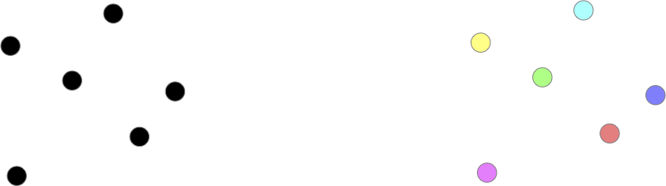
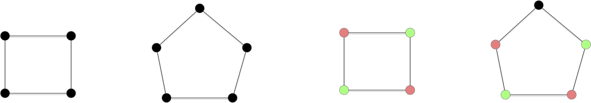
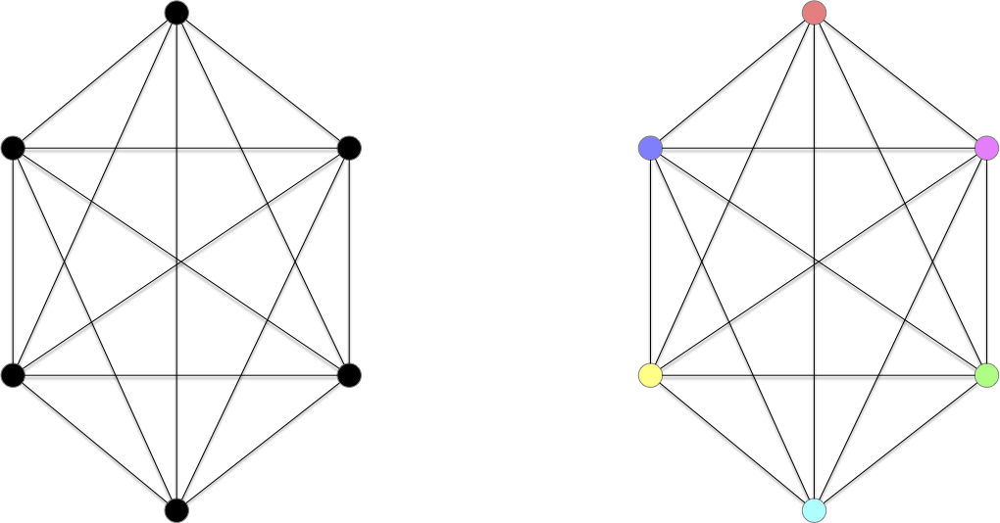
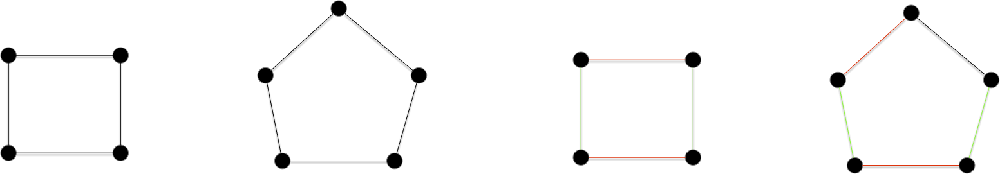
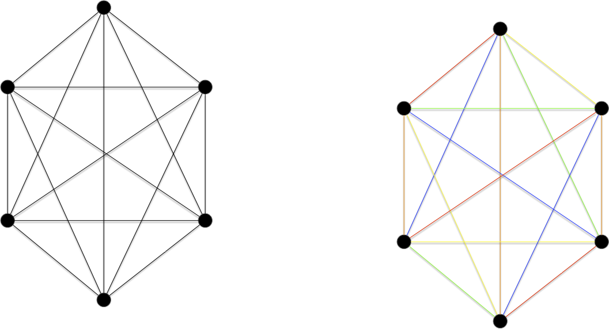
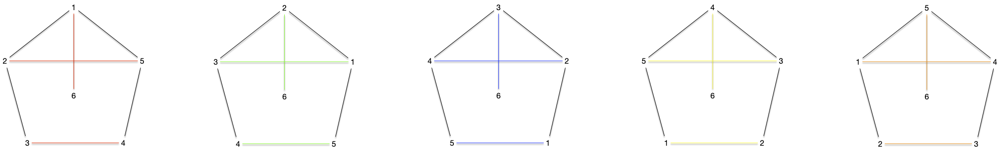

Il existe deux notion de colorabilité dans les graphes : la coloration de sommets et la coloration d'arêtes. Dans les deux cas, on veut colorier avec deux couleurs différentes des éléments (sommets ou arêtes respectivement) qui se touches (via une arête ou un sommet, respectivement).

Bien que ces deux façons de colorer des graphes soient liées, elles possèdent chacune des propriétés et théorèmes intéressants, nous en verront quelques uns.

## Définitions

### Coloration des sommets


Soit $G=(V, E)$ un graphe. Une **_$k$-coloration_** de $G$ est une fonction $c: V \to \\{1,\dots, k\\}$ telle que pour toute arête $xy \in E$, $c(x) \neq c(y)$.


Le graphe discret par exemple admet une 1-coloration, 2-coloration, ..., jusqu'à une $n$-coloration :

On voit vite que ceci se généralise et que l'on a :


Si un graphe $G$ admet une **_$k$-coloration_** de ses sommets, il admet également une coloration avec exactement $k \leq k' \leq v(G)$ couleurs.


Il suffit de remplacer une des couleurs par plusieurs autres.


Continuons notre exploration en essayant de chercher le nombre minimum de couleurs possible pour colorer les sommets d'un graphe. Les cycles paires admettent une 2-coloration (mais pas une 1-coloration puisqu'ils ont une arête) et les cycles impaires quant à eux uniquement une 3-coloration :


Montrer que :

- les cycles paires admettent une coloration en 2 couleurs mais pas en 1 couleur,
- les cycles impaires admettent une coloration en 3 couleurs mais pas en 2 couleur,



Tout graphe possédant au moins une arête ne peut avoir de 1-coloration. C'est le cas ds cycles puisqu'ils ont tous au moins 3 sommets et donc 3 arêtes.

- Pour tout cycle paire $x_0x_1\cdot x_{2p}$ on peut donner la couleur $i \bmod 2$ au sommet $x_i$.
- une 2 couleur pour un cycle impair va forcer l'alternance des couleurs et on se retrouvera à la fin avec 2 couleurs identique pour une arête. Il faut donc donner une troisième couleur à ce dernier sommet.



Et les cliques ?


Montrer que :

- $\chi(K_n) = n$



S'il existait une coloration en strictement moins de $n$ sommet, il existerait deux sommets différents ayant même couleurs. Comme il existe une arêtes entre ces deux sommet ceci est impossible et contredit notre hypothèse.



Explicitons cette borne minimum de coloration :



Soit $G=(V, E)$ un graphe. On note $\chi(G)$ le nombre minimum de couleurs qu'il faut pour colorier ses sommets et on l'appelle **_nombre chromatique de $G$_**.



On a déjà quelques $\chi$ pour des classes de graphes connus :

- $\chi(G) = 1$ si (et seulement si) $G$ est le graphe discret,
- $\chi(G) = 2$ si $G$ est un chemin ou un cycle de longueur pair,
- $\chi(G) = 3$ si $G$ est un chemin ou un cycle de longueur impair,
- $\chi(G) = v(G)$ si $G$ est le graphe complet.

Et une première borne évidente :


Pour tout graphe $G$ on a :

$$
\omega(G) \leq \chi(G) \leq v(G)
$$



Pour un graphe $G$, $\omega(G)$ est [la taille de sa plus grande clique](../../cliques-stables/#définition-notation-clique-stable-maximum){.interne}.


Le lecteur attentif aura également remarqué que la notion de colorabilité des sommets est équivalente à la notion [de graphe k-parti](../../graphe-biparti/#définition-k-parti).

### Coloration des arêtes


Soit $G=(V, E)$ un graphe. Une **_$k$-coloration des arêtes_** $G$ est une fonction $c: E \to \\{1,\dots, k\\}$ telle que pour triplet de sommets $x \neq y \neq z \in E$ si $xy, xz \in E$ alors $c(xy) \neq c(xz)$.


On peut tout de suite appliquer à la coloration des arêtes la propriété évidente de la coloration des sommets :


Si un graphe $G$ admet une **_$k$-coloration_** de ses arêtes, il admet également une coloration avec exactement $k \leq k' \leq v(G)$ couleurs.


Il suffit de remplacer une des couleurs par plusieurs autres.


Et qu'il existe un minimum :



Soit $G=(V, E)$ un graphe. On note $\chi'(G)$ le nombre minimum de couleurs qu'il faut pour colorier ses arêtes et on l'appelle **_index chromatique de $G$_**.



Les cycles paires admettent une 2-coloration et les cycles impaires uniquement une 3-coloration de leurs arêtes :


Montrer que :

- $\chi'(G) = 2$ pour les cycles paires,
- $\chi'(G) = 3$ pour les cycles impaires,




Les arguments sont identiques à ceux avancés pour la coloration des sommets


On aurait tord de penser que les deux concepts sont égaux. L'exemple des cliques le montre :


Montrer que $\chi'(K_{2n}) = 2n-1$



Il ne peut exister une coloration des arêtes en strictement moins de $2n-1$ couleurs puisque tout sommet à $2n-1$ voisins.

Pour trouver une coloration en $2n-1$ couleurs on utiliser le principe des championnats de sport comme on l'a déjà fait pour [les couplages](../../couplages/problème/#championnat-sport).



Pour les cliques de tailles impair l'index chromatique est different du nombre chromatique. Mais pourquoi avoir différentié les cliques de tailles impaire et paire ?


Montrer que $\chi'(K_{2n-1}) \geq 2n$



$K_{2n-1}$ possède $m = (2n-1)\cdot (n-1)$ arêtes. Comme tout sommet est de degré $2n-2$, chaque couleur est utilisée en moyenne pour $\frac{m}{2n-2}$ arêtes, c'est à dire : $n-1/2> n-1$ fois : il existe donc une couleur qui est utilisée au moins $n$ fois. Mais ceci est impossible si on prend $n$ arêtes au moins deux partagent un même sommet, on a donc pas un coloriage d'arête.



Le lecteur attentif aura remarqué que la notion de colorabilité des arêtes se rapproche de la notion [de couplage](../couplages) : la $k$ colorabilité des arêtes correspond à une partition en couplages de $G$. Ce qui permet de borner notre problème :


Pour tout graphe $G$ on a :

$$
\Delta(G)\leq \chi'(G) \leq e(G)
$$



Pour un graphe $G$, $\Delta(G)$ est [la valeur du plus grand degré](../../structure/#degré-max-min-graphe){.interne}.




clair



## Utilité pratique

Enfin, ces deux types de colorations ont des applications pratiques nombreuses et différentes.


Cette modélisation est très pratique lorsque l'on a des ressources partagées dont on veut maximiser l'utilisation.


### sommets

Ces problèmes sont souvent liés à des problèmes d'incompatibilités.

#### Résoudre des sudoku


[le graphe du sudoku](https://fr.wikipedia.org/wiki/Graphe_du_sudoku)


#### Faire des plan de table

> TBD ou résoudre des problèmes d'emploi du temps.
> p45 <https://mathweb.ucsd.edu/~gptesler/154/slides/154_graphcoloring_20-handout.pdf>

#### Optimiser la compilation de programmes

> p4 <http://o.togni.u-bourgogne.fr/CMGraphesCh3.pdf>
> et p49 <https://mathweb.ucsd.edu/~gptesler/154/slides/154_graphcoloring_20-handout.pdf>

#### Colorer des cartes de géographie

> TBD donner le problème et dire qu'on y reviendra.

### Aretes

Ces problèmes sont souvent liés à des problèmes de couplages.

#### Championnat

On l'a déjà vu dans la partie couplage, mais le problème des championnats de sport s'explicite plus joliment sous la forme d'un problème de coloration d'arêtes car il incorpore directement toutes les contraintes.

L'algorithme qui explicite directement le problème est appelé [round robin scheduling](https://nrich.maths.org/articles/tournament-scheduling). Noter qu'il est différent de celui utilisé pour le couplage. Pour $K_6$ ceci donne :

#### Affectation de ressources

> p3 <https://www.gerad.ca/~alainh/Chapitre5.pdf>

### Attention

> TBD à ne pas trout modéliser par des couleurs.
> à 5min45 <https://www.youtube.com/watch?v=y4RAYQjKb5Y>
>
> On le verra le problème général de la coloration est NP-complet donc ne modélisez pas par un problème NP-complet un problème simple. Les taxis, on l'a vu se résolvent facilement par un algorithme glouton !
> Ca arrive plus souvent qu'pon ne le pense, doc faite attention lorsque vous modélisez votre problème : essayez d'être le plus précis possible.
