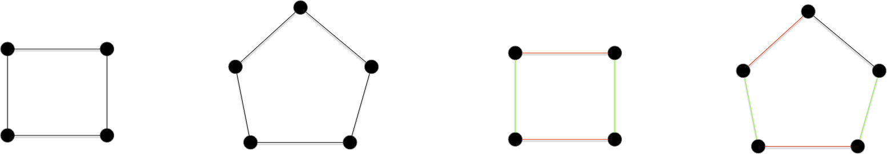
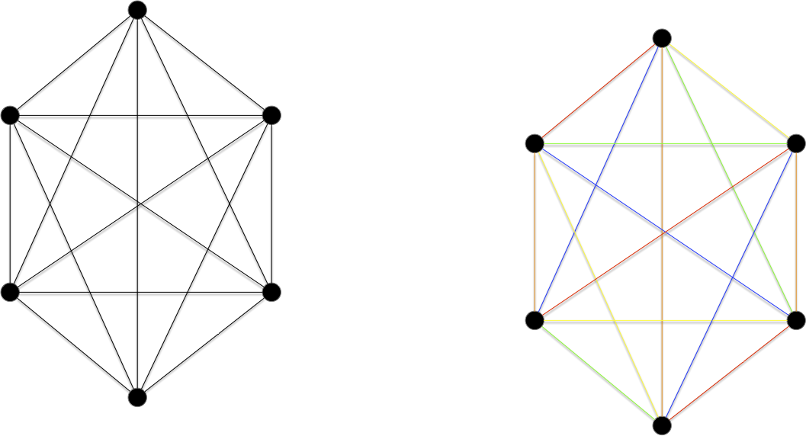
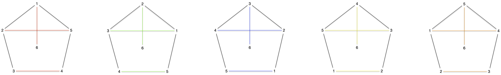

> TBD à remanier et en rappelant ce que l'on a déjà fait dans l'introduction.

Il existe deux notion de colorabilité dans les graphes : la coloration de sommets et la coloration d'arêtes. Dans les deux cas, on veut colorier avec deux couleurs différentes des éléments (sommets ou arêtes respectivement) qui se touches (via une arête ou un sommet, respectivement).

Bien que ces deux façons de colorer des graphes soient liées, elles possèdent chacune des propriétés et théorèmes intéressants, nous en verront quelques uns.


Soit $G=(V, E)$ un graphe. Une **_$k$-coloration des arêtes_** $G$ est une fonction $c: E \to \\{1,\dots, k\\}$ telle que pour triplet de sommets $x \neq y \neq z \in E$ si $xy, xz \in E$ alors $c(xy) \neq c(xz)$.


On peut tout de suite appliquer à la coloration des arêtes la propriété évidente de la coloration des sommets :


Si un graphe $G$ admet une **_$k$-coloration_** de ses arêtes, il admet également une coloration avec exactement $k \leq k' \leq v(G)$ couleurs.


Il suffit de remplacer une des couleurs par plusieurs autres.


Et qu'il existe un minimum :



Soit $G=(V, E)$ un graphe. On note $\chi'(G)$ le nombre minimum de couleurs qu'il faut pour colorier ses arêtes et on l'appelle **_index chromatique de $G$_**.



Les cycles paires admettent une 2-coloration et les cycles impaires uniquement une 3-coloration de leurs arêtes :


Montrer que :

- $\chi'(G) = 2$ pour les cycles paires,
- $\chi'(G) = 3$ pour les cycles impaires,




Les arguments sont identiques à ceux avancés pour la coloration des sommets


On aurait tord de penser que les deux concepts sont égaux. L'exemple des cliques le montre :


Montrer que $\chi'(K_{2n}) = 2n-1$



Il ne peut exister une coloration des arêtes en strictement moins de $2n-1$ couleurs puisque tout sommet à $2n-1$ voisins.

Pour trouver une coloration en $2n-1$ couleurs on utiliser le principe des championnats de sport comme on l'a déjà fait pour [les couplages](../../couplages/problème/#championnat-sport).



Pour les cliques de tailles impair l'index chromatique est different du nombre chromatique. Mais pourquoi avoir différentié les cliques de tailles impaire et paire ?


Montrer que $\chi'(K_{2n-1}) \geq 2n$



$K_{2n-1}$ possède $m = (2n-1)\cdot (n-1)$ arêtes. Comme tout sommet est de degré $2n-2$, chaque couleur est utilisée en moyenne pour $\frac{m}{2n-2}$ arêtes, c'est à dire : $n-1/2> n-1$ fois : il existe donc une couleur qui est utilisée au moins $n$ fois. Mais ceci est impossible si on prend $n$ arêtes au moins deux partagent un même sommet, on a donc pas un coloriage d'arête.



Le lecteur attentif aura remarqué que la notion de colorabilité des arêtes se rapproche de la notion [de couplage](../couplages) : la $k$ colorabilité des arêtes correspond à une partition en couplages de $G$. Ce qui permet de borner notre problème :


Pour tout graphe $G$ on a :

$$
\Delta(G)\leq \chi'(G) \leq e(G)
$$



Pour un graphe $G$, $\Delta(G)$ est [la valeur du plus grand degré](../../structure/#degré-max-min-graphe){.interne}.




clair



## Utilité pratique

Enfin, ces deux types de colorations ont des applications pratiques nombreuses et différentes.

### Aretes

Ces problèmes sont souvent liés à des problèmes de couplages.

#### Championnat

On l'a déjà vu dans la partie couplage, mais le problème des championnats de sport s'explicite plus joliment sous la forme d'un problème de coloration d'arêtes car il incorpore directement toutes les contraintes.

L'algorithme qui explicite directement le problème est appelé [round robin scheduling](https://nrich.maths.org/articles/tournament-scheduling). Noter qu'il est différent de celui utilisé pour le couplage. Pour $K_6$ ceci donne :

#### Affectation de ressources

> p3 <https://www.gerad.ca/~alainh/Chapitre5.pdf>

