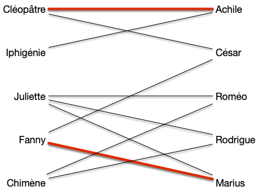

Dans les exercices de modélisation par des flots, [le problème du transport amoureux](../../projet-flots-modélisation/#transport-amoureux){.interne} permettait de résoudre un problème de couplage. En utilisant cette modélisation, et en augmentant les flots d'une valeur entière (toujours 1) une chaîne augmentante est un chemin tel que les arcs sont :

- têtes bêches de la source au puits
- les arcs allant vers le puits sont de flot 0 et peuvent être augmentés
- les arcs allant vers la source sont de flot 1 et peuvent être diminués.

Essayons d'adapter ceci à notre problème de couplage. Commençons par décrire le graphe des relations entre les deux couples de personnes. Marier le plus de héros de roman revient à trouver un couplage maximum dans le graphe suivant :

On a pas besoin d'ajouter une source ou un puits. Ajoutons quelques arêtes au couplage :

Le graphe précédent admet le couplage $M = \\{ \\{\text{Cléopâtre},\text{Achille}\\}, \\{\text{Fanny},\text{Marius}\\} \\}$. Dans le cadre d'une modélisation par flot (avec des arcs, une source et un puits), on serait dans le cadre suivant :

Il resterait encore des chaines augmentante comme : `source -> Juliette -> Rodrigue -> puits` ou encore `source -> Iphigénie -> Achille <- Cléopâtre -> César -> puits`.

Dans notre graphe de couplage ceci s'écrit comme un chemin de longueur impaire dont une arête est alternativement dans le couplage ou non et commence par un sommet qui n'est extrémité d'aucune arête du couplage.

## Chemin alertant et augmentant


Soit $G=(V, E)$ un graphe et $M$ un de ses couplages.

- **_Un chemin alternant_** $x_0\dots x_k$ est tel que :
  - $x_0\dots x_k$ est un [chemin élémentaire](../../chemins-cycles-connexite/#définition-élémentaire){.interne} de $G$
  - si $x_{i-1}x_{i} \in M$ alors $x_{i}x_{i+1} \notin M$ pour tout $i$
  - si $x_{i-1}x_{i} \notin M$ alors $x_{i}x_{i+1} \in M$ pour tout $i$
- **_Un chemin augmentant_** $x_0\dots x_k$ est un chemin alternant qui commence ($x_0$) et termine ($x_k$) par deux sommets libres.



Dans l'exemple précédent, `Cléopâtre - Achille - Iphigénie` est un chemin alternant mais pas augmentant, alors que `Juliette - Roméo` ou encore `César - Cléopâtre - Achille - Iphigénie` sont des chemins augmentant. On remarque que cette notion (de chemin augmentant) est similaire à celle de chaîne augmentante dans les flots :


Soit $G=(V, E)$ un graphe et $M$ un de ses couplages.

S'il existe un chemin augmentant $x_0\dots x_{2p+1}$ alors l'ensemble :

$$
M' = (M \backslash \{ x_{1+2i}x_{2i+2} \vert 0 \leq i < p\}) \cup \{ x_{2i}x_{2i+1} \vert 0\leq i \leq p\}
$$

Est un couplage tel que $\vert M' \vert = \vert M \vert +1$



Clair puisque $x_0$ et $x_{2p+1}$ sont libres.



Comme on s'y attend, la réciproque est également vraie :


Soit $G=(V, E)$ un graphe et $M$ un de ses couplages.

S'il existe n'existe pas de chemin augmentant alors $M$ est un coupage maximum.




Soit $M$ (en vert) un couplage et $M^\star$ (en rouge un couplage optimal). Si $xy \in M$ et $xy' \in M^\star$ on est dans un des deux cas suivant :

Et les autres voisins de $x$ (les arêtes en pointillées) ne sont ni dans $M$ ni dans $M^\star$

De plus si l'arête $xy$ est dans un seul couplage ($M$ ou $M^\star$), au moins une de ses extrémité est couverte par l'autre couplage, sinon les deux sommets $x$ et $y$ seraient libre pour lui et $xy$ serait un chemin augmentant.

Soit alors le graphe $G'=(V, M \cup M^\star)$. Les remarques précédentes  est alors tel que tout sommet est au plus de degré 2 : ses composantes connexes sont soit des chemins soit des cycles alternants.

On conclut la preuve en remarquant que le fait qu'ils soient alternants impose que les cycles et les chemins soient de longueur pairs :

- les cycle car sinon on a deux arêtes du même couplage  qui se suivent
- les chemins sinon il existerait un chemin augmentant pour l'un ou l'autre couplage.

Si par exemple aucune des extrémité du chemin ci dessous ne se prolonge (qu'il y ait ou pas des voisins), alors il existe un chemin augmentant pour pour le couplage rouge :

La parité des cycles et des chemins montre que $\vert M^\star\vert = \vert M\vert$.



On a alors l'équivalence suivante :


Soit $G=(V, E)$ un graphe et $M$ un de ses couplages.

$M$ est maximum si et seulement si il existe n'existe pas de chemin augmentant.



Les algorithmes permettant de trouver des couplages maximaux vont chercher à produire des chaines augmentantes. C'est parfois facile (pour les graphes biparti), parfois plus compliqué (pour les graphes ayant des cycles de longueurs impairs).

## Trouver un chemin augmentant

La première idée pour trouver un chemin augmentant est de mimer [l'algorithme de recherche de chaîne augmentante](../../flots/#ford-fulkerson){.interne} des flots.

### Algorithme

1. marque tous les sommets libres $s$ par $[s, P, \varnothing]$
   1. la première marque donne le sommet libre de départ
   2. la seconde indique si arrivée à ce sommet le chemin alternant est Pair (marque $P$) ou Impair (marque $I$)
   3. la dernière marque donne le prédécesseur
2. on examine toutes les arêtes $uv$ telles que $u$ possède une marque Paire (second élément de la liste de marquage valant $P$) $[s, P, p]$. Si :
   1. si $v$ est libre ($s = v$), on le marque par $[s, I, u]$ et on s'arrête on a trouvé un chemin augmentant
   2. $v$ n'a pas de marque, il existe une arête $vw \in M$. On marque alors :
      1. $v$ par $[s, I, u]$
      2. $w$ par $[s, P, v]$
      3. on recommence l'étape 2
   3. si $v$ est marqué $[s', P, p']$ avec $s\neq s'$ on peut remonter jusqu'à $s'$ et on a trouvé un chemin augmentant
   4. si $v$ est marqué $[s, P, p']$ on se retrouve devant un cas problématique.

Reprenons le graphe exemple avec un couplage initial vide $M = \varnothing$.

Au départ tous les sommets sont libres, leurs marques valent $[x, P, \varnothing]$ :

#### Étape 2.1

L'algorithme s'arrête dès l'examen de la première arête, disons $\\{2, 6\\}$, dans le cas 2.1. Le marquage de l'étape suivant est alors :

On peut recommencer l'algorithme et encore une fois s'arrêter dans le cas 2.1 en choisissant d'arête $\\{8, 10\\}$. Le marquage de l'étape suivant est alors :

On peut recommencer et choisir $\\{7, 9\\}$ et arriver à :

#### Étape 2.2

En considérant l'arête $\\{4, 8\\}$, on se retrouve dans le cas 2.2. On obtient le marquage :

Et l'on faire de même en choisissant ensuite $\\{3, 7\\}$ :

#### Étape 2.3

Choisir l'arête $\\{9, 10\\}$, nous fait visiter le cas 2.3 : on obtient un chemin augmentant 3, 7, 9, 8, 4 et on obtient le graphe et le couplage :

Le cas 2.3 de l'algorithme précédent fonctionne car le chemin alternant de $v$ à $s'\neq s$ ne peut couper le chemin de $s$ à $u$ sinon deux arêtes avec une extrémité commune seraient dans le couplage.

#### Étape 4

Choisir l'arête $\\{1, 2\\}$ nous permettrait de terminer l'algorithme sans obtenir de cas problématique mais choisissons $\\{5, 2\\}$ puis $\\{6, 4\\}$ et enfin $\\{8, 10\\}$. On arrive dans le cas suivant :

Le choix de l'arête $\\{8, 10\\}$ nous mène au cas 2.4 problématique : on boucle comme le montre le chemin vert suivi par les marques. On appelle ces structures des **_fleurs_** :

### Analyse

Cet algorithme fonctionne, dans la mesure où il ne trouve pas de fleurs :

Si l'algorithme de recherche d'un chemin augmentant s'arrête sans trouver de fleur ni de chemin augmentant, alors le couplage est maximum.



Supposons que l'algorithme s'arrête sans fleur et sans chemin augmentant, alors qu'il existe un chemin augmentant $x_0\dots x_{2p+1}$. Si les secondes marques des $x_{2k}$ sont toutes paires et les secondes marques des $x_{2k-1}$ sont toutes impaires, alors l'algorithme aurait du trouver un chemin augmentant passant par un sous-chemin de $x_0\dots x_{2p+1}$ puisqu'une marque $I$ ou P suppose qu'on peut prolonger le chemin en chemin augmentant.

Soit alors $x_i$ le premier sommet qui n'a pas la bonne seconde marque (I ou P) à la fin de l'algorithme. On a alors que :

- $0 < i < 2p+1$ car $x_0$ et $x_{2p+1}$ sont libres
- si $x_{2p-1}$ à une marque impair alors $x_{2p}$ à une marque paire et réciproquement.

La seule possibilité est qu'une arête $x_{2k-1}x_{2k}$ du couplage soit inversée, mais là encore ceci aurait du conduire à l'existence d'un chemin augmentant lors de l'analyse de l'arête $x_{2k-2}x_{2k-1}$.



Les fleurs posent donc problème à notre algorithme. On a déjà rencontré ce problème lorsqu'on voulait autoriser des mariages homosexuels pour nos héros de romans : l'augmentation de flot cycle. Si ce problème était irresoluble pour les flots on verra qu'on peut le contourner ici.
