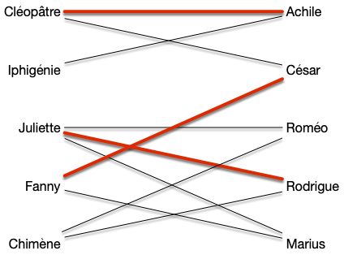
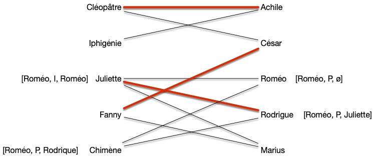
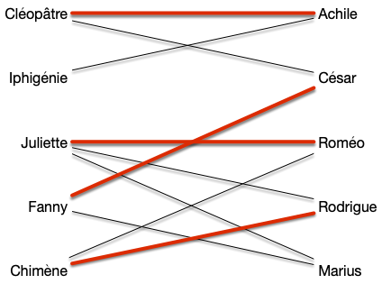
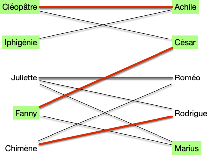
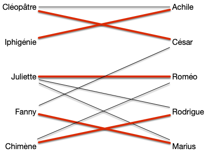
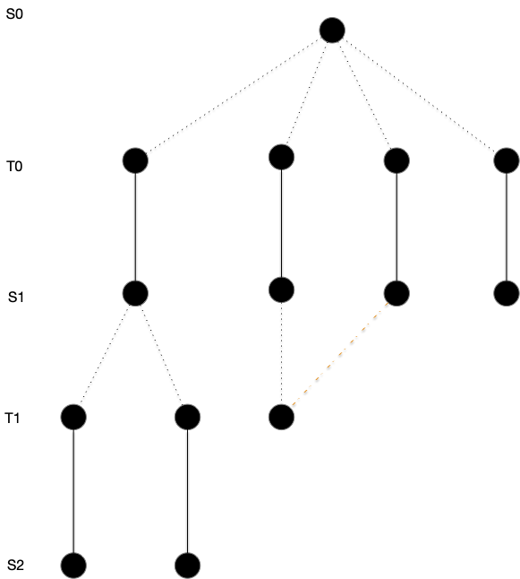
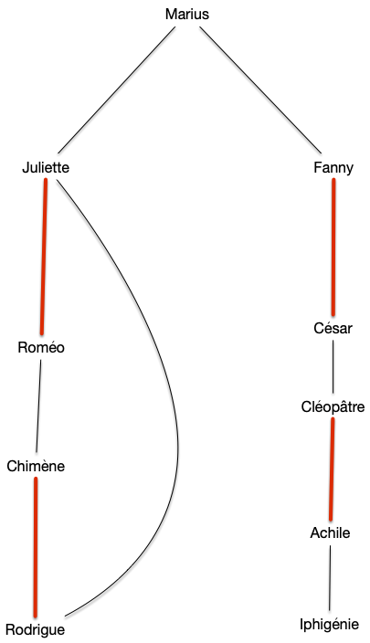

Nous allons montrer un algorithme du à Edmonds qui va chercher à trouver un chemin augmentant peux se fait exactement comme pour trouver des chaînes augmentante dans [l'algorithme de Ford et Fulkerson](../../flots/#ford-fulkerson){.interne}, par un algorithme de marquage examen qui va faire grossir des chemins alternants.

On verra qu'il est optimal pour [les graphes bi-partis](../../graphe-biparti/){.interne}.

## Trouver un chemin augmentant

On utilise l'algorithme de recherche de chemin augmentant précédent. On sait qu'il fonctionne s'il ne trouve pas de fleurs... qui n'existent pas dans les graphes bi-parti :


S i l'algorithme de recherche d'un chemin augmentant trouve une fleur c'est qu'il existe un cycle de longueur impair.



Une fleur ne peut exister que s'il existe un cycle de longueur impair formant sa corolle.




L'algorithme de recherche d'un chemin augmentant trouve un chemin augmentant s'il en existe un pour les graphes bi-partis.



Les graphes bi-partis sont exactement les graphes sans cycles de longueur impair.


### Complexité

Trouver un chemin augmentant se fait en $\mathcal{O}(m + n)$ opérations puisqu'au maximum on parcours toutes les arêtes (on ne peut que rajouter des arêtes à considérer) et pour chaque arête on fait un no,bre constant d'opérations.

Comme pour un graphe connexe on a $m \geq n-1$, pour un graphe connexe, trouver un chemin augmentant se fait en $\mathcal{O}(m)$ opérations.

## Algorithme de couplage maximum dans les graphes bi-partis

La recherche de chemin augmentant fonctionnant pour les graphes bi-parti puisque ce sont exactement les graphes sans cycles de longueur impair.


L'algorithme de recherche d'un chemin augmentant fonctionne pour les graphes bipartis.



Une corolle ne peut exister que s'il existe un cycle de longueur impair, ce qui n'existe pas pour les graphes biparti.


Il suffit alors de faire le même algorithme que pour les flots : essayer d'améliorer un chemin augmentant et si on en trouve pas, conclure que le couplage actuel est optimal.

Comme chaque étape augment de 1 le couplage, il faut au maximum tenter d'augmenter $\mathcal{O}(n)$ fois le couplage.

Partons d'un graphe ayant déjà un couplage de taille 3 :

Le marquage peut donner :

Pour augmenter le couplage :

Refaire l'algorithme peut donner :

Ce qui donne le couplage optimal :


Trouver un couplage maximum dans un graphe biparti peut se faire en $\mathcal{O}(mn)$ opérations consistant


Chaque étape d'augmentation du couplage se fait en $\mathcal{O}(m)$ opérations et il faut au maximum le fair $\mathcal{O}(n)$ fois.


Notez qu'il existe des algorithme meilleurs, comme [l'algorithme de Hopcroft-Karp](https://en.wikipedia.org/wiki/Hopcroft%E2%80%93Karp_algorithm) qui est en $\mathcal{O}(m\sqrt{n})$, mais plus compliqué à mettre en œuvre.

## Propriétés des couplage parfait et maximum dans un graphe biparti

Maintenant que l'on sait trouver un couplage optimal dans un graphe bi-parti, analysons en les propriétés.

### Couvertures

 et commençons par une constatation simple :


Soit $G = (A\cup B, E)$ un graphe bi-parti admettant $A$ et $B$ comme stables. Le couplage maximum est de taille inférieure ou égale à $\min(\vert A \vert, \vert B \vert)$.

Cette borne est atteinte, entre autre, pour les graphes biparti complet.



C'est évident.



La proposition précédente, liée au fait qu'un stable dans un graphe bi-parti est une couverture permet de retrouver [la proposition générale](../problème/#couverture){.interne}, mais on peut faire bien mieux :


Pour tout graphe biparti, la cardinalité minimum de ses couvertures est égale à la cardinalité maximum de ses couplages.




Soit $G= (A\cup B, E)$ un graphe biparti admettant $A$ et $B$ comme stables. On suppose de plus que $\vert A \vert \leq \vert B \vert$.
Soit $M$ un couplage maximum de $A$.

Si $\vert M \vert = \vert A\vert$ alors comme $A$ est une couverture on a bien le résultat demandé.

Sinon, soit $L\subseteq A$ les éléments non couverts par $M$ (on a $\vert M\vert = \vert A \vert - \vert L \vert$) et $C$ l'ensemble des sommets $x$ tels qu'il existe un [chemin alternant](../chemins-augmentant/#définition-chemin-alternant){.interne} (pas augmentant, juste alternant) partant d'un élément de $L$ et finissants en $x \notin L$. On pose alors :

- $A' = A \cap C$
- $B' = B \cap C$

Tout élément $x$ dans $B'$ sera un élément impair d'un chemin alternant et puisqu'il ne peut être libre par maximalité de $M$, il existe $xy \in M$ avec $y\in A'$. On a donc $\vert A' \vert = \vert B' \vert$ et comme $K = L \cup B' \cup (A\backslash A')$ est trivialement une couverture on a bien le résultat demandé.



La preuve du théorème précédent donne de plus une construction de la couverture de taille minimum à partir d'un couplage maximum, ce qui montre que le problème de la recherche de la couverture minimale est polynomiale dans le cas des graphes biparti alors qu'il est NP-complet dans le cas général !

> TBD écrire bien l'algorithme

Terminons cette partie en remarquant que la preuve du Théorème de Hall nous donne également un algorithme alternatif à la modélisation par flots pour trouver un couplage maximum d'un graphe bi-parti.

Il suffit de construire un arbre en partant d'une racine libre en construisant des chemins alternants :

En procédant comme dans la preuve du théorème on trouvera forcément soit un chemin augmentant soit un ensemble prouvant la maximalité du couplage.

Enfin ceci peut se faire simplement avec parcours en profondeur pour trouver un chemin augmentant en $\mathcal{O}(m)$ opérations. C'est ce que donne un DFS avec le graphe du transport amoureux avec un couplage de taille 4 et en partant d'un sommet libre :

On parcours les sommets tant que l'on peut augmenter le chemin alternant et sinon on stope la récursion.

### Couplage parfait


Un graphe biparti n'admet de couplage parfait que si toute bipartition en deux stables $A$ et $B$ est telle que $\vert A \vert = \vert B \vert$.


Ce n'est cependant pas une équivalence, comme le montre le graphe suivant :

La condition nécessaire et suffisante existe cependant mais elle est plus complexe, comme on va le voir ci-après.

### Taille des couplages


Soit $G = (A\cup B, E)$ un graphe bi-parti admettant $A$ et $B$ comme stables.

Il existe un couplage couvrant $A$ si et seulement si pour tout $S \subseteq A$ on a :

$$
\vert \{y | xy \in E, x \in S\}\vert \geq \vert S \vert
$$




Si $\vert A \vert > \vert B \vert$, c'est impossible et en prenant $S = A$, on a $\vert \\{y | xy \in E, x \in S\\}\vert \leq \vert B \vert < \vert A \vert$. On peut donc considérer que $\vert A \vert \leq \vert B \vert$

Soit $M$ un couplage maximum qui ne couvre pas $x_0 \in A$ et on note :

- $S_0 = \\{x_0\\}$
- $T_0 = \\{ y \vert yx_0 \in E\\}$

Tous les éléments de $T_0$ sont couverts sinon le couplage $M$ n'est pas maximum.

Si $\vert T_0 \vert < \vert S_0 \vert$ ($T_0$ est vide) la propriété est démontrée. Sinon, soit $y_0 \in T_0$. Si $y_0$ n'était pas couvert $x_0y_0$ serait un chemin augmentant et donc il existe $x_1 \in A \backslash S_0$ tel que $x_1y_0 \in M$ et on note $S_1 = S_0 \cup \\{x_1 \\}$, on a $\vert S_1 \vert = \vert S_0 \vert + 1$, puis on pose $T_1 = \\{ y \vert yx \in E, x \in S_1\\}$

Si $\vert T_1 \vert < \vert S_1 \vert$ la propriété est démontrée et sinon soit $y_1 \in T_1\backslash T_0$. Si $y_1$ n'était pas couvert $x_0y_0x_1y_1$ serait un chemin augmentant et donc il existe $x_2 \in A \backslash S_1$ $x_2y_1 \in M$ et on note $S_2 = S_1 \cup \\{x_2 \\}$ et on a $\vert S_2 \vert = \vert S_1 \vert + 1$ puis on pose $T_2 = \\{ y \vert yx \in E, x \in S_2\\}$.

On peut recommencer cette procédure par finitude du graphe, il va arriver un moment où $\vert T_i \vert < \vert S_i \vert$ ce qui conclue la preuve.


Le théorème précédent nous permet de résoudre l'exercice suivant :


Un graphe biparti $G=(A\cup B, E)$ tel que $\delta(x) = k > 0$ pour tout sommet $x$ admet un couplage parfait.


On a clairement $\vert A\vert = \vert B \vert$ (puisque $\vert E \vert = \sum_{x \in A}\delta(x) = \sum_{x \in B}\delta(x)$).

On conclut la preuve en remarquant que pour tout $S \subseteq A$, on a alors $\vert \\{y | xy \in E, x \in S\\}\vert = k \vert S \vert \geq \vert S \vert$.


Montrons un corollaire immédiat du théorème de Hall :


Soit $G = (A\cup B, E)$ un graphe biparti admettant $A$ et $B$ comme stables.  Il admet un couplage $\vert M \vert \geq k$ si et seulement si pour tout $S\subseteq A$ :

$$
\vert \{y | xy \in E, x \in S\}\vert \geq \vert S \vert + k - \vert A \vert
$$



Comme pour la démonstration du théorème, on peut supposer sans perte de généralité  avec $k < \vert A \vert \leq \vert B \vert$.

En ajoutant à $G$ $\vert A \vert - k$ sommets reliés à tous les éléments de $A$ pour former le graphe biparti $G'=(A\cup B', E')$ où $B'$ est le graphe contenant $B$ et tous les nouveaux sommets, on a que $G'$ contient un couplage de taille $\vert A \vert$. Même si ce couplage couvre tous les nouveaux sommets il couvre tout de même $k$ sommets de $G$ ce qui conclut la preuve.


