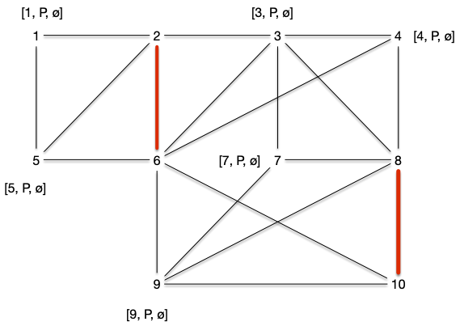

> TBD voir si utile : <https://pagesperso.g-scop.grenoble-inp.fr/~stehlikm/teaching/inf303/8-couplages.pdf>
> 
## Algorithme optimaux

### Graphes bi-parti

Trouver un chemin augmentant peux se fait exactement comme pour trouver des chaînes augmentante dans [l'algorithme de Ford et Fulkerson](../flots/#ford-fulkerson), par un algorithme de marquage examen qui va faire grossir des chemins alternants.

Un chemin augmentant est un chemin alternant qui commence et qui fii par un sommet libre. On va donc commencer par un sommet libre et l'augmenter de façon alternée jusqu'à arriver sur un autre sommet libre.

1. marque tous les sommets libres $s$ par $[s, P, \varnothing]$
   1. la première marque donne le sommet libre de départ
   2. la seconde indique si arrivée à ce sommet le chemin alternant est Pair ou Impair
   3. la dernière marque donne le prédécesseur
2. on examine toutes les arêtes $uv$ telle que $u$ possède une marque Paire (second élément de la liste de marquage valant $P$) $[s, P, p]$. Si :
   1. si $v$ est libre ($s = v$), on le marque par $[s, I, u]$ et on s'arrête on a trouvé un chemin augmentant
   2. $v$ n'a pas de marque, il existe une arête $vw \in M$. On marque alors :
      1. $v$ par $[s, I, u]$
      2. $w$ par $[s, P, v]$
      3. on recommence l'étape 2
   3. si $v$ est marqué $[s', P, p']$ avec $s\neq s'$ on peut remonter jusqu'à $s'$ et on a trouvé un chemin augmentant
   4. si $v$ est marqué $[s, P, p']$ on se retrouve devant un cas problématique.

Reprenons [le graphe exemple](#graphe-exemple){.interne} avec un couplage initial vide $M = \varnothing$.

Au départ tous les sommets sont libres, leurs marques valent $[x, P, \varnothing]$ :

#### Étape 2.1

L'algorithme s'arrête dès l'examen de la première arête, disons $\\{2, 6\\}$, dans le cas 2.1. Le marquage de l'étape suivant est alors :

On peut recommencer l'algorithme et encore une fois s'arrêter dans le cas 2.1 en choisissant d'arête $\\{8, 10\\}$. Le marquage de l'étape suivant est alors :

On peut recommencer et choisir $\\{7, 9\\}$ et arriver à :

#### Étape 2.2

En considérant l'arête $\\{4, 8\\}$, on se retrouve dans le cas 2.2. On obtient le marquage :

Et l'on faire de même en choisissant ensuite $\\{3, 7\\}$ :

#### Étape 2.3

Choisir l'arête $\\{9, 10\\}$, nous fait visiter le cas 2.3 : on obtient un chemin augmentant 3, 7, 9, 8, 4 et on obtient le graphe et le couplage :

Le cas 2.3 de l'algorithme précédent fonctionne car le chemin alternant de $v$ à $s'\neq s$ ne peut couper le chemin de $s$ à $u$ sinon deux arêtes avec une extrémité commune seraient dans le couplage.

#### Étape 4

Choisir l'arête $\\{1, 2\\}$ nous permettrait de terminer l'algorithme sans obtenir de cas problématique mais choisissons $\\{5, 2\\}$ puis $\\{6, 4\\}$ et enfin $\\{8, 10\\}$. On arrive dans le cas suivant :

Le choix de l'arête $\\{8, 10\\}$ nous mène au cas 2.4 problématique : on boucle comme le montre le chemin vert suivi par les marques. On appelle ces structures des **_fleurs_** :

Nous verrons plus tard comment résoudre le problème des fleurs (spoiler : en les coupant), pour l'instant étudions le cas où l'on ne peut pas trouver de fleurs :


L'algorithme de recherche d'un chemin augmentant fonctionne pour les graphes sans cycle impair.



Une corolle ne peut exister que s'il existe un cycle de longueur impair.



## Graphe biparti

Les graphes biparti sont exactement les graphes sans cycle impair.


L'algorithme de recherche d'un chemin augmentant fonctionne pour les graphes bipartis.



Une corolle ne peut exister que s'il existe un cycle de longueur impair, ce qui n'existe pas pour les graphes biparti.

De plus dans le cas des graphes bi-parti, l'algorithme de recherche de chemin augmentant est identique à la recherche d'une chaîne augmentante en modélisant le couplage sous la forme d'[un problème du transport amoureux](../projet-flots-modélisation/#transport-amoureux){.interne}. On est donc garanti d'obtenir un couplage maximum si l'on ne trouve pas de chemin augmentant.



On peut donc utiliser l'algorithme de chemin augmentant ou la modélisation par les flot pour trouver un couplage maximum dans un graphe bi-parti.

### Couplage parfait et maximum dans un graphe biparti


Soit $G = (A\cup B, E)$ un graphe bi-parti admettant $A$ et $B$ comme stables. Le couplage maximum est de taille $\min(\vert A \vert, \vert B \vert)$.

Cette borne est atteinte, entre autre, pour les graphes biparti complet.



C'est évident.



La proposition précédente nous permet d'énoncer le corollaire suivant  :


Un graphe biparti n'admet de couplage parfait que si toute bipartition en deux stables $A$ et $B$ est telle que $\vert A \vert = \vert B \vert$.


Ce n'est cependant pas une equivalence, comme le montre le graphe suivant :

La condition nécessaire et suffisante existe cependant mais elle est plus complexe :


Soit $G = (A\cup B, E)$ un graphe bi-parti admettant $A$ et $B$ comme stables.

Il existe un couplage couvrant $A$ si et seulement si pour tout $S \subseteq A$ on a :

$$
\vert \{y | xy \in E, x \in S\}\vert \geq \vert S \vert
$$




Si $\vert A \vert > \vert B \vert$, c'est impossible et en prenant $S = A$, on a $\vert \\{y | xy \in E, x \in S\\}\vert = \vert B \vert < \vert A \vert$. On peut donc considérer que $\vert A \vert \leq \vert B \vert$

Soit $M$ un couplage maximum qui ne couvre pas $x_0 \in A$ et on note :

- $S_0 = \\{x_0\\}$
- $T_0 = \\{ y \vert yx_0 \in E\\}$

Tous les éléments de $T_0$ sont couverts sinon le couplage $M$ n'est pas maximum.

Si $\vert T_0 \vert < \vert S_0 \vert$ ($T_0$ est vide) la propriété est démontrée. Sinon, soit $y_0 \in T_0$. Si $y_0$ n'était pas couvert $x_0y_0$ serait un chemin augmentant et donc il existe $x_1 \in A \backslash S_0$ tel que $x_1y_0 \in M$ et on note $S_1 = S_0 \cup \\{x_1 \\}$, on a $\vert S_1 \vert = \vert S_0 \vert + 1$, puis on pose $T_1 = \\{ y \vert yx \in E, x \in S_1\\}$

Si $\vert T_1 \vert < \vert S_1 \vert$ la propriété est démontrée et sinon soit $y_1 \in T_1\backslash T_0$. Si $y_1$ n'était pas couvert $x_0y_0x_1y_1$ serait un chemin augmentant et donc il existe $x_2 \in A \backslash S_1$ $x_2y_1 \in M$ et on note $S_2 = S_1 \cup \\{x_2 \\}$ et on a $\vert S_2 \vert = \vert S_1 \vert + 1$ puis on pose $T_2 = \\{ y \vert yx \in E, x \in S_2\\}$.

On peut recommencer cette procédure par finitude du graphe, il va arriver un moment où $\vert T_i \vert < \vert S_i \vert$ ce qui conclue la preuve.


Le théorème précédent nous permet de résoudre l'exercice suivant :


Un graphe biparti $G=(A\cup B, E)$ tel que $\delta(x) = k > 0$ pour tout sommet $x$ admet un couplage parfait.


On a clairement $\vert A\vert = \vert B \vert$ (puisque $\vert E \vert = \sum_{x \in A}\delta(x) = \sum_{x \in B}\delta(x)$).

On conclut la preuve en remarquant que pour tout $S \subseteq A$, on a alors $\vert \\{y | xy \in E, x \in S\\}\vert = k \vert S \vert \geq \vert S \vert$.


Montrons un corollaire immédiat du théorème de Hall :


Soit $G = (A\cup B, E)$ un graphe biparti admettant $A$ et $B$ comme stables.  Il admet un couplage $\vert M \vert \geq k$ si et seulement si pour tout $S\subseteq A$ :

$$
\vert \{y | xy \in E, x \in S\}\vert \geq \vert S \vert + k - \vert A \vert
$$



Comme pour la démonstration du théorème, on peut supposer sans perte de généralité  avec $k < \vert A \vert \leq \vert B \vert$.

En ajoutant à $G$ $\vert A \vert - k$ sommets reliés à tous les éléments de $A$ pour former le graphe biparti $G'=(A\cup B', E')$ où $B'$ est le graphe contenant $B$ et tous les nouveaux sommets, on a que $G'$ contient un couplage de taille $\vert A \vert$. Même si ce couplage couvre tous les nouveaux sommets il couvre tout de même $k$ sommets de $G$ ce qui conclut la preuve.



Terminons cette partie en remarquant que la preuve du Théorème de Hall nous donne un algorithme alternatif à la modélisation par flots pour trouver un couplage maximum d'un graphe bi-parti.

> TBD arbre de chemins alternant à partir d'un sommet non couvert. ON trouvera forcément soit un chemin augmentant soit un ensemble prouvant la maximalité du couplage.

On reverra cet algorithme.
