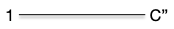

Le problème du couplage dans un graphe quelconque se résout aussi de façon polynomiale, mais les algorithmes sont plus complexes.

## Couplage parfait et maximum dans un graphe quelconque

> TBD :
> 
> - taille du couplage MAX : <https://fr.wikipedia.org/wiki/Formule_de_Tutte-Berge>
>
> - perfect matching :
>   - <https://ti.inf.ethz.ch/ew/lehre/GA07/lec-matching-alg.pdf>
>   - tutte 47 graph with perfect matching dans NP cap co-NP
>   - <https://www.dimap.ufrn.br/~mfsiqueira/Marcelo_Siqueiras_Web_Spot/Talks_files/matching-1.pdf>
>   - <http://users.cms.caltech.edu/~schulman/Courses/18cs150/lec11.pdf>


Tutte, c'est un calcul de déterminant et c'est idem que multiplication de matrice : <https://www.cs.mcgill.ca/~amehra13/Presentations/max_matching.pdf>



## Chemin augmentant dans un graphe quelconque

On a vu que l'algorithme de recherche d'un chemin augmentant fonctionnait sauf s'il constituait une fleur :

Si cela arrive, on peut contracter la corolle en un seul sommet, les arêtes parant de la corolle étant fusionné sur le nouveau sommet :

Aucune autre arête contracté ou partant de la corolle (les arêtes vertes) ne peut être dans le couplage. On a alors la propriété fondamentale suivante de l'algorithme :


S'il existe un chemin augmentant dans le graphe contracté, il existe un chemin augmentant dans le graphe initial.



Plusieurs cas sont à envisager :

- si le chemin augmentant ne passe pas par la corolle, c'est évident
- si le nouveau sommet est une extrémité, la tige n'existe pas et soit :
  - l'arête partant du nouveau point est une arête du graphe initial et du coup tout le chemin est aussi dans le graphe initial
  - l'arête partant du nouveau point n'est pas une arête du graphe initial on peut y aller dans le graphe initial sans casser le chemin augmentant
  
- le chemin passe par le nouveau sommet. La tige, ou au moins son dernier élément, est alors une des extrémités et au peut retrouver l'autre en passant par la corolle.
  


Dans l'exemple, si on a pas de chance pn peut encore contracter
On peut alors contracter la corolle en un seul sommet et en conservant les arêtes qui en partent :

Que l'on peut encore contracter une fois :

Que l'on peut contracter une dernière fois pour obtenir un graphe biparti contenant un chemin augmentant :

Ce chemin peut se détracter en un chemin augmentant du graphe initial.

On peut transformer petit à petit notre graphe. Si on a pas de chance, on obtiendra après toutes les contractions possible un graphe sans corolle, donc biparti et on sait ue pour ces graphes notre algorithme trouve toujours un chemin augmentant s'il existe.

Enfin, toute cette construction se fait de plus de façon polynomiale !

> TBD la complexité. Plus les améliorations.
