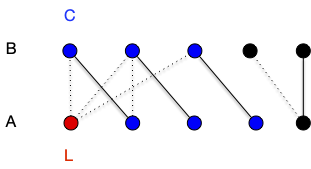

## Couplage et couverture

Si [le problème de la couverture minimale](../../cliques-stables/#problème-graphe-couverture){.interne} est un problème NP-complet en général, il devient simple pour les graphes bi-parti car il est indissociable du problème du couplage.

> TBD refaire.


Soit $G=(V, E)$ un graphe. Une couverture de $G$ est un ensemble $K \subseteq V$ telle que toute arête de $G$ à au moins un sommet dans $K$.


Remarquons immédiatement que couplage et couverture sont liées puisque si $M$ est un couplage et $K$ une couverture d'un graphe, on a évidemment $\vert M \vert \leq \vert K \vert$.

> TBD exemple

On a alors immédiatement la proposition suivante :


Soit $G=(V, E)$ un graphe. La cardinalité minimum de ses couvertures est plus grande la cardinalité maximum de ses couplages.



Attention, ce n'est pas forcément égal dans le cas général. On le déduit aisément de l'exercice suivant :


Pour tout $n>0$ il faut au moins des ensembles de $n-1$ éléments pour couvrir $K_n$.


C'est vrai pour $n < 2$ et pour $n \geq 2$, s'il existait une couverture à strictement moins de $n-1$ éléments, il existerait $x$ et $y$, deux sommets différents qui n'y sont pas, ce qui n'est pas possible puisque $xy$ est une arête de $K_n$.


Mais pour les graphes biparti ça l'est :


Pour tout graphe biparti, la cardinalité minimum de ses couvertures est égale à la cardinalité maximum de ses couplages.




Soit $G= (A\cup B, E)$ un graphe biparti admettant $A$ et $B$ comme stables. On suppose de plus que $\vert A \vert \leq \vert B \vert$.
Soit $M$ un couplage maximum de $A$.

Si $\vert M \vert = \vert A\vert$ alors comme $A$ est une couverture on a bien le résultat demandé.

Sinon, soit $L\subseteq A$ les éléments non couverts par $M$ (on a $\vert M\vert = \vert A \vert - \vert L \vert$) et $C$ l'ensemble des sommets $x$ tels qu'il existe un chemin alternant partant d'un élément de $L$ et finissants en $x \notin L$. On pose alors :

- $A' = A \cap C$
- $B' = B \cap C$

Tout élément $x$ dans $B'$ sera un élément impair d'un chemin alternant et puisqu'il ne peut être libre par maximalité de $M$, il existe $xy \in M$ avec $y\in A'$. On a donc $\vert A' \vert = \vert B' \vert$ et comme $K = L \cup B' \cup (A\backslash A')$ est trivialement une couverture on a bien le résultat demandé.



La preuve du théorème précédent donne de plus une construction de la couverture de taille minimum à partir d'un couplage maximum, ce qui montre que le problème de la recherche de la couverture minimale est polynomiale dans le cas des graphes biparti alors qu'il est NP-complet dans le cas général :


Montrez que le problème de recherche d'une couverture de taille minimale inférieure à $k$ est NP-complet.



Le problème est dans NP puisque si l'on se donne un ensemble solution, il suffit de vérifier que cet ensemble est un sous-ensemble de $V$ et que toute arête possède une extrémité dans cet ensemble. Ceci peut évidemment être fait en temps polynomial.

SI $C$ est une couverture alors $V \backslash C$ est un stable. Réciproquement si $S$ est un stable, alors $V \backslash S$ est une couverture.

Donc $G=(V, E)$ admet une couverture de taille $k$ ou moins si et seulement si le graphe complémentaire $\overline{G}=(V, \overline{E})$ admet une clique de taille $\vert V\vert - k$. Comme clique est NP-complet, ainsi est couverture.



La dualité couverture minimale et couplage maximal rappelle la dualité coupe minimale et flot maximum. On va pouvoir généraliser cette dualité et l'utiliser de la même manière dans les flots dans la partie suivante pour trouver un couplage de poids maximum dans les graphes bipartis.

## Couplage de poids maximum

> TBD couplage à poids maximum = couplage maximum à coût min.
> TBD def $p(M)$

On préfère celui-ci car cela permet d'ajouter des arêtes de poids nul et de ne considérer que des couplage de poids maximum pour des graphes bi-partis complets. Et en ajoutant des sommets relié uniquement à des arêtes de coût nul on peut même uniquement chercher des couplages parfait de $K_{n,n}$.


Soit $K_{n,n}=(V, E)$ le graphe biparti complet valué par $p:E\to \mathbb{R}^+$.

On cherche un couplage $M$ tel que $\sum_{xy\in M}p(xy) \geq \sum_{xy\in M'}p(xy)$ pour tout couplage $M'$ de $K_{n,n}$


> TBD c'est des cas pratiques à foison <https://webia.lip6.fr/~bampise/kuhn-munkres.pdf>

L'algorithme que l'on va utiliser pour cela est appelé **_méthode hongroise_** et utilise le principe de dualité entre couverture et couplage pour les graphes bipartis.

Pour cela, il faut avant tout définir une **_couverture valuée_** :


Une **_couverture valuée_** d'un graphe $G=(V, E)$ valué par $p$ est une fonction $c:V\to \mathbb{R}^+$ telle que : $c(x) + c(y)\geq p(xy)$ pour tout $xy \in E$.

Le **_coût_** d'une couverture valué est $c(V) = \sum_{x\in V}c(x)$.


Nous allons généraliser [le théorème de König-Egerváry](./#König-Egerváry) au cas valué. Commençons par remarquer que :


Soit $G=(v, E)$ un graphe valué par $p$, $c$ une de ses couverture valuée et $M$ un de ses couplages. On a :

$$
c(V) \geq p(M)
$$



Pour toute arête $xy$ de $M$ on a $c(x)+c(y)\geq p(xy)$ et comme chaque sommet apparaît au plus une fois dans le couplage on a bien l'inégalité demandée.


L'algorithme va petit à petit augmenter un couplage en diminuant une couverture valuée jusqu'à arriver à une valuation égale.

- Donnée : pne valuation $p$ du graphe biparti complet $K_{n,n} =(A\cup B, E)$ (avec $A$ et $B$ ses 2 stables)
- algorithme
   1. on note $c$ le couplage valué tel que :
      - $c(x) = \max(\\{ p(xy) \vert xy \in E \\})$ si $x\in A$
      - $c(x) = 0$ si $x\in B$
   2. soit $G[c] = (A\cup B, E[c])$ le graphe tel que $xy \in E$ si et seulement si $c(x) + c(y) - p(xy) = 0$
   3. Soit $M$ un couplage maximum de $G[c]$
   4. **si** $M$ couvre $A$ **rendre** $M$ et $c$
   5. soit $C$ une couverture de taille $\vert M \vert$. On pose :
      - $A' = A \cap C$
      - $B' = B \cap C$
      - $\lambda = \min(\\{c(x) + c(y) - p(xy) \vert x\in A\backslash A', y\in B\backslash B' \\})$
      - $c(x) = c(x) -\lambda$ si $x \in A\backslash A'$
      - $c(x) = c(x)  + \lambda$ si $x \in B\backslash B'$
   6. retour à l'étape 2.

L'algorithme va forcément trouver un couplage parfait car à chaque étape $G[c]$ va avoir strictement plus d'arête :

- si $c(x) + c(y) - p(xy) = 0$ à une étape donné c'est vrai aussi à l'étape suivante
- à l'étape 5. aucune arête $xy$ avec $x\in A\backslash A'$ et $y \in B\backslash B'$ n'est dans $G[c]$, ce qui implique que $\lambda > 0$

De plus, à la fin on a clairement que $c(A\cup B) = p(M)$ ce qui montre que le couplage est bien de poids maximum et la couverture valuée de poids minimum.

Tout ce fait de façon polynomiale puisque  trouver la couverture max peut se faire comme dans la preuve [du théorème de König-Egerváry](./#König-Egerváry).

> TBD exemple avec augmentation sur l'arbre des chemin (comme non valué). Les arêtes du couplage sont telle que un des sommets est de degré 1 das l'arbre (cf poly)

Cet algorithme démontre un principe fondamental dans le design d’algorithme par primal/dual : une solution augmente pendant que l'autre diminue, la solution étant trouvée lorsque les deux coïncident.



- <https://webia.lip6.fr/~bampise/kuhn-munkres.pdf>
- [méthode hongroise](https://www.youtube.com/watch?v=fMAmtE0UyzI)


