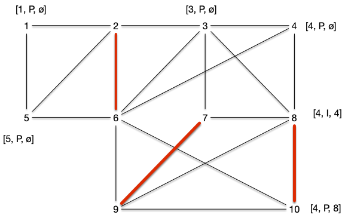
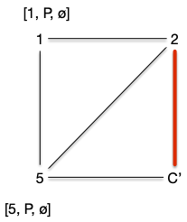

Le problème de couplage peut être défini ainsi :


Soit $G=(V, E)$ un graphe. Un **_couplage_** est un ensemble $M \subseteq E$ tel que si $xy, x'y' \in E$ alors $xy \cap x'y' = \varnothing$ (le degré de tout sommet du graphe $G'=(V, M)$ est strictement inférieur à 2).


Dans un couplage tout extrémité d'une arête n'apparaît qu'une seule fois. Par exemple, le graphe ci-dessous :

Admet l'ensemble des arêtes rouges comme couplage :

On définit plusieurs types de couplages selon le graphe :


Soit $G=(V, E)$ un graphe. Un **_couplage_** $M$ est dit :

- **_maximal_** s'il n'existe pas de couplage $M'$ l'incluant (toute arête de $G$ possède une extrémité co;;une avec une arête de $M$)
- **_maximum_** s'il n'existe pas de couplage $M'$ tels que $\vert M'\vert > \vert M\vert$
- **_parfait_** si pour tout sommet de $V$ il existe une arête de $M$ l'ayant comme extrémité. Un couplage parfait ne peut exister que s'il y a un nombre pair de sommet et à forcément $\vert V \vert/2$ arêtes.


Le couplage du graphe précédent par exemple était maximal mais pas maximum. Il possède en effet un couplage parfait :


Montrez que le graphe précédent admet un autre couplage parfait.





## Algorithme glouton

On peut faire la même chose que ce qu'on a vu pour [le problème du postier chinois](../projet-postier-chinois/) en prenant des arêtes une à une tant que c'est possible.

Cet algorithme possède au pire deux fois moins d'arêtes qu'un couplage maximum

> TBD preuve : <https://people.cs.uchicago.edu/~laci/HANDOUTS/greedymatching.pdf>
>

Le problème n'est cependant pas NP-complet comme on pourrait s'y attendre, il est même facile à résoudre algorithmiquement. Commençons par caractériser les couplages maximum.

## Chemin augmentant

Dans les exercices de modélisation par des flots, [le problème du transport amoureux](../projet-flots-modélisation/#transport-amoureux){.interne} permettait de résoudre un problème de couplage. En utilisant cette modélisation, et en augmentant les flots d'une valeur entière (toujours 1) une chaîne augmentante est un chemin tel que les arcs sont :

- têtes bêches de la source au puits
- les arcs allant vers le puits sont de flot 0 et peuvent être augmentés
- les arcs allant vers la source sont de flot 1 et peuvent être diminués.

Essayons d'adapter ceci à notre problème de couplage. Commençons par décrire le graphe des relations entre les deux couples de personnes. Marier le plus de héros de roman revient à trouver un couplage maximum dans le graphe suivant :

On a pas besoin d'ajouter une source ou un puits. Ajoutons quelques arêtes au couplage :

Le graphe précédent admet le couplage $M = \\{ \\{\text{Cléopâtre},\text{Achille}\\}, \\{\text{Fanny},\text{Marius}\\} \\}$. Dans le cadre d'une modélisation par flot (avec des arcs, une source et un puits), il resterait encore des chaines augmentante comme : `source -> Juliette -> Rodrigue -> puits` ou encore `source -> Iphigénie -> Achille <- Cléopâtre -> César -> puits`.

Dans notre graphe de couplage ceci s'écrit comme un chemin de longueur impaire dont une arête est alternativement dans le couplage ou non et commence par un sommet qui n'est extrémité d'aucune arête du couplage.


Soit $G=(V, E)$ un graphe et $M$ un de ses couplages.

- un sommet $x$ est :
  - **_libre_** s'il n'est pas extrémité d'une arête de $M$.
  - **_couvert_** s'il est extrémité d'une arête de $M$.
- **_Un chemin alternant_** $x_0\dots x_k$ est tel que :
  - $x_0\dots x_k$ est un [chemin élémentaire](../chemins-cycles-connexite/#définition-élémentaire) de $G$
  - si $x_{i-1}x_{i} \in M$ alors $x_{i}x_{i+1} \notin M$ pour tout $i$
  - si $x_{i-1}x_{i} \notin M$ alors $x_{i}x_{i+1} \in M$ pour tout $i$
- **_Un chemin augmentant_** $x_0\dots x_k$ est un chemin alternant qui commence ($x_0$) et termine ($x_k$) par deux sommets libres.



Dans l'exemple précédent, `Cléopâtre - Achille - Iphigénie` est un chemin alternant mais pas augmentant, alors que `Juliette - Roméo` ou encore `César - Cléopâtre - Achille - Iphigénie` sont des chemins augmentant. On remarque que cette notion (de chemin augmentant) est similaire à celle de chaîne augmentante dans les flots :


Soit $G=(V, E)$ un graphe et $M$ un de ses couplages.

S'il existe un chemin augmentant $x_0\dots x_{2p+1}$ alors l'ensemble :

$$
M' = (M \backslash \\{ x_{1+2i}x_{2i+2} \vert 0 \leq i < p\\}) \cup \\{ x_{2i}x_{2i+1} \vert 0\leq i \leq p\\}
$$

Est un couplage tel que $\vert M' \vert = \vert M \vert +1$



Clair.



### Chemin augmentant et couplage maximum

Comme on s'y attend, la réciproque est également vraie :


Soit $G=(V, E)$ un graphe et $M$ un de ses couplages.

S'il existe n'existe pas de chemin augmentant alors $M$ est un coupage maximum.




Soit $M$ (en vert) un couplage et $M^\star$ (en rouge un couplage optimal). Si $xy \in M$ et $xy' \in M^\star$ on est dans un des deux cas suivant :

Et les autres voisins de $x$ (les arêtes en pointillées) ne sont ni dans $M$ ni dans $M^\star$

De plus si l'arête $xy$ est dans un seul couplage ($M$ ou $M^\star$), au moins une de ses extrémité est couverte par l'autre couplage, sinon les deux sommets $x$ et $y$ seraient libre pour lui et $xy$ serait un chemin augmentant.

Soit alors le graphe $G'=(V, M \cup M^\star)$. Les remarques précédentes  est alors tel que tout sommet est au plus de degré 2 : ses composantes connexes sont soit des chemins soit des cycles alternants.

On conclut la preuve en remarquant que le fait qu'ils soient alternants impose que les cycles et les chemins soient de longueur pairs :

- les cycle car sinon on a deux arêtes du même couplage  qui se suivent
- les chemins sinon il existerait un chemin augmentant pour l'un ou l'autre couplage.

Si par exemple aucune des extrémité du chemin ci dessous ne se prolonge (qu'il y ait ou pas des voisins), alors il existe un chemin augmentant pour pour le couplage rouge :

La parité des cycles et des chemin montre que $\vert M^\star\vert = \vert M\vert$.



On a alors l'équivalence suivante, que l'on doit à Claude Berge :


Soit $G=(V, E)$ un graphe et $M$ un de ses couplages.

$M$ est maximum si et seulement si il existe n'existe pas de chemin augmentant.



### Trouver un chemin augmentant ?

Trouver un chemin augmentant peux se fait exactement comme pour trouver des chaînes augmentante dans [l'algorithme de Ford et Fulkerson](../flots/#ford-fulkerson), par un algorithme de marquage examen qui va faire grossir des chemins alternants.

Un chemin augmentant est un chemin alternant qui commence et qui fii par un sommet libre. On va donc commencer par un sommet libre et l'augmenter de façon alternée jusqu'à arriver sur un autre sommet libre.

1. marque tous les sommets libres $s$ par $[s, P, \varnothing]$
   1. la première marque donne le sommet libre de départ
   2. la seconde indique si arrivée à ce sommet le chemin alternant est Pair ou Impair
   3. la dernière marque donne le prédécesseur
2. on examine toutes les arêtes $uv$ telle que $u$ possède une marque Paire (second élément de la liste de marquage valant $P$) $[s, P, p]$. Si :
   1. si $v$ est libre ($s = v$), on le marque par $[s, I, u]$ et on s'arrête on a trouvé un chemin augmentant
   2. $v$ n'a pas de marque, il existe une arête $vw \in M$. On marque alors :
      1. $v$ par $[s, I, u]$
      2. $w$ par $[s, P, v]$
      3. on recommence l'étape 2
   3. si $v$ est marqué $[s', P, p']$ avec $s\neq s'$ on peut remonter jusqu'à $s'$ et on a trouvé un chemin augmentant
   4. si $v$ est marqué $[s, P, p']$ on se retrouve devant un cas problématique.

Reprenons [le graphe exemple](#graphe-exemple){.interne} avec un couplage initial vide $M = \varnothing$.

Au départ tous les sommets sont libres, leurs marques valent $[x, P, \varnothing]$ :

#### Étape 2.1

L'algorithme s'arrête dès l'examen de la première arête, disons $\\{2, 6\\}$, dans le cas 2.1. Le marquage de l'étape suivant est alors :

On peut recommencer l'algorithme et encore une fois s'arrêter dans le cas 2.1 en choisissant d'arête $\\{8, 10\\}$. Le marquage de l'étape suivant est alors :

On peut recommencer et choisir $\\{7, 9\\}$ et arriver à :

#### Étape 2.2

En considérant l'arête $\\{4, 8\\}$, on se retrouve dans le cas 2.2. On obtient le marquage :

Et l'on faire de même en choisissant ensuite $\\{3, 7\\}$ :

#### Étape 2.3

Choisir l'arête $\\{9, 10\\}$, nous fait visiter le cas 2.3 : on obtient un chemin augmentant 3, 7, 9, 8, 4 et on obtient le graphe et le couplage :

Le cas 2.3 de l'algorithme précédent fonctionne car le chemin alternant de $v$ à $s'\neq s$ ne peut couper le chemin de $s$ à $u$ sinon deux arêtes avec une extrémité commune seraient dans le couplage.

#### Étape 4

Choisir l'arête $\\{1, 2\\}$ nous permettrait de terminer l'algorithme sans obtenir de cas problématique mais choisissons $\\{5, 2\\}$ puis $\\{6, 4\\}$ et enfin $\\{8, 10\\}$. On arrive dans le cas suivant :

Le choix de l'arête $\\{8, 10\\}$ nous mène au cas 2.4 problématique : on boucle comme le montre le chemin vert suivi par les marques. On appelle ces structures des **_fleurs_** :

Nous verrons plus tard comment résoudre le problème des fleurs (spoiler : en les coupant), pour l'instant étudions le cas où l'on ne peut pas trouver de fleurs :


L'algorithme de recherche d'un chemin augmentant fonctionne pour les graphes sans cycle impair.



Une corolle ne peut exister que s'il existe un cycle de longueur impair.



## Graphe biparti

Les graphes biparti sont exactement les graphes sans cycle impair.


L'algorithme de recherche d'un chemin augmentant fonctionne pour les graphes bipartis.



Une corolle ne peut exister que s'il existe un cycle de longueur impair, ce qui n'existe pas pour les graphes biparti.

De plus dans le cas des graphes bi-parti, l'algorithme de recherche de chemin augmentant est identique à la recherche d'une chaîne augmentante en modélisant le couplage sous la forme d'[un problème du transport amoureux](../projet-flots-modélisation/#transport-amoureux){.interne}. On est donc garanti d'obtenir un couplage maximum si l'on ne trouve pas de chemin augmentant.



On peut donc utiliser l'algorithme de chemin augmentant ou la modélisation par les flot pour trouver un couplage maximum dans un graphe bi-parti.

### Couplage parfait et maximum dans un graphe biparti


Soit $G = (A\cup B, E)$ un graphe bi-parti admettant $A$ et $B$ comme stables. Le couplage maximum est de taille $\min(\vert A \vert, \vert B \vert)$.

Cette borne est atteinte, entre autre, pour les graphes biparti complet.



C'est évident.



La proposition précédente nous permet d'énoncer le corollaire suivant  :


Un graphe biparti n'admet de couplage parfait que si toute bipartition en deux stables $A$ et $B$ est telle que $\vert A \vert = \vert B \vert$.


Ce n'est cependant pas une equivalence, comme le montre le graphe suivant :

La condition nécessaire et suffisante existe cependant mais elle est plus complexe :


Soit $G = (A\cup B, E)$ un graphe bi-parti admettant $A$ et $B$ comme stables.

Il existe un couplage couvrant $A$ si et seulement si pour tout $S \subseteq A$ on a :

$$
\vert \{y | xy \in E, x \in S\}\vert \geq \vert S \vert
$$




Si $\vert A \vert > \vert B \vert$, c'est impossible et en prenant $S = A$, on a \vert \{y | xy \in E, x \in S\}\vert = \vert B \vert < \vert A \vert$. On peut donc considérer que $\vert A \vert \leq \vert B \vert$

Soit $M$ un couplage maximum qui ne couvre pas $x_0 \in A$ et on note :

- $S_0 = \\{x_0\\}$
- $T_0 = \\{ y \vert yx_0 \in E\\}$

Tous les éléments de $T_0$ sont couverts sinon le couplage $M$ n'est pas maximum.

Si $\vert T_0 \vert < \vert S_0 \vert$ ($T_0$ est vide) la propriété est démontrée. Sinon, soit $y_0 \in T_0$. Si $y_0$ n'était pas couvert $x_0y_0$ serait un chemin augmentant et donc il existe $x_1 \in A \backslash S_0$ tel que $x_1y_0 \in M$ et on note $S_1 = S_0 \cup \\{x_1 \\}$ et on a $\vert S_1 \vert = \vert S_0 \vert + 1$ puis on pose $T_1 = \\{ y \vert yx \in E, x \in S_1\\}$.

Si $\vert T_1 \vert < \vert S_1 \vert$ la propriété est démontrée et sinon soit $y_1 \in T_1\backslash T_0$. Si $y_1$ n'était pas couvert $x_0y_0x_1y_1$ serait un chemin augmentant et donc il existe $x_2 \in A \backslash S_1$ $x_2y_1 \in M$ et on note $S_2 = S_1 \cup \\{x_2 \\}$ et on a $\vert S_2 \vert = \vert S_1 \vert + 1$ puis on pose $T_2 = \\{ y \vert yx \in E, x \in S_2\\}$.

On peut recommencer cette procédure par finitude du graphe, il va arriver un moment où $\vert T_i \vert < \vert S_i \vert$ ce qui conclue la preuve.


Le théorème précédent nous permet de résoudre l'exercice suivant :


Un graphe biparti $G=(A\cup B, E)$ tel que $\delta(x) = k > 0$ pour tout sommet $x$ admet un couplage parfait.


On a clairement $\vert A\vert = \vert B \vert$ (puisque $\vert E \vert = \sum_{x \in A}\delta(x) = \sum_{x \in B}\delta(x)$).

On conclut la preuve en remarquant que pour tout $S \subseteq A$, on a alors $\vert \\{y | xy \in E, x \in S\\}\vert = k \vert S \vert \geq \vert S \vert$.


Montrons un corollaire immédiat du théorème de Hall :


Soit $G = (A\cup B, E)$ un graphe biparti admettant $A$ et $B$ comme stables.  Il admet un couplage $\vert M \vert \geq k$ si et seulement si pour tout $S\subseteq A$ :

$$
\vert \{y | xy \in E, x \in S\}\vert \geq \vert S \vert + k - \vert A \vert
$$



Comme pour la démonstration du théorème, on peut supposer sans perte de généralité  avec $k < \vert A \vert \leq \vert B \vert$.

En ajoutant à $G$ $\vert A \vert - k$ sommets reliés à tous les éléments de $A$ pour former le graphe biparti $G'=(A\cup B, E')$ où $B'$ est le graphe contenant $B$ et tous les nouveaux sommets, on a que $G'$ contient un couplage de taille $\vert A \vert$. Même si ce couplage couvre tous les nouveaux sommets il couvre tout de même $k$ sommets de $G$ ce qui conclut la preuve.



Terminons cette partie en remarquant que la preuve du Théorème de Hall nous donne un algorithme alternatif à la modélisation par flots pour trouver un couplage maximum d'un graphe bi-parti. On reverra cet algorithme.

### Couplage et couverture


Soit $G=(V, E)$ un graphe. Une couverture de $G$ est un ensemble $K \subseteq V$ telle que toute arête de $G$ à au moins un sommet dans $K$.


Remarquons immédiatement que couplage et couverture sont liées puisque si $M$ est un couplage et $K$ une couverture d'un graphe, on a évidemment $\vert M \vert \leq \vert K \vert$.

> TBD exemple

On a alors immédiatement la proposition suivante :


Soit $G=(V, E)$ un graphe. La cardinalité minimum de ses couvertures est plus grande la cardinalité maximum de ses couplages.



Attention, ce n'est pas forcément égal dans le cas général. On le déduit aisément de l'exercice suivant :


Pour tout $n>0$ il faut au moins des ensembles de $n-1$ éléments pour couvrir $K_n$.


C'est vrai pour $n < 2$ et pour $n \geq 2$, s'il existait une couverture à strictement moins de $n-1$ éléments, il existerait $x$ et $y$, deux sommets différents qui n'y sont pas, ce qui n'est pas possible puisque $xy$ est une arête de $K_n$.


Mais pour les graphes biparti ça l'est :


Pour tout graphe biparti, la cardinalité minimum de ses couvertures est égale à la cardinalité maximum de ses couplages.




Soit $G= (A\cup B, E)$ un graphe biparti admettant $A$ et $B$ comme stables. On suppose de plus que $\vert A \vert \leq \vert B \vert$.
Soit $M$ un couplage maximum de $A$.

Si $\vert M \vert = \vert A\vert$ alors comme $A$ est une couverture on a bien le résultat demandé.

Sinon, soit $L\subseteq A$ les éléments non couverts par $M$ (on a $\vert M\vert = \vert A \vert - \vert L \vert$) et $C$ l'ensemble des sommets $x$ tels qu'il existe un chemin alternant partant d'un élément de $L$ et finissants en $x$. On pose alors :

- $A' = A \cap C$
- $B' = B \cap C$

Tout élément $x$ dans $B'$ sera un élément pair d'un chemin alternant et puisqu'il ne peut être libre par maximalité de $M$, il existe $xy \in M$ avec $y\in A'$. On a donc $\vert A' \vert = \vert B' \vert$ et comme $K = L \cup B' \cup (A\backslash A')$ est trivialement une couverture on a bien le résultat demandé.

> TBD dessin



La preuve du théorème précédent donne de plus une construction de la couverture de taille minimum à partir d'un couplage maximum, ce qui montre que le problème de la recherche de la couverture minimale est polynomiale dans le cas des graphes biparti alors qu'il est NP-complet dans le cas général :


Montrez que le problème de recherche d'une couverture de taille minimale inférieure à $k$ est NP-complet.



Le problème est dans NP puisque si l'on se donne un ensemble solution, il suffit de vérifier que cet ensemble est un sous-ensemble de $V$ et que toute arête possède une extrémité dans cet ensemble. Ceci peut évidemment être fait en temps polynomial.

SI $C$ est une couverture alors $V \backslash C$ est un stable. Réciproquement si $S$ est un stable, alors $V \backslash S$ est une couverture.

Donc $G=(V, E)$ admet une couverture de taille $k$ ou moins si et seulement si le graphe complémentaire $\overline{G}=(V, \overline{E})$ admet une clique de taille $\vert V\vert - k$. Comme clique est NP-complet, ainsi est couverture.



La dualité couverture minimale et couplage maximal rappelle la dualité coupe minimale et flot maximum. On va pouvoir généraliser cette dualité et l'utiliser de la même manière dans les flots dans la partie suivante pour trouver un couplage de poids maximum dans les graphes bipartis.

### Couplage de poids maximum

> TBD couplage à poids maximum = couplage maximum à coût min.
> TBD def $p(M)$

On préfère celui-ci car cela permet d'ajouter des arêtes de poids nul et de ne considérer que des couplage de poids maximum pour des graphes bi-partis complets. Et en ajoutant des sommets relié uniquement à des arêtes de coût nul on peut même uniquement chercher des couplages parfait de $K_{n,n}$.


Soit $K_{n,n}=(V, E)$ le graphe biparti complet valué par $p:E\to \mathbb{R}^+$.

On cherche un couplage $M$ tel que $\sum_{xy\in M}p(xy) \geq \sum_{xy\in M'}p(xy)$ pour tout couplage $M'$ de $K_{n,n}$


> TBD c'est des cas pratiques à foison <https://webia.lip6.fr/~bampise/kuhn-munkres.pdf>

L'algorithme que l'on va utiliser pour cela est appelé **_méthode hongroise_** et utilise le principe de dualité entre couverture et couplage pour les graphes bipartis.

Pour cela, il faut avant tout définir une **_couverture valuée_** :


Une **_couverture valuée_** d'un graphe $G=(V, E)$ valué par $p$ est une fonction $c:V\to \mathbb{R}^+$ telle que : $c(x) + c(y)\geq p(xy)$ pour tout $xy \in E$.

Le **_coût_** d'une couverture valué est $c(V) = \sum_{x\in V}c(x)$.


Nous allons généraliser [le théorème de König-Egerváry](./#König-Egerváry) au cas valué. Commençons par remarquer que :


Soit $G=(v, E)$ un graphe valué par $p$, $c$ une de ses couverture valuée et $M$ un de ses couplages. On a :

$$
c(V) \geq p(M)
$$



Pour toute arête $xy$ de $M$ on a $c(x)+c(y)\geq p(xy)$ et comme chaque sommet apparaît au plus une fois dans le couplage on a bien l'inégalité demandée.


L'algorithme va petit à petit augmenter un couplage en diminuant une couverture valuée jusqu'à arriver à une valuation égale.

- Donnée : pne valuation $p$ du graphe biparti complet $K_{n,n} =(A\cup B, E)$ (avec $A$ et $B$ ses 2 stables)
- algorithme
   1. on note $c$ le couplage valué tel que :
      - $c(x) = \max(\\{ p(xy) \vert xy \in E \\})$ si $x\in A$
      - $c(x) = 0$ si $x\in B$
   2. soit $G[c] = (A\cup B, E[c])$ le graphe tel que $xy \in E$ si et seulement si $c(x) + c(y) - p(xy) = 0$
   3. Soit $M$ un couplage maximum de $G[c]$
   4. **si** $M$ couvre $A$ **rendre** $M$ et $c$
   5. soit $C$ une couverture de taille $\vert M \vert$. On pose :
      - $A' = A \cap C$
      - $B' = B \cap C$
      - $\lambda = \min(\\{c(x) + c(y) - p(xy) \vert x\in A\backslash A', y\in B\backslash B' \\})$
      - $c(x) = c(x) -\lambda$ si $x \in A\backslash A'$
      - $c(x) = c(x)  + \lambda$ si $x \in B\backslash B'$
   6. retour à l'étape 2.

L'algorithme va forcément trouver un couplage parfait car à chaque étape $G[c]$ va avoir strictement plus d'arête :

- si $c(x) + c(y) - p(xy) = 0$ à une étape donné c'est vrai aussi à l'étape suivante
- à l'étape 5. aucune arête $xy$ avec $x\in A\backslash A'$ et $y \in B\backslash B'$ n'est dans $G[c]$, ce qui implique que $\lambda > 0$

De plus, à la fin on a clairement que $c(A\cup B) = p(M)$ ce qui montre que le couplage est bien de poids maximum et la couverture valuée de poids minimum.

Tout ce fait de façon polynomiale puisque  trouver la couverture max peut se faire comme dans la preuve [du théorème de König-Egerváry](./#König-Egerváry).

> TBD exemple

Cet algorithme démontre un principe fondamental dans le design d’algorithme par primal/dual : une solution augmente pendant que l'autre diminue, la solution étant trouvée lorsque les deux coïncident.



- <https://webia.lip6.fr/~bampise/kuhn-munkres.pdf>
- [méthode hongroise](https://www.youtube.com/watch?v=fMAmtE0UyzI)



## Graphe quelconque

Le problème du couplage dans un graphe quelconque se résout aussi de façon polynomiale, mais les algorithmes sont plus complexes.

### Couplage parfait et maximum dans un graphe quelconque

> TBD :
> 
> - taille du couplage MAX : <https://fr.wikipedia.org/wiki/Formule_de_Tutte-Berge>
>
> - perfect matching :
>   - <https://ti.inf.ethz.ch/ew/lehre/GA07/lec-matching-alg.pdf>
>   - tutte 47 graph with perfect matching dans NP cap co-NP
>   - <https://www.dimap.ufrn.br/~mfsiqueira/Marcelo_Siqueiras_Web_Spot/Talks_files/matching-1.pdf>
>   - <http://users.cms.caltech.edu/~schulman/Courses/18cs150/lec11.pdf>


Tutte, c'est un calcul de déterminant et c'est idem que multiplication de matrice : <https://www.cs.mcgill.ca/~amehra13/Presentations/max_matching.pdf>



### Algorithme

#### Fleur

À partir d'une fleur :

On peut contracter la corolle en un seul sommet, les arˆ´tes parant de la corolle étant fusionné sur le nouveau sommet :

Aucune autre arête contracté ou partant de la corolle (les arêtes vertes) ne peut être dans le couplage. On a alors la propriété fondamentale suivante de l'algorithme :


S'il existe un chemin augmentant dans le graphe contracté, il existe un chemin augmentant dans le graphe initial.



Plusieurs cas sont à envisager :

- si le chemin augmentant ne passe pas par la corolle, c'est évident
- si le nouveau sommet est une extrémité, la tige n'existe pas et soit :
  - l'arête partant du nouveau point est une arête du graphe initial et du coup tout le chemin est aussi dans le graphe initial
  - l'arête partant du nouveau point n'est pas une arête du graphe initial on peut y aller dans le graphe initial sans casser le chemin augmentant
  
- le chemin passe par le nouveau sommet. La tige, ou au moins son dernier élément, est alors une des extrémités et au peut retrouver l'autre en passant par la corolle.
  


Dans l'exemple, si on a pas de chance pn peut encore contracter
On peut alors contracter la corolle en un seul sommet et en conservant les arêtes qui en partent :

Que l'on peut encore contracter une fois :

Que l'on peut contracter une dernière fois pour obtenir un graphe biparti contenant un chemin augmentant :

Ce chemin peut se détracter en un chemin augmentant du graphe initial.

On peut transformer petit à petit notre graphe. Si on a pas de chance, on obtiendra après toutes les contractions possible un graphe sans corolle, donc biparti et on sait ue pour ces graphes notre algorithme trouve toujours un chemin augmentant s'il existe.

Enfin, toute cette construction se fait de plus de façon polynomiale !

> TBD la complexité. Plus les améliorations.

#### Valué

> TBD par primal dual. Donner l'algo et dire qu'on ne le démontrera pas ici.

> TBD min couverture = max couplage, ne marche pas ici (exemple ?)
> 
1. général
   1. les fleurs d'Edmonds $\mathcal{O}(n^4)$: <https://fr.wikipedia.org/wiki/Algorithme_d%27Edmonds_pour_les_couplages>, <https://math.nist.gov/~JBernal/p_t_f.pdf>
   2. couplage d'un graphe valué : <https://en.wikipedia.org/wiki/Maximum_weight_matching>
      1. on peut toujours se ramener à un couplage parfait en doublant le graphe et en mettant des 0 sur les arêtes qui relient les 2 copies du graphe
      2. on cherche des chaînes augmentantes dans des graphes particuliers. <https://theory.stanford.edu/~jvondrak/MATH233B-2017/lec6.pdf>. [Framework primal/dual](https://math.mit.edu/~goemans/PAPERS/book-ch4.pdf) : ceci dépasse le cadre de ce cours mais généralise ce qu'on a vu pour les graphes bipartis



- [programmation linéaire et couplage](https://www.cs.cmu.edu/afs/cs.cmu.edu/academic/class/15850-f20/www/notes/lec7.pdf)
- [primal dual et problèmes combinatoires](https://www.youtube.com/watch?v=Z0eSQapcE6A&list=PLXsmhnDvpjORcTRFMVF3aUgyYlHsxfhNL&index=42)



## Implémentation

- [NetworkX](https://networkx.org/) : <https://stackoverflow.com/questions/27132313/maximum-weighted-pairing-algorithm-for-complete-graph>
- <https://cs.stackexchange.com/questions/109021/perfect-matching-in-complete-weighted-graph>