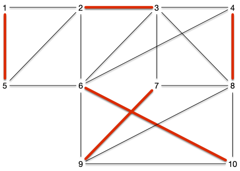

Le problème de couplage peut être défini ainsi :


Soit $G=(V, E)$ un graphe. Un **_couplage_** est un ensemble $M \subseteq E$ tel que si $xy, x'y' \in E$ alors $xy \cap x'y' = \varnothing$ (le degré de tout sommet du graphe $G'=(V, M)$ est strictement inférieur à 2).

Un sommet $x$ est :

- **_libre_** s'il n'est pas extrémité d'une arête de $M$.
- **_couvert_** s'il est extrémité d'une arête de $M$.



Dans un couplage tout extrémité d'une arête n'apparaît qu'une seule fois. Par exemple, le graphe ci-dessous :

<span id="graphe-exemple"></span>


Admet l'ensemble des arêtes rouges comme couplage :


On définit plusieurs types de couplages selon le graphe :


Soit $G=(V, E)$ un graphe. Un **_couplage_** $M$ est dit :

- **_maximal_** s'il n'existe pas de couplage $M'$ l'incluant (toute arête de $G$ possède une extrémité co;;une avec une arête de $M$)
- **_maximum_** s'il n'existe pas de couplage $M'$ tels que $\vert M'\vert > \vert M\vert$
- **_parfait_** si pour tout sommet de $V$ il existe une arête de $M$ l'ayant comme extrémité. Un couplage parfait ne peut exister que s'il y a un nombre pair de sommet et à forcément $\vert V \vert/2$ arêtes.


Pour tout graphe $G=(V, E)$, on note $\nu(G)$ le nombre d'arête de ses couplages maximum.



Les trois types de couplages sont bien distincts. Le couplage de la figure précédente était maximal (toute arête du graphe à un sommet commun avec une arête du couplage), mais il n'est pas maximum. Il possède en effet un couplage parfait :



Montrez que le graphe précédent admet un autre couplage parfait.





## Algorithme glouton

Le problème du couplage admet un algorithme glouton très simple permettant de trouver un couplage acceptable puisqu'à performance garantie :

```pseudocode

algorithme couplage_glouton(G: Graphe<Sommet>) → { {Sommet} }
   M := { {Sommet} }
   M ← ∅
   pour chaque arête xy de G:
      si x et y ne sont pas couverts par M:
         M ← M ∪ { xy }
```

Cet algorithme est très simple et il est clair qu'il peut trouver un couplage maximum s'il prend les arêtes dans un _bon_ ordre. Mais même si l'ordre est quelconque il ne peut pas être si mauvais que ça :


L'algorithme précédent est à [performance garantie](/cours/algorithmie/design-algorithmes/algorithmes-gloutons/principe/#définition-performance-garantie){.interne} de $1/2$ (il a au pire 2 fois moins d'arêtes qu'un couplage maximum).



Il est tout d'abord clair que le couplage $M$ obtenu par l'algorithme est maximal puisque toute arête rejetée possède une de ses extrémité couverte par $M$. De là, si $M^\star$ un couplage maximum alors chacune de ses arêtes a au moins 1 de ses sommets couvert par $M$ (soit l'arête est dans $M$ soit elle a été rejetée au cours de l'algorithme).

Donc au moins la moitié ($\frac{1}{2}$) des sommets couverts  par $M^\star$ ($2 \cdot \vert M^\star \vert$) sont couverts par les sommets de $M$ ($2\cdot \vert M \vert$), on a ainsi $\frac{1}{2}\cdot(2 \cdot \vert M^\star \vert) \leq 2 \cdot \vert M \vert$ ce qui conclut la preuve.



L'exercice suivant montre que la 1/2 performance garantie est atteinte quelque soit la taille du graphe.


Montrez que quelques soit $n$, il existe un graphe connexe à plus de $n$ sommets tel que l'algorithme peut trouver 2 fois moins d'arête que son couplage maximum.



On peut prendre un graphe qui est une successions d chemins de longueur 3 comme celui-ci :


Si l'algorithme prend systématiquement l'arête au milieu du chemin, son couplage sera de taille deux fois plus petite que le couplage prenant les extrémités de chaque chemin.


Cet algorithme glouton montre que si l'on cherche rapidement une solution (l'algorithme est linéaire en la taille du graphe) on peut le faire sans grand risque de tomber trop à côté de la solution optimale.

## <span id="couverture"></span>Couplage et couvertures

Couplage maximum et [couverture minimale](../../cliques-stables/#problème-graphe-couverture){.interne} sont deux problèmes intimement liés. En effet :


Si $M$ est un couplage et $K$ une couverture d'un graphe, on a évidemment $\vert M \vert \leq \vert K \vert$.


S'il existait une couverture à strictement moins de $\vert M \vert$ sommets, il existerait une arête $xy$ de $M$ dont aucun des sommets ne serait dans la couverture, ce qui est impossible (puisque $xy$ est ue arête du graphe).



On a alors immédiatement la proposition suivante :


Soit $G=(V, E)$ un graphe. La cardinalité minimum de ses couvertures est plus grande la cardinalité maximum de ses couplages.



Attention, ce n'est pas forcément égal dans le cas général.

En reprenant notre exemple de départ, le graphe admet un couplage parfait à 5 arêtes alors que la plus petite couverte possède 6 sommets :


Mais ce lien nous permet déjà de trouver une 2-approximation au problème de la couverture :


Soit $G=(V, E)$ un graphe et $M=\\{x_1y_1, \dots, x_ky_k\\}$ un de ses couplages obtenu par l'algorithme glouton.

Alors :

- l'ensemble $K = \cup_{k} \\{ \\{x_i, y_i\\} \\}$ est une couverture de $G$
- toute couverture de $G$ possède au moins $k$ sommets.



1. S'il existait une arête $uv$ dans le graphe tels que $u$ et $v$ soient ouvert dans $M$, alors l'algorithme glouton l'aurait prise.
2. vient de la première proposition de cette partie qui montre que $\vert M\vert \leq \vert K\vert$.


## Exemples

### Trouver des binômes

Dans les exercices de modélisation par des flots, [le problème du transport amoureux](../../projet-flots-modélisation/#transport-amoureux){.interne} permettait de résoudre un problème de couplage. Marier le plus de héros de roman revient à trouver un couplage maximum dans le graphe des affinités (une arête entre deux héros s'ils s'apprécient) :


Et on obtenant le couplage parfait suivant :


On a cependant vu que cette modélisation ne fonctionne que si l'on a deux populations distinctes (ici les garçons et les filles) à coupler. Si ce n'est pas le cas (coupler 2 garçons ou deux filles ensembles) on ne peut plus modéliser le problème de couplage par des flots.

On verra dans ce cours que c'est polynomialement facile à faire même si l'algorithme ne l'est pas tant que ça (facile).

### <span id="tournoi-sport"></span>Tournois de sport


[Tournoi toutes rondes](https://fr.wikipedia.org/wiki/Tournoi_toutes_rondes)


Dans un tournoi de sports où deux équipes s'affrontent tout à tour, il est nécessaire de trouver un couplage des différentes équipes pour une ronde, mais également que toute équipe ne rencontre pas une équipe déjà vue. Il faut donc ici trouver non pas 1 couplage parfait (ce qui serait facile) mais $n-1$ tous différents de telle sorte que chaque équipe rencontre chacune des autres équipes.

L'algorithme est le suivant, pour $n$ pair :

- $n$ équipes numérotées de 0 à $n-1$
- $n-1$ rondes numérotées de 0 à $n-2$

Les deux équipes $i < j$ jouent ensembles à la ronde $r$ si :

- $r = 2i \bmod (n-1)$ et $j = n-1$
- $r = i + j \bmod (n-1)$ et $j < n-1$

L'équipe $i$ est à domicile si :

- $2i < n-1$ $j = n-1$
- $i + j$ est impair et $j < n-1$

Si $j = n-1$ Ok. Elle va être à domicile une fois sur 2 et va jouer avec l'équipe $i$ à la ronde $i$.
Sinon, Ok aussi :

- $a+x \bmod (n-1) = K$ a une unique solutions pour $x$ quelque soit $0\leq a, K \leq n-2$ : on a bien un couplage max à chaque ronde et chaque équipe va affronter une équipe différente à chaque ronde
- $i+j \bmod (n-1) = K$ a $n-1$ solutions possible pour $0\leq i < j < n-1$ le couplage est maximum à chaque ronde

Pour les match impair, l'équipe $n-1$ fait office d'équipe fantôme : les équipe qui devraient l'affronter ne jouent pas.

i | j< 5 | i + j | i à domicile
==|======|=======|=============
0 |   1  |   1   | OUI
0 |   2  |   2   | NON
0 |   3  |   3   | OUI
0 |   4  |   4   | NON
1 |   2  |   3   | OUI
1 |   3  |   4   | NON
1 |   4  |   0   | OUI
2 |   3  |   0   | OUI
2 |   4  |   1   | NON
3 |   4  |   2   | OUI

Et pour l'équipe $n-1$ :

i | j=5 | 2i | i à domicile
==|=====|====|=============
0 |  5  | 0  | OUI
1 |  5  | 2  | OUI
2 |  5  | 4  | OUI
3 |  5  | 1  | NON
4 |  5  | 3  | NON

Ce qui donne par ronde avec l'équipe à domicile en premier:

- ronde 0 : (1, 4), (2, 3), (0, 5)
- ronde 1 : (0, 1), (4, 2), (5, 3)
- ronde 2 : (2, 0), (3, 4), (1, 5)
- ronde 3 : (0, 3), (1, 2), (5, 4)
- ronde 4 : (4, 0), (3, 1), (2, 5)

On reverra plus tard cet exemple en montrant qu'on peut le modéliser comme un problème de coloration d'arêtes du graphe complet.
