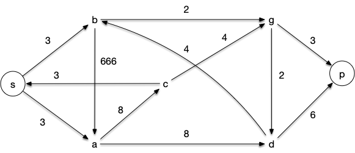
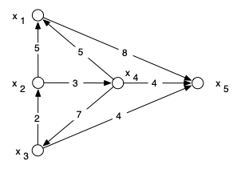

## Application directe

On considère le réseau ci-dessous, les capacités des arcs étant les nombres en noir :




Pourquoi a-t-on donné une capacité de 666 à un des arcs ? Aurait-on pu lui assigner une autre valeur sans changer les flot maximaux ?


On a mis une capacité très grande pour modéliser l'infini : la capacité de cet arc ne sera jamais un problème.

Pour réaliser cela, on pourrait prendre la valeur de toute coupe ne la traversant pas, puisque la valeur du flot sera toujours inférieure. On peut par exemple prendre la coupe ne contenant que la source et mettre sa capacité à cette valeur : 6.



Donner et justifier la valeur maximale d'un flot sans utiliser l'algorithme de Ford et Fulkerson.


La capacité de la coupe ne contenant que la source vaut 6 et le flot suivant est de valeur 6 :





On considère un flot partiel donné par :

- $f(s,a)=3$, $f(s,b)=3$, $f(c,s)=3$
- $f(b,g)=2$, $f(d,b)=3$
- $f(a,d)=1$, $f(g,d)=2$

Déterminez les valeurs du flot sur les autres arcs.



On remplit ce qui est indispensable pour la conservation des flots. c'est à dire les arcs sont un des sommets à tous ses arcs, sauf un, avec un flot indiqué :

1. $b$
2. puis $a$
3. $c$ est a maintenant un flot de fixé sur tous ses voisins mais la conservation du flot est OK
4. $d$
5. $g$

On obtient le flot suivant, de valuation 3 :






À partir du flot précédent, utiliser l'algorithme de Ford et Fulkerson pour réaliser le flot maximal en une seule chaîne augmentante ayant des arcs dans les deux sens



Pour trouver le flot maximal en une unique chaîne augmentante, il faut trouver en trouver une d'augmentation possible 3.

Depuis la source :

1. la seule possibilité de est de considérer l'arc $sc$ les deux autres étant saturés.
2. Puis il faut passer par l'arc $ca$, puisque l'arc $cg$ ne peut être augmenté que de 1.
3. ensuite deux choix :
   - soit $ad$ puis $dp$
   - soit $ab$, $bd$ et enfin $dp$ qui est une autre possibilité



## Création d'une source et d'un puits

Une ressource est disponible sur 5 sites $x_1$, $x_2$, $x_3$, $x_4$ et $x_5$ en quantités respectives, 30,70,80,60 et 60. Cette ressource est demandée dans 6 sites $y_1$, $y_2$, $y_3$, $y_4$ , $y_5$ et $y_6$ en quantités respectives 40, 20, 40, 40, 30 et 70. Les possibilités d'acheminement des ressources en $x_i$ vers le site $y_j$ sont indiquées dans le tableau ci-dessous (une valeur
sur la ligne $x_i$ et la colonne $y_j$ signifie un acheminement possible de $x_i$ vers $y_j$, d'une capacité max correspondant à la valeur indiquée et une
absence de valeur signifie un acheminement impossible) :

<div>
$$
\begin{array}{|c|*{6}{c}|}
\hline
&y_1&y_2&y_3&y_4&y_5&y_6\\
\hline
x_1&20&10&30&&20&\\
x_2&30&20&&30&30&\\
x_3&&20&20&20&&20\\
x_4&&10&10&10&&40\\
x_5&30&&20&&&20\\
\hline
\end{array}
$$
</div>



Est-il possible de satisfaire les demandes des $y_j$, à partir des possibilités des $x_i$ et des possibilités de transport ?



> TBD avec des arc dirigés



## Modification du flot max

Quatre industries $x_1$, $x_2$, $x_3$ et $x_4$ rejetant des eaux polluées doivent faire traiter ces eaux à la même station d'épuration $x_5$. Elles peuvent utiliser le réseau de canalisations de la figure suivant :



Les capacités des canalisations sont données par les nombres (exprimés en dizaines de m$^3$ par seconde) associés aux arcs du graphe. D'autre part, les eaux rejetées des centres $x_1$, $x_2$ et $x_4$ sont
réceptionnées initialement dans des bassins de capacités finies respectivement égales à 4, 3 et 4 dizaines de m$^3$ par seconde. Le bassin de réception des eaux rejetées du centre $x_3$ est très grand et peut pratiquement être considéré de capacité infinie.



Déterminer un plan d'épuration des eaux polluées de volume (par unité
de temps) maximal.



Des problèmes techniques vont rendre inutilisable une partie $\lambda$ de la capacité (initialement égale à 4) du bassin de réception des eaux rejetées par le centre $x_1$. Quelles seront les conséquences sur le plan d'épuration optimal ?


## Graphe d'écart

On considère le réseau suivant (en gras les capacités, en italique les flux) :




```python
G = {
    's': {'a', 'd', 'b'},
    'a': {'c', 'f', 'd'},
    'b': {'d', 'g', 'e'},
    'c': {'h', 'f'},
    'd': {'f', 'i', 'g'},
    'e': {'g', 'j'},
    'f': {'h', 'k', 'i'},
    'g': {'i', 'l', 'j'},
    'h': {'k'},
    'i': {'k', 'p', 'l'},
    'j': {'l'},
    'k': {'p'},
    'l': {'p'},
    'p': set()
}

c = {
    ('s', 'a'): 15,
    ('s', 'b'): 9,
    ('s', 'd'): 5,
    ('a', 'f'): 12,
    ('a', 'c'): 2,
    ('a', 'd'): 1,
    ('b', 'd'): 3,
    ('b', 'e'): 4,
    ('b', 'g'): 2,
    ('c', 'h'): 3,
    ('c', 'f'): 1,
    ('d', 'i'): 9,
    ('d', 'g'): 10,
    ('d', 'f'): 1,
    ('e', 'g'): 1,
    ('e', 'j'): 2,
    ('f', 'h'): 1,
    ('f', 'k'): 2,
    ('f', 'i'): 7,
    ('g', 'i'): 4,
    ('g', 'l'): 14,
    ('g', 'j'): 2,
    ('h', 'k'): 6,
    ('i', 'p'): 3,
    ('i', 'k'): 1,
    ('i', 'l'): 2,
    ('j', 'l'): 3,
    ('k', 'p'): 9,
    ('l', 'p'): 16
}

f = {
    ('s', 'a'): 8,
    ('s', 'b'): 8,
    ('s', 'd'): 5,
    ('a', 'f'): 5,
    ('a', 'c'): 2,
    ('a', 'd'): 1,
    ('b', 'd'): 3,
    ('b', 'e'): 3,
    ('b', 'g'): 2,
    ('c', 'h'): 2,
    ('c', 'f'): 0,
    ('d', 'i'): 4,
    ('d', 'g'): 5,
    ('d', 'f'): 0,
    ('e', 'g'): 1,
    ('e', 'j'): 2,
    ('f', 'h'): 1,
    ('f', 'k'): 2,
    ('f', 'i'): 2,
    ('g', 'i'): 0,
    ('g', 'l'): 7,
    ('g', 'j'): 1,
    ('h', 'k'): 3,
    ('i', 'p'): 3,
    ('i', 'k'): 1,
    ('i', 'l'): 2,
    ('j', 'l'): 3,
    ('k', 'p'): 6,
    ('l', 'p'): 12
}
```




Tracer le graphe d'écart associé à ce réseau.




Les arcs plein sont les arcs directs, les arcs en pointillés, les arcs retours.


Créez le graphe d'écart en python.



```python
Ge = graphe_écart(G, c, f)
print("Graphe d'écart :")
for x in Ge:
    print(x, Ge[x])
```




Cherchez à améliorer le flot avec une chaîne augmentante en utilisant le graphe d'écart, puis augmentez le jusqu'à son maximum avec l'algorithme de Ford et Fulkerson en exhibant une coupe minimum.


Une chaîne augmentante et l'augmentation de flot associée dans la foulée :


La coupe min :




Créez la coupe min en python



```python
ford_et_fulkerson(G,c, 's', 'p',f)  # on rend le flot maximum

print("coupe min :", set(marquage(G, c, 's', 'p', f)))  # les sommets marqués sont la coupe min
```


