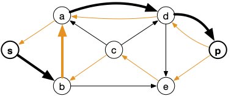


[Algorithme de Edmonds et Karp](https://fr.wikipedia.org/wiki/Algorithme_d%27Edmonds-Karp)


L'algorithme de Ford et Fulkerson pour trouver une chaîne augmentante est efficace si les capacités sont peux importantes. Il n'est cependant pas polynomial.

Nous allons montrer ici une variante utilisant un graphe, nommé **_graphe d'écart_**, pour trouver une chaîne augmentante. La simple utilisation de ce graphe va montrer qu'il est possible de rendre l'algorithme de Ford et Fulkerson polynomial.

## Graphe d'écart

On peut utiliser un graphe auxiliaire, appelé **_graphe d'écart_** pour trouver une chaîne augmentante.


Soit $G=(V, E)$ un graphe orienté antisymétriques (c'est à dire que si l'arête $xy$ existe, l'arête $yx$ n'existe pas), une capacité $c$ et un flot $f$. On appelle **_graphe d'écart_** le graphe orienté $G_f = (V, E')$ tel que pour toute arc $xy$ de $G$ :

- si $f(xy) < c(xy)$ alors on crée un arc $xy$ dans $G_f$
- si $f(xy) > 0$ alors on crée un arc $yx$ dans $G_f$



Il est alors clair qu'il n'existe un chemin allant de $s$ à $p$ dans $G_f$ que si et seulement si il existe une chaîne augmentante pour le réseau initial.



```python
def graphe_écart(G, c, f):
    Gf = {x: set() for x in G}

    for xy in c:
        x, y = xy
        if c[xy] > f[xy]:
            Gf[x].add(y)
        if f[xy] > 0:
            Gf[y].add(x)

    return Gf
```



Le fait que le graphe soit antisymétrique peut sembler restrictif, mais il n'en est rien car on peut toujours s'y ramener. En effet si $G$ est un graphe orienté tel qu'il existe deux sommets $x$ et $y$ avec $xy$ et $yx$ comme arc, il suffit de créer le graphe $G'$ tel que :

- $V(G') = V(G) \cup \\{z\\}$
- $E(G') = E(G) \backslash \\{ yx \\}\cup \\{ xz, zy \\}$

Et de donner comme capacités aux arcs $xz$ et $zy$ la même que celle associé initialement à $yx$.


On considérera par la suite que le graphe $G$ est antisymétrique.


### Chaîne augmentante avec un graphe d'écart

Une chaîne augmentante correspond à un chemin entre $s$ et $p$ dans le graphe d'écart.


En utilisant un parcours en largeur ou en profondeur du graphe d'écart depuis la source  on trouve. s'il en existe, un chemin entre $s$ et $p$ en $\mathcal{O}(e(G_f))$ opérations.


Une fois ce chemin trouvé, on détermine facilement la valeur du flot que l'on peut augmenter en prenant le minimum $\alpha$ des valuations de ses arcs. Si $xy$ un arc du chemin, sa valuation $v(xy)$ valant :

- $f(xy)$ si $xy$ n'est pas un arc de $G$
- $c(xy) - f(xy)$ si $xy$ est un arc de $G$



L'idée de l'algorithme est de regarder si on a déjà créé la valuation on non. Si oui, on prend le minimum et sinon on place la valuation de l'arc considéré.

```python
def graphe_écart_valuation(G, c, f, v):
    Gf = {x: set() for x in G}
    vf = dict()

    for xy in c:
        x, y = xy
        if c[xy] > f[xy]:
            Gf[x].add(y)

            if (x, y) not in vf:
                vf[(x, y)] = v[(x, y)]
            else:
                vf[(x, y)] = min(v[(x, y)], v[(y, x)])

        if f[xy] > 0:
            Gf[y].add(x)

            if (y, x) not in vf:
                vf[(y, x)] = v[(x, y)]
            else:
                vf[(y, x)] = min(v[(x, y)], v[(y, x)])

    return Gf, vf
```



L'augmentation du flot est identique à celle utilisée dans l'algorithme de Ford et Fulkerson pour tout arc $xy$ du chemin entre $s$ et $p$ du graphe d'écart :

- si $xy$ est dans $G$ alors $f(xy) = f(xy) + \alpha$
- si $xy$ n'est pas dans $G$ alors $f(yx) = f(yx) - \alpha$

### Exemple

Reprenons notre exemple fétiche :


Le graphe d'écart associé est alors (avec en orange les arcs inverses) :


Ce qui donne comme chemin possible :


Et après mise à jour du flot :


Le nouveau graphe d'écart (et un chemin possible) devient alors :



D'où le flot :


Et le graphe d'écart qui ne permet plus de trouver un chemin entre $s$ et $p$ :


## Algorithme complet

L'algorithme de Edmonds-Karp procède comme suit avec un graphe $G$ antisymétrique valué par des capacités, une source e$s$ et un puits $p$.

1. on considère $f$ le flot nul et $G_f = G$ le graphe d'écart.
2. on cherche un chemin **de longueur minimum** entre $s$ et $p$ dans $G_f$
3. s'il n'existe pas de chemin entre $s$ et $p$ le flot est maximum. Sinon on crée le flot $f'$ qui est l'augmentation de $f$ par la valeur minimale des valuation du chemin.
4. on crée le graphe d'écart $G_{f'}$
5. $f = f'$ et on retourne à l'item 2 de cette liste.

La seule différence avec l'algorithme de Ford et Fulkerson est que l'on est que l'on prend un chemin de longueur minimum et non pas n'importe quel chemin, Ce qui prouve la convergence de cet algorithme.

Mais ce tout petit changement va avoir de grandes conséquences en terme de complexité.

## Complexité

La complexité de chaque étape est :

1. création du premier graphe d'écart : $\mathcal{O}(v(G) + e(G))$
2. trouver un chemin de longueur minimum dans le graphe d'écart : $\mathcal{O}(e(G))$ en utilisant un parcours en largeur à partir de $s$
3. on parcours tous les arcs du chemins : $\mathcal{O}(v(G))$ pour créer $f'$
4. seuls les arcs du chemin peuvent-être modifié on retourne les arcs saturés :
   - si $xy$ est un arc du chemin, que $xy$ est un arc de $G$ et que $f'(xy) = c(xy)$ : on supprime $xy$ de $G_{f'}$ et on le remplace par l'arc $yx$
   - si $xy$ est un arc du chemin, que $yx$ est un arc de $G$ et que $f'(xy) > 0$ : on supprime $yx$ de $G_{f'}$ et on le remplace par l'arc $xy$

La complexité totale de chacune de ces étapes est donc $\mathcal{O}(v(G) + e(G)) = \mathcal{O}(e(G))$ si on suppose le graphe $G$ connexe.

Il nous reste à estimer le nombre de fois où l'on va refaire ces étapes. On va pour cela commencer par montrer que la longueur des chemins de la sources aux autres sommets des graphes d'écart ne peut qu'augmenter.

Soit $G_f$ un graphe d'écart, $ c_f = s x_1\dots x_{k-1} p$ un chemin de longueur minimum (donc élémentaire) entre $s$ et $p$ et $G_f{f'}$ le prochain graphe d´écart ($f'$ est le flot $f$).



On note $\delta_f(x, y)$ la longueur min d'un chemin entre $x$ et $y$ dans $G_f$.



La proposition suivante va être la pierre angulaire de la preuve de polynomialité :



Pour tous sommets $x$ de $G$ on a $\delta_f(s, x) \leq \delta_{f'}(s, x)$




On suppose par l'absurde qu'il existe une étape de l'algorithme tel que $\delta_f(s, y) > \delta_{f'}(s, y)$.
On peut alors également supposer sans perte de généralité que $y$ est tel que $\delta_f(s, y)$ soit minimum parmi tous les sommets dont la longueur du chemin minimum diminue.

Soit alors $xy$ le dernier arc d'un chemin de longueur minimum entre $s$ et $y$ dans $G_{f'}$. Comme :

- $\delta_{f'}(s, x) \leq \delta_{f'}(s, y) - 1$ car le chemin entre $s$ et $y$ est aussi un chemin entre $s$ et $x$.
- $\delta_{f'}(s, y) \leq \delta_{f'}(s, x) + 1$ puisque $xy$ est un arc de $G_{f'}$

On en déduit que $\delta_{f'}(s, x) = \delta_{f'}(s, y) - 1$ et donc que $\delta_{f'}(s, x) \geq \delta_{f}(s, x)$ ($y$ est par hypothèse le plus petit sommet dont la longueur diminue strictement).

Ceci implique que $xy$ n'est **pas** un arc de $G_f$, autrement :

<div>
$$
\begin{array}{lcl}
\delta_{f}(s, y)&\leq & \delta_{f}(s, x) + 1\\
&\leq & \delta_{f'}(s, x) + 1\\
&\leq & \delta_{f'}(s, y)\\
\end{array}
$$
</div>

Ce qui contredit notre hypothèse de diminution de longueur.

On a donc que $xy$ est un arc de $G_{f'}$ et $yx$ est un arc de $G_{f}$ : l'arc $yx$ était sur le chemin de longueur minimum entre $s$ et $p$ ayant conduit à l'augmentation de $f$ en $f'$.

Ceci nous indique que :

1. un plus court chemin entre $s$ et $y$ dans $G_f$ est $c_f$
2. un plus court chemin entre $s$ et $x$ dans $G_f$ est $c_f$ et son dernier arc est $yx$.

Ce qui donne :

<div>
$$
\begin{array}{lcl}
\delta_{f}(s, y) &=& \delta_{f}(s, x) - 1\\
&\leq & \delta_{f'}(s, x) - 1\\
&\leq & \delta_{f'}(s, y) - 2\\
& < & \delta_{f'}(s, y)\\
\end{array}
$$
</div>

Ce qui est impossible, contredit notre hypothèse et termine la preuve par l'absurde.



Cette augmentation des chemins de longueur minimum entre la source et tout autre sommet des graphes d'écart va borner le nombre de fois ou un arc peut apparaître et disparaître des graphes d'écart et par là borner le nombre d'étapes de l'algorithme.



Le nombre de fois où un arc $xy$ peut disparaître d'un graphe d'écart est de l'ordre de $\mathcal{O}(v(G))$.




Si un arc $xy$ disparaît que graphe d'écart $G_f$ c'est qu'il était sur le chemin $c_f$ et donc que $\delta_f(s, y) = \delta_f(s, x) + 1$.

A une étape ultérieure, disons lors de l'analyse d'un flot $f^\star$, c'est l'arc $yx$ qui disparaît et on a alors  $\delta_{f^\star}(s, x) = \delta_{f^\star}(s, y) + 1$.

Ce qui donne :

<div>
$$
\begin{array}{lclr}
\delta_{f^\star}(s, x) &=& \delta_{f^\star}(s, y) + 1\\
&\geq & \delta_{f}(s, y) + 1&\text{puisque les chemins de longueur minimum croissent}\\
&\geq & \delta_{f}(s, x) + 2\\
\end{array}
$$
</div>

Comme la longueur d'un chemin minimum ne peut dépasser $v(G)$ l'arc $xy$ ne peut apparaître qu'au maximum $v(G)/2$ fois.



La preuve précédente nous borne le nombre d'étapes :



Le nombre maximum d'étape de l'algorithme de Edmonds-Karp est de l'ordre de $\mathcal{O}(v(G)\cdot e(g))$.




A chaque étape au moins un arc va apparaître (et son opposé disparaître), comme le même arc ne peut apparaître qu'au pire $\mathcal{O}(v(G))$ et qu'il y a $e(G)$ arc, on en conclut que le nombre d'étape est borné par $\mathcal{O}(v(G)\cdot e(g))$ (à chaque itération un seul arc apparaît).



En conclusion, comme chaque étape se fait en $\mathcal{O}(e(g))$ opérations, on en déduit :



Le complexité de l'algorithme de Edmonds-Karp est de l'ordre de $\mathcal{O}(v(G)\cdot e(g)^2)$.



Si l'on ne veut pas de surprise ou que la valeur max du flot est trop grande, on préférera donc cet algorithme plutôt que celui de Ford et Fulkerson.
