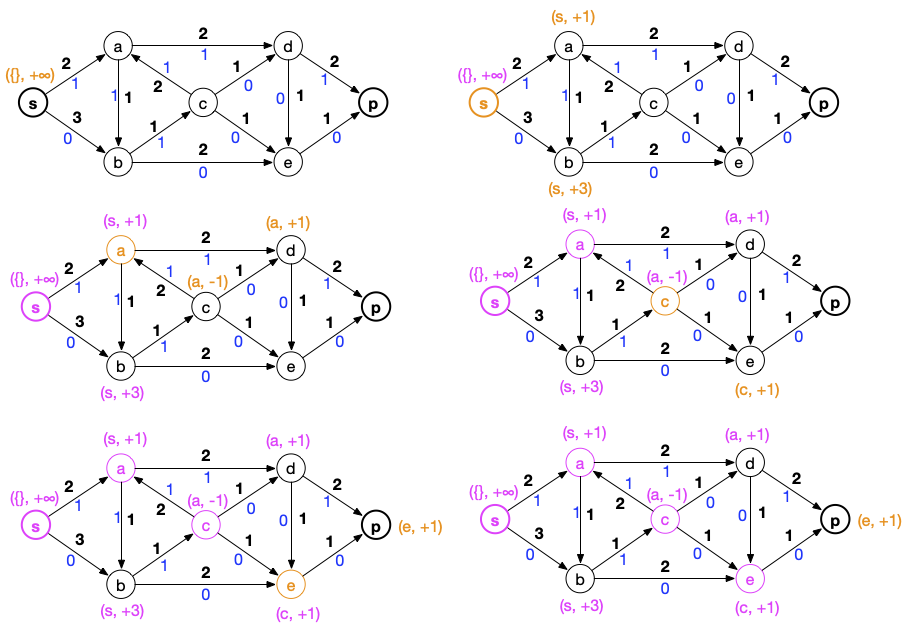
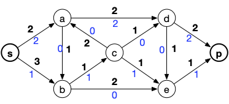
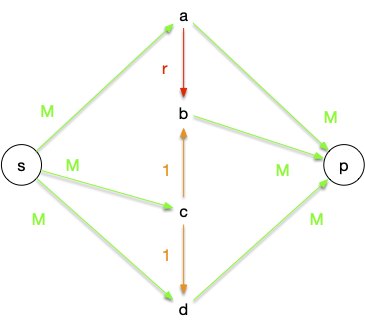
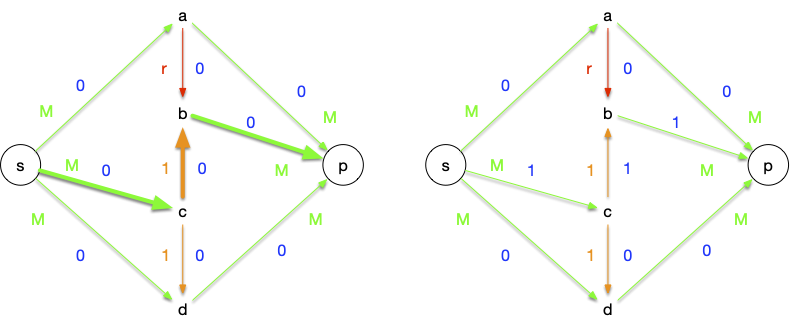


[Algorithme de Ford et Fulkerson](https://fr.wikipedia.org/wiki/Algorithme_de_Ford-Fulkerson)


L'algorithme de Ford et Fulkerson (1955) est en trois parties :

1. un algorithme de marquage/examen des sommets
2. utilisation des marques pour trouver une chaîne augmentante
3. augmenter le flot et recommencer

## Algorithme de marquage/examen

Cette procédure est paradigmatique des algorithme de type _**marquer/ examiner**_. Cette technique est à connaître car elle peut être utilisé dans problème où l'ensemble des sommets potentiellement utilisable change au court du temps :

1. on marque les sommets potentiellement utilisable
2. on examine un de ces sommets puis on le raye des sommets possibles.

```text
Entrée :
    un graphe orienté G = (V, E)
    une capacité c qui associe un réel strictement positif à toute arc de G
    deux sommets s et p
    un flot f admissible
Initialisation :
    marquer s par (s, +∞)
    considérer tous les sommet différent de s comme non marqué
    considérer qu'aucun sommet n'est examiné
Algorithme :
    tant que p est non marqué et qu'il existe un sommet marqué et non examiné :
        soit x marqué et non examiné
        soit ⍺ la valeur absolue du second paramètre de la marque de x
        pour chaque voisin y de x tel que y est non marqué :
            si c(xy) > f(xy) alors :
                β = min(⍺, c(xy) - f(xy))
                marquer y par (x, +β)
        pour chaque sommet non marqué y tel que yx est un arc :
            si f(yx) > 0 alors :
                β = min(⍺, f(yx))
                marquer y par (x, -β)
        considérer x comme examiné
Retour :
    les marques des sommets
```



```python/
def marquage(G, c, s, p, f):

    marques = {s: (s, None)}
    examiné = set()

    while (p not in marques) and (set(marques.keys()) - examiné):
        x = (set(marques.keys()) - examiné).pop()

        for y in G[x]:
            if y in marques:
                continue

            if c[(x, y)] > f[(x, y)]:
                if (marques[x][1] is None) or (abs(marques[x][1]) > c[(x, y)] - f[(x, y)]):
                    marques[y] = (x, c[(x, y)] - f[(x, y)])
                else:
                    marques[y] = (x, abs(marques[x][1]))

        for y in G:
            if (y in marques) or (x not in G[y]):
                continue

            if f[(y, x)] > 0:
                if (marques[x][1] is None) or (abs(marques[x][1]) > f[(y, x)]):
                    marques[y] = (x, -f[(y, x)])
                else:
                    marques[y] = (x, -abs(marques[x][1]))

        examiné.add(x)

    return marques
```




Le code python précédent comporte une boucle vraiment non optimale. Laquelle ?

Peut-on y remédier ?


C'est la boucle for de la ligne 19 ! On cherche tous les y tels que (xy) est un arc.

Pour accélérer cette étape, on peut créer au début de l'algorithme le graphe $G'$ qui est le graphe opposé de $G$ : si $xy$ est un arc dans $G$ alors $yx$ est un arc dans $G'$.

Une fois ce graphe créé, la boucle for de la ligne 19 revient à prendre tous les voisins de $x$ dans $G'$ : on ne passe plus obligatoirement par tous les sommets du graphe.


### Détermination d'une chaîne augmentante

Si le sommet p est marqué à la fin de l'algorithme, il existe une chaîne augmentante que l'on trouve à partir des marques de l'algorithme précédant :

```text
Entrée :
    deux sommets s et p
    les marques de l'algorithme de marquage
Initialisation :
    C = [p]
Algorithme :
    x = p
    tant que x est différent de s:
        soit y la première marque de x
        x = y
        ajouter x au début de C
Retour :
    C
```



```python
def chaîne_augmentante(s, p, marques):
    C = [p]
    x = p
    while x != s:
        y = marques[x][0]
        x = y
        C.append(x)

    C.reverse()

    return C
```



Si le puits n'est pas marqué, c'est qu'il n'existe pas de chaine augmentante :


Si le puits n'est pas marqué, il n'existe pas de chaîne augmentante.



Soit $S$ la coupe formée des sommets marqués. Si :

- $xy$ est un arc tel que $x\in S$ et $y \notin S$ alors $f(xy) = c(xy)$ sinon on aurait pu marquer $y$ à partir de $x$
- $yx$ est un arc tel que $x\in S$ et $y \notin S$ alors $f(xy) = 0$ sinon on aurait pu marquer $y$ à partir de $x$

La capacité de notre coupe est égale à la valeur du flot : il est maximum.



### Mise à jour du flot

Si p n'est pas marqué il n'existe pas de chaîne augmentante et le flot est maximum. Sinon, on peut augmenter le flot :

```text
Entrée :
    une chaîne augmentante c=c[0] ... c[k] entre s et p
    les marques
    deux sommets s et p
    un flot f
Algorithme
    soit ⍺ la valeur absolue de la seconde marque de p
    pour chaque i allant de 1 à k:
        si le premier paramètre de de la marque de c[i] est positif alors :
            f((c[i-1],c[i])) += ⍺
        sinon :
            f((c[i],c[i-1])) -= ⍺
```



```python
def augmentation_flot(s, p, marques, chaîne, f):
    alpha = abs(marques[p][1])

    for i in range(1, len(chaîne)):
        if marques[chaîne[i]][1] > 0:
            f[(chaîne[i-1], chaîne[i])] += alpha
        else:
            f[(chaîne[i], chaîne[i-1])] -= alpha
```



### Algorithme complet

Après avoir mis à jour le flot, on recommence jusqu'à obtenir une marque qui ne contient pas le puits.



```python
def ford_et_fulkerson(G, c, s, p, f):
    marques = marquage(G, c, s, p, f)

    while p in marques:
        chaîne = chaîne_augmentante(s, p, marques)
        augmentation_flot(s, p, marques, chaîne, f)
        marques = marquage(G, c, s, p, f)
```



## Exemple

On va utiliser notre graphe qui possède déjà un flot :


 :

```python
G = {
    's': {'a', 'b'},
    'a': {'b', 'd'},
    'b': {'c', 'e'},
    'c': {'a', 'd', 'e'},
    'd': {'e', 'p'},
    'e': {'p'},
    'p': set()
}

c = {
    ('s', 'a'): 2,
    ('s', 'b'): 3,
    ('a', 'b'): 1,
    ('a', 'd'): 2,
    ('b', 'c'): 1,
    ('b', 'e'): 2,
    ('c', 'a'): 2,
    ('c', 'd'): 1,
    ('c', 'e'): 1,
    ('d', 'e'): 1,
    ('d', 'p'): 2,
    ('e', 'p'): 1
}

f = {
    ('s', 'a'): 1,
    ('s', 'b'): 0,
    ('a', 'b'): 1,
    ('a', 'd'): 1,
    ('b', 'c'): 1,
    ('b', 'e'): 0,
    ('c', 'a'): 1,
    ('c', 'd'): 0,
    ('c', 'e'): 0,
    ('d', 'e'): 0,
    ('d', 'p'): 1,
    ('e', 'p'): 0
}

```



### Création des marques

Les graphes ci-dessous montre les différentes étapes de l'algorithme de marquage (en orange les résultats de l'étape courante).



On s'arrête une fois le puits marqué.


Que donne la fonction python `marquage`{.language-} sur l'exemple ?



On exécute la fonction `marquage(G, c, 's', 'p', f)`{.language-} qui rend le dictionnaire :

```python
{
    's' ('s', None),
    'a' ('s', 1),
    'b' ('s', 3),
    'c' ('a', -1),
    'd' ('a', 1),
    'e' ('c', 1),
    'p' ('e', 1)
}
```

**Attention**, d'autres possibilités existent ! En relançant plusieurs fois l'algorithme vous trouverez des marques différentes, comme par exemple :

```python
{
    's': ('s', None),
    'a': ('s', 1),
    'b': ('s', 3),
    'c': ('a', -1),
    'd': ('a', 1),
    'e': ('b', 2),
    'p': ('e', 1)
}
```



### Première chaîne augmentante

La chaîne augmentante trouvée est :



Que donne la fonction python `chaîne_augmentante`{.language-} sur l'exemple ?



On exécute la fonction `chaîne_augmentante('s', 'p', marques)`{.language-} où marques est le résultat de la fonction `marquage`{.language} précédent et on obtient le chemin :

```python
['s', 'a', 'c', 'e', 'p']
```

Pour le second jeu de marques, on aurait eu une chaîne différente (en l’occurrence : `['s', 'a', 'd', 'p']`{.language-})



### Mise à jour

On peut augmenter de +1 (la valeur absolue du second paramètre de la marque du puits) :


Ce qui donne le flot suivant :



Que donne la fonction python `augmentation_flot`{.language-} sur l'exemple ?



On exécute la fonction `augmentation_flot('s', 'p', marques, chaîne, f)`{.language-} où `marques`{.language-} et `chaîne`{.language-} sont les résultats précédents des fonctions `marquage`{.language-} et `chaîne_augmentante`{.language-}. Le dictionnaire `f`{.language-} est modifié en :

```python
{
    ('s', 'a'): 2
    ('s', 'b'): 0
    ('a', 'b'): 1
    ('a', 'd'): 1
    ('b', 'c'): 1
    ('b', 'e'): 0
    ('c', 'a'): 0
    ('c', 'd'): 0
    ('c', 'e'): 1
    ('d', 'e'): 0
    ('d', 'p'): 1
    ('e', 'p'): 1
}
```



### Deuxième chaîne augmentante

On relance l'algorithme de Ford et Fulkerson et on obtient (cette fois ci il n'y a qu'une possibilité), la chaîne augmentante suivante :


Et le flot :



Ce flot est maximum puisque l'on sature les arcs arrivant en p.

Montrons le en exécutant l'algorithme de Ford et Fulkerson pour trouver la coupe minimum (en magenta un ordre possible d'examen des sommets):


La coupe minimum est en orange.


Quelles sont les marques obtenues en exécutant la fonction `marquage(G, c, 's', 'p', f)`{.language-} pour un flot maximum



On exécute la fonction `marquage(G, c, 's', 'p', f)`{.language-} où $f$ est le flot maximal :

```python
f = {
    ('s', 'a'): 2,
    ('s', 'b'): 1,
    ('a', 'b'): 1,
    ('a', 'd'): 2,
    ('b', 'c'): 1,
    ('b', 'e'): 1,
    ('c', 'a'): 1,
    ('c', 'd'): 0,
    ('c', 'e'): 0,
    ('d', 'e'): 0,
    ('d', 'p'): 2,
    ('e', 'p'): 1
}
```

Et on obtient :

```python
{
    's': ('s', None),
    'b': ('s', 2),
    'e': ('b', 1),
    'a': ('b', -1),
    'c': ('a', -1),
    'd': ('c', 1)
}
```



## Complexité

La complexité de l’algorithme de marquage est proportionnelle au nombre d'arête du graphe (il suffit de stocker les éléments marqué dans une liste que l'on prend petit à petit). Il est donc optimal pour trouver et traiter une chaîne augmentante.

En revanche, la complexité totale dépend du nombre de fois où l'on va trouver une chaîne augmentante. Si les capacités sont toutes entières, ce qui va être le cas en informatique (au pire les nombres sont des valeurs $k\cdot \epsilon$ avec $\epsilon >0$ et $k$ entier, ce qui revient au même que de manipuler des entiers) on peut borner la complexité de l'algorithme :


Soit $G = (V, E)$ un graphe orienté et $c : E \rightarrow \mathbb{N}^{+\star}$ des capacités **entières**. Trouver le flot maximal entre deux sommets $s$ et $p$ de $G$ peut être effectué par l'algorithme de Ford et Fulkerson en :
$\mathcal{O}(c(S, \overline{S}) \cdot \vert E\vert)$ opérations.




Trouver une chaîne augmentante se fait en $\mathcal{O}(\vert E\vert)$ opérations et comme le flot augmente au minimum de 1 à chaque fois, on obtient bien le résultat souhaité.



On peut prendre ce que l'on veut comme comme coupe comme par exemple $S = \\{s\\}$, $S = V \backslash \\{p\\}$ ou toute autre coupe dont on peut facilement calculer la capacité.

Il existe un cas particulier très important, le cas où la capacité est constante :


Montrer que si les capacités sont constantes, la complexité de l'algorithme de ford et Fulkerson est en $\mathcal{O}(\vert V\vert \cdot \vert E\vert)$


Il suffit de prendre $S = \\{s\\}$ comme coupe et de remarquer que $c(S, \overline{S}) = \mathcal{O}(\vert V \vert|)$



Attention, la capacité d'une coupe peut être aussi grande que l'on veut et donc cet algorithme n'est **pas** de complexité polynomial en la taille des entrées.

## Flot à capacités réelles

Attention, l'algorithme ne converge que si les valeurs sont entières. Si les capacités sont réelles, l'algorithme peut ne jamais s'arrêter...

L'exemple que nous allons prendre pour illustrer ce cas particulier est tiré de [l'article _"The Simplest and Smallest Network on Which the Ford-Fulkerson Maximum Flow Procedure May Fail to Terminate"_](https://www.jstage.jst.go.jp/article/ipsjjip/24/2/24_390/_pdf) qui fait une revue de plusieurs exemples pathologiques.

On considère le graphe orienté et les capacités suivantes :



Avec :

- $M$ un entier plus grand ou égal à 5
- $r = (\sqrt{5}-1)/2$

Le flot maximal est bien sur de $2M + 1$ (la valeur de la coupe $S = \\{s, c, d\\}$) et est réalisé par, par exemple :


Cependant, la nature particulière de $r$ ($r^k-r^{k+1} = r^{k+2}$) et un choix malheureux de chaînes augmentantes peut ne pas faire converger l'algorithme en un nombre fini d'opérations.

On commence par trouver une première chaîne augmentante en partant du flot nul :



Puis on va itérativement appliquer les chaines augmentante :

1. $sabcdp$ : on peut augmenter le flot de $r^1$, ce qui sature l'arc $ab$
   
2. $scbap$ : on peut augmenter le flot de $r^1$, ce qui sature l'arc $cb$
   
3. $sabcdp$ : on peut augmenter le flot de $r^2$, ce qui sature l'arc $cd$
   
4. $sdcbp$ : on peut augmenter le flot de $r^2$, ce qui sature l'arc $cb$
   

Ces 4 étapes nous ont fait augmenter le flot de $2(r^1+r^2)$. On peut refaire à l'infini ces 4 étapes, comme le montre le tableau suivant (on s'est arrêté à $n=2$):

| chaîne      | $ab$        | $bc$        | $cd$                           | valeur flot                               |
| ----------- | ----------- | ----------- | ------------------------------ | ----------------------------------------- |
| $r-r^{n+1}$ | $1-0$       | $1-r^{n}$   | $2(\sum_{0\leq i\leq n}r^i)-1$ |
| $sabcdp$    | $r-0$       | $1-r^{n+1}$ | $1-r^{n+2}$                    | $2(\sum_{0\leq i\leq n}r^i) -1 +r^{n+1}$  |
| $scbap$     | $r-r^{n+1}$ | $1-0$       | $1-r^{n+2}$                    | $2(\sum_{0\leq i\leq n+1}r^i) - 1$        |
| $sabcdp$    | $r-r^{n+3}$ | $1-r^{n+2}$ | $1-0$                          | $2(\sum_{0\leq i\leq n+1}r^i) -1+r^{n+2}$ |
| $sdcbp$     | $r-r^{n+3}$ | $1-0$       | $1-r^{n+2}$                    | $2(\sum_{0\leq i\leq n+2}r^i)-1$          |

On peut alors recommencer jusqu'à l'infini car $\sum_{0\leq i\leq n}r^i$ est [une série géométrique](https://fr.wikipedia.org/wiki/S%C3%A9rie_g%C3%A9om%C3%A9trique) convergente : $\sum_{0\leq i\leq n}r^i \leq 1/(1-r)\leq 3$ pour tout $n$. Et donc la valeur du flot sera toujours inférieure à 5, donc à $M$ et pourra passer par tous les arcs.
