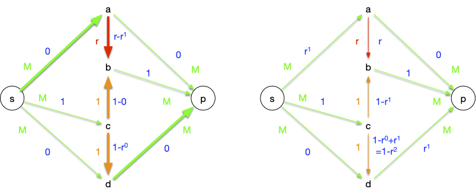
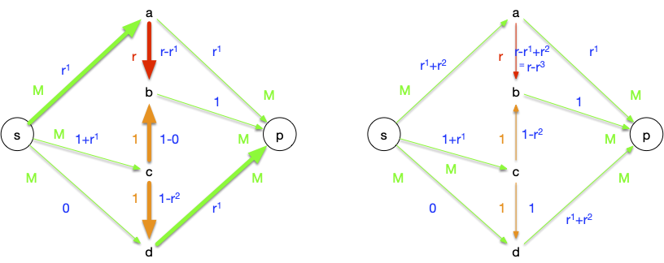
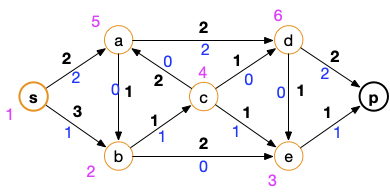

<!-- début résumé -->

Modéliser des problèmes de robinets par la théorie des graphes.

<!-- end résumé -->


Les exemples de ce cours ont été pris dans l'excellent livre de Charon et Hudry [Introduction à l'optimisation continue et discrète](https://www.amazon.fr/Introduction-loptimisation-continue-discr%C3%A8te-exercices/dp/2746248638).



## Introduction

On considère un réseau de canalisations, chaque tuyau le constituant ayant une capacité (le diamètre) particulière. Dans ce réseau on considère deux nœuds d'intérêt :

- la source : le robinet
- le puits : l'endroit on l'on veut récupérer l'eau.

Lorsque l'on ouvre le robinet, on peut mesurer le débit (en $m^3/s$) au puits.


Quel est le flot maximum (débit maximum) que l'on peut avoir si on ouvre à fond le robinet ?


Remarquez bien qu'une fois le flot maximum atteint, il ne sert rien d'ouvrir plus le robinet.

Où est le goulot d'étranglement du réseau ?



Notez que le goulot d'étranglement est le flot maximum.


C'est pour résoudre ces problèmes d'importance capitale sans avoir besoin de se mouiller que nous allons [utiliser la théorie des graphes](https://fr.wikipedia.org/wiki/Probl%C3%A8me_de_flot_maximum). On verra aussi quelques cas d'applications où les flots apparaissent alors qu'on ne les attendait pas.

## Définitions


Un **_réseau_** est un graphe (simple) orienté $G=(V, E)$ avec :

- une **_capacité_** $c : E \rightarrow \mathbb{R}^{+\star}$ (réels strictement positifs)
- deux sommets spéciaux nommées **_source_** (noté $s$) et **_puits_** (noté $p$).
  

exemple de réseau :



Notez que si on veut une capacité nulle, il suffit de supprimer l'arc



Un **_flot_** dans un réseau donné est une application $f : E \rightarrow \mathbb{R}^{+}$ telle que :

- $0 \leq f(u) \leq c(u)$ pour tout arc $u \in E$
- pour tout sommet $x$ différent de $s$ et $p$, il y a **_conservation du flot_**, c'est à dire que le flot entrant est égal au flot sortant : $\sum_{y \in N^-(x)} f(yx) = \sum_{y \in N^+(x)} f(xy)$.

On dit que pour un arc donné $u$ son **_flux_** est $f(u)$.


Exemple de flot (nombres en bleu) :


On peut d'ores et déjà noter qu'il existe toujours un flot dans n'importe quel réseau, le flot nul qui vaut $0$ pour tout arc.


Une **_coupe_** est déterminée à partir d'un ensemble $S \subseteq V$ contenant $s$ et pas $p$. En notant $\overline{S} = V \backslash S$ le complémentaire de $S$, une coupe, notée $(S, \overline{S})$ est l'ensemble des arcs ayant leurs origines dans $S$ et leurs extrémités dans $\overline{S}$.


Notez bien qu'une coupe $S$ n'est pas forcément connexe dans $G$. Exemples de coupes pour notre réseau :

- $(\\{s\\}, V \backslash \\{s\\})$ qui contient les arcs : $sa$ et $sb$
- $(V \backslash \\{p\\}, \\{p\\})$ qui contient les arcs $dp$ et $ep$
- $(\\{s, d\\}, \overline{\\{s, d\\}})$ qui contient les arcs : $sa$, $sb$, $dp$ et $de$


La **_capacité d'une coupe_** $c(S, \overline{S})$ est la somme des capacités des arcs de la coupe :

$$c(S, \overline{S}) = \sum_{xy \in (S, \overline{S})}c(xy)$$



On note également pour une coupe $(S, \overline{S})$ les valeurs suivantes :

- $f(S, \overline{S})$ comme étant la somme des flux des arcs ayant pour origine $S$ et pour extrémité $\overline{S}$ (les éléments de la coupe)
- $f(\overline{S}, S)$ comme étant la somme des flux des arcs ayant pour extrémité $S$ et pour origine $\overline{S}$

Exemples :

- $f(\\{s\\}, \overline{\\{s\\}}) = 1 + 0 = 1$
- $f(\\\{p\\}, V \backslash \\{p\\}) = 1 + 0 = 1$
- $f(\\{s, d\\}, \overline{\\{s, d\\}}) = 1 + 0 + 1 + 0 = 2$

## Valeur d'un flot

On va prouver que pour toute coupe $(\overline{S}, S)$, la quantité suivante est constante :

$$
f(S, \overline{S}) - f(\overline{S}, S) = \mbox{val}(f)
$$

Pour tout sommet $x$ de $S$ différent de $s$, on a conservation du flot donc :

$$\sum_{x \in S} (\sum_{xy \in E} f(xy) - \sum_{yx \in E} f(yx)) = \sum_{sy \in E} f(sy) - \sum_{ys \in E} f(ys) = f(\{s\}, \overline{\{s\}}) - f(\overline{\{s\}}, \{s\})$$

De plus, les arcs internes à $S$ sont comptés deux fois une fois pour l'origine de façon positive et une fois pour l'extrémité de façon négative. Les seuls arcs qui ne sont comptés qu'une fois sont ceux qui rentre ou qui sortent de $S$. de là :

$$\sum_{x \in S} (\sum_{xy \in E} f(xy) - \sum_{yx \in E} f(yx)) = f(S, \overline{S}) - f(\overline{S}, S)$$

On en conclut donc que $f(S, \overline{S}) - f(\overline{S}, S)$ est une constante pour n'importe quelle coupe et vaut :

$$ \mbox{val}(f) = \sum*{sx \in E}f(sx) - \sum*{xs \in E}f(xs) = \sum*{xp \in E}f(xp) - \sum*{px \in E}f(px)$$


Ce qui rentre dans le réseau en ressort.


Pour notre exemple, on a donc une valeur de flot de $\mbox{val}(f) = 1$

## Flot maximum

On a clairement que :

- $\mbox{val}(f) \leq c(S, \overline{S})$ pour toute coupe du réseau.
- si $\mbox{val}(f) = c(S^\star, \overline{S^\star})$ alors :
  - $S^\star$ est la coupe réalisant le minimum de $c(S, \overline{S})$ pour toute coupe $S$
  - $\mbox{val}(f)$ est maximum
  - pour tout arc $u$ partant de $S^\star$ pour finir en $\overline{S^\star}$, $f(u) = c(u)$
  - pour tout arc $u$ partant de $\overline{S^\star}$ pour finir en $S^\star$, $f(u) = 0$

La réciproque est également vraie et nous allons le prouver. On va prouver :

1. que le flot maximum existe
2. que le flot maximum est égale à la coupe minium.

### Existence du flot maximum

Commençons pas montrer que le flot maximum est atteint.

Soient $G= (V, E)$ et $c$ un réseau donné. Une valuation $f$ des arcs de $G$ peut être vue comme un vecteur de l'espace vectoriel $\mathbb{R}^m$ où $m = \vert E \vert$ que l'on munie d'une norme $\vert\vert . \vert\vert$ . Si cette valuation n'est pas un flot, alors :

- soit une des coordonnées est strictement négative : $f(u) < 0$,
- soit la conservation du flot n'est pas respectée pour au moins un sommet de $G$ : la valeur absolue de la différence vaut $d > 0$.

Il existe alors $\epsilon > 0$ tel que toute valuation $f'$ avec $\vert\vert f - f'\vert\vert \leq \epsilon$ n'est pas non plus un flot (on prend $\epsilon$ plus petit que $f(u) > 0$ et $d > 0$) : l'espace de $\mathbb{R}^m$ où $f$ n'est pas un flot est un ouvert. Donc son complémentaire, l'espace de $\mathbb{R}^m$ où $f$ est un flot, est fermé. Ce fermé est de plus borné puisque les flux ne peuvent dépasser les capacités.

Un fermé borné atteignant ses bornes, on en déduit que $\mbox{val}(f)$ va atteindre ses bornes : il existe bien un flot maximum.

### Chaîne augmentante

Pour montrer que le flot maximum est égal à la coupe minimum on va introduire la notion de chaîne augmentante.

Une **chaîne** $c_0 \dots c_k$ dans un graphe orienté $G=(V, E)$ est une suite de sommets tels que pour tout $0 \leq i < k$, soit $c_ic_{i+1}$ soit $c_{i+1}c_i$ soit un arc du graphe.

On suppose que l'on ait un réseau $G=(V, E)$ avec ses capacités $c$ et un flot $f$. Soit alors $C = c_0\dots c_k$ une chaîne de $s$ à $p$ dans $G$.

Par exemple :


Cette chaîne a 3 arcs qui vont dans le sens de $s$ à $p$ ($sa$, $ce$ et $ep$) et un arc qui va de $p$ vers $s$ ($ca$).

Si l'on peut augmenter la valeurs des arcs allant de $s$ à $p$ et diminuer la valeur des flots allant de $p$ à $s$ on augmentera le flot. Pour garder la conservation des flots, il faut augmenter et diminuer de la même valeur absolue.

Notons alors $C^+$ (respectivement $C^-$) l'ensemble des arcs de la chaîne allant de $s$ à $p$ (respectivement de $p$ à $s$) et calculons :

- $\alpha^+ = \min \\{ c(u) - f(u) \vert u \in C^+ \\}$
- $\alpha^- = \min \\{ f(u) \vert u \in C^- \\}$
- $\alpha = \min \\{\alpha^+, \alpha^-\\}$

Si $\alpha > 0$, $C$ est dit être une **chaîne augmentante** car on peut augmenter le flot des arcs de $C^+$ de $\alpha$ et diminuer les arcs de $C^-$ de $\alpha$ ce qui garde la conservation du flot et augmente $\mbox{val}(f)$ de $\alpha > 0$.

Dans l'exemple on a : $\alpha^+ = \alpha^- = 1$ : notre flot n'est pas maximum


On en conclut que s'il existe une chaîne augmentante de $s$ à $p$ alors $\mbox{val}(f)$ n'est pas maximum.


Réciproquement, supposons qu'il n'existe pas de chaînes augmentante de $s$ à $p$. Soit alors $S'$ l'ensemble des sommets $x$ tels qu'il existe une chaîne augmentante de $s$ à $x$. L'ensemble $S = S' \cup \\{ s\\}$ est alors une coupe de notre réseau et :

- pour tout arc $xy$ commençant dans $S$ et finissant dans $\overline{S}$ on a $f(xy) = c(xy)$ sinon il existerait une chaîne augmentante de $s$ à $x$ et de $x$ à $y$, donc une chaîne augmentante entre $s$ et $y$
- pour tout arc $xy$ commençant dans $\overline{S}$ et finissant dans $S$ on a $f(xy) > 0$ sinon il existerait une chaîne augmentante de $s$ à $y$ et de $y$ à $x$, donc une chaîne augmentante entre $s$ et $y$

On en déduit que pour cette coupe : $c(S, \overline{S}) = f(S, \overline{S}) - f(\overline{S}, S)$, la valeur de notre flot est maximum !

On a donc qu'il existe une chaîne augmentante de $s$ à $p$ si et seulement si $\mbox{val}(f)$ n'est pas maximum.


Les arcs d'une chaîne augmentante ne sont **pas forcément** tous dans le même sens ! La chaîne $sacep$ de l'exemple précédent le prouve. Cette chaîne est augmentante mais les arcs sont $s\rightarrow a \leftarrow c \rightarrow e \rightarrow p$.


### Théorème des flots

Finalement :

- il existe une chaîne augmentante de $s$ à $p$ si et seulement si $\mbox{val}(f)$ n'est pas maximum.
- comme le flot maximum est atteint sa valeur ne peut être que la valeur de la coupe minimum puisque l'ensemble des sommets admettant une chaîne augmentante forme alors une coupe.


La coupe minimum est le goulot d'étranglement du réseau.


## Algorithmes

Il existe de nombreux algorithme pour résoudre le problème du flot maximum. Nos allons ici juste montrer un exemple en suivant l'idée des chaînes augmentantes.

L'idée est d'itérativement :

1. trouver une chaîne augmentante
2. maximiser sa valeur en l'augmentant au maximum sa valeur de flot

Lorsque l'on ne trouve plus de chaîne augmentante, le flot est maximum. L'initialisation est toujours possible puisque le flot nul est un flot possible.

Si l'on suppose que nos capacités sont entières on pourra augmenter au minimum de 1 unité toutes nos chaînes augmentantes à chaque fois, donc l'algorithme va converger en :

- au maximum $C(S, \overline{S})$ itérations où $S$ est une coupe
- au maximum $\max \mbox{val}(f)$ itérations où $\max \mbox{val}(f)$ est la valeur de flot maximum
- au maximum $\vert V \vert \cdot c_\max$ itérations où $c_\max$ est la capacité maximale (pour montrer ça on considère la coupe $(\\{s\\}, V \backslash \\{s \\})$ : $s$ a au plus $\vert V\vert$ voisins et chacun de capacité maximale au plus $c_\max$)

### <span id="#ford-fulkerson"></span> Ford et Fulkerson

L'algorithme de Ford et Fulkerson (1955) est une implémentation de ce principe. Il cherche une chaîne augmentante puis la résout. La procédure de recherche de chaîne est paradigmatique des algorithme _marquer/ examiner_

#### Algorithme de marquage

Son algorithme de recherche de chaîne commence par marquer les sommets

```text
Entrée :
    un graphe orienté G = (V, E)
    une capacité c qui associe un réel strictement positif à toute arc de G
    deux sommets s et p
    un flot f admissible
Initialisation :
    marquer s par (s, +∞)
    considérer tous les sommet différent de s comme non marqué
    considérer qu'aucun sommet n'est examiné
Algorithme :
    tant que p est non marqué et qu'il existe un sommet marqué et non examiné :
        soit x marqué et non examiné
        soit ⍺ la valeur absolue du second paramètre de la marque de x
        pour chaque voisin y de x tel que y est non marqué :
            si c(xy) > f(xy) alors :
                β = min(⍺, c(xy) - f(xy))
                marquer y par (x, +β)
        pour chaque sommet non marqué y tel que yx est un arc :
            si f(yx) > 0 alors :
                β = min(⍺, f(yx))
                marquer y par (x, -β)
        considérer x comme examiné
Retour :
    les marques des sommets
```



```python#
def marquage(G, c, s, p, f):

    marques = {s: (s, None)}
    examiné = set()

    while (p not in marques) and (set(marques.keys()) - examiné):
        x = (set(marques.keys()) - examiné).pop()

        for y in G[x]:
            if y in marques:
                continue

            if c[(x, y)] > f[(x, y)]:
                if (marques[x][1] is None) or (abs(marques[x][1]) > c[(x, y)] - f[(x, y)]):
                    marques[y] = (x, c[(x, y)] - f[(x, y)])
                else:
                    marques[y] = (x, abs(marques[x][1]))

        for y in G:
            if (y in marques) or (x not in G[y]):
                continue

            if f[(y, x)] > 0:
                if (marques[x][1] is None) or (abs(marques[x][1]) > f[(y, x)]):
                    marques[y] = (x, -f[(y, x)])
                else:
                    marques[y] = (x, -abs(marques[x][1]))

        examiné.add(x)

    return marques
```




Le code précédent comporte une boucle vraiment non optimale. Laquelle ?

Peut-on y remédier ?


C'est la boucle for de la ligne 19 ! On cherche tous les y tels que (xy) est un arc.

Pour accélérer cette étape, on peut créer au début de l'algorithme le graphe $G'$ qui est le graphe opposé de $G$ : si $xy$ est un arc dans $G$ alors $yx$ est un arc dans $G'$.

Une fois ce graphe créé, la boucle for de la ligne 19 revient à prendre tous les voisins de $x$ dans $G'$ : on ne passe plus obligatoirement par tous les sommets du graphe.


Si le sommet p est marqué à la fin de l'algorithme, il existe une chaîne augmentante.

#### Chaîne augmentante à partir des marques

La chaîne augmentante est retrouvée à partir des marques par l'algorithme suivant :

```text
Entrée :
    deux sommets s et p
    les marques de l'algorithme de marquage
Initialisation :
    C = [p]
Algorithme :
    x = p
    tant que x est différent de s:
        soit y la première marque de x
        x = y
        ajouter x au début de C
Retour :
    C
```



```python
def chaîne_augmentante(s, p, marques):
    C = [p]
    x = p
    while x != s:
        y = marques[x][0]
        x = y
        C.append(x)

    C.reverse()

    return C
```



Pour se convaincre que l'algorithme trouve bien une chaîne augmentante si elle existe, il suffit de remarquer qu'un sommet est marqué que si et seulement si il existe une chaîne augmentante allant de s à lui. Ceci fonctionne car s'il existe une chaîne augmentante allant de $s$ à $x$ et une chaîne augmentante allant de $x$ à $y$ alors il existe une chaîne augmentante allant de $s$ à $y$.

#### Mise à jour du flot

De là, si p n'est pas marqué, il n'existe pas de chaîne augmentante, et le flot est maximum. Sinon, on peut augmenter le flot avec l'algorithme suivant et recommencer :

```text
Entrée :
    une chaîne augmentante c=c[0] ... c[k] entre s et p
    les marques
    deux sommets s et p
    un flot f
Algorithme
    soit ⍺ la valeur absolue de la seconde marque de p
    pour chaque i allant de 1 à k:
        si le premier paramètre de de la marque de c[i] est positif alors :
            f((c[i-1],c[i])) += ⍺
        sinon :
            f((c[i],c[i-1])) -= ⍺
```



```python
def augmentation_flot(s, p, marques, chaîne, f):
    alpha = abs(marques[p][1])

    for i in range(1, len(chaîne)):
        if marques[chaîne[i]][1] > 0:
            f[(chaîne[i-1], chaîne[i])] += alpha
        else:
            f[(chaîne[i], chaîne[i-1])] -= alpha
```



#### Algorithme complet

Après avoir mis à jour le flot, on recommence jusqu'à obtenir une marque qui ne contient pas le puits.



```python
def ford_et_fulkerson(G, c, s, p, f):
    marques = marquage(G, c, s, p, f)

    while p in marques:
        chaîne = chaîne_augmentante(s, p, marques)
        augmentation_flot(s, p, marques, chaîne, f)
        marques = marquage(G, c, s, p, f)
```



#### Complexité

La complexité de l’algorithme de marquage est proportionnelle au nombre d'arête du graphe (il suffit de stocker les éléments marqué dans une liste que l'on prend petit à petit). Il est donc optimal pour trouver et traiter une chaîne augmentante.

En revanche, la complexité totale dépend du nombre de fois où l'on va trouver une chaîne augmentante. Si les capacités sont toutes entières, ce qui va être le cas en informatique (au pire les nombres sont des valeurs $k\cdot \epsilon$ avec $\epsilon >0$ et $k$ entier, ce qui revient au même que de manipuler des entiers) on peut borner la complexité de l'algorithme :


Soit $G = (V, E)$ un graphe orienté et $c : E \rightarrow \mathbb{N}^{+\star}$ des capacités **entières**. Trouver le flot maximal entre deux sommets $s$ et $p$ de $G$ peut être effectué par l'algorithme de Ford et Fulkerson en :
$\mathcal{O}(c(S, \overline{S}) \cdot \vert E\vert)$ opérations.




Trouver une chaîne augmentante se fait en $\mathcal{O}(\vert E\vert)$ opérations et comme le flot augmente au minimum de 1 à chaque fois, on obtient bien le résultat souhaité.



On peut prendre ce que l'on veut comme comme coupe comme par exemple $S = \\{s\\}$, $S = V \backslash \\{p\\}$ ou toute autre coupe dont on peut facilement calculer la capacité.

Il existe un cas particulier très important, le cas où la capacité est constante :


Montrer que si les capacités sont constantes, la complexité de l'algorithme de ford et Fulkerson est en $\mathcal{O}(\vert V\vert \cdot \vert E\vert)$


Il suffit de prendre $S = \\{s\\}$ comme coupe et de remarquer que $c(S, \overline{S}) = \mathcal{O}(\vert V \vert|)$



Attention, la capacité d'une coupe peut être aussi grande que l'on veut et donc cet algorithme n'est **pas** de complexité polynomial en la taille des entrées.

De plus, et de façon plus insidieuse, si les capacités sont réelles, l'algorithme peut même ne jamais s'arrêter... L'exemple que nous allons prendre pour illustrer ce cas particulier est tiré de [l'article _"The Simplest and Smallest Network on Which the Ford-Fulkerson Maximum Flow Procedure May Fail to Terminate"_](https://www.jstage.jst.go.jp/article/ipsjjip/24/2/24_390/_pdf) qui fait une revue de plusieurs exemples pathologiques.

On considère le graphe orienté et les capacités suivantes :


Avec :

- $M$ un entier plus grand ou égal à 4
- $r = (\sqrt{5}-1)/2$

Le flot maximal est bien sur de $2M + 1$ (la valeur de la coupe $S = \\{s, c, d\\}$) et est réalisé par, par exemple :


Cependant, la nature particulière de $r$ ($r^k-r^{k+1} = r^{k+2}$) et un choix malheureux de chaînes augmentantes peut ne pas faire converger l'algorithme en un nombre fini d'opérations.

On commence par trouver une première chaîne augmentante en partant du plot nul :


Puis on va itérativement appliquer les chaines augmentante :

1. $sabcdp$ : on peut augmenter le flot de $r^1$
    
2. $scbap$ : on peut augmenter le flot de $r^1$
    
3. $sabcdp$ : on peut augmenter le flot de $r^2$
    
4. $sdcbp$ : on peut augmenter le flot de $r^2$
    

Ces 4 étapes nous ont fait augmenter le flot de $2(r^1+r^2)$

> TBD ca fonctionne pour $M$
> TBD régime stable avec les r^i$ sous la forme d'un tableau de

### Exemple

On va utiliser notre graphe qui possède déjà un flot :


 :

```python
G = {
    's': {'a', 'b'},
    'a': {'b', 'd'},
    'b': {'c', 'e'},
    'c': {'a', 'd', 'e'},
    'd': {'e', 'p'},
    'e': {'p'},
    'p': set()
}

c = {
    ('s', 'a'): 2,
    ('s', 'b'): 3,
    ('a', 'b'): 1,
    ('a', 'd'): 2,
    ('b', 'c'): 1,
    ('b', 'e'): 2,
    ('c', 'a'): 2,
    ('c', 'd'): 1,
    ('c', 'e'): 1,
    ('d', 'e'): 1,
    ('d', 'p'): 2,
    ('e', 'p'): 1
}

f = {
    ('s', 'a'): 1,
    ('s', 'b'): 0,
    ('a', 'b'): 1,
    ('a', 'd'): 1,
    ('b', 'c'): 1,
    ('b', 'e'): 0,
    ('c', 'a'): 1,
    ('c', 'd'): 0,
    ('c', 'e'): 0,
    ('d', 'e'): 0,
    ('d', 'p'): 1,
    ('e', 'p'): 0
}

```



#### Création des marques

Les graphes ci-dessous montre les différentes étapes de l'algorithme de marquage (en orange les résultats de l'étape courante).


On s'arrête une fois le puits marqué.


Que donne la fonction python `marquage`{.language-} sur l'exemple ?



On exécute la fonction `marquage(G, c, 's', 'p', f)`{.language-} qui rend le dictionnaire :

```python
{
    's' ('s', None),
    'a' ('s', 1),
    'b' ('s', 3),
    'c' ('a', -1),
    'd' ('a', 1),
    'e' ('c', 1),
    'p' ('e', 1)
}
```

**Attention**, d'autres possibilités existent ! En relançant plusieurs fois l'algorithme vous trouverez des marques différentes, comme par exemple :

```python
{
    's': ('s', None),
    'a': ('s', 1),
    'b': ('s', 3),
    'c': ('a', -1),
    'd': ('a', 1),
    'e': ('b', 2),
    'p': ('e', 1)
}
```



#### Première chaîne augmentante

La chaîne augmentante trouvée est :



Que donne la fonction python `chaîne_augmentante`{.language-} sur l'exemple ?



On exécute la fonction `chaîne_augmentante('s', 'p', marques)`{.language-} où marques est le résultat de la fonction `marquage`{.language} précédent et on obtient le chemin :

```python
['s', 'a', 'c', 'e', 'p']
```

Pour le second jeu de marques, on aurait eu une chaîne différente (en l’occurrence : `['s', 'a', 'd', 'p']`{.language-})



#### Mise à jour

On peut augmenter de +1 (la valeur absolue du second paramètre de la marque du puits) :


Ce qui donne le flot suivant :



Que donne la fonction python `augmentation_flot`{.language-} sur l'exemple ?



On exécute la fonction `augmentation_flot('s', 'p', marques, chaîne, f)`{.language-} où `marques`{.language-} et `chaîne`{.language-} sont les résultats précédents des fonctions `marquage`{.language-} et `chaîne_augmentante`{.language-}. Le dictionnaire `f`{.language-} est modifié en :

```python
{
    ('s', 'a'): 2
    ('s', 'b'): 0
    ('a', 'b'): 1
    ('a', 'd'): 1
    ('b', 'c'): 1
    ('b', 'e'): 0
    ('c', 'a'): 0
    ('c', 'd'): 0
    ('c', 'e'): 1
    ('d', 'e'): 0
    ('d', 'p'): 1
    ('e', 'p'): 1
}
```



#### Deuxième chaîne augmentante

On relance l'algorithme de Ford et Fulkerson et on obtient (cette fois ci il n'y a qu'une possibilité), la chaîne augmentante suivante :


Et le flot :


Ce flot est maximum puisque l'on sature les arcs arrivant en p.

Montrons le en exécutant l'algorithme de Ford et Fulkerson pour trouver la coupe minimum (en magenta un ordre possible d'examen des sommets):



La coupe minimum est en orange.


Quelles sont les marques obtenues en exécutant la fonction `marquage(G, c, 's', 'p', f)`{.language-} pour un flot maximum



On exécute la fonction `marquage(G, c, 's', 'p', f)`{.language-} où $f$ est le flot maximal :

```python
f = {
    ('s', 'a'): 2,
    ('s', 'b'): 1,
    ('a', 'b'): 1,
    ('a', 'd'): 2,
    ('b', 'c'): 1,
    ('b', 'e'): 1,
    ('c', 'a'): 1,
    ('c', 'd'): 0,
    ('c', 'e'): 0,
    ('d', 'e'): 0,
    ('d', 'p'): 2,
    ('e', 'p'): 1
}
```

Et on obtient :

```python
{
    's': ('s', None),
    'b': ('s', 2),
    'e': ('b', 1),
    'a': ('b', -1),
    'c': ('a', -1),
    'd': ('c', 1)
}
```



### Graphe d'écart

L'algorithme de Ford et Fulkerson pour trouver une chaîne augmentante est efficace si les capacités sont peut importante. Il n'est cependant pas polynomial.

Nous allons montrer ici une variante utilisant un graphe, nommé **_graphe d'écart_**, pour trouver une chaîne augmentante. La simple utilisation de ce graphe va montrer qu'il est possible de rendre l'algorithme de Ford et Fulkerson polynomial.


[Algoruthme d'Edmonds Karp](https://fr.wikipedia.org/wiki/Algorithme_d%27Edmonds-Karp)



On peut utiliser un graphe auxiliaire, appelé **_graphe d'écart_** pour trouver une chaîne augmentante.

Soit $G=(V, E)$ un graphe orienté, une capacité $c$ et un flot $f$. on appelle graphe d'écart le graphe orienté $G_f = (V, E')$ tel que pour toute arc $xy$ de $G$ :

- si $f(xy) < c(xy)$ alors on crée un arc $xy$ dans $G_f$
- si $f(xy) > 0$ alors on crée un arc $yx$ dans $G_f$

Il est alors clair qu'il n'existe un chemin allant de $s$ à $p$ dans $G_f$ que si et seulement si il existe une chaîne augmentante pour le réseau initial.



```python
def graphe_écart(G, c, f):
    Gf = {x: set() for x in G}

    for xy in c:
        x, y = xy
        if c[xy] > f[xy]:
            Gf[x].add(y)
        if f[xy] > 0:
            Gf[y].add(x)

    return Gf
```



#### Chaîne augmentante avec un graphe d'écart

Une chaîne augmentante correspond à un chemin entre $s$ et $p$ dans le graphe d'écart. En valuant ses arcs avec le coût de l'augmentation du flot, un chemin de poids minimum donnera une augmentation minimale du coût.

On peut utiliser l'[algorithme de Dijkstra](../chemin-poids-min-positif){.interne} par exemple pour trouver ce chemin.

Pour valuer les arcs $xy$ du graphe d'écart, si le graphe est anti-symétrique (si $xy \in E$ alors $yx \notin E$) — ce qui est le cas de nombreux graphes utiles pour les flots — il suffit de valuer l'arc $xy$ du graphe d'écart par la valuation de l'arc ayant généré ce graphe. Si le graphe est quelconque, il faut faire attention à l'arc du graphe initial qui a généré l'arc dans le graphe d'écart.


On peut procéder comme suit, qui retrace toutes les possibilités de création d'une arête dans le graphe d'écart et accorde son poids en conséquence :

- si $xy$ n'est pas dans $G$ on value par $v[yx]$ puisque l'on peut augmenter le flot en diminuant le flot passant par $yx$
- si $xy$ est dans $G$ :
  - si $yx$ n'est pas dans $G$ on value par $v[xy]$ puisque l'on peut augmenter le flot en augmentant le flot passant par $xy$
  - si $yx$ est dans $G$ :
    - si $f[xy] < c[xy]$ et $0 < f[yx]$ on value par $\min(v[xy], v[yx])$ puisque l'on peut augmenter le flot **soit** en augmentant le flot passant par $xy$, soit en diminuant le flot passant par $yx$
    - si $f[xy] < c[xy]$ et $0 = f[yx]$ on value par $v[xy]$ puisque l'on ne peut augmenter le flot qu'en augmentant le flot passant par $xy$ \* si $f[xy] = c[xy]$ et $0 < f[yx]$ on value par $v[yx]$ puisque l'on ne peut augmenter le flot qu'en diminuant le flot passant par $yx$
    



L'idée de l'algorithme est de regarder si on a déjà créé la valuation on non. Si oui, on prend le minimum et sinon on place la valuation de l'arc considéré.

```python
def graphe_écart_valuation(G, c, f, v):
    Gf = {x: set() for x in G}
    vf = dict()

    for xy in c:
        x, y = xy
        if c[xy] > f[xy]:
            Gf[x].add(y)

            if (x, y) not in vf:
                vf[(x, y)] = v[(x, y)]
            else:
                vf[(x, y)] = min(v[(x, y)], v[(y, x)])

        if f[xy] > 0:
            Gf[y].add(x)

            if (y, x) not in vf:
                vf[(y, x)] = v[(x, y)]
            else:
                vf[(y, x)] = min(v[(x, y)], v[(y, x)])

    return Gf, vf
```



#### Exemple avec le graphe d'écart

Reprenons notre exemple fétiche (On ne mettra pas de valuation sur le graphe) :


Le graphe d'écart associé est alors (avec en orange les arcs inverses) :



Quel est le graphe d'écart obtenu en utilisant exécutant la fonction `graphe_écart_anti_symétrique(G, c, f)`{.language-} ?



```python
{
    's': {'a', 'b'}
    'a': {'d', 'c', 's'}
    'b': {'a', 'e'}
    'c': {'a', 'b', 'd', 'e'}
    'd': {'a', 'e', 'p'}
    'e': {'p'}
    'p': {'d'}
}
```



Ce qui donne comme chemin possible :


Et après mise à jour du flot :


Le nouveau graphe d'écart (et un chemin possible) devient alors :


D'où le flot :


Et le graphe d'écart qui ne permet plus de trouver un chemin entre $s$ et $p$ :


#### Complexité polynomiale

> TBD . Dans le graphe d'écart la taille du chemin min augmente
> TBD voir <https://www.cs.williams.edu/~shikha/teaching/spring20/cs256/lectures/Lecture19.pdf>
> TBD voir introduction aux algorithme pour la preuve de polynomialité

## Flot maximum à coût minimum

Si les arcs ont un coût de passage $v(u)$, le coût du flot est : $\sum_{u \in E} v(u)f(u)$

On peut alors chercher à trouver un flot maximum à coût minimum. Ceci est possible pour les graphes antisymétriques (c'est à dire que si l'arête $xy$ existe, l'arête $yx$ n'existe pas) en utilisant les graphes d'écart pour trouver une chaîne augmentante de poids minimum.


La complexité est plus importante qu'avec l'algorithme de Ford et Fulkerson car il faut utiliser Dijkstra pour trouver un chemin.

