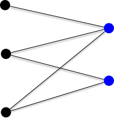
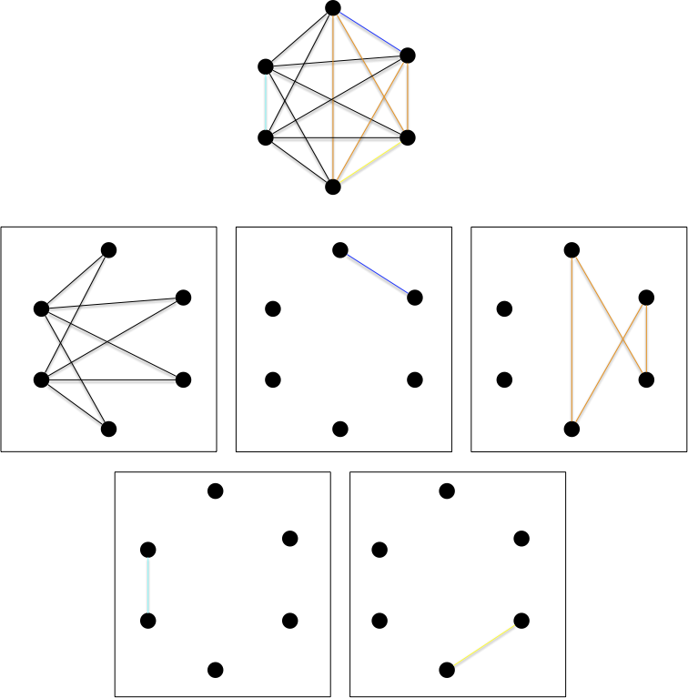

Les graphes biparti font parti de ces classes de graphes assez généraux pour être présent partout et assez spécifique pour que tous se passe bien (les principaux problèmes NP-complets dans le cas général deviennent polynomiaux voir triviaux).

C'est une classe de graphe importante à connaître car, parfois curieusement, ils apparaissent dans nombre de problèmes de graphes. Parfois comme sous-cas facilement solvable, parfois comme fondement d'une preuve. Nous allons voir quelques définitions et caractérisation des graphes bi-parti ainsi que quelques exercices classique (et élégant).

## Définitions

### Bi-parti


Un graphe $G=(V, E)$ est **_biparti_** s'il existe une bipartition $V_1$ et $V_2$ de $V$  en deux [stables](../structure/#definition-stable){.interne}.


Par exemple le graphe suivant :


Les graphes bipartis sont une famille héréditaire, il est en effet clair que :



Tous [sous-graphe](../structure/#definition-sous-graphe) ou [graphe partiel](../structure/#definition-graphe-partiel) d'un graphe biparti est biparti.



On a déjà vu ce genre de graphe sans le savoir lors de [l'étude du transport amoureux](../projet-flots-modélisation/#transport-amoureux) : le problème du mariage entre 2 populations distinctes se modélise comme un graphe bi-parti où chaque population est un stable.


Montrez que si un graphe bi-parti est connexe, sa bi-partition en deux stables est unique.


Si le graphe est connexe, on peut parcourir celui-ci (en largeur ou en profondeur) à partir d'une racine pour créer un arbre planté.

Chaque élément sera forcément dans le stable différent de son parent : l'affectation de chaque élément dépend uniquement de l'affectation de la racine.



La propriété précédente n'est bien sur plus vraie si le graphe n'est pas connexe :


Montrez que  le graphe discret (sans arêtes) à $n$ sommets possède $2^{n-1}-1$ bi-partitions possibles.




Par récurrence. Un graphe discret à 2 sommets possède bien $2^{2-1}-1 = 1$ bipartition.

On suppose la propriété vrai pour les ensembles à $n$ éléments et soit le graphe discret $G=(V, \varnothing)$ à $n+1$ sommets et soit $x$ un de ces éléments. Pour toute les bipartitions $x$ est dans une des deux partitions et, à part celle où $x$ est tout seul dans une classes, si on supprime $x$ on a une bipartition d'un ensemble à $n$ éléments : une bipartition à $n+1$ élément est donc soit :

- $\\{\\{x\\}, V\backslash \\{x\\}\\}$
- $\\{U\cup \\{x\\}, V\\}$ ou $\\{U, V\cup \\{x\\}\\}$ avec $\\{U, V\\}$ une bipartition de $V\backslash \\{x\\}$

Il y a donc $2\cdot (2^{n-1}-1) + 1 = 2^n-1$ bipartitions à $n+1$ éléments (il y en a $2^{n-1}-1$ pour un ensemble à $n$ éléments par hypothèse de récurrence), ce qui conclut la preuve.



Le nombre de partitions d'un ensemble à $n$ éléments en $k$ sous-ensembles est appelé [nombre de Stirling de second espèce](https://fr.wikipedia.org/wiki/Nombre_de_Stirling#Nombre_de_Stirling_de_seconde_esp%C3%A8ce)


En conclure :


Montrez qu'un graphe biparti à $p$ composantes connexes possède $2^{p}-1$ bipartitions possibles.



Soient $\\{X_i, Y_i\\}$, $1\leq i \leq p$, les $p$ bipartitions associées au stables des $p$ composantes connexes de $G$. Un des deux stables de $G$ sera alors :

- soit l'union de tous les $X_i$
- soit une partie des $X_i$, ce qui correspond à ue bipartition des $X_i$, $1\leq i \leq p$.

Il y a donc autant de de façon de faire que de bipartition à $p$ élément plus 1.



Terminons cette série d'exercices par une propriété sur la cardinalité :


Soit $G$ un graphe biparti tel que $\delta(x) = k > 0$ pour tout sommet $x$. Montrez que les deux stables ont même cardinal.


Soient $U$ et $V$ une bipartition en deux stables de $G$. On a : $\sum_{u\in U} \delta(u) = \sum_{v\in V} \delta(v)$

Or $\sum_{u\in U} \delta(u) = k\cdot \vert U\vert$ et $\sum_{v\in V} \delta(u) = k\cdot \vert V\vert$ ce qui conclue la preuve.


### Biparti complets


Un **_graphe biparti complet_** est le graphe $K_{p,q} = (V_p \cup V_q, V_p \times V_q)$, avec $\vert V_p \vert = p$ et $\vert V_q \vert = q$



Le graphe $K_{2, 3}$ est par exemple :




Les graphes bipartis complets sont aussi parfois appelé [**_une biclique_**](https://fr.wikipedia.org/wiki/Graphe_biparti_complet)



On retrouve les graphes bi-partis complets dans plein de champs de la théorie des graphes car ils ont plein de chouettes propriétés. Par exemple :


Montrez que si un graphe biparti est [hamiltonien](../parcours-hamiltoniens/#definition-graphe-hamiltonien){.interne}, alors la taille des 2 stables est identique.



Si le graphe biparti admet un cycle hamiltonien il est connexe et donc n'admet qu'un 2 stables. Soit $x_1x_2\dots x_nx_1$ un cycle hamiltonien. Comme un graphe biparti ne peut avoir de cycle de longueur impaire $n$ est forcément paire.

On conclue la preuve en remarquant que les $x_i$ paires et les $x_i$ impairs sont forcément dans des stables différents.




Déduire de l'exercice précédent que les seuls graphes bipartis complets hamiltoniens sont les graphes $K_{p, p}$ avec $p\geq 1$.




Si le graphe biparti complet $K_{p, p}$ est composé des stables $\\{x_1,\dots x_n\\}$ et $\\{y_1,\dots y_n\\}$, le cycle $x_1y_1\dots x_iy_i\dots x_ny_nx_1$ est hamiltonien : tous les graphes $K_{p, p}$ sont hamiltoniens.



## Reconnaissance

Savoir si un graphe est biparti est _"facile"_ en utilisant un algorithme de marquage qui associe une couleur à chaque sommet.

On considère que le graphe est connexe dans l'algorithme suivant. S'il ne l'est pas on le relance sur chacune des parties connexes.

On retrouve un algorithme de marquage puis examen de sommets, comme [l'algorithme de recherche de chaîne augmentante de Ford et Fulkerson](../flots). Ce principe général permet de résoudre efficacement beaucoup de problèmes en théorie des graphes.

```python
Initialisation :

    On possède deux couleurs.
    Soit x un sommet du graphe que l'on marque avec une couleur

Boucle principale :

    tant qu'il existe x, un sommet marqué non examiné:

        examiner x
        pour chaque voisin y de x :
            si y est marqué avec la couleur de x:
                FIN : le graphe n'est pas biparti
            sinon si y n'est pas marqué:
                marquer y avec la couleur différente de celle de x
    
    FIN : le graphe est biparti et la couleur des sommets determine les 2 stables

```

> TBD à écrire propre

1. on voit bien tous les sommets car connexe : on le fait par récurrence sur la longueur du chemin entre $x$ et $y$
2. chaque couleur est obligatoire
3. linéaire n+m si on utilise un parcours en largeur (les éléments marqués sont dans une file).

## Caractérisation



Un graphe est biparti si et seulement si il ne contient pas de cycle de longueur impaire.



Vous allez en faire la démonstration grâce à deux exercices.



Un graphe biparti ne contient pas de cycle de longueur impaire.




Si le graphe possède un cycle, ses arêtes doivent passer d'un stable à l'autre un nombre pair de fois.



Et dans l'autre sens :



Un graphe n'est pas biparti s'il contient un cycle de longueur impaire.



On utilise l'algorithme et si l'algorithme répond non c'est qu'on a un cycle de longueur impaire.


On le verra tout au long de ce cours l'existence de cycles de longueurs impairs pose de nombreux problèmes algorithmique. Se restreindre aux graphes bi=parti va souvent accélérer et rendre optimal des algorithmes autrement plus compliqués sinon.

## Partition en graphes Biparti

Le problème de partition d'un graphe en graphes bipartis est un problème de communication réseau initialement posé (et résolu) par les deux chercheurs Graham et Pollak des laboratoires Bell dans les années 1970.


[Problème de Graham-Pollak](https://www.youtube.com/watch?v=ZtXfGagSUlA)


Des ordinateurs liés entre eux deux à deux par un graphe complet doivent tous communiquer entre eux. La contrainte est que chaque ordinateur ne peut être que dans 3 états :

- endormis
- en transmission avec **un** unique autre ordinateur.

Chaque couple d'ordinateur doit s'échanger **une** donnée. Combien d'étapes au minimum sont-elles nécessaires pour tout couple d'ordinateurs aient communiqué ?

Ce problème peux se décrire comme un problème de graphe. Commençons par définir une partition d'un graphe.


Une **_partition_** d'un graphe $G=(V, E)$ est une suite $G_i=(V, E_i)$, avec $1\leq i \leq m$ telle que :

- $\cup_{1\leq i \leq m} E_i = E$
- $E_i \cap E_j = \varnothing$ pour tout $1\leq i \neq j \leq m$



La définition explicite le fait que l'on partitionne l'ensemble des arêtes d'un graphe. On spécifie souvent la famille de graphe à laquelle la partition doit appartenir (pour nous des graphes bipartis) et comme tout graphe à $n$ sommet est inclut dans $K_n$ la clique à $n$ sommet, c'est lui que l'on va chercher à partitionner.

Notre problème de partition est :


Combien faut-il au minimum de graphes bipartis (complets) pour partitionner $K_n$ ?


Comme il faut minimiser le nombre d'éléments de la partition et que chaque arête du graphe complet doit être utilisé, les graphes bi-partis sont forcément complets.


Remarquons tout de suite que ce problème admet une solution, il en faut moins de $n(n-1)/2$ puisque les graphes G_{i,j} = (\\{i, j\\}, \\{ij\\})$ sont tous bipartis.

On peut bien sur faire mieux, comme le montre l'exemple suivant qui partitionne $K_6$ en 6 graphes bi-partis complets :


Vous avez peut-être remarqué, mais la partition ci-dessus n'est pas minimale, on peut faire mieux :



Montrer que l'on peut toujours décomposer $K_n$ en $n-1$ étoiles.


Une **_étoile_** est un graphe $G = (V, E)$ tel qu'il existe $x\in V$ avec $E = \\{xy | y \in V\backslash \\{x\\}\\}$




Les étoiles en questions sont $G_i = (V_i, E_i)$ avec $1\leq i < n$ :

- $V_i = \\{j | j \geq i \\}$
- $E_i = \\{\\{i, j\\} | i < j \\}$



Le partitionnement en étoile n'est pas unique, par exemple avec $K_6$ :



En revanche, $n-1$ est bien le minimum :



On ne peut décomposer $K_n$ en moins de $n-1$ graphes bipartis complets.




La preuve est atypique et ne parlera pas de graphes. De plus, on ne connaît pas de preuve combinatoire. J'ai repris la preuve de _Proofs from the book_ (chapitre 11, théorème 4 de la sixième édition) qui comme chacune des preuves du livre est extrêmement élégante.

Soit $K_n$ le graphe complet avec comme ensemble de sommets $V = \\{1, \dots, n\\}$. Soit $(B_k)_{1\leq k \leq m}$ une de ses décompositions en en $m$ graphes bipartis complets, et on note également $\\{U_k, V_k\\}$ les deux stables de $B_k$.

Soient $x_1, \dots, x_n$, $n$ variables réelles. On considère alors [Le système d'équations linéaires](https://fr.wikipedia.org/wiki/Syst%C3%A8me_d%27%C3%A9quations_lin%C3%A9aires) formé des $m+1$ équations suivantes :

- $\sum_{1\leq i \leq n}x_i = 0$
- $\sum_{i \in U_k}x_i = 0$ pour tout $1\leq k \leq m$

Si $m + 1 < n$ [ce système va posséder une solution non nulle](https://fr.wikipedia.org/wiki/Syst%C3%A8me_d%27%C3%A9quations_lin%C3%A9aires#Nombre_de_solutions_d%E2%80%99un_syst%C3%A8me_d'%C3%A9quations) $(c_1, \dots, c_n)$ (il existe $i$ tel que $c_i \neq 0$). Nous allons montrer que ceci est impossible.

Comme pour tout $i \neq j$, il n'existe qu'un unique $k$ tel que $x_i \in U_k$ et $x_j \in V_k$, on a l'égalité :

<div>
$$
\begin{array}{lcl}
\sum\limits_{i < j}x_ix_j &=& \sum\limits_{1\leq k \leq m}(\sum\limits_{(i, j) \in U_k\times V_k} x_i \cdot x_j)\\
&=& \sum\limits_{1\leq k \leq m}(\sum\limits_{i \in U_k} (x_i \cdot (\sum\limits_{j \in V_k} x_j))\\
&=& \sum\limits_{1\leq k \leq m}((\sum\limits_{i \in U_k} x_i)\cdot (\sum\limits_{j \in V_k} x_j))
\end{array}
$$
</div>

Comme $\sum_{1\leq i\leq n}c_i = 0$ on a aussi :

<div>
$$
\begin{array}{lcl}
0 &=& (\sum\limits_{1\leq i\leq n}c_i)^2\\
&=&\sum\limits_{1\leq i\leq n}c_i^2 + \sum\limits_{i < j}c_ic_j\\
&=&\sum\limits_{1\leq i\leq n}c_i^2 + \sum\limits_{1\leq k \leq m}((\sum\limits_{i \in U_k} c_i)\cdot (\sum\limits_{j \in V_k} c_j))\\
\end{array}
$$
</div>

Or $\sum_{i \in U_k}c_i = 0$ pour tout $1\leq k \leq m$, ce qui implique :

<div>
$$
\begin{array}{lcl}
0 &=& \sum\limits_{1\leq i\leq n}c_i^2\\
\end{array}
$$
</div>

Ce qui n'est possible que si $c_i = 0$ pour tout $1\leq i \leq n$ : contradiction. Notre hypothèse était donc fausse, on a $m + 1 = n$.



## Sous-graphes bi-partis

Nous allons montrer des encadrements sur les graphe possédant, ou pas, des sous-graphes bi-partis.

### sous-graphe bi-parti inclus


<https://www.youtube.com/watch?v=crMyNv2fdkc&list=PLUl4u3cNGP61cYB5ymvFiEbIb-wWHfaqO&index=1>


Le grand retour de la méthode probabiliste pour résoudre un problème à priori très compliqué.


Dans tout graphe $G=(V, E)$ à $m$ arêtes, il existe un [sous-graphe](../structure/#definition-sous-graphe){.interne} bi-parti $G'$ à au moins $\frac{m}{2}$ arêtes.



On va associer à chaque sommet du graphe $G$ une couleur parmi 2 choix possibles (disons rouge et noir) de façon **uniforme** et **indépendante**.

On considère ensuite le sous-graphe couvrant $G'$ où l'on a supprimé de graphe toutes les arêtes dont les sommets de sont de couleurs différentes. La probabilité pour une arête $xy$ d'être dans $G'$ est $\frac{1}{2}$. Il y a en effet 4 possibilité pour chaque arêtes, chacune de probabilité $\frac{1}{4}$ :

- soit $x$ et $y$ sont rouges
- soit $x$ est rouge et $y$ est noir
- soit $x$ est noir et $y$ est rouge
- soit $x$ et $y$ sont noires

De là, en notant $\mathcal{G}'$ l'ensemble de tout ces sous-graphes possibles, l'espérance du nombre d'arêtes dans $G'$ est :

<div>
$$
\begin{array}{lcl}
\mathbb{E}(E') &=& \frac{1}{\vert \mathcal{G}' \vert}\sum_{G'=(V, E') \in \mathcal{G}'}\vert E'\vert\\
& =& \frac{1}{\vert \mathcal{G}' \vert}\sum_{xy \in E} \vert \{G' \vert G'=(V, E') \in \mathcal{G}', xy \in E' \}\vert\\
& = &\frac{\sum_{xy \in E} \vert \{G' \vert G'=(V, E') \in \mathcal{G}', xy \in E' \}\vert}{\vert \mathcal{G}' \vert} \\
&= &\sum_{xy \in E}p_{\text{probabilité que les deux sommet de } xy \text{soient de même couleur}}
\end{array}
$$
</div>

Comme cette probabilité vaut $\frac{1}{2}$ quelque soit l'arête, on en déduit que le nombre moyen d'arête dans $G'$ est $\frac{m}{2}$.

On termine la preuve en remarquant que pour obtenir cette espérance il est indispensable qu'il existe au moins un sous-graphe $G^\star$ de $G$ atteignant cette moyenne.


Notez comment la preuve est élégante ! C'est souvent le cas lorsque l'on utilise [la méthode probabiliste](https://fr.wikipedia.org/wiki/M%C3%A9thode_probabiliste). Cependant, ces preuves sont non constructives. Et dans notre cas, trouver ce graphe bi-parti n'est pas facile du tout puisque trouver le plus grand sous-graphe biparti est NP-complet. Cela revient en effet à trouver une coupe de taille maximale : <https://fr.wikipedia.org/wiki/Coupe_maximum>.
> TBD NP-complet <https://www.cs.cornell.edu/courses/cs4820/2014sp/notes/reduction-maxcut.pdf>
> On dérive de NAE 3- sat.

Le problème de trouver le grand sous graphe bi-parti (clairement) équivalent au problème suivant :
<span id="problème-MAX-CUT"></span>



- **nom** : MAX-CUT
- **Entrée** :
  - un graphe
  - un entier $K$
- **Question** : le graphe contient-il une bipartition $V_1$ et $V_2$ de ses sommets tels que $\vert \\{xy \vert xy \in V(G), x \in V_1, y in V_2 \\} \geq K$ ?



Ue coupe dans un graphe est soit une bi=partition de ses sommets, soit l'ensemble des arêtes dont les extrémités sont dans des classes différentes.



Le problème MAX-CUT est


Qui est NP-complet :


Le problème MAX-CUT est NP-complet.


On montre que [STABLE](../cliques-stables/#problème-stable) ≤ MAX-cut

Soit $(G, K)$ une instance du problème stable. On peut considérer sans perte de généralité que $\delta_G(x)\geq 1$ pour tout sommet $x$ de $G$.

> TBD ici



Dans notre cas, on ne cherche pas le plus grand, seul $m/2$ est suffisant, mais si on pouvait le faire rapidement on pourrait par dichotomie trouver le plus grand en ajoutant des sommets et des arêtes

> TBD le faire.

On appelle ce genre de preuve "une paille dans une botte de foin". Il existe plein de solutions possibles (il y a beaucoup de graphes $G'$ et pour que la moyenne soit $m/2$, plein fonctionnent) mais ils sont difficiles à trouver algorithmiquement.

### Grand sous-graphe bi-parti exclus

> TBD exemples


<https://www.youtube.com/watch?v=YAo1sd4kuOQ&list=PLUl4u3cNGP62qauV_CpT1zKaGG_Vj5igX&index=3>


On cherche des graphes à $n$ sommets ne possédant pas de sous-graphes bi-partis complets. On sait peut de choses sur ces graphes, mais on peut montrer que :


Pour tout $s\leq t$, il existe ue constante $C$ telle que tout graphe à $n$ sommet ne possédant pas $K_{s, t}$ à moins de $C\cdot n^{2-{1}/{s}}$ arêtes.



> TBD écrire la preuve.



Remarquez que la borne ne dépend pas de $t$.


> TBD applications unit distance problem.
> TBD si on y a simple droite puis triangle on reste sur des trucs linéaires.
> TBD montrer qu'on arrive à $n\log(n)$ facilement.
> n0 = 1 m0 = 0
> on duplique le graphe en translattant tout de 1 unité (rester en position générale, possible par dichotomie de l'angle du vecteur de translation puisque toujours nb fini de sommets). on a alors
> n(i+1) = 2ni
> m(i+1) = 2mi + ni
>
> ce qui donne m(i+1)/n(i+1) = m(i)/n(i) + 1/2 = ... = m0/n0 + i/2 = log(n(i+1))/2
>
> $\mathcal{O}(n^{3/2}) = \mathcal{O}(n\sqrt{n})$ car le graphe est sans $K_{2, 3}$ l'intersection de deux cercle de rayon 1 centré en 0 et 1 c'est 2 points donc si deux sommets ont 2 voisins en commun ils ne peuvent avoir de troisième voisin en commun au mieux ils sont voisins entre eux.
> TBD meilleurs application connue est $\mathcal{O}(n^{4/3})$.

> TBD parler de la solution d'Erdòs ?

Nous allons montrer maintenant une borne min pour des graphes sans sous-graphes bi-parti complets.


Pour tout $s\leq t$, il existe des graphes à $n$ sommets ayant plus de $\frac{1}{16}\cdot n^{2-\frac{s + t -2}{s\cdot t -1}}$ arêtes n'admettant pas $K_{s, t}$ comme sous-graphe.


La preuve de ce théorème est une conséquence directe du théorème suivant, qui utilise la méthode probabiliste avec altération. Ce raffinement de la méthode probabiliste commence par construire un graphe aléatoire puis on le modifie pour qu'il satisfasse nos hypothèse. Encore une fois la preuve est (extrêmement) élégante mais non constructive :


Soit $H$ un graphe à $v(H) \geq 2$ sommets et $e(H) \geq 3$ arêtes, il existe $s\leq t$, il existe des graphes à $n$ sommets ayant plus de $\frac{1}{16}\cdot n^{2-\frac{v(H) -2}{e(H) -1}}$ arêtes n'admettant pas $H$ comme sous-graphe.


La preuve va consister à construire un graphe aléatoirement, puis à supprimer toutes les copies de $H$ qu'il contient.

Soit $G$ à $n$ sommets construit tel que la probabilité d'avoir l'arête $xy$ vaut $p$ quelque soit l'arête (ces graphes sont appelés graphes aléatoire de Erdős-Rényi, on y revient plus tard dans ce cours). On choisira $p$ plus tard pour maximiser le nombre d'arêtes tout en conservant peux de copies de $H$ dans $G$.

En notant $\sharp H$ le nombre de sous-graphes valant $H$ de $G$ on va calculer son espérance $\mathbb{E}(\sharp H)$.

Pour cela il nous faut une autre donnée qui est le nombre d'[automorphisme de $H$](https://fr.wikipedia.org/wiki/Automorphisme_de_graphe) (les permutation de sommets conservant $H$), appelons le $\text{aut}(H)$, pour pouvoir écrire :

<div>
$$
\begin{array}{lcl}
\mathbb{E}(\sharp H) &=& \frac{n\cdot(n-1)\cdot \dots \cdot (n-v(H))}{\text{aut}(H)}\cdot p^{e(H)}\\
\end{array}
$$
</div>

Puisque l'on compte pour tout ensemble de $v(H)$ sommets la probabilité de fabriquer $H$ en sachant que chaque arête a une probabilité $p$ d'exister indépendante des autres (d'où la multiplication $p \cdot \dots \cdot p = p^{e(H)}$). On en déduit l'inégalité :

<div>
$$
\begin{array}{lcl}
\mathbb{E}(\sharp H) &\leq& n^{v(H)}\cdot p^{e(H)}\\
\end{array}
$$
</div>

D'un autre côté l'espérance du nombre d'arête de $G$ vaut : $\mathbb{E}(e(G)) = p \cdot \binom{n}{2}$. On veut que le nombre d'arête de $G$ soit le plus grand possible tout en minimisant le nombre de sous-graphe valant $H$ : on cherche à maximiser $\mathbb{E}(e(G) - \sharp H) = \mathbb{E}(e(G)) - \mathbb{E}(\sharp H)$.

<div>
$$
\begin{array}{lcl}
\mathbb{E}(e(G) - \sharp H) &\geq& p \cdot \binom{n}{2}[1-2p^{e(H)-1}\cdot \frac{n^{v(H)-1}}{n-1}]\\
&\geq& p \cdot \binom{n}{2}[1-2p^{e(H)-1}\cdot {n^{v(H)-2}}]\\
\end{array}
$$
</div>

On peut maintenant trouver $p$ qui vq simplifier tout ça, par exemple $p = \frac{1}{2}\cdot n^{-\frac{v(H) -2}{e(H) -1}}$ puisqu'on a alors :

<div>
$$
\begin{array}{lclr}
\mathbb{E}(e(G) - \sharp H) &\geq& p \cdot \binom{n}{2}[1-2(\frac{1}{2}\cdot n^{-\frac{v(H) -2}{e(H) -1}})^{e(H)-1}\cdot {n^{v(H)-2}}]\\
&\geq& p \cdot \binom{n}{2}[1-\frac{1}{2^{e(H)-2}}]\\
&\geq& p\cdot \binom{n}{2}\cdot \frac{1}{2} &\text{ puisque }e(H)\geq 3\\
&\geq& \frac{1}{4} p\cdot (n(n-1))\\
&\geq& \frac{1}{8} \cdot n^{-\frac{v(H) -2}{e(H) -1}}\cdot (n(n-1))\\
&\geq& \frac{1}{8} \cdot n^{-\frac{v(H) -2}{e(H) -1}}\cdot (n(\frac{n}{2}))& \text{ puisque }v(H)\geq 2\\
&\geq& \frac{1}{16}\cdot n^{2-\frac{v(H) -2}{e(H) -1}}\\
\end{array}
$$
</div>

On peut maintenant utiliser l'argument classique de la méthode probabiliste : il existe forcément un graphe $G^\star$ tel que $e(G) - \sharp H \geq \frac{1}{16}\cdot n^{2-\frac{v(H) -2}{e(H) -1}}$.

Il suffit maintenant d'enlever une arête de $G^\star$ pour toute copie de $H$ en lui (on énumère tous les sous-graphe de $G^\star$ et on supprime si nécessaire une de ses arête si c'est $H$). On obtient alors un nouveau graphe ${G^\star}'$ sans sous-graphe valant $H$ et ayant au moins $e(G^\star) - \sharp H \geq \frac{1}{16}\cdot n^{2-\frac{v(H) -2}{e(H) -1}}$ arêtes.



On peut faire mieux en utilisant d'autres méthodes, en particulier algébrique. Regardez le lien si vous voulez plus d'infos.


Pour le graphe bi-parti complet $K_{s, t}$ cela nous donne l'encadrement suivant pour un graphe $G$ à $n$ sommets ne possédant pas $K_{s, t}$ comme sous-graphe :

<div>
$$
\frac{1}{16}\cdot n^{2-\frac{s + t -2}{s\cdot t -1}} \leq e(G) \leq C_n \cdot n^{2-{1}/{s}}
$$
</div>

Notez que lorsque $t$ tend vers l'infini les deux bornes vont se rejoindre.

Pour des graphes bi-partis $K_{s, s}$ on obtient :

<div>
$$
\frac{1}{16}\cdot n^{2-\frac{2}{s + 1}} \leq e(G) \leq C_n \cdot n^{2-{1}/{s}}
$$
</div>

En particulier pour le graphe sans cycle de longueur 4, c'est à dire des graphes sans $K_{2, 2}$  on a la l'encadrement :

<div>
$$
\Theta(n^{4/3}) \leq e(G) \leq C_n \cdot \mathcal{O}(n^{3/2})
$$
</div>


On peut trouver des encadrement plus fin en utilisant des méthodes plus sophistiquée, si cela vous intéresse, regardez la vidéo en lien.

