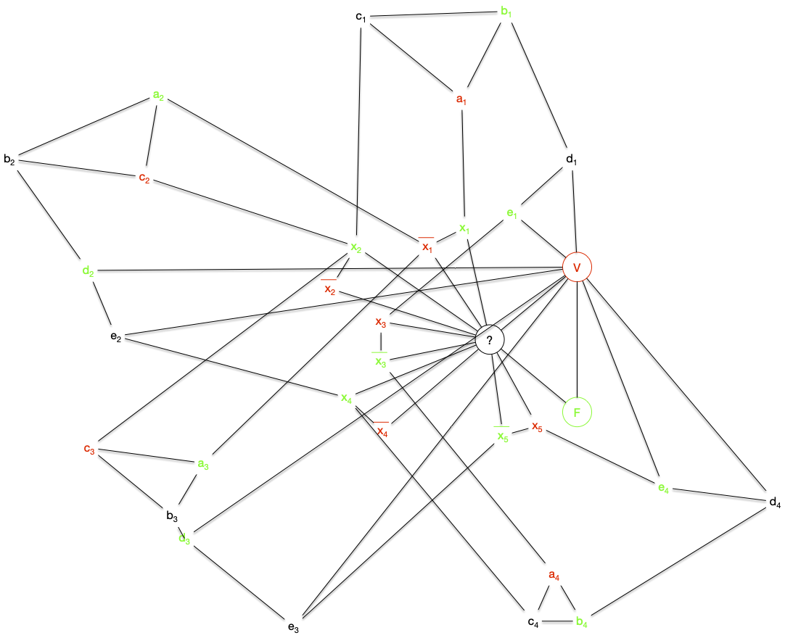

Les graphes biparti font parti de ces classes de graphes assez généraux pour être présent partout et assez spécifique pour que tous se passe bien (les principaux problèmes NP-complets dans le cas général deviennent polynomiaux voir triviaux).


Un graphe $G=(V, E)$ est **_biparti_** s'il existe une bipartition $V_1$ et $V_2$ de $V$  en deux [stables](../structure/#definition-stable){.interne}.


Par exemple le graphe suivant :


Les graphes bipartis sont une famille héréditaire, il est en effet clair que :



Tous [sous-graphe](../structure/#definition-sous-graphe) ou [graphe partiel](../structure/#definition-graphe-partiel) d'un graphe biparti est biparti.



On a déjà vu ce genre de graphe sans le savoir lors de [l'étude du transport amoureux](../projet-flots-modélisation/#transport-amoureux) : le problème du mariage entre 2 populations distinctes se modélise comme un graphe bi-parti où chaque population est un stable.


Montrez que si un graphe bi-parti est connexe, sa bi-partition en deux stables est unique.


Si le graphe est connexe, on peut parcourir celui-ci (en largeur ou en profondeur) à partir d'une racine pour créer un arbre planté.

Chaque élément sera forcément dans le stable différent de son parent : l'affectation de chaque élément dépend uniquement de l'affectation de la racine.



La propriété précédente n'est bien sur plus vraie si le graphe n'est pas connexe :


Montrez que  le graphe discret (sans arêtes) à $n$ sommets possède $2^{n-1}-1$ bi-partitions possibles.




Par récurrence. Un graphe discret à 2 sommets possède bien $2^{2-1}-1 = 1$ bipartition.

On suppose la propriété vrai pour les ensembles à $n$ éléments et soit le graphe discret $G=(V, \varnothing)$ à $n+1$ sommets et soit $x$ un de ces éléments. Pour toute les bipartitions $x$ est dans une des deux partitions et, à part celle où $x$ est tout seul dans une classes, si on supprime $x$ on a une bipartition d'un ensemble à $n$ éléments : une bipartition à $n+1$ élément est donc soit :

- $\\{\\{x\\}, V\backslash \\{x\\}\\}$
- $\\{U\cup \\{x\\}, V\\}$ ou $\\{U, V\cup \\{x\\}\\}$ avec $\\{U, V\\}$ une bipartition de $V\backslash \\{x\\}$

Il y a donc $2\cdot (2^{n-1}-1) + 1 = 2^n-1$ bipartitions à $n+1$ éléments (il y en a $2^{n-1}-1$ pour un ensemble à $n$ éléments par hypothèse de récurrence), ce qui conclut la preuve.



Le nombre de partitions d'un ensemble à $n$ éléments en $k$ sous-ensembles est appelé [nombre de Stirling de second espèce](https://fr.wikipedia.org/wiki/Nombre_de_Stirling#Nombre_de_Stirling_de_seconde_esp%C3%A8ce)


En conclure :


Montrez qu'un graphe biparti à $p$ composantes connexes possède $2^{p}-1$ bipartitions possibles.



Soient $\\{X_i, Y_i\\}$, $1\leq i \leq p$, les $p$ bipartitions associées au stables des $p$ composantes connexes de $G$. Un des deux stables de $G$ sera alors :

- soit l'union de tous les $X_i$
- soit une partie des $X_i$, ce qui correspond à ue bipartition des $X_i$, $1\leq i \leq p$.

Il y a donc autant de de façon de faire que de bipartition à $p$ élément plus 1.



Terminons cette série d'exercices par une propriété sur la cardinalité :


Soit $G$ un graphe biparti tel que $\delta(x) = k > 0$ pour tout sommet $x$. Montrez que les deux stables ont même cardinal.


Soient $U$ et $V$ une bipartition en deux stables de $G$. On a : $\sum_{u\in U} \delta(u) = \sum_{v\in V} \delta(v)$

Or $\sum_{u\in U} \delta(u) = k\cdot \vert U\vert$ et $\sum_{v\in V} \delta(u) = k\cdot \vert V\vert$ ce qui conclue la preuve.


## Reconnaissance

Savoir si un graphe est biparti est _"facile"_ en utilisant un algorithme de marquage qui associe une couleur à chaque sommet.

On considère que le graphe est connexe dans l'algorithme suivant, o. S'il ne l'est pas on le relance sur chacune des parties connexes.

On retrouve un algorithme de marquage puis examen de sommets, comme [l'algorithme de recherche de chaîne augmentante de Ford et Fulkerson](../flots). Ce principe général permet de résoudre efficacement beaucoup de problèmes en théorie des graphes.

```python
Initialisation :

    On possède deux couleurs.
    Soit x un sommet du graphe que l'on marque avec une couleur

Boucle principale :

    tant qu'il existe x, un sommet marqué non examiné:

        examiner x
        pour chaque voisin y de x :
            si y est marqué avec la couleur de x:
                FIN : le graphe n'est pas biparti
            sinon si y n'est pas marqué:
                marquer y avec la couleur différente de celle de x
    
    FIN : le graphe est biparti et la couleur des sommets determine les 2 stables

```

> TBD à écrire propre

1. on voit bien tous les sommets car connexe : on le fait par récurrence sur la longueur du chemin entre $x$ et $y$
2. chaque couleur est obligatoire
3. linéaire n+m si on utilise un parcours en largeur (les éléments marqués sont dans une file).

## Caractérisation



Un graphe est biparti si et seulement si il ne contient pas de cycle de longueur impaire.



Vous allez en faire la démonstration grâce à deux exercices.



Un graphe biparti ne contient pas de cycle de longueur impaire.




Si le graphe possède un cycle, ses arêtes doivent passer d'un stable à l'autre un nombre pair de fois.



Et dans l'autre sens :



Un graphe n'est pas biparti s'il contient un cycle de longueur impaire.



On utilise l'algorithme et si l'algorithme répond non c'est qu'on a un cycle de longueur impaire.


## Généralisations

### Biparti complets


Un **_graphe biparti complet_** est le graphe $K_{p,q} = (V_p \cup V_q, V_p \times V_q)$, avec $\vert V_p \vert = p$ et $\vert V_q \vert = q$



Le graphe $K_{2, 3}$ est par exemple :



Les graphes bipartis complets sont aussi parfois appelé [**_une biclique**_](https://fr.wikipedia.org/wiki/Graphe_biparti_complet)



On retrouve les graphes bi-partis complets dans plein de champs de la théorie des graphes car ils ont plein de chouettes propriétés. Par exemple :


Montrez que si un graphe biparti est [hamiltonien](../parcours-hamiltoniens/#definition-graphe-hamiltonien){.interne}, alors la taille des 2 stables est identique.



Si le graphe biparti admet un cycle hamiltonien il est connexe et donc n'admet qu'un 2 stables. Soit $x_1x_2\dots x_nx_1$ un cycle hamiltonien. Comme un graphe biparti ne peut avoir de cycle de longueur impaire $n$ est forcément paire.

On conclue la preuve en remarquant que les $x_i$ paires et les $x_i$ impairs sont forcément dans des stables différents.




Déduire de l'exercice précédent que les seuls graphes bipartis complets hamiltoniens sont les graphes $K_{p, p}$ avec $p\geq 1$.




Si le graphe biparti complet $K_{p, p}$ est composé des stables $\\{x_1,\dots x_n\\}$ et $\\{y_1,\dots y_n\\}$, le cycle $x_1y_1\dots x_iy_i\dots x_ny_nx_1$ est hamiltonien : tous les graphes $K_{p, p}$ sont hamiltoniens.



### Graphes $k$-partis

Une généralisation possible des graphes biparti est d'augmenter le nombre de stables :


Un graphe est **_$k$-parti_** s'il existe une partition $V_1, \dots, V_k$ de $V$ en $k\geq 1$ [stables](../structure/#definition-stable){.interne}.



Il est clair qu'un graphe $k$-parti est $k'$-parti pour tout $k'\geq k$. La réciproque n'est pas vraie puisque qu'u cycle à 5 éléments est 3-parti mais pas biparti.

Le problème de cette généralisation est que le problème de reconnaissance devient NP-complet pour $k\geq 3$.



- nom : Reconnaissance d'un graphe $k$-parti (`Rec-k-parti`)
- entrée : un graphe $G$
- sortie : Oui si $G$ est $k$-parti, Non sinon.



On remarque que $k$ fait parti du problème, ce n'est pas une entrée. Il existe donc un problème de reconnaissance différent pour chaque $k$. Il est clair qu'ils sont tous dans NP :



Le problème de la reconnaissance d'un graphe $k$-parti est dans NP plur tout $k\geq 1$




Si l'on se donne une solution possible sous la forme d'une partition en $k$ classe de l'ensemble des sommets, il est facile de vérifier si ce sont des stables.



On a vu précédemment que le problème de reconnaissance est polynomial (et même linéaire) pour les graphes biparti et pour les graphes 1-parti (c'est le graphe discret). De plus, vous aller le montrer, on peu facilement réduire la reconnaissance d'un graphe $k$-parti à un cas particulier de la reconnaissance d'un graphe $(k+1)$-parti :


Montrez que pour tout $k\geq 1$ on a : `Rec-k-parti` $\leq$ `Rec-(k+1)-parti`.



Soit $G=(V, E)$ dont on cherche à savoir s'il est $k$-parti. Soit alors $G'=(V \cup \\{x\\}, E \cup \\{xy \vert y\in V})$. On a clairement (le seul stable contenant $x$ c'est lui-même) :

- $G$ est $k$-parti si et seulement si $G'$ est $(k+1)-parti
- les stables de $G$ sont les stables de $G'$ privé du stable contenant uniquement $x$.



Pour terminer, il nous reste à montrer que `Rec-3-parti` est NP-complet :



Le problème de la reconnaissance d'un graphe $3$-parti est NP-complet.




On part de 3-SAT. Soient :

- $(x_i)_{1\leq i \leq n}$ les $n$ variables d'une instance de 3-SAT
- $c_j = l_j^1 \lor l_j^2 \lor l_j^3$  pour $1\leq j \leq m$ les $m$ clauses formés des littéraux $l_j^k \in \\{x_1, \dots, x_n, \overline{x_1}, \dots, \overline{x_1}\\}$ pour $1\leq k \leq 3$ et $1\leq j \leq m$
- $C = \land_{j} c_j$ la conjonction de clauses.

On va associer à tout ceci, de façon polynomiale, un graphe qui sera 3-parti si et seulement si la conjonction de clause $C$ est satisfiable.

On commence par créer un graphe permettant de rendre compte de la véracité des variables : $G_1 = (V_1 \cup V_2, E)$ où :

- $V_1 = \\{x_1, \dots, x_n, \overline{x_1}, \dots, \overline{x_1}\\}$
- $V_2 = \\{ V, F, ?\\}$
- $E = \\{\\{V, ?\\}, \\{F, ?\\}, \\{V, F\\} \\}\cup \\{\\{x_i, ?\\} \vert 1\leq i \leq n \\} \cup \\{\\{\overline{x_i}, ?\\} \vert 1\leq i \leq n \\}$


Le graphe $G_1$ est clairement 3-parti avec :

- les 3 sommets $V$, $F$ et $?$ dans 3 stables différents,
- les sommets $x_i$ et $\overline{x_i}$ sont dans le stable ne contenant pas $?$,
- si $x_i$ est dans le stable contenant $V$ alors $\overline{x_i}$ est dans le stable contenant $F$ et réciproquement pour tout $1\leq i \leq n$.

Il faut maintenant ajouter à ce graphes les clauses qui vont permettre de placer des valeurs de vérité aux variables via des stables (le stable de V ou le stable de F). Soit alors le graphe $C_j = (V'_1 \cup V_2 \cup V_j, E_j)$ tel que :

- $V_j = \\{a_j, b_j, c_j, d_j, e_j \\}$
- $V'_1 = \\{l^1_j, l^2_j, l^3_j \\} \subseteq V_1$
- $E_j$ correspondant au graphe ci-dessous


On remarque que les graphes $C_j$ sont 3-partis et que tous leurs stables sont tels que $l^1_j$, $l^2_j$ et $l^3_j$ ne sont pas tous les 3 dans la classe de $F$.

On en conclut donc que le graphe $G = (V_1 \cup V_2 \cup (\cup_j V_j), E \cup (\cup_j E_j))$ est triparti si et seulement si la conjonction de clause $C$ est satisfiable.



La réduction de la preuve de la proposition précédente est plus complexe que toutes celles que l'on a fait jusqu'à présent, [Le gadget utilisé](https://fr.wikipedia.org/wiki/Gadget_(informatique)) n'étant pas trivial. Montrons ce qu'il donne sur [notre exemple fil rouge des réduction depuis 3-SAT](/cours/algorithmie/problème-SAT/#3-sat-exemple){.interne} :

- $G_1$ : 
- $C_1$ : 
- $C_2$ : 
- $C_3$ : 
- $C_4$ : 

Ce qui donne le graphe final :


Ce graphe est tripartite (on a associé une couleur à chaque stable) :



On voit que, comme pour le problème SAT, le problème est simple pour 1 et 2 mais NP-complet à partir de 3.

### Graphes $k$-partis complets

On en a parfois besoin, donc autant les définir ici :



On appelle **_graphe $k$-parti complet_** le graphe Le graphe $K_{p_1,\dots, p_k} = (\cup_{i} V_{p_i}, \\{uv \vert u\in V_{p_i}, v\in V_{p_j}, i\neq j\\})$


Pour voir quelques graphes tri-partis complets, vous pouvez jeter un coup d'oeil à la page suivante :


<https://mathworld.wolfram.com/CompleteTripartiteGraph.html>


Terminons par un petit exercice pour appliquer tout ça :


Trouver toutes les valeurs entières de a, b, c telles que $0 < a ≤ b ≤ c$ et que le graphe 3-parti complet $K_{a,b,c}$ possède :

- [un cycle eulérien](../parcours-eulériens/#definition-cycle-eulerien){.interne}.

- [un chemin eulérien](../parcours-eulériens/#definition-chemin-eulerien){.interne}



Soient $A$, $B$ et $C$ les 3 stables tels que $\vert A\vert = a$, $\vert B\vert = b$ et $\vert C\vert = c$. On a :

- les a sommets de $A$ ont pour degré $b+c$,
- les b sommets de $B$ ont pour degré $a+c$,
- les c sommets de $C$ ont pour degré $a+b$.

Pour que le graphe admette un cycle eulérien, il faut que tout sommet soit de degré pair, ce qui n'est possible que si $a$, $b$ et $c$ sont soit tous pair soit tous impairs.

Pour que le graphe admette un chemin eulérien, il faut que tous les sommets soient de degré paires sauf 2. Comme tous les sommets d'un même stable ont même degré, on a deux cas : soit $a=b=1$ et $c$ pair, soit $a=2$ et il faut alors que :

- $b+c$ soit impair,
- $2+c$ soit pair,
- $2+b$  soit pair.

Ce qui est impossible.

Les seuls graphes tripartis complets admettant un chemin eulériens sont donc les graphes $K_{1,1,2p}$


## Partition en graphes Biparti

Le problème de partition d'un graphe en graphes bipartis est un problème de communication réseau initialement posé (et résolu) par les deux chercheurs Graham et Pollak des laboratoires Bell dans les années 1970.


[Problème de Graham-Pollak](https://www.youtube.com/watch?v=ZtXfGagSUlA)


Posons le problème en commençant par définir une partition d'un graphe.


Une **_partition_** d'un graphe $G=(V, E)$ est une suite $G_i=(V_i, E_i)$, avec $1\leq i \leq m$ telle que :

- $V_i \subseteq = V$ pour tout $1\leq i \neq j \leq m$
- $\cup_{1\leq i \leq m} E_i = E$
- $E_i \cap E_j = \varnothing$ pour tout $1\leq i \neq j \leq m$



La définition explicite le fait que l'on partitionne l'ensemble des arêtes d'un graphe. On spécifie souvent la famille de graphe à laquelle la partition doit appartenir (pour nous des graphes bipartis) et comme tout graphe à $n$ sommet est inclut dans $K_n$ la clique à $n$ sommet, c'est lui que l'on va chercher à partitionner.

Notre problème de partition est :


Combien faut-il au minimum de graphes bipartis complets pour partitionner $K_n$ ?



Remarquons tout de suite que ce problème admet une solution, il en faut moins de $n(n-1)/2$ puisque les graphes G_{i,j} = (\\{i, j\\}, \\{ij\\})$ sont tous bipartis.

On peut bien sur faire mieux, comme le montre l'exemple suivant qui partitionne $K_6$ en 6 graphes bi-partis complets :


Vous avez peut-être remarqué, mais la partition ci-dessus n'est pas minimale, on peut faire mieux :



Montrer que l'on peut toujours décomposer $K_n$ en $n-1$ étoiles.


Une **_étoile_** est un graphe $G = (V, E)$ tel qu'il existe $x\in V$ avec $E = \\{xy | y \in V\backslash \\{x\\}\\}$




Les étoiles en questions sont $G_i = (V_i, E_i)$ avec $1\leq i < n$ :

- $V_i = \\{j | j \geq i \\}$
- $E_i = \\{\\{i, j\\} | i < j \\}$



Le partitionnement en étoile n'est pas unique, par exemple avec $K_6$ :


En revanche, $n-1$ est bien le minimum :



On ne peut décomposer $K_n$ en moins de $n-1$ graphes bipartis complets.




La preuve est atypique et ne parlera pas de graphes. De plus, on ne connaît pas de preuve combinatoire. J'ai repris la preuve de _Proofs from the book_ (chapitre 11, théorème 4 de la sixième édition) qui comme chacune des preuves du livre est extrêmement élégante.

Soit $K_n$ le graphe complet avec comme ensemble de sommets $V = \\{1, \dots, n\\}$. Soit $(B_k)_{1\leq k \leq m}$ une de ses décompositions en en $m$ graphes bipartis complets, et on note également $\\{U_k, V_k\\}$ les deux stables de $B_k$.

Soient $x_1, \dots, x_n$, $n$ variables réelles. On considère alors [Le système d'équations linéaires](https://fr.wikipedia.org/wiki/Syst%C3%A8me_d%27%C3%A9quations_lin%C3%A9aires) formé des $m+1$ équations suivantes :

- $\sum_{1\leq i \leq n}x_i = 0$
- $\sum_{i \in U_k}x_i = 0$ pour tout $1\leq k \leq m$

Si $m + 1 < n$ [ce système va posséder une solution non nulle](https://fr.wikipedia.org/wiki/Syst%C3%A8me_d%27%C3%A9quations_lin%C3%A9aires#Nombre_de_solutions_d%E2%80%99un_syst%C3%A8me_d'%C3%A9quations) $(c_1, \dots, c_n)$ (il existe $i$ tel que $c_i \neq 0$). Nous allons montrer que ceci est impossible.

En effet, comme pour tout $i \neq j$, il n'existe qu'un unique $k$ tel que $x_i \in U_k$ et $x_j \in V_k$, de là on a l'égalité :

<div>
$$
\begin{array}{lcl}
\sum\limits_{i < j}x_ix_j &=& \sum\limits_{1\leq k \leq m}(\sum\limits_{(i, j) \in U_k\times V_k} x_i \cdot x_j)\\
&=& \sum\limits_{1\leq k \leq m}[(\sum\limits_{i \in U_k} x_i)\cdot (\sum\limits_{i \in V_k} x_j)]
\end{array}
$$
</div>

Comme $\sum_{1\leq i\leq n}c_i = 0$ on a aussi :

<div>
$$
\begin{array}{lcl}
0 &=& (\sum\limits_{1\leq i\leq n}c_i)^2\\
&=&\sum\limits_{1\leq i\leq n}c_i^2 + \sum\limits_{i < j}c_ic_j\\
&=&\sum\limits_{1\leq i\leq n}c_i^2 + \sum\limits_{1\leq k \leq m}[(\sum\limits_{i \in U_k} c_i)\cdot (\sum\limits_{i \in V_k} c_j)]\\
\end{array}
$$
</div>

Or $\sum_{i \in U_k}x_i = 0$ pour tout $1\leq k \leq m$, donc $\sum_{i \in U_k}c_i = 0$ également, ce qui implique :

<div>
$$
\begin{array}{lcl}
0 &=& \sum\limits_{1\leq i\leq n}c_i^2\\
\end{array}
$$
</div>

Ce qui n'est possible que si $c_i = 0$ pour tout $1\leq i \leq n$ : contradiction. Notre hypothèse était donc fausse, on a $m + 1 = n$.


