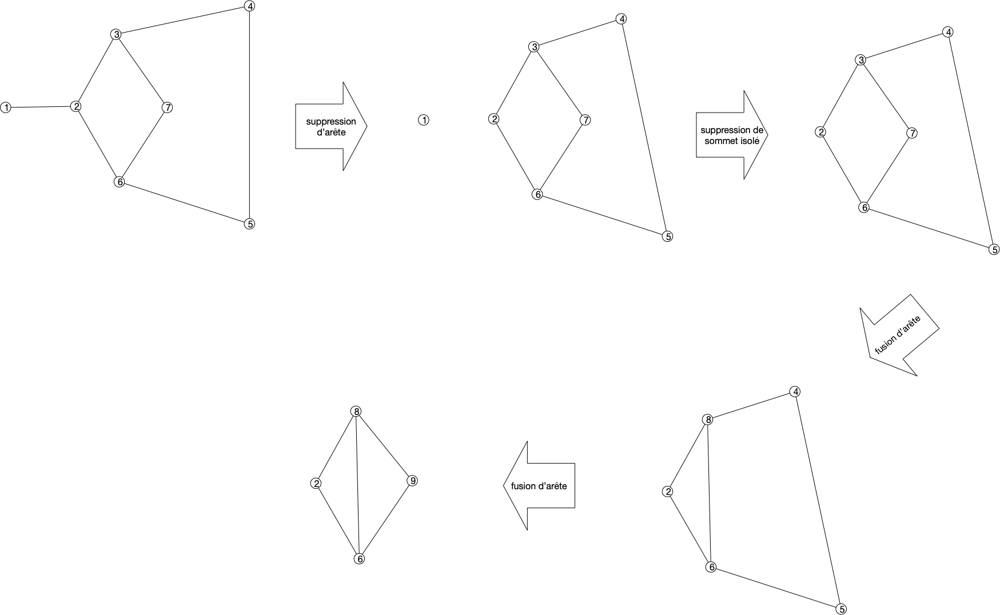


[Théorème de Kuratowski](https://fr.wikipedia.org/wiki/Graphe_planaire#Caract%C3%A9risation_de_Kuratowski_et_de_Wagner)


## Preuve d'un théorème de Jordan simplifié

> TBD suffisant pour les graphes où les sommets sont dénombrables.
> 
> TBD si courbe alors polygone alors droites

## Caractérisation

La caractérisation des graphes planaire de Kuratowski se fait par "_mineur exclu_". C'est à dire caractériser les graphes qui vont nous empêcher de réussir un dessin planaire


Soit $G$ un graphe. Un graphe $H$ est un mineur de $G$ s'il peut être obtenu par un nombre quelconque des opérations suivantes :

- suppression d'un sommet sans voisin
- suppression d'une arête
- contraction d'un arête: on fusionne l'arête en un nouveau sommet $z$ dont les voisins sont les voisins des anciens sommets formant l'arête


[mineurs de graphes](https://fr.wikipedia.org/wiki/Mineur_(th%C3%A9orie_des_graphes))


En deux mots, les mineurs sont les graphes cachés dans un graphe plus gros :

### Mineur et planarité

g planaire implique mineur planaire
> 
> TBD caractérisation par mineur exclus gros théorème de Seymour.
> <https://fr.wikipedia.org/wiki/Th%C3%A9or%C3%A8me_de_Robertson-Seymour>
> 

- définitions et propriétés + Kuratowsky : <https://perso.ens-lyon.fr/eric.thierry/Graphes2009/theophile-trunck.pdf> ou <https://perso.ens-lyon.fr/eric.thierry/Graphes2007/vincent-nivoliers.pdf> On a besoin de :
  - coloriabilité via le problème de la galerie d'art :
    - <https://fr.wikipedia.org/wiki/Probl%C3%A8me_de_la_galerie_d%27art>
    - exercices : <https://static.idm314.org/resources/activities/idm-art-gallery-fr.pdf>
    - TIPE : <https://cpge-paradise.com/TIPE/Baudoin_Solal/PPT_Baudoin_Solal.pdf>
    - théorème de Jordan : <https://minerve.ens-rennes.fr/images/Le_Th%C3%A9or%C3%A8me_de_Jordan_S.Quayle_V.Le_Gruiec..pdf>
  - k-connectivité
- preuve Kuratowski juste avec 2-connexité: <https://www.math.cmu.edu/~mradclif/teaching/228F16/Kuratowski.pdf>
- planaire et embedding : <https://www.youtube.com/watch?v=MNgKx4A1pXM&list=PLriUvS7IljvkGesFRuYjqRz4lKgodJgh2&index=13>

  - topologie et courbe fermée Jordan  : <https://pagesperso.g-scop.grenoble-inp.fr/~lazarusf/Enseignement/graphesPlans.pdf>
  - exercices : <http://www.gymomath.ch/javmath/polycopie/th_graphe5.pdf>
  - preuve simple ? <https://www.sciencedirect.com/science/article/pii/0012365X80901454>
