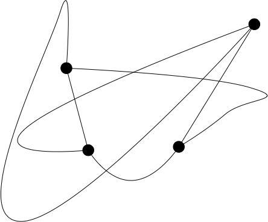
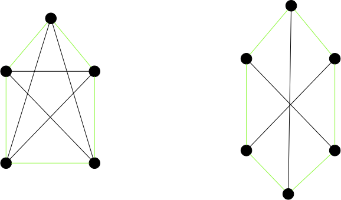
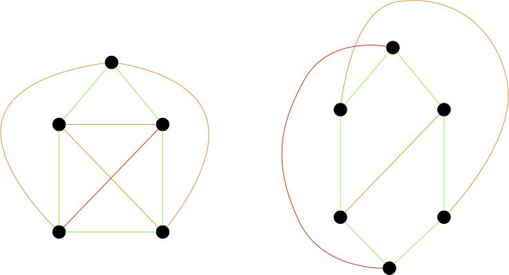
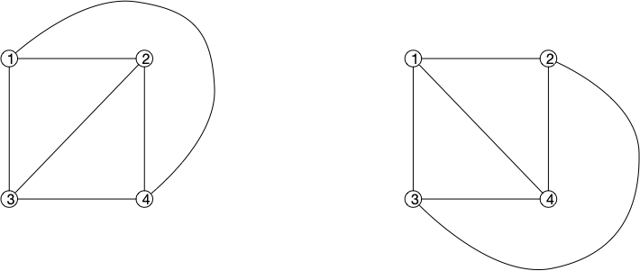

Un graphe est une structure abstraite. Lorsque l'on veut la représenter graphiquement, il faut la dessiner. Cette opération instinctive peut s'écrire formellement ainsi :


Un **dessin** d'un graphe $G= (V, E)$ est un couple de fonctions :

- une injection $f: V \rightarrow \mathbb{R}^2$ associant les sommets à des points du plan (les sommets sont distincts),
- une fonction $g: E \rightarrow \mathbb{C}$ associant les arêtes à des **_courbes_** $\gamma_{xy}$ allant d'un sommet à l'autre ($\gamma_{x, y}(0) = f(x)$ et $\gamma_{x, y}(1) = f(y)$)
- pour toute courbe $\gamma_{xy}$, $\gamma_{xy}(s) \notin f(V)$ pour tout $0<s <1$.


La dernière condition n'est pas restrictive puisqu'on peut toujours modifier d'un epsilon une courbe pour qu'elle évite un nombre finis de points.


Une **_courbe_** est une fonction $\gamma$ continue de $[0, 1]$ dans $\mathbb{R}^2$ telle que $\gamma(s) \neq \gamma(t)$ si $s\neq t$ et $\\{s, t\\} \neq \\{0, 1\\}$.


Par exemple le dessin ci-dessous des [graphes de Petersen](https://fr.wikipedia.org/wiki/Graphe_de_Petersen) et de $K_4$ :

{.interne}

Il existes de nombreuses façon de dessiner les graphe, par exemple ci-dessous un autre dessin des deux graphes précédents :

{.interne}

On a utilisé des courbes simples, mais rien d'empêche de faire dans le bizarre :

{.interne}

En revanche, la définition d'une courbe empêche les boucles, le dessin suivant n'est donc pas à proprement parler un dessin de graphe.

{.interne}

Dessiner un graphe est un problème peu simple car il dépend de ce que l'on cherche à faire :

- trouver les parties denses,
- les nœuds d'articulation,
- être _joli_
- ...

Avant d'aller plus loin restreignons nous un peu. On voit bien que si un graphe n'est pas connexe, on peut dessiner ses parties connexes indépendamment. Pour simplifier :


Par défaut, on ne considérera ici que des graphes connexes.


Nous allons nous intéresser ici à la représentation d'un graphe avec le moins d'**_intersections_**.


Une **_intersection_** d'un dessin dessin $(f, g)$ d'un graphe $G= (V, E)$ est un point d'intersection de deux courbes représentant des arêtes. C'est à dire un point $p$ tel que $p = g(xy)(s) = g(zt)(t)$


[Le dessin précédent](#intersections){.interne} possède 5 intersections.

Les dessins sans intersections sont dit planaires :


Un **_dessin planaire_** d'un graphe est un dessin sans intersections.


On a alors clairement que :


Soit $(f, g)$ un dessin planaire de $G$. Pour tout chemin $x_0\dots x_k$ de $G$, la courbe qui est la concaténation des courbes associée aux arêtes $x_ix_{i+1}$ est une courbe.


> TBD dessin

Cette définition apporte deux questions auquel on va répondre :

- tous les graphes admettent-il un dessin planaire ?
- est-ce facile de dessiner planairement un graphe ?

Mais avant de poursuivre, répondons rapidement aux deux questions précédentes : NON et OUI et attardons nous un peu sur les usages et l'importance de la planarité.

## Exemple

Il y a de nombreux usages des graphes planaires. Citons-en quelques uns.

### Circuits électroniques

> TBD minimiser les couches.

### Cartes de géographie

> TBD pays et frontières = graphe planaire

### 3D

> TBD triangulation de textures. Algorithmes de recherche, etc
> TBD : Il sont aussi extrêmement utilisés pour les mesh 3D. C'est une surface sans trous.

### Preuves

La classe des graphes planaires est assez grande tout en ayant de fortes contraintes. Ils possèdent donc de nombreuses propriétés et beaucoup de problèmes NP-complets en général deviennent polynomiaux pour eux.

## Propriétés générales

On va ici supposer que l'on a un dessin planaire d'un graphe $G$.

### Courbe de Jordan

Un outil géométrique important pour étudier les graphes planaires est [la courbe de Jordan](https://www.bibmath.net/dico/index.php?action=affiche&quoi=./c/courbejordan.html) et son [célèbre théorème associé](https://fr.wikipedia.org/wiki/Th%C3%A9or%C3%A8me_de_Jordan) :


Une **_courbe de Jordan_** est une courbe $\gamma$ telle que $\gamma(0) = \gamma(1)$.


Ce qui appliqué aux dessins planaire donne :


Soit $(f, g)$ un dessin planaire de $G$. Pour tout cycle $x_0\dots x_k$ de $G$, la courbe qui est la concaténation des courbes associée aux arêtes $x_ix_{i+1}$ est une courbe de Jordan.


Le célèbre théorème associée aux courbes de Jordan est :


Pour toute courbe de Jordan $\gamma$, il existe $\mathcal{P}_1$ et $\mathcal{P}_2$ deux sous-ensembles de $\mathbb{R}^2 \backslash \gamma([0, 1])$ tels que :

- $\mathcal{P}_1 \cup \mathcal{P}_2 = mathbb{R}^2 \backslash \gamma([0, 1])$
- quelle que soit la courbe $\gamma'$ telle que $\gamma'(0) \in \mathcal{P}_1$ et $\gamma'(1) \in \mathcal{P}_2$ alors $\gamma'([0, 1]) \cap \gamma([0, 1]) \neq \varnothing$


Par exemple :

{.interne}

Ce que dit le théorème est tout simple : 


Toute courbe fermée sépare l'espace en deux : l'intérieur et l'extérieur de la courbe.


Mais à démontrer c'est une autre paire de manche car une courbe n'est que continue. Elle peut donc faire plein de bêtises... On verra plus tard que pour les graphes, on peut utiliser une version affaiblie de ce théorème que l'on démontrera.

Appliqué aux graphes le corollaire donne :


Soit $(f, g)$ un dessin planaire de $G$. Soient :

- $x_0\dots x_k$ est un cycle de $G$ associé à la courbe de Jordan $\mathcal{C}$
- $x_0 u_1 \dots u_px_i$ un chemin dont aucun $u_m$ n'est dans $\\{x_0, \dots, x_k\\}$
- $x_jv_1 \dots v_qx_l$ un chemin tel que $0< j < i$, $i< l < k$ dont aucun $v_m$ n'est dans $\\{x_0, \dots, x_k\\}$

Alors une courbe associée à un chemin est entièrement à l'intérieur de $\mathcal{C}$ et l'autre entièrement à l'extérieur


Si les deux courbes étaient à l'intérieur ou à l'extérieur, on serait dans un des deux cas ci-dessous :

Ce qui implique au moins une intersection.


Ceci nous suffit pour montrer que ni $K_5$ (à gauche dans la figure ci-dessous) ni $K_{3, 3}$ (à droite dans la figure ci-dessous) ne peuvent être planaires ! En effet tout deux admettent des circuit hamiltoniens (en vert) :

Et en analysant les autres arêtes il n'y a pas assez de place à l'intérieur et à l'extérieur pour les caser. Ci dessous un des cas possibles, les autres se résolvent de la même manière :

Ceci nous donne une réponse à notre première question : NON tous les graphes n'admettent pas de dessin planaire. Ce qui nous permet de définir les **_graphes planaires_** :


Un graphe est **_planaire_** s'il admet un dessin planaire.


Tous les dessins d'un graphe ne sont bien sur pas planaires, comme le montre les 2 dessins de $K_4$.


Ceci nous donne aussi une technique de preuve pour savoir si un graphe hamiltonien est planaire ou pas :

1. le circuit hamiltonien est une courbe de Jordan
2. les autres arêtes sont soient à l'intérieur soit à l'extérieur du circuit.

## Comptage des faces


Un ensemble $A \subseteq \mathcal{R}^2$ est connexe si pour tous $x, y \in A$ il existe une courbe $\gamma$ telle que :

- $\gamma(0) = x$, $\gamma(1) = y$
- $\gamma([0, 1]) \subseteq A$


Les **_faces_** d'un dessin planaire $(f, g)$ d'un graphe connexe $G=(V, E)$ sont les régions connexes de $\mathcal{R}^2 \backslash (\cup_{xy \in E}g(xy)([0, 1]))$.


Les faces sont bien ce que l'on pense qu'elles sont, si on n'oublie pas la face extérieur (infinie). Le graphe suivant à donc 3 faces :


Soit $G = (V, E)$ un graphe et $(f, g)$ un de ses dessins planaires. Si $F$ est son nombre de faces, $n$ son nombre de sommets et $m$ son nombre d'arêtes, on a l'égalité :

$$
F = m - n + 2
$$



> TBD cours papier


La formule d'Euler montre que le nombre de faces ne dépend pas de son dessin ! On peut donc parler du nombre de faces d'un graphe planaire indépendamment de son dessin planaire. L'exemple ci-après montre deux dessins planaires différents de $K_4$, les faces sont différentes, mais leur nombre (3) est le même :

> TBD preuve
>
> 
> euler sur le nombre de faces

