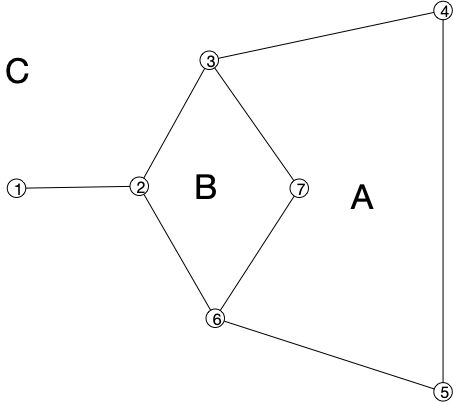
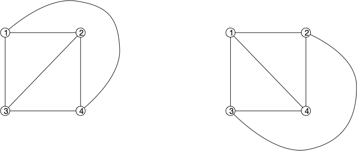

## Comptage des faces


Un ensemble $A \subseteq \mathcal{R}^2$ est connexe si pour tous $x, y \in A$ il existe une courbe $\gamma$ telle que :

- $\gamma(0) = x$, $\gamma(1) = y$
- $\gamma([0, 1]) \subseteq A$


Les **_faces_** d'un dessin planaire $(f, g)$ d'un graphe connexe $G=(V, E)$ sont les régions connexes de $\mathcal{R}^2 \backslash (\cup_{xy \in E}g(xy)([0, 1]))$.


Les faces sont bien ce que l'on pense qu'elles sont, si on n'oublie pas la face extérieur (infinie). Le graphe suivant à donc 3 faces :


Soit $G = (V, E)$ un graphe et $(f, g)$ un de ses dessins planaires. Si $F$ est son nombre de faces, $n$ son nombre de sommets et $m$ son nombre d'arêtes, on a l'égalité :

$$
F = m - n + 2
$$



> TBD cours papier


La formule d'Euler montre que le nombre de faces ne dépend pas de son dessin ! On peut donc parler du nombre de faces d'un graphe planaire indépendamment de son dessin planaire. L'exemple ci-après montre deux dessins planaires différents de $K_4$, les faces sont différentes, mais leur nombre (3) est le même :

## Degrés des graphes planaires

La formule d'Euler permet de borner le nombres d'arêtes d'un graphe planaire

> m ≤3n-6 <https://facultyweb.kennesaw.edu/mlavrov/courses/graph-theory/lecture21.pdf>

Et de prouver l'existence d'un sommet de petit degré

> sommet de degré ≤ 5

### Triangulation

Le no,bre maximum d'arêtes pour un graphe planaire est m = 3n-6 dans ce cas la, toutes les faces sont des triangles.

Donc trianguler une représentation planaire triangule toutes les autres, même si les faces sont différentes !

> TBD comment trianguler : <https://fr.wikipedia.org/wiki/Triangulation_d%27un_polygone>

### Nombre minimum de croisements de graphes non planaires

Enfin, une dernière propriété sur les graphes nom planaires.

> TBD borne évidente $\text{cr}(G)\geq 3n-6$ on doit supprimer les arêtes surnuméraires pour arriver à la borne et on supprime itérativement une arête qui possède un croisement (il en existe forcément une).

$$
\text{cr}(G) \geq \frac{1}{64}\frac{m^3}{n^2}
$$

> TBD exemple.

On utilise la méthode probabiliste !

> 2.2 crossing lemma : <https://www-sop.inria.fr/members/Frederic.Havet/Cours/proba-notes.pdf> à mettre après Euler <https://en.wikipedia.org/wiki/Crossing_number_inequality#Statement_and_history>
>

## Algorithmes

### Reconnaissance

> Par blocks (2-connexe maximals).
> puis reconnaissance de blocs

### Dessin

> TBD dessin avec 2-connexe <https://perso.ens-lyon.fr/eric.thierry/Graphes2010/lucie-martinet.pdf>

> TBD triangulation d'une représentation fait triangulation de toutes les représentations. Si triangulé admet le nombre maximum d'arêtes m = 3n-6 <https://facultyweb.kennesaw.edu/mlavrov/courses/graph-theory/lecture21.pdf> et donc vrai partout.

> TBD dessin sans courbure dans un triangle:
>   - exemple <https://ics.uci.edu/~eppstein/gina/schnyder/> ou <https://ics.uci.edu/~eppstein/163/lecture10c.pdf>
>   - papier <https://acm.math.spbu.ru/~sk1/courses/1617f_au3/papers/schnyder-grid-embedding.pdf>

## Coloration de graphes planaires

> TBD pareil que colorier les faces.
 
> TBD 3 colorable planaire np-complet : <https://www.cs.cmu.edu/afs/cs/academic/class/15451-s04/www/Lectures/chapter23.pdf>

- coloriable :

---

Nom de l'algorithme

> algo
> > autre algo $x_1 \leftarrow 3$
> fin

---

### Théorème des 4 couleurs

> TBD 6 par notre algo de coloration
> TBD 5 couleur : démonstration de Kempe.
>
> Elle ne fonctionne pas pour 4 couleurs. Pourquoi ?
> TBD Une démo du théorème des 4 couleurs par Kempe : <https://www.youtube.com/watch?v=adZZv4eEPs8>
> TBD théorème des 4 couleurs :
>
> - <https://www.lix.polytechnique.fr/~werner/PI-4C/sujet4C.html>
> - 4 couleurs : <https://inria.hal.science/hal-04034866/document>

### Algorithmes de coloration

> - 6 coloration avec l'algo de coloration
> - 5 coloration linéaire <https://www.enseignement.polytechnique.fr/profs/informatique/Francois.Morain/INF431/X06/5col.pdf>
> - 4 coloration d'un graphe planaire 3 colorable (Kawarabayashi et Ozeki 2009) <https://tgt.ynu.ac.jp/ozeki/2009KO2.pdf>. Soit il sort une 4 coloration, soit il dit que le graphe n'est pas 3 colorable. Pourquoi n'est-ce pas en contradiction avec le fait que le problème est NP-complet ?

### Variantes

> TBD pays non connexes
> TBD colonies lunaires

## Colorabilité et partage de secrets

> TBD un sujet qui lie tout ce qu'on a fait jusqu'à maintenant.

> <https://fr.wikipedia.org/wiki/Preuve_%C3%A0_divulgation_nulle_de_connaissance>
>


- [Avi Wigderson parle des zero knowledge proof](https://www.youtube.com/watch?v=5ovdoxnfFVc)
- [le papier](https://www.wisdom.weizmann.ac.il/~oded/X/gmw1j.pdf)



> [Curry-Howard correspondance](https://fr.wikipedia.org/wiki/Correspondance_de_Curry-Howard)

## Odds and ends

Nombreux problèmes NP-complets sont facile à les graphes planaires.

### Propriétés

- 3 coloriable et problème de la galerie d'art : <https://fr.wikipedia.org/wiki/Probl%C3%A8me_de_la_galerie_d%27art>

- Lemme de Sperner <https://www.youtube.com/watch?v=cpIexccvYjI&list=PLdUzuimxVcC0QCFYP0Af3TNldswjL8_ep&index=18>, on peut le démontrer avec la planarité : <https://www.ams.jhu.edu/~abasu9/AMS_550-472-672/sperner.pdf>. Attention, ce n'est **pas** de la coloration de graphes (pas de contrainte sur les voisins).

### Facile pour les graphes planaires

<!-- > TBD Theorem (Tutte, 1956). A 4-connected planar graph has a Hamiltonian cycle. -->
> TBD isomorphisme de graphe planaire

## Références


- <https://www.youtube.com/watch?v=wnYtITkWAYA&list=PLGxuz-nmYlQPgIHbqWtgD-F7NnJuqs4fH>


<!-- 
- <http://monge.univ-mlv.fr/~goaoc/lec1.pdf>
- <https://personalpages.manchester.ac.uk/staff/mark.muldoon/Teaching/DiscreteMaths/LectureNotes/PlanarGraphs.pdf> -->
