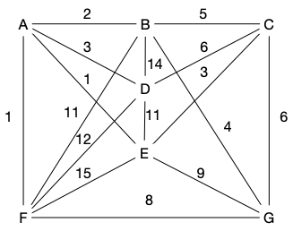

Les arbres couvrant se retrouvent parfois dans des endroits inattendus et permettent de résoudre simplement des  problèmes plus complexes.

Dans un réseau de communication, on appelle **_débit_** la quantité d'information que le réseau garantit de pouvoir faire passer entre deux sommets. Dans cet exercice, le réseau est modélisé par un graphe $G = (X, E)$ connexe. Chaque arête est munie d'une bande passante (qui ici sera appelée poids), $v: E\to \mathbb{R}^+$, qui limite la quantité d'information qu'elle peut véhiculer. Le but de l'exercice est de mettre au point des algorithmes permettant de calculer le débit. Le graphe suivant va servir d'exemple. :



Montrer que si $\mathcal{C}_{xy}$ est l'ensemble des chemins entre $x$ et $y$ alors le débit entre $x$ et $y$ s'écrit :

$$
D(x, y) = \max(\{ \min(\{v(x_ix_{i+1}) \vert 0 \leq i < k\}) \vert x_0 \dots x_k \in  \mathcal{C}_{xy} \})
$$




> TBD





En déduire, à l'aide d'arguments simples, que la chaîne de débit maximum entre $A$ et $C$ pour le graphe exemple a un débit
égal à trois.




> TBD



Passons au cas général :


Soit $T$ un arbre couvrant de poids maximum d'un graphe connexe valué $(G, f)$. On appelle $T_1$ et $T_2$ les deux composantes connexes que
l'on obtient, à partir de $T$, en enlevant l'arête de poids minimum
sur la chaîne de $T$ entre $x$ et $y$. Prouver que la valuation minimale de la chaîne de $T$
joignant $x$ et $y$ vaut $D(x, y)$ pour le réseau $G$.




> TBD





Quelle méthode peut-on appliquer pour déterminer, dans
un graphe quelconque $G$, une chaîne de débit maximum entre deux
sommets quelconques de $G$ ?




> TBD arbre  unique chemin entre deux sommets
> TBD



Et retour à l'exemple pour conclure :



	Appliquer cette méthode pour déterminer une chaîne de
	débit maximum entre $B$ et $E$ dans le réseau exemple.




> TBD


