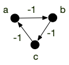
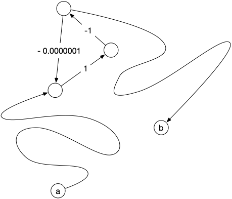
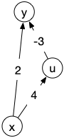

Il peut en effet exister des [circuits](../../chemins-cycles-connexite#définition-circuit){.interne} de poids négatifs :


Soit $(G, f)$ un graphe orienté valué. Un **circuit absorbant** est un circuit $c$ de poids strictement négatif.


Même s'il existe toujours des chemins de poids minimum (on ne repasse pas deux fois par le même arc, il y en a donc un nombre fini), ils ne sont pas les plus rapides ! En effet il suffit de repasser une fois par le circuit absorbant pour aller encore plus vite... Par exemple dans le graphe orienté ci-dessous le poids du circuit $abca$ est de -3 :

Si je veux aller de $a$ à $c$, le chemin de poids minimum est $abc$ et vaut $-2$. Cependant :

- le pseudo-chemin de $a$ à $c$ : $abcabc$ est meilleur puisqu'il vaut $-2 - 3 = -5$
- mais on peut encore faire mieux en passant 2 fois par le circuit absorbant et obtenir le pseudo-chemin de $a$ à $c$ : $abcabcabc$ qui vaut $-5 - 3 = -8$
- et ainsi de suite...

Il **n'existe pas de plus court pseudo-chemin entre $a$ et $c$** car en ajoutant autant de fois que nécessaire le circuit absorbant on peut rendre le poids du pseudo-chemin aussi petit que l'on veut.


Même s'il existe un chemin de poids minimum dans un graphe valué quelconque, s'il existe des circuits absorbants alors il n'est potentiellement pas le plus court.


On peut déjà donner la proposition suivante, qui donne une condition nécessaire pour qu'il existe un pseudo-chemin de poids minimum entre deux sommets, et donc que le chemin de poids minimum soit bien le plus court :


Soit $(G, f)$ un graphe orienté valué ; $a$ et $b$ deux sommets de $G$.

S'**il existe** un pseudo-chemin $c=v_0\dots v_{k-1}$ entre $a$ et $b$ **tel que** : il existe $i < j$ tel que $v_i = v_j$ et $f(v_i\dots v_j) < 0$ (c'est un circuit absorbant),
**Alors il n'existe pas** de pseudo-chemin de poids minimum entre $a$ et $b$ et le chemin de poids minimum n'est pas le plus court.



la portion $v_i \dots v_j$ de $c$ est une boucle. On peut donc créer un chemin $c_l$ où l'on répète cette boucle $l$ fois :

\[
c_l = v_0 \dots v_j \underbracket{\underbracket{v_{i+1} \dots v_j} \dots \underbracket{v_{i+1} \dots v_j}}_{\mbox{répété $l$ fois}}v_{j+1} \dots v_{k-1}
\]

Le poids de $c_l$ est : $c - l \cdot f(v_i\dots v_j) < c$. Comme $f(v_i\dots v_j)$ est une constante, on en conclut que :

\[
\lim_{l \rightarrow +\infty}f(c_l) = -\infty
\]



La proposition précédente nous indique qu'il suffit d'atteindre un circuit absorbant depuis $a$ et pouvoir en repartir pour atteindre $b$ pour qu'il n'existe pas de pseudo-chemin de poids minimum. Le circuit absorbant n'a pas besoin d'être _à côté_ ni de valuation très négative pour poser soucis, par exemple :

C'est même une équivalence :


Soit $(G, f)$ un graphe orienté valué **ne contenant pas** de circuit absorbant ; $a$ et $b$ deux sommets $G$ tels qu'il existe un chemin entre eux.

Il existe un **chemin élémentaire** $c^\star$ entre $a$ et $b$ tel que pour tout pseudo-chemin $c$ entre $a$ et $b$ :

- la longueur de $c^\star$ est plus petite ou égale à la longueur de $c$
- le poids de $c^\star$ est plus petit ou égal au poids de $c$



Soit $c = v_0\dots v_{k-1}$ un chemin entre $a$ et $b$. S'il existe $i < j$ tel que $v_i = v_j$ alors : $f(v_i \dots v_j) \geq 0$ puisqu'il n'existe pas de circuit absorbant par hypothèse et donc le chemin $c' = v_0 \dots v_i v_{j+1} \dots v_{k-1}$ est de poids inférieur. Un pseudo-chemin avec boucle est donc toujours de poids supérieur à un pseudo-chemin sans boucle (c'est à dire un chemin élémentaire).

Comme il existe un chemin, donc un chemin élémentaire entre $a$ et $b$, l'ensemble des chemins élémentaires $\mathcal{C}$ entre $a$ et $b$ est non vide. Comme il n'y en a qu'un nombre fini, on peut prendre $c^\star \in \mathcal{C}$ tel que $f(c^\star) = \min \\{ f(c) \mid c \in \mathcal{C}\\}$. D'après ce qui précède $c^\star$ est aussi de poids minimum parmi tous les pseudo-chemins.


Pour un graphe orienté sans circuits absorbant, les notions de pseudo-chemins de poids minimum et de chemins de poids minimum coïncident donc ! On peut donc donner le théorème d'existence suivant :


Soit $(G, f)$ un graphe orienté valué ; $a$ et $b$ deux sommets tel qu'il existe un chemin entre $a$ et $b$ dans $G$.

**Il existe** un pseudo-chemin de poids minimum entre $a$ et $b$ si et seulement s'**il n'existe pas** de circuit absorbant $c=v_i\dots v_{j}$ (avec $v_i=v_j$) tel que :

- il existe un chemin entre $a$ et un $v_i$
- il existe un chemin entre un $v_j$ et $b$

De plus, s'il existe un pseudo-chemin $p$ entre $a$ et $b$, on peut en extraire un chemin élémentaire $p^\star$ entre $a$ et $b$ tel que $f(p^\star) \leq f(p)$.



Clair car tout circuit dans un pseudo chemin sera de poids positif ou nulle. On peut donc le supprimer du pseudo-chemin sans augmenter son poids.


Résoudre le problème du chemin de poids minimum entre $a$ et $b$ dans un graphe orienté à valuation quelconque il y a donc 2 problèmes à résoudre :

1. existe-t-il un circuit absorbant _entre_ $a$ et $b$ ?
2. si non, trouver un chemin de poids minimum entre $a$ et $b$

Finissons cette partie par un exercice qui montre que les cycles absorbant peuvent être utiles ! En particulier pour devenir riche :


Soit $D$ un ensemble de devises et $f: D \times D \rightarrow \mathbb{R}^+$ la fonction qui à chaque couple de devises $(u, v)$ associe le taux de change pour convertir la devise $u$ en $v$ : 1 unité de $u$ vaut $f(u, v)$ unités de $v$.

Montrer que :

1. trouver une suite de devises $u_0\dots u_{k-1}$ tel que : $u_0 = u_{k-1}$ et $\Pi_{0 \leq i < k-1}f(u_i, u_{i+1}) > 1$ permet de devenir très riche.
2. on peut ramener ce problème à la recherche d'un circuit absorbant dans un graphe.
   
   

S'il existe une suite telle que demandée alors pour 1 unité de devise $u_0$, en faisant tous les taux de change on obtient au final strictement plus que 1 unité : on génère de l'argent par conversion successive.

$\Pi_{0 \leq i < k-1}f(u_i, u_{i+1}) > 1$ est équivalent à $\sum_{0 \leq i < k-1}-\ln(f(u_i, u_{i+1})) < 0$. Il suffit de considérer le graphe orienté $G=(D, E)$ où $E$ est l'ensemble de couples de devises possibles valué par $-\ln(f(u, v))$.


La recherche de chemins de poids minimum dans le cas général est plus complexe que le cas simple où la valuation est positive. On ne peut en particulier plus utiliser l'algorithme de Dijkstra car il ne garantit pas de trouver un chemin de longueur minimum.

L'exemple ci-après le montre :

Dijkstra trouvera $xy$ comme chemin de poids minimum entre $x$ et $y$ alors que c'est $xuy$.

## Algorithme de Bellman-Ford

Cas heureux, on peut résoudre les deux problèmes en même temps grâce à :


l'algorithme de [Bellman-Ford](https://fr.wikipedia.org/wiki/Algorithme_de_Bellman-Ford) qui :

- cherche un chemin de poids minimum entre deux sommets dans un graphe orienté valué
- donne un circuit absorbant entre $a$ et $b$ s'il y en a un

En $\mathcal{O}(\vert V \vert \cdot \vert E \vert)$ opérations.


La complexité de l'algorithme de Bellman-Ford est plus importante que celle de Dijkstra, évitez donc de l'utiliser si la valuation du graphe est positive.


[Algorithme de Bellman-Ford](./bellman-ford){.interne}


## Algorithme de Roy-Floyd-Warshall

Dans le cas d'un graphe orienté valué, si l'on cherche tous les chemins de poids minimum entre chaque paire de sommets, on peut utiliser :


L'algorithme de [Roy-Floyd-Warshall](https://fr.wikipedia.org/wiki/Algorithme_de_Floyd-Warshall) qui pour un graphe orienté valué :

- donne tous les chemins de poids minimum entre chaque paire de sommets
- donne un circuit absorbant s'il en existe

La complexité de cet algorithme est en $\mathcal{O}(\vert V \vert ^3)$ opérations.


La complexité de l'algorithme de Roy-Floyd-Warshall est plus grande que celle de Bellman-Ford, donc si vous n'avez besoin que de chercher les plus cours chemins ou les cycles absorbants entre 2 sommets il vaut mieux utiliser Bellman-Ford.

> TBD algo

## Conclusion

Si vous devez résoudre un problème de recherche de chemin de poids minimum dans une graphe orienté $G$ valué par une fonction $f$ :

- si les poids sont tous positifs, on utilise l’algorithme de Dijkstra que l'on peut implémenter de telle sorte que sa complexité soit $\mathcal{O}(\vert E \vert + \vert V \vert\log_2(\vert V \vert))$
- si l'on cherche un chemin précis, on utilise l'algorithme de Bellman-Ford dont la complexité est $\mathcal{O}(\vert E \vert \cdot \vert V \vert)$
- si l'on cherche tous les chemins, on utilise l'algorithme de Roy-Floyd-Warshall dont la complexité est $\mathcal{O}(\vert V \vert^3)$

Notez que les complexités sont de plus en plus importantes.
