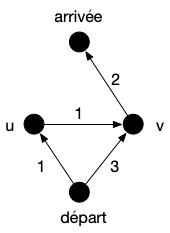

> TBD : <https://www.youtube.com/watch?v=A60q6dcoCjw>

Un algorithme beaucoup utilisé lorsque le graphe peut changer ou s'il est très grand, voir inconnu (un terrain de jeu) est [l'algorithme $A^\star$](https://fr.wikipedia.org/wiki/Algorithme_A*), qui est une variante de l'algorithme de Dijkstra qui accélère la procédure de choix en sacrifiant l'optimalité : on obtient alors _rapidement_ une solution _acceptable_ plutôt qu'obtenir _lentement_ une solution optimale.

Son principe est identique à celui de Dijkstra, mais plutôt que de prendre à chaque fois l'élément de coût minimum on choisit un élément dont le coût + une distance heuristique $h$ sur sa distance à l'arrivée est minimum. Son pseudo-code est donc identique à celui de Dijkstra à part l'ajout d'un élément à la structure (lignes 23 à 27) qui devient :

```python/23
        # ajout d'un élément à la structure
        soit u un élément de V \ V_dijkstra tel que coût[u] + h(u) soit minimum

        pivot = u
        ajoute pivot à V_dijkstra

```

Cette modification est faite pour considérer moins de sommets que Dijkstra (on ne va pas choisir de sommets inutiles) en estimant la coût qu'il reste à parcourir pour aller de $x$ à l'arrivée.

Notez que si l'heuristique vaut $0$ pour tout sommet, $A^\star$ est exactement l'algorithme de Dijkstra et il trouvera toujours un chemin de poids minimum. On peut montrer que $A^\star$ trouvera aussi des chemins de poids minimum pour des heuristiques particulières :



L'heuristique $h$ est dite **_consistante_** si $h(x) \leq f(c) + h(y)$ pour tout sommet $x$, tout sommet $y$ et $c$ un chemin de poids minimum entre $x$ et $y$

Si $h$ est consistante alors $A^\star$ trouvera un chemin de poids minimum.



> TBD : mettre un dessin explicatif. et peut-être expliquer mieux.

Procédons par l'absurde. Soit la première étape où l'on choisit de rentrer dans $V'$ un sommet $u$ tel que $\mbox{coût}[u]$ est strictement plus grand que le poids d'un chemin de poids minimum entre $\mbox{départ}$ et $u$. Il existe alors un chemin $c$ allant $\mbox{départ}$ à $u$ de poids plus petit. Soit $u$' le premier élément de ce chemin qui n'est pas dans $V'$. Alors :

1. $u'$ est le premier élément à sortir de $V'$. Si $p'$ est son prédécesseur dans $c$ on a $\mbox{coût}[p'] + f(p', u') \geq \mbox{coût}[u']$ par construction de l'algorithme.
2. $c$ est de poids minimum, c'est donc aussi un chemin de poids minimum pour aller de $\mbox{départ}$ à $p'$
3. le coût de tous les éléments $x$ de $V'$ est égal au poids minimum d'un chemin allant de $\mbox{départ}$ à $x$ : $\mbox{coût}[p']$ vaut le poids de $c$ de $\mbox{départ}$ à $p'$
4. $\mbox{coût}[p'] + f(p', u')$ est égal au coût d'un chemin de poids minimum entre $\mbox{départ}$ à $u'$
5. $\mbox{coût}[u']$ est égal au coût d'un chemin de poids minimum entre $\mbox{départ}$ à $u'$

De plus, comme $u'$ n'a pas été choisit à cette étape on a :

$$
\mbox{coût}[u'] + h(u') \geq \mbox{coût}[u] + h(u)
$$

Comme notre hypothèse est que $f(c) < \mbox{coût}[c]$ on a :

$$
\mbox{coût}[u'] + h(u') \geq \mbox{coût}[u] + h(u) > f(c) + h(u)
$$

En notant $c'$ la fin du chemin $c$ qui commence par $u'$, on a $f(c) = \mbox{coût}[u'] + f(c')$ et donc :

$$
\mbox{coût}[u'] + h(u') > f(c) + h(u) = \mbox{coût}[u'] + f(c') + h(u)
$$

On en déduit que :

$$
h(u')  > f(c') + h(u)
$$

Ce qui est impossible car $h$ est consistante.



La proposition suivante montre que l'on peut donner une définition locale de consistance, qui donne un moyen simple de vérifier ou de construire une heuristique consistante :

Une heuristique $h$ est **_consistante_** si et seulement si pour tout arc $uv$ on a :

$$
h(u) \leq f(uv) + h(v)
$$




Comme $f(c) \leq f(uv)$ avec $c$ est un chemin de poids minimum entre $u$ et $v$ un sens de qu'équivalence est prouvé.

Réciproquement, soit $c = x_0\dots x_{k-1}$ un chemin tel que $h(x_i) \leq f(x_{i}x_{i+1}) + h(x_{i+1})$. On en déduit que $h(x_0) \leq \sum_{i} f(x_{i}x_{i+1}) + h(x_{k-1})$ ce qui conclut la preuve.



Un exemple d'utilisation classique est le parcours d'un robot, d'une voiture, d'un personnage de jeu vidéo, etc dans un espace à 2 dimensions.


Proposez une implémentation de l'algorithme $A^*$ qui trouvera un chemin de poids minimum pour le parcours dans une salle d'un petit robot.



- On peut prendre comme graphe la grille 2D carré de pas 1m par exemple
- s'il y a des murs on ne met pas d'arêtes
- l'heuristique sera la distance entre la position et l'arrivée. Qui est consistante.



Avant de conclure cette partie, donnons une autre condition pour qu'$A^\star$ donne un chemin de poids minimum.



Une heuristique $h$ est dite **_admissible_** si $h(x)$ est plus petite que le poids d'un chemin minimum entre $x$ et $\mbox{arrivée}$ pour tout sommet $x$.

Si l’heuristique de $A^\star$ est admissible **et** qu'à chaque étape de l'algorithme il existe un chemin de poids minimum entre $\mbox{départ}$ et $\mbox{arrivé}$ tel que si deux voisins sont dabs $V'$ alors l'arc est dans l'arborescence **alors** $A^\star$ trouvera un chemin de poids minimum.



Voir <https://en.wikipedia.org/wiki/Admissible_heuristic> et en particulier la [preuve de l'optimalité](https://en.wikipedia.org/wiki/Admissible_heuristic#Optimality_proof).



Notez que admissible est une condition plus faible que la consistance : Elle ne garantie pas à elle seule l'optimalité de l'algorithme. Considérez le graphe suivant qui contient un unique chemin de poids minimum entre $\mbox{départ}$ et $\mbox{arrivé}$ :



L'heuristique admissible mais non consistante suivante : $h(\mbox{départ}) = h(\mbox{arrivée}) = h(v) = 0$ et $h(u) = 3$, $A^\star$ ne trouvera pas la bonne solution (le chemin passant pas $u$ est détruit lorsque l'on met $v$ dans l'arborescence).


Il est possible de rendre l'algorithme $A^\star$ optimal en utilisant uniquement une heuristique admissible, mais au prix d'une complexité potentiellement exponentielle.



1. mettre à jour tous les voisins à chaque itération et pas uniquement ceux qui ne sont pas dans `V_dijkstra`{.language-}
2. si on met à jour un sommet dans `V_dijkstra`{.language-} il faut supprimer de `V_dijkstra`{.language-} tout son sous-arborescence
3. choisir le nouveau pivot se fait dans l'ensemble $\\{ v \mid uv \in E, u \in V', v \notin V' \\}$

Les 3 mécanismes ci-dessus assurent qu'il existe toujours un chemin de poids minimum accessible, mais $A^\star$ peut effectuer un nombre exponentiel d'opérations. Bref, le coût de l'optimalité est très cher, autant utiliser Dijkstra.


On préférera parfois utiliser des heuristique non consistantes voir non admissible (sans changer $A^\star$) si cela permet d'aller plus vite. Cette approche est particulièrement utilisées dans une grande variété de cas d'applications où il est plus important d'aller vite que d'être exact : comme dans les jeux vidéos par exemple où on utilise cet algorithme dans le [_pathfinding_](https://fr.wikipedia.org/wiki/Recherche_de_chemin) par exemple.


## Dijkstra et BFS

> TBD montrer que Dijkstra = BFS + file de priorité
> TBD attention différent de Prim dans ses valuations
