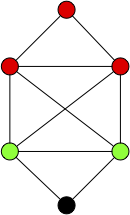
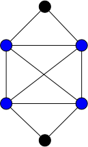
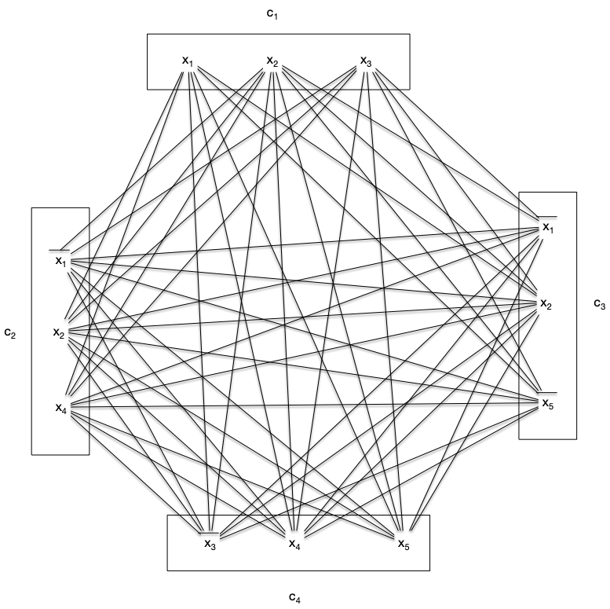
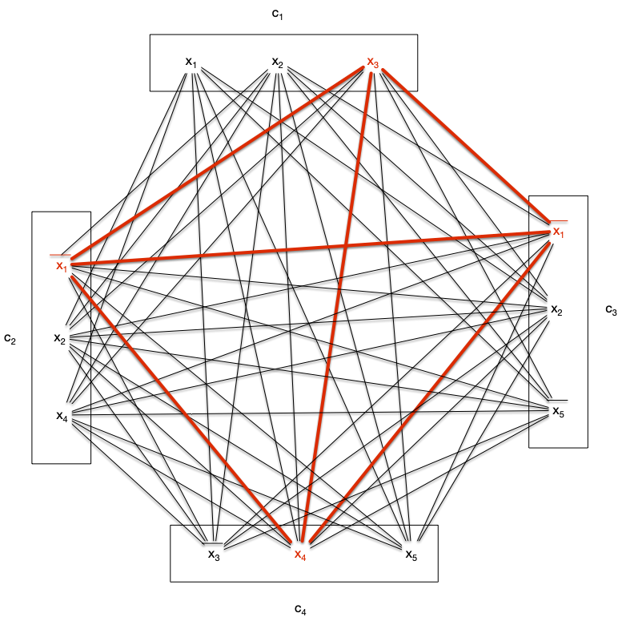

<span id="definition-clique"></span>

Une **_clique_** $C$ d'un graphe $G=(V, E)$ est un ensemble de sommets tel que quelque soient $x \neq y \in C \subseteq V$, $xy \in E$.


Un **_stable_** est l'opposé :

<span id="definition-stable"></span>


Une **_stable_** $S$ d'un graphe $G=(V, E)$ est un ensemble de sommets tel que quelque soient $x \neq y \in S$, $xy \notin E$.


Des deux définition précédentes, un sommet est à la fois une clique et un stable. Ils constituent les ensembles minimaux non vide. Réciproquement, on appelle **_clique maximale_** (_resp._ **_stable maximal_**) un ensemble maximal pour l'inclusion.

Dans le graphe suivant, les ensembles rouges et verts sont des cliques, mais seule l'ensemble rouge est maximal.



On appelle **_clique maximum_** (_resp._ **_stable maximum_**) une clique maximale (_resp._ **_stable maximal_**) maximum pour l'inclusion (il n'en existe pas de plus grande).

<span id="définition-notation-clique-stable-maximum"></span>


Soit $G$ un graphe. On note :

- $\omega(G)$ la taille de ses cliques maximum
- $\alpha(G)$ la taille de ses stables maximum



Notez que pour l'exemple précédent, l'ensemble de sommets rouges n'est pas une clique maximum.


Montrez que pour le graphe $G$ précédent, $\omega(G) = 4$.


Pour ce genre de preuves, il faut procéder en deux temps :

1. exhiber une clique de taille 4
2. montrer que tout ensemble de 5 sommets n'est pas une clique.

Le sous ensemble des sommets bleus suivant est une clique :



Si on prend 5 éléments, cela revient à supprimer 1 élément du graphe et aucuns de ceux ci n'est une clique.


Il est facile, itérativement à partir d'une clique possiblement réduite à un point, de trouver une clique maximale :

```pseudocode
algorithme clique_maximale(G: Graphe<sommet>, x:sommet) -> {sommet}

C := {sommet}
C <- {x}
tant qu'il existe un sommet y de G \ C tel que C U {y} est une clique:
    C <- C U {y}
rendre C
```

Le problème est qu'il y a de nombreux minima locaux, ce qui fait que trouver $\omega(G)$ ou $\alpha(G)$ pour un graphe donné est un problème difficile.


Montrez que pour le graphe $G$ précédent, l'algorithme peut, avec un même sommet de départ, trouver une clique maximale de taille 3 ou 4.



Il suffit de prendre un des deux sommets rouge à l'intersection de la clique de taille 4 et du triangle rouge.


Terminons par une petite propriété :


Pour tout graphe $G$ on a :

<div>
$$
\alpha(G) + \omega(G) \leq v(G)
$$
</div>


Une clique et un stable ne peuvent partager qu'au plus 1 sommet donc $n - (\alpha(G) - 1) \geq \omega(G)$.



Montrez qu'il existe des graphes $G$ pour lesquels il y a égalité : $\alpha(G) + \omega(G) = v(G) + 1$



Si $S$ est un stable à $p$ sommets et Si $K_q$ la clique à $q$ sommets alors l$e graphe : $G = (V(S) \cup V(K_q), E(S) \cup E(K_q))$ est tel que : $\omega(G) = q$ et $\alpha(G) = p + 1$.



## Problème de la clique/stable maximum

Trouver une clique maximum d'un graphe est un problème NP-complet. Considérons les deux problèmes suivant :

<span id="problème-clique"></span>



- **nom** : clique
- **Entrée** :
  - un graphe
  - un entier $K$
- **Question** : le graphe contient-il une clique de taille supérieure ou égale à $K$ ?



<span id="problème-stable"></span>



- **nom** : stable
- **Entrée** :
  - un graphe
  - un entier $K$
- **Question** : le graphe contient-il un stable de taille supérieure ou égale à $K$ ?



Les deux problèmes sont clairement dans NP puisque vérifier qu'un ensemble est une clique/stable se résout polynomialement (il suffit de compter le nombre d'arêtes) :

```pseudocode
algorithme compte(G: graphe<sommet>, A: {sommet}, clique: booléen) → entier:
  var m entier ← 0

  pour chaque x de A:
    pour chaque y de A:
        si x ≠ y:
            si xy est une arête de G:
                m ← m+1
  retourne m

algorithme vérification_clique(G: graphe<sommet>, A: {sommet}) → booléen:
  retourne |A| * (|A|-1) == 2 * compte(G, A)

algorithme vérification_stable(G: graphe<sommet>, A: {sommet}) → booléen:
  retourne compte(G, A) == 0

```

Commençons par un petit échauffement :


Montrez que en montrant que $\text{clique} \leq \text{stable}$ :



On utilise la réduction consistant à prendre en entrée de stable le graphe complémentaire de celui en entrée de clique. La construction de ce graphe est au pire de complexité $\mathcal{O}(n^2)$ avec $n$ le nombre de sommets du graphe (on peut être amené à ajouter de l'ordre de $\mathcal{O}(n^2)$ arêtes si le graphe initial est discret).

La solution du problème stable est aussi la solution de problème clique pour le graphe originel, il n'y a donc aucun ajustement à faire pour le retour.



L'exercice précédent nous permet de nous consacrer uniquement au problème clique, la NP-completude du problème stable en découlera immédiatement.
Il est de plus NP-complet :


Le problème clique est NP-complet.


On va le montrer par réduction depuis [le problème SAT](/cours/algorithmie/problème-SAT/#3-sat){.interne}.

Soit l'ensemble de clauses suivantes formant une entrée du problème SAT, sur l'ensemble de variables $\\{ x_1, \dots, x_n \\}$ :

<div>
$$
\mathcal{C} = \bigwedge_{1\leq i \leq m}( l_i^1\lor \dots \lor l_i^{k_i})
$$
</div>

Avec pour tous $1\leq i \leq m$ et $1\leq j \leq k_i$, $l_i^j \in \\{x_i \vert 1\leq i \leq n \\} \cup \\{\overline{x_i} \vert 1\leq i \leq n \\}$.

On associe (polynomialement) à cette instance un graphe $G=(V, E)$ tel que :

- $V = \\{ l_i^j \vert 1\leq i \leq m, 1\leq j \leq k_i \\}$
- $l_i^jl_k^l$ est une arête si :
  - $i \neq k$
  - $l_i^j \neq \overline{l_k^l}$

Et on cherche s'il existe une clique de taille supérieure ou égale à $m$.

S'il existe une solution au problème SAT alors il existe un littéral $l_i^{u_i}$ qui est vrai pour toute clause $1\leq i \leq m$. L'ensemble $\mathcal{C} = \\{ l_i^{u_i} \vert 1\leq i \leq m\\}$ est une clique de taille $K$ de $G$.

Réciproquement toute clique de $G$ ne peut contenir qu'au plus un littéral de chaque clause, donc une clique de taille $K$ contient un littéral par clause que l'on peut positionner à vrai.


Le problème stable est NP-complet.


En reprenant [l'exemple du problème 3-SAT](/cours/algorithmie/problème-SAT/#3-sat-exemple){.interne} on obtient le graphe associé $G=(V, E)$ :



Ce graphe possède de multiples cliques de taille 4, comme par exemple :



Ce qui fixe 1 littéral pour chaque clause :

- ${x_3}$ de la clause 1
- $\overline{x_1}$ des clauses 2 et 3
- ${x_4}$ de la clause clause 4

Qui fixe 3 variables. On aura toutes les clauses de vérifiées quelques soient les valeurs de $x_2$ et $x_5$ si :

- $x_3 = 1$,
- $x_1 = 0$,
- $x_4 = 1$

Dans la plupart des exemples réels, il y aura plus de clauses que de variables mais la clique max sera toujours compatible, la variable apparaissant toujours de façon identique pour chaque littéral de la clique : comme chez nous il y a 2 fois $\overline{x_1}$.

C'est le premier problème de graphe que l'on voit NP-complet, il va y en avoir tout un tas d'autres. Le fait que ce problème soit compliqué vient du fait que la taille de la clique à trouver dépend du no,bre de clauses. Si on a une instance de 3-SAT à $m$ clauses il faut trouver une clique de taille $m$ dans un graphe à $3m$ sommets. L'algorithme naïf cherchant une clique de taille $K$ dans un graphe de taille $n$ prenant $\mathcal{O}(n^K)$ opérations, si on l'utilisait ici il prendrait $\mathcal{O}((3m)^m) = \mathcal{O}(3^m \cdot m^m)$ opérations ce qui est clairement exponentiel.

## Exercice : problème de la couverture minimale

<span id="problème-graphe-couverture"></span>


Une **_couverture_** d'un graphe $G=(V, E)$ est un ensemble de sommets $C \subseteq V$ tel que toute arête de $G$ possède une extrémité dans $C$.




- **nom** : couverture
- **Entrée** :
  - un graphe
  - un entier $K$
- **Question** : le graphe contient-il une couverture de taille inférieure ou égale à $K$ ?




Montrez que toute couverture de $K_n$ contient $n-1$ sommet.


C'est vrai pour $n < 2$ et pour $n \geq 2$, s'il existait une couverture à strictement moins de $n-1$ éléments, il existerait $x$ et $y$, deux sommets différents qui n'y sont pas, ce qui n'est pas possible puisque $xy$ est une arête de $K_n$.


Montrez que le problème couverture est dans NP.


```pseudocode
algorithme vérification_couverture(G: graphe<sommet>, A: {sommet}, K: entier) → booléen:
  si |A| > K:
    rendre Faux
  
  pour chaque x, y de E(G):
    si x ∉ A ET y ∉ A:
        rendre Faux
  
  rendre Vrai
```


Si $C$ est une couverture d'un graphe $G$. Qu'est l'ensemble $V\backslash C$ ?


C'est un stable !


En déduire que le problème couverture est NP-complet


L'exercice précédent montre que chercher une couverture de taille inférieure ou égale à $K$ est équivalent à trouver un stable de taille supérieure ou égale à $v(G) - K$.


## Clique ou stable ?

On peut combiner les problèmes de la clique et du stable de taille au moins $K$ en un seul problème :



- **nom** : clique ou stable
- **Entrée** :
  - un graphe
  - un entier $K$
- **Question** : le graphe contient-il une clique ou un stable de taille supérieure ou égale à $K$ ?



Le problème est clairement dans NP puisqu'on peut vérifier une solution potentielle en utilisant nos algorithmes `vérification_clique(G: graphe<sommet>, A: {sommet})  → booléen`{.language-} et  `vérification_stable(G: graphe<sommet>, A: {sommet})  → booléen`{.language-} :

```pseudocode
algorithme vérification_clique_ou_stable(G: graphe<sommet>, A: {sommet})  → booléen:
    rendre vérification_clique(G, A) OU vérification_stable(G, A)
```
À vous pour la partie NP-Complet !


Montrez que le problème "clique ou stable" est NP-complet.


Vous pourrez réduire clique à ce problème


On construit le graphe $G' = (V', E')$ tel que :

- $V' = V(G) \cup \\{x_1, \dots, x_{v(G)} \\}$
- $E' = E(G) \cup \\{ x_iy \mid 1\leq i \leq v(G), y \in V(G) \in \in \\}$

De là trouver une clique de taille au moins $K$ dans $G$ est équivalent à trouver une clique ou un stable de taille au moins $v(G) + K$ dans $G'$.

Toutes ces transformations étant polynomiales on a bien que le problème clique est plus simple que le problème clique ou stable.


Cette combinaison de cliques et de stable a été étudiée par Ramsey au début du vingtième siècle et l'est toujours...

## <span id="ramsey"></span>Théorème de Ramsey


[Théorème de Ramsey](https://fr.wikipedia.org/wiki/Th%C3%A9or%C3%A8me_de_Ramsey)



Il existe plusieurs formulation de ce théorème et des problématiques qu'il traite. Nous allons ici le formuler avec des cliques et des stables :


Pour tout couple d'entiers $p, q\geq 1$ il existe un entier $R(p, q)$ tel que tout graphe à plus de $R(p, q)$ sommets contienne soit (non exclusif) une clique à $p$ sommets soit un stable à $q$ sommets. De plus, pour $p, q\geq 2$ on a l'inégalité :

<div>
$$
R(p, q) \leq R(p-1, q) + R(p, q-1)
$$
</div>


On prouve le résultat par récurrence sur $r = p + q \geq 2$.

Comme on a clairement que $R(1, 1) = 1$ et $R(2, 1) = R(1, 2) = 2$ on a que le résultat est vrai pour tous $p, q\geq 1$ tels que $p +q = r = 2$. On suppose le résultat vrai pour $r\geq 2$ et soit $p, q\geq 1$ tels que $r+1 = p + q$.

Comme $R(p-1, q)$ et $R(p, q-1)$ existent par hypothèse de récurrence, soit $G$ un graphe à $n = R(p-1, q) + R(p, q-1)$ sommets et $v$ un de ses sommets.

De deux choses l'une :

- soit $\delta(v)\geq R(p-1, q)$. On a alors 2 cas :
  - $G$ restreint aux voisins de $v$ contient un stable de taille $q$, donc $G$ également
  - $G$ restreint aux voisins de $v$ contient une clique $C$ de taille $p-1$ : $C \cup \\{v\\}$ est une clique de taille $p$ dans $G$,
- soit $\delta(v)\leq R(p-1, q) - 1$ et $n-1-\delta(v) \geq R(p-1, q) + R(p, q-1) - 1 -(R(p-1, q) - 1) \geq  R(p, q-1)$. De la même manière que précédemment soit :
  - il existe une clique de taille $p$ dans le graphe $G$ restreint aux non-voisins de $v$, donc dans $G$ également
  - il existe un stable $S$ de taille $q-1$ dans le graphe $G$ restreint aux non-voisins de $v$ : $S \cup \\{v\\}$ est un stable de taille $q$ dans $G$.



<div id="R_majoration"></div>


Pour tout couple d'entiers $p, q\geq 4$ on a :

<div>
$$
R(p, q) \leq \binom{p+q-2}{p-1}
$$
</div>


Une récurrence triviale en utilisant la formule du [triangle de Pascal](https://fr.wikipedia.org/wiki/Triangle_de_Pascal).



Ceci montre que si vous prenez $R(p, q)$ personnes au hasard dans une soirée, soit il existe un ensemble de $p$ d'invités se connaissant mutuellement ; soit il existe un ensemble de $q$ personnes qui sont de parfait étrangers l'un pour l'autre.

De façon plus profonde, ceci montre que le désordre total n'existe pas : lorsque le nombre de sommets devient grand il existera toujours des cliques ou des stables.


Montrez que pour tous $p, q\geq 1$, on a $R(p, q) = R(q, p)$


Soit $G$ un graphe à $R(p, q)$ sommets. Le graphe $\overline{G}$ à le même nombre de sommets que $G$ donc :

- il possède soit une clique de taille $p$ et $G$ possède un stable de taille $p$
- il possède soit un stable de taille $q$ et $G$ possède une clique de taille $q$

On en déduit que $R(p, q) \leq R(q, p)$ pour tous $p$ et $q$ ils sont donc égaux (car on a alors aussi $R(q, p) \leq R(p, q)$)


On prend souvent $p = q$ et on note $R(p) = R(p, p)$.


Montrez que $R(3) = 6$



Tout d'abord $R(3)> 5$ puisque le cycle $C_5$ ne contient que des cliques et des stables de taille 2.

Soit alors un graphe $G$ à plus de 6 sommets et soit $v$ un de ses sommets. Si $\delta(v) \geq 3$ alors :

- soit le graphe $G$ restreint à $N(v)$ n'a pas d'arête et c'est un stable de taille au moins 3,
- soit le graphe $G$ restreint à $N(v)$ a une arête dont ses extrémités plus $v$ forment une clique de taille 3.

Enfin, si $\delta(v) < 3$ un raisonnement identique sur le complémentaire de $G$ donne que :

- soit $\overline{G}$ possède un stable de taille 3 et donc $G$ une clique de taille 3,
- soit $\overline{G}$ possède une clique de taille 3 et donc $G$ un stable de taille 3.



Continuons sur notre lancée :


Montrez que $R(3, 4) > 8$


Vous pourrez utiliser [le graphe de Wagner](https://fr.wikipedia.org/wiki/Graphe_de_Wagner).


Le graphe de Wagner ne possède ni clique de taille 3 ni stable de taille 4.


En "_déduire_" que $R(3, 4) = 9$


L'exercice précédent montre $R(3, 4) \geq 9$. Notre minoration donne $R(3, 4) \leq R(2, 4) + R(3, 3) \leq 10$ mais on peut la raffiner pour notre cas. Soit $v$ un sommet d'un graphe à 9 sommets. Si $\delta(v) \geq R(2, 4)$ alors le même raisonnement que pour le théorème nous permet de conclure. On suppose alors que $\delta(v) < R(2, 4) = 4$. Mais si $\delta(v) = 3$, soit il n'y a pas d'arêtes dans le graphe restreint aux voisins de $v$ et il y a un stable de taille 3, soit il y a une arête et si on ajoute $v$ cela fait une clique de taille 3.

On peut alors supposer que $\delta(v) < 3$ et donc $9-\delta(v)> 6$ : le graphe restreint aux non-voisins de $G$ contient soit une clique de taille 3 soit un stable de taille 3 qui adjoint à $v$ fait un stable de taille 4.



Ce qui est troublant c'est que passé 4 ($R(4) = 18$ car $R(3, 4) = 9$ et [le graphe de Paley d'ordre 17](https://fr.wikipedia.org/wiki/Graphe_de_Paley) ne possède ni de clique ni se stable de taille 4) on n'a plus de valeurs exacte. On sait par exemple juste que 
$43 \leq R(5) \leq 48$. Et combien même vous prendriez un graphe de taille 50, on ne connaît pas d'algorithme efficace pour trouver une clique ou un stable de taille 5 : il faut tout essayer ce qui va prendre exponentiel lorsque la taille de la clique/stable à chercher augmente. On sait que ce cela existe mais c'est dur à trouver !



[chercher une paille dans une meule de fois peut être aussi  dur que d'y trouver l'aiguille](https://www.youtube.com/watch?v=4weMmFZSBtI)


Toutes les vidéos de cette chaîne Youtube sont très bonnes !


Terminons cette partie en exprimant un encadrement de $R(n)$. On commence par adapter [la borne précédente](./#R_majoration){.interne} pour trouver une majoration :



Pour tout $n\geq 1$, on a :

<div>
$$
R(n) \leq (1 + o(1))\frac{4^{n-1}}{\sqrt{\pi \cdot n}}
$$
</div>



On utilise [la formule de Stirling](https://fr.wikipedia.org/wiki/Formule_de_Stirling#%C3%89quivalent_du_coefficient_binomial_central) : $\binom{2p}{p} \sim \frac{4^{n}}{\sqrt{\pi \cdot n}}$.

Il existe alors une fonction négligeable en 1 lorsque $n$ tend vers l'infini, notée $f(n)$, telle que : $\binom{2p}{p} = (1 + f(n)) \frac{4^{n}}{\sqrt{\pi \cdot n}}$.
En utilisant [la borne précédente](./#R_majoration){.interne} appliquée à $R(n,n)$ on a : $R(n, n) \leq \binom{2(n-1)}{n-1} = (1 + f(n)) \frac{4^{n-1}}{\sqrt{\pi \cdot (n-1)}}$ et comme $\frac{1}{\sqrt{n}} \sim \frac{1}{\sqrt{n-1}}$ en $+\infty$ on en déduit bien l'inégalité demandée.


On doit la minoration à Erdős. Elle utilise, de façon magistrale, la méthode probabiliste (que nous n'avons pour l'instant qu'effleuré). 

Mais commençons par un échauffement pour se rappeler la méthode probabiliste :


Pour tout $n\geq 1$ et tout $K$ tel que $\binom{K}{n} < {2^{n(n-1)/2 -1}}$, on a :

<div>
$$
R(n) > K
$$
</div>



Vous pourrez calculer la probabilité qu'un graphe aléatoire à $n$ sommets (la probabilité qu'une arête $xy$ donnée existe soit $1/2$) soit une clique ou un stable, puis en déduire une majoration de la probabilité qu'un graphe quelconque à $N$ sommet contienne une clique ou un stable de taille $n$.


Prenons un graphe aléatoire à $n$ sommets dont la probabilité qu'une arête $xy$ donnée existe soit $1/2$. La probabilité que ce graphe soit le stable à $p$ sommet est la même que ce graphe soit le graphe complet à $p$ sommet et vaut : $(\frac{1}{2})^{n(n-1)/2}$. Ainsi, la probabilité que ce graphe soit soit un stable soit une clique vaut  $(2 \cdot \frac{1}{2})^{n(n-1)/2} = 2^{1-n(n-1)/2}$


Si on a maintenant un graphe aléatoire$G$  à $K$ sommets. La probabilité $P_{n}(G)$ qu'il contienne soit un stable soit une clique à $n$ sommets est inférieure à la somme pour chaque sous-ensemble à $n$ sommets (il y en a $\binom{K}{n}$) de la probabilité qu'il soit une clique ou un stable (et qui vaut $2^{1-n(n-1)/2}$). On en déduit que :

<div>
$$
P_{n}(G) \leq \binom{K}{n} \cdot 2^{1-n(n-1)/2}
$$
<div>

Si $\binom{K}{n} < {2^{n(n-1)/2 -1}}$, on a que $P_{n}(G) <1$ et donc il existe des graphes à $K$ sommets n'ayant ni clique ni stable à $n$ sommets, ce qui conclut la preuve.


Cette minoration toute simple va vous permettre de minorer explicitement $R(n)$ :


Déduire de l'exercice précédent que :

<div>
$$
R(n) > 2^{n/2}
$$
</div>


Vous pourrez utiliser l'inégalité classique : pour tous $p\leq q$, on a $\binom{q}{p} < \frac{q^p}{p!}$



$K = 2^{n/2}$, alors : $\binom{K}{n} < \frac{K^n}{n!} < \frac{2^{n^2/2}}{n!}$ et de là, comme $n! > 2^{n/2 + 1}$ (par une récurrence triviale) on a : $\binom{K}{n} < \frac{2^{n^2/2}}{2^{n/2 + 1}}$. On se retrouve dans les hypothèses de l'exercice, ce qui nous permet de conclure.



Maintenant qu'on est bien chaud on peut se concenter sur la proposition suivante, qui utilise une variation subtile de la méthode probabiliste pour améliorer la minoration précédente :


Pour tout $k, n \geq 1$ on a :

<div>
$$
R(n) > k - \binom{k}{n} \cdot 2^{1-n(n-1)/2}
$$
</div>



On va utiliser la méthode probabiliste mais de façon un peu plus subtile que dans l'exercice.

Soit $G$ un graphe aléatoire à $k$ sommets. Soit $X(G)$ la variable aléatoire qui compte le nombre de clique et de stables de taille $n$ de $G$. On a :

<div>
$$
\begin{array}{lcl}
\mathbb{E}(X) &=& \sum\limits_{A \text{ ensemble de taille }n}(\Pr(A \text{soit une clique}) + \Pr(A \text{soit un stable}))\\
&=& \sum\limits_{A \text{ ensemble de taille }n} 2 \cdot \frac{1}{2^{n(n-1)/2}}\\
&=& \binom{k}{n} 2 \cdot {2^{1-n(n-1)/2}}\\
\end{array}
$$
</div>

Si l'on supprime du graphe un sommet (on peut supprimer plusieurs fois le même sommet) pour chacune de ses cliques et stable de taille $n$, le nouveau graphe ne contient plus ni clique ni stable de taille $n$ et aura au moins $k - X(G)$ sommets puisque l'on peut supprimer le même sommet plusieurs fois.

De là, l'espérance du nombre de sommets du nouveau graphe est plus grande que $\mathbb{E}(N - X) = N - \mathbb{E}(X) = N - \binom{N}{n} \cdot {2^{1-n(n-1)/2}}$. Comme c'est une espérance il existe des graphes ayant ce nombre de sommets ou plus après suppression et donc : $R(n) \geq k - \binom{k}{n} \cdot {2^{1-n(n-1)/2}}$ pour tout $k$.



Pour tout $k, n \geq 1$ on a :

<div>
$$
R(n) > (\frac{1}{e} + o(1))\cdot n\cdot 2^{n/2}
$$
</div>




La proposition précédente étant vraie pour tout $k$. On peut alors prendre un $k$ qui nous arrange, par exemple : $k = \lfloor\frac{n}{e}\cdot 2^{n/2}\rfloor$. Ce $k$ est effectivement arrangeant car :

- $\binom{k}{n} = \frac{k (k-1) \dots (k-n-1)}{n!} < \frac{k^n}{n!}$
- $e^n \geq \frac{n^n}{n!}$, puisque $e^n = \sum_{i\geq 0}\frac{n^{i}}{i!}\geq \frac{n^n}{n!}$

Et donc : $\binom{k}{n} \cdot {2^{1-n(n-1)/2}} \leq \frac{k^n}{n^n/e^n} \cdot  {2^{1-n(n-1)/2}}$

En remplaçant $k$ par sa valeur on obtient $R(n) > \lfloor\frac{n}{e}\cdot 2^{n/2}\rfloor - 2\cdot 2^{}n/2 \geq \frac{n}{e}\cdot 2^{n/2} - 1 - 2\cdot 2^{}n/2 = (1/e + o(1))\cdot n\cdot 2^{n/2}$ ce qui conclut la preuve.



On en déduit l'encadrement :


<div>
$$
 (\frac{1}{e} + o(1))\cdot n\cdot 2^{n/2} < R(n) \leq  (1 + o(1))\frac{4^{n-1}}{\sqrt{\pi \cdot n}}
$$
</div>


C'est un encadrement très proche des bornes connues.



[Des généralisations possibles](https://perso.ens-lyon.fr/edwige.cyffers/projects/ramsey/tipeRamsey.pdf)




