
[cours sur la coloration](https://www-sop.inria.fr/members/Frederic.Havet/Cours/coloration.pdf)


Commençons par définir ce que l'on cherche à faire :


Soit $G=(V, E)$ un graphe. Une **_$k$-coloration_** de $G$ est une fonction $c: V \to \\{1,\dots, k\\}$ telle que pour toute arête $xy \in E$, $c(x) \neq c(y)$.


Le graphe discret par exemple admet une 1-coloration, 2-coloration, ..., jusqu'à une $n$-coloration :

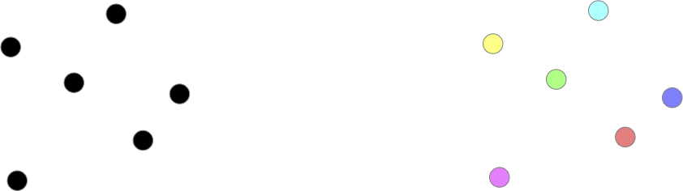

On voit vite que ceci se généralise et que l'on a :


Si un graphe $G$ admet une **_$k$-coloration_** de ses sommets, il admet également une coloration avec exactement $k \leq k' \leq v(G)$ couleurs.


Il suffit de remplacer une des couleurs par plusieurs autres.


Notez que l'on a déjà vu un problème de coloration. En effet [les nombres de Ramsey](../cliques-stables/#ramsey){.interne} correspondent à la recherche de cliques de tailles donnée dans la 2-coloration d'un graphe complet.

## Problème

Continuons notre exploration en essayant de chercher le nombre minimum de couleurs possible pour colorer les sommets d'un graphe. Les cycles paires admettent une 2-coloration (mais pas une 1-coloration puisqu'ils ont une arête) et les cycles impaires quant à eux uniquement une 3-coloration :

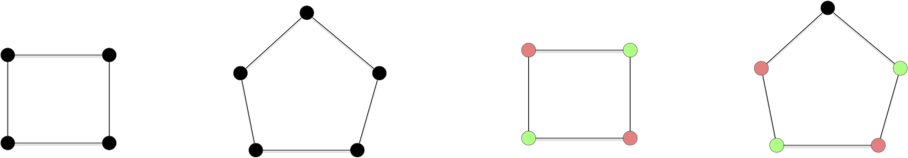


Montrer que :

- les cycles paires admettent une coloration en 2 couleurs mais pas en 1 couleur,
- les cycles impaires admettent une coloration en 3 couleurs mais pas en 2 couleur,



Tout graphe possédant au moins une arête ne peut avoir de 1-coloration. C'est le cas ds cycles puisqu'ils ont tous au moins 3 sommets et donc 3 arêtes.

- Pour tout cycle paire $x_0x_1\cdot x_{2p}$ on peut donner la couleur $i \bmod 2$ au sommet $x_i$.
- une 2 couleur pour un cycle impair va forcer l'alternance des couleurs et on se retrouvera à la fin avec 2 couleurs identique pour une arête. Il faut donc donner une troisième couleur à ce dernier sommet.



Et les cliques ?

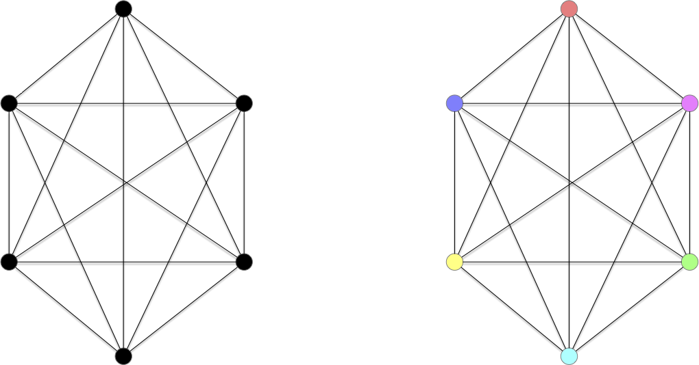


Montrer que :

- $\chi(K_n) = n$



S'il existait une coloration en strictement moins de $n$ sommet, il existerait deux sommets différents ayant même couleurs. Comme il existe une arêtes entre ces deux sommet ceci est impossible et contredit notre hypothèse.



Explicitons cette borne minimum de coloration :

<span id="définition-notation-coloration-minimum"></span>



Soit $G=(V, E)$ un graphe. On note $\chi(G)$ le nombre minimum de couleurs qu'il faut pour colorier ses sommets et on l'appelle **_nombre chromatique de $G$_**.



On a déjà quelques $\chi$ pour des classes de graphes connus :

- $\chi(G) = 1$ si (et seulement si) $G$ est le graphe discret,
- $\chi(G) = 2$ si $G$ est un chemin ou un cycle de longueur pair,
- $\chi(G) = 3$ si $G$ est un chemin ou un cycle de longueur impair,
- $\chi(G) = v(G)$ si $G$ est le graphe complet.

Et une première borne évidente :


Pour tout graphe $G$ on a :

<div>
$$
\omega(G) \leq \chi(G) \leq v(G)
$$
</div>


Pour un graphe $G$, $\omega(G)$ est [la taille de sa plus grande clique](../cliques-stables/#définition-notation-clique-stable-maximum){.interne}.



Le problème principal que l'on veut résoudre est celui-ci :



- **Nom** : $k$-coloriable
- **Entrée** : un graphe $G$
- **Sortie** : $G$ admet-il une $k$-coloration ?



Sa version optimisation est celui-ci :



- **Nom** : colorabilité
- **Entrée** : un graphe $G$
- **Sortie** : $\chi(G)$



On remarque que $k$ fait parti du problème, ce n'est pas une entrée. Il existe donc un problème de reconnaissance différent pour chaque $k$. Il est clair qu'ils sont tous dans NP :




Le problème $k$-colorable est dans NP pour tout $k\geq 1$




Si l'on se donne une solution possible sous la forme d'une partition en $k$ classes de l'ensemble des sommets, il est facile de vérifier si ce sont des stables.




### $k$-colorabilité ≤ $k+1$-colorabilité


Cela se gâte pour $k>2$. On va maintenant montrer la NP-complétude du problème de $k$-colorabilité pour $k>2$.


On a vu précédemment que le problème de reconnaissance est polynomial (et même linéaire) pour les graphes 2-colorable et pour les graphes 1-colorable (c'est le graphe discret). De plus, vous aller le montrer, on peut facilement réduire la reconnaissance d'un graphe $k$-parti à un cas particulier de la reconnaissance d'un graphe $(k+1)$-parti :


Montrez que pour tout $k\geq 1$ on a : `k-colorable` $\leq$ `(k+1)-colorable`.



Soit $G=(V, E)$ dont on cherche à savoir s'il est $k$-colorable. Soit alors $G'=(V \cup \\{x\\}, E \cup \\{xy \vert y\in V\\})$. On a clairement (le seul stable contenant $x$ c'est lui-même) :

- les stables de $G$ sont les stables de $G'$ privé du stable contenant uniquement $x$.
- $G$ est $k$-colorable si et seulement si $G'$ est $(k+1)$-colorable



### 3-coloriable est NP-Complet

Pour terminer, il nous reste à montrer que `3-colorable` est NP-complet. Nous allons pour cela utiliser un gadget sous la forme du graphe ci-dessous :

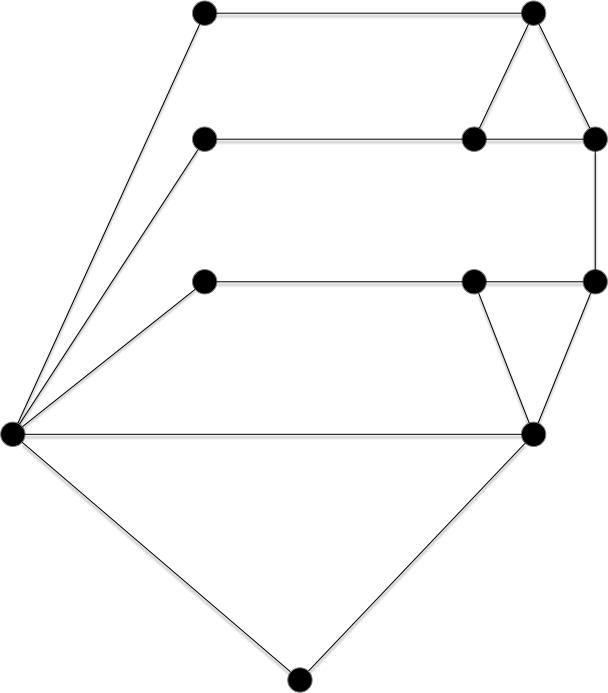

L'intérêt de ce graphe est qu'il est trois colorable, et de plein de façons différente :

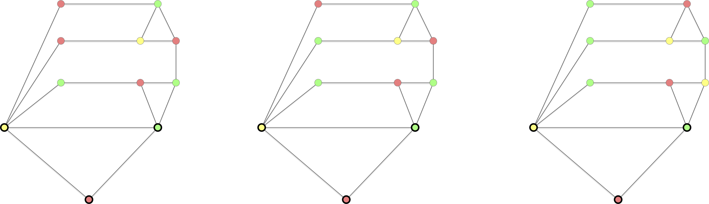

Sauf une seule, lorsque les 3 sommets ne faisant pas parti d'un triangle sont de la même couleur que celle du sommet formant le bas du dernier triangle :

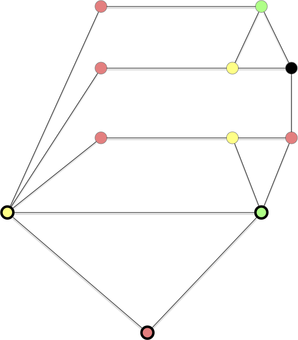

C'est cette propriété que l'on va utiliser pur prouver la NP-complétude de la 3 coloration d'un graphe.

<span id="3-colorable-NPC"></span>



Le problème de la reconnaissance d'un graphe $3$-colorable est NP-complet.




On part de 3-SAT. Soient :

- $(x_i)_{1\leq i \leq n}$ les $n$ variables d'une instance de 3-SAT
- $c_j = l_j^1 \lor l_j^2 \lor l_j^3$  pour $1\leq j \leq m$ les $m$ clauses formés des littéraux $l_j^k \in \\{x_1, \dots, x_n, \overline{x_1}, \dots, \overline{x_1}\\}$ pour $1\leq k \leq 3$ et $1\leq j \leq m$
- $C = \land_{j} c_j$ la conjonction de clauses.

On va associer à tout ceci, de façon polynomiale, un graphe qui sera 3-parti si et seulement si la conjonction de clause $C$ est satisfiable.

On commence par créer un graphe permettant de rendre compte de la véracité des variables : $G_1 = (V_1 \cup V_2, E)$ où :

- $V_1 = \\{x_1, \dots, x_n, \overline{x_1}, \dots, \overline{x_1}\\}$
- $V_2 = \\{ V, F, ?\\}$
- $E = \\{\\{V, ?\\}, \\{F, ?\\}, \\{V, F\\} \\}\cup \\{\\{x_i, ?\\} \vert 1\leq i \leq n \\} \cup \\{\\{\overline{x_i}, ?\\} \vert 1\leq i \leq n \\}$

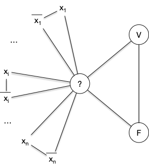

Le graphe $G_1$ est clairement 3-parti avec :

- les 3 sommets $V$, $F$ et $?$ dans 3 stables différents,
- les sommets $x_i$ et $\overline{x_i}$ sont dans le stable ne contenant pas $?$,
- si $x_i$ est dans le stable contenant $V$ alors $\overline{x_i}$ est dans le stable contenant $F$ et réciproquement pour tout $1\leq i \leq n$.

Il faut maintenant ajouter à ce graphes les clauses qui vont permettre de placer des valeurs de vérité aux variables via des stables (le stable de V ou le stable de F). Soit alors le graphe $C_j = (V'_1 \cup V_2 \cup V_j, E_j)$ tel que :

- $V_j = \\{a_j, b_j, c_j, d_j, e_j \\}$
- $V'_1 = \\{l^1_j, l^2_j, l^3_j \\} \subseteq V_1$
- $E_j$ correspondant au graphe ci-dessous


On remarque que les graphes $C_j$ sont 3-partis et que tous leurs stables sont tels que $l^1_j$, $l^2_j$ et $l^3_j$ ne sont pas tous les 3 dans la classe de $F$.

On en conclut donc que le graphe $G = (V_1 \cup V_2 \cup (\cup_j V_j), E \cup (\cup_j E_j))$ est triparti si et seulement si la conjonction de clause $C$ est satisfiable.



La réduction de la preuve de la proposition précédente est plus complexe que toutes celles que l'on a fait jusqu'à présent, [Le gadget utilisé](https://fr.wikipedia.org/wiki/Gadget_(informatique)) n'étant pas trivial. Montrons ce qu'il donne sur [notre exemple fil rouge des réduction depuis 3-SAT](/cours/algorithmie/problème-SAT/#3-sat-exemple){.interne} :

<div>
$$
(x_1 \lor x_2 \lor x_3) \land (\overline{x_1} \lor x_2 \lor x_4) \land (\overline{x_1} \lor x_2 \lor \overline{x_5})\land (\overline{x_3} \lor x_4 \lor x_5)
$$
</div>

- $G_1$ : 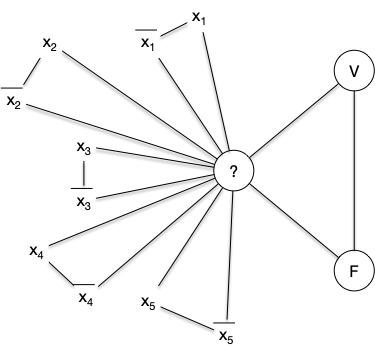
- $C_1$ : 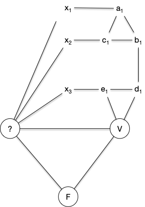
- $C_2$ : 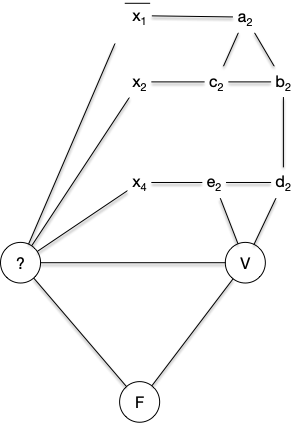
- $C_3$ : 
- $C_4$ : 

Ce qui donne le graphe final :

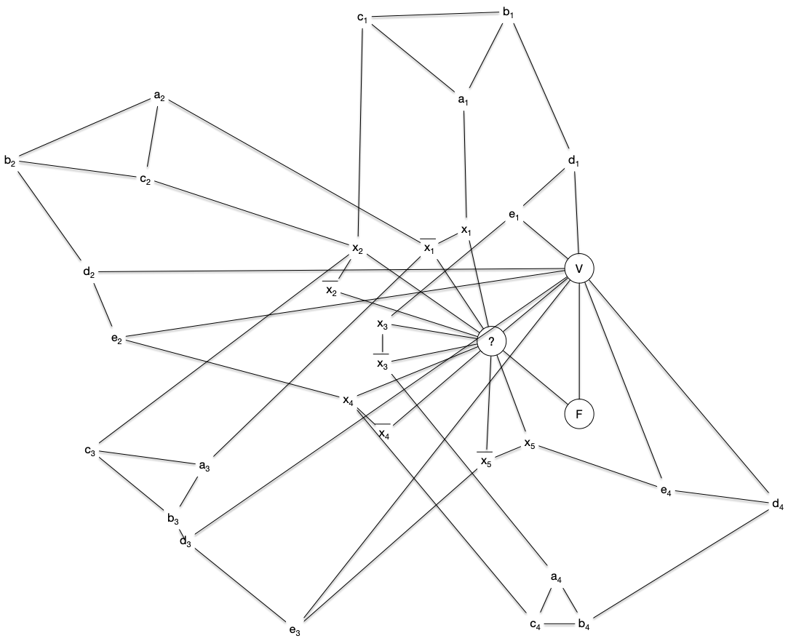

Ce graphe est 3-colorable (on a associé une couleur à chaque stable) :

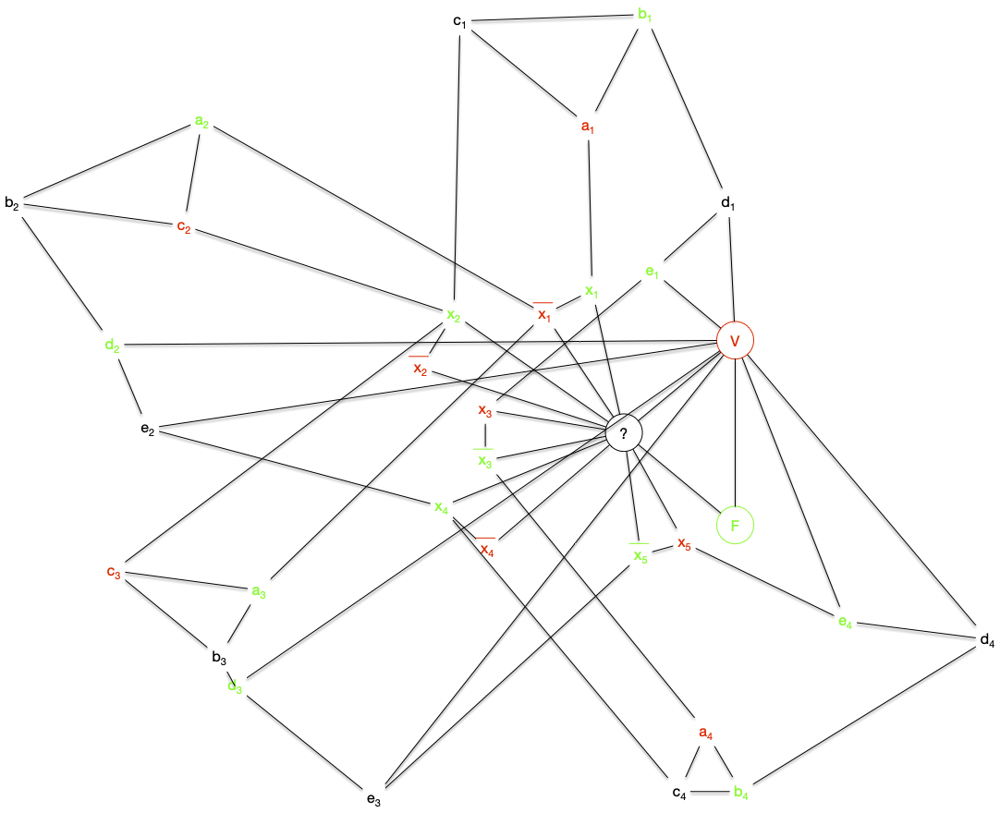


## Graphes bi-parti

Le problème de la 2-colorabilité définit une classe très importante de graphe, les graphes bi-partis :

<span id="définition-biparti"></span>


Un graphe $G=(V, E)$ est **_biparti_** s'il existe une bipartition $V_1$ et $V_2$ de $V$ ($V_1 \cap V_2 = \varnothing$ et $V_1 \cup V_2 = V$) en deux [stables](../structure/#définition-stable){.interne}.


Par exemple le graphe suivant :

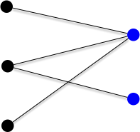


Un graphe est 2-colorable si et seulement si il est bi-parti.


Chaque couleur produit un stable et réciproquement, chaque stable produit une couleur.


La réduction pour montrer que 3-colorable est NP-Complet ne fonctionne pas pour la 2-colorabilité, 
savoir si un graphe est 2-colorable est même rapide en utilisant un algorithme de marquage qui associe une couleur à chaque sommet.

On considère que le graphe est connexe dans l'algorithme suivant. S'il ne l'est pas on le relance sur chacune des parties connexes.

```python
Initialisation :

    On possède deux couleurs.
    Soit x un sommet du graphe que l'on marque avec une couleur

Boucle principale :

    tant qu'il existe x, un sommet marqué non examiné:

        examiner x
        pour chaque voisin y de x :
            si y est marqué avec la couleur de x:
                FIN : le graphe n'est pas biparti
            sinon si y n'est pas marqué:
                marquer y avec la couleur différente de celle de x
    
    FIN : le graphe est biparti et la couleur des sommets determine les 2 stables

```


1. on voit bien tous les sommets car connexe : on le fait par récurrence sur la longueur du chemin entre $x$ et $y$
2. chaque couleur est obligatoire
3. linéaire n+m si on utilise un parcours en profondeur (les éléments marqués sont dans une pile).

L'algorithme fonctionne clairement si le graphe est bi-parti puisque par composante connexe il n'y a qu'une seule possibilité de bi-partition une fois 1 élément assigné :


Si le graphe est bi-parti, alors l'algorithme s'arrête en donnant une bipartition du graphe



La réciproque est également vraie :


Si l'algorithme donne une bipartition, le graphe est bi-parti.


Si le graphe est connexe, chaque sommet sera marqué et examiné. Comme les couleurs ne sont jamais remise en cause et que l'on vérifie tous les voisins d'un sommet examiné on explorera toutes les arêtes du graphes et les sommets chacune d'elles seront de couleurs différentes.


Si l'algorithme s'arrête en répondant NON, c'est qu'il existe un voisin $y$ du sommet examiné $x$ marqué avec la même couleur. Il existe donc un chemin entre le premier élément marqué de l'algorithme, disons $x_0$, et $x$ alternant de couleur en couleur :

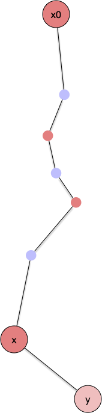

Si $y$ est marqué c'est qu'on la déjà vu, disons en examinant le sommet $x' \neq x$. Il existe donc aussi un chemin alternant de couleurs entre $x_0$ et $x'$ qui est de couleur différente de $x$ :

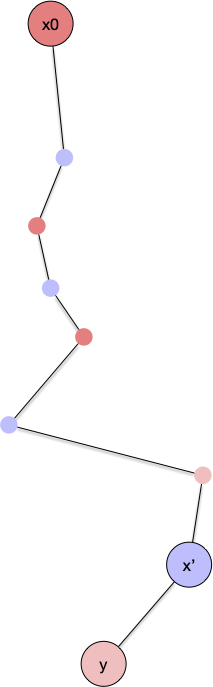

On se trouve donc globalement dans une situation où il existe un chemin alternant les couleurs entre $x_0$ et un chemin alternant les couleurs entre $x$ et entre $x_0$ et $x'$. Ces deux chemins sont de parité différente puisque $x$ et $x'$ sont de couleurs différentes :

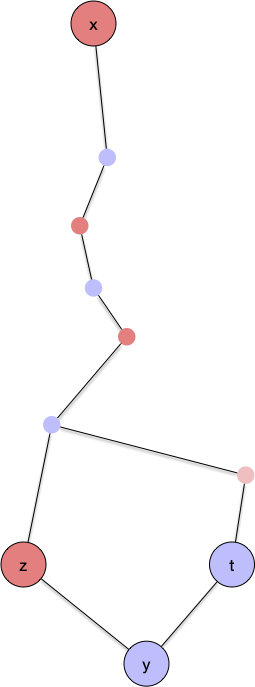

En remontant ces deux chemins jusqu'au premier élément en commun (il existe puisque $x_0$ fait parti des deux chemins) on obtiendra alors forcément un cycle de longueur impaire :

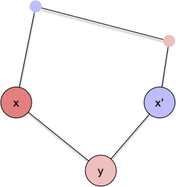

On en conclut :


Si l'algorithme s'arrête en répondant NON, alors le graphe possède un cycle de longueur impair.



Si un graphe n'est pas bi-parti, alors il existe un cycle de longueur impair.



Cette alternance de couleur est appelé [chaîne de Kempe](https://en.wikipedia.org/wiki/Kempe_chain) et est un outil très puissant en coloration de graphe.

Enfin l'algorithme nous donne une caractérisation des graphes bi-partis :



Un graphe est biparti si et seulement si il ne contient pas de cycle de longueur impaire.




- Si un graphe est biparti alors il ne contient pas de cycle de longueur impaire puisque les arêtes d'un cycle doivent passer d'un stable à l'autre un nombre pair de fois.
- Si un graphe n'est pas biparti alors l'algorithme de reconnaissance va répondre NON, ce qui implique l'existence d'un cycle de longueur impaire.



Les graphes bi-parti sont une classe de graphes très générale. On les retrouve un peu partout dans des preuves, en support à des algorithmes généraux, etc car de nombreux problèmes NP-complets en général sont polynomiaux pour eux (par exemple la coloration...).

## Un algorithme glouton



- [Algorithme glouton](https://fr.wikipedia.org/wiki/Coloration_gloutonne)
- [Algorithme glouton en action](https://www.youtube.com/watch?v=L2csXWQMsNg)



L'algorithme est tout simple :

Les couleurs sont des entiers. On associe à chaque sommet la couleur valant le plus petit entier strictement positif non encore affecté à un de ses voisins (ceux étant avant lui dans l'ordre).

Ce qui donne le code :

```text
Soit v_1, ... v_n un ordonnancement des sommets de G


pour chaque i de 1 à n:
    c(v_i) = min N^+ \ { { c(v_j) | v_iv_j ∈ E, j < i} }
```

Une fois l'ordre choisi la complexité de l'algorithme est linéaire en la taille du graphe $\mathcal{O}(m + n)$ puisque pour chaque sommet on examine tous ses voisins. . Bien sur, cet ordre est primordial puisqu'il peut trouver un bon coloriage comme un coloriage moins bon. 

Par Exemple pour le graphe ci-après :

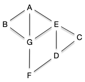

Si on prend l'ordre alphabétique on obtient un 4 coloriage :

| A | B | C | D | E | F | G |
|---|---|---|---|---|---|---| 
| 1 | 2 | 1 | 2 | 3 | 1 | 4 |


Alors que l'on peut avoir un 3 coloriage :

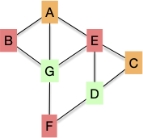

Ce qui est le minimum (puisqu'il existe un cycle impair il n'et pas bi-parti).

> TBD algo avec un tableau :
> On garde un tableau avec les sommets dont la couleur vaut l'index.
> on parcours tous les voisins et on met T[i] = id nœud courant.
> puis on regarde si T[1] vaut l'id du nœud courant, si oui  on passe à 2 et sinon on met 1 comme couleur au nœud courant.

La propriété que suit cet algorithme est, quelque soit l'ordre :

<div>
$$
\chi(G) \leq \max(\min(\delta(v_i), i-1)) + 1
$$
</div>

Cette propriété nous donne une borne de la colorabilité d'un graphe :


Pour tout graphe $G$ on a :

<div>
$$
\chi(G) \leq \Delta(G) +1
$$
</div>



On a vu que chaque couleur associée dépendait du nombre de voisins déjà placés. On a alors pour un ordonnancement des sommets $v_1, \dots v_n$ :

<div>
$$
\chi(G) \leq \max(\{ \min(\{\delta(v_i), i-1\}) \vert 1\leq i \leq n\}) + 1
$$
</div>

ce qui donne immédiatement la borne voulue.



Cette borne est atteinte, on l'a vue, pour les graphes complets et les cycles impair... Et, on le montrera plus tard, c'est les seuls fois.

### Algorithme de Welch-Powel


<https://fr.wikipedia.org/wiki/Coloration_de_graphe#Algorithme_de_Welsh_et_Powell>


L'algorithme de Welch-Powel choisi pour l'ordre celui du nombre de degré décroissants. Avec cet ordre on cherche à minimiser $\min(\{\delta(v_i), i-1\}$ : 

- lorsque $i$ est petit $\delta(v_i)$ est grand
- lorsque $i$ est grand et $\delta(v_i)$ est petit


|ordre| G | E | A | B | D | C | F |
|-----|---|---|---|---|---|---|---| 
|δ(x) | 4 | 4 | 3 | 3 | 2 | 2 | 2 |
|coul.| 1 | 2 | 3 | 3 | 2 | 2 | 2 |

La complexité augmente puisque trouver l'ordre rajoute une complexité de $\mathcal{O}(n\ln(n))$, pour une complexité totale de $\mathcal{O}(n\ln(n)+m)$ Notez que même si cet ordre est raisonnable et permet souvent de trouver un bon coloriage il peut tout de même se tromper pour des cas simples :


Montrer que l'algorithme de Welch-Powel peut trouver un 3-coloriage pour un graphe bi-parti


On prend $C_6$ et comme tous les sommets ont même degré on peut les prendre dans l'ordre que l'on veut en particulier $x_1$ puis $x_4$ ce qui leur donne la même couleur.


### Algorithme DSATUR


<https://fr.wikipedia.org/wiki/DSATUR>


L'algorithme DSATUR est une optimisation de l'algorithme de Welch-Powel. Il choisi à chaque étape le sommet le plus contraint.

On appelle contrainte d'un sommet le nombre de couleurs différentes de ses voisins.

L'algorithme DSATUR prend à chaque étape un sommet ayant le plus grand degré parmi les sommets les plus contraints.

Cette variante fonctionne maintenant avec les cycles pair et même avec tous les graphes bi-parti. Le choix du sommet est cependant maintenant en $\mathcal{O}(n)$ ce qui fait passer la complexité totale en $\mathcal{O}(n^2+m)$

> TBD optimisation avec les tas de Fibonacci ?

Avec note exemple, l'ordre est encore différent :


|ordre| G | E | A | B | D | C | F |
|-----|---|---|---|---|---|---|---| 
|δ(x) | 4 | 4 | 3 | 3 | 2 | 2 | 2 |
|coul.| 1 | 2 | 3 | 2 | 1 | 3 | 2 |


### Ordre aléatoire

Quelque soit l'optimisation il n'est pas à performance garantie, on peut forger des exemples qui rendent une coloration non optimale. De là comme l'algorithme va vite utiliser plusieurs ordre aléatoire puis prendre le meillleur donne souvent de bon résultats.  Ceci est lié à un résultat curieux que nous ne démontrerons pas :


Pour un graphe donné, trouver le pire nombre de couleur que va donner l'algorithme glouton est NP-difficile.


Les pires nombre de couleurs sont appelé  les ["_grundy numbers_"](https://en.wikipedia.org/wiki/Grundy_number).


## Coloration par composition de graphes

La coloration des sommets d'un graphe étant lié aux arêtes voisines commençons par une proposition qui va nous permettre de ne considérer par la suite que des graphes connexes :


Pour tout graphe $G$, son nombre chromatique est égal au plus grand nombre chromatique maximum de ses parties connexes.



En coloriant chaque partie connexe $G_i$ avec des entiers de 1 à $\chi(G_i)$, on a bien le résultat demandé.


Cet proposition toute simple montre que l'on peut parfois utiliser des colorations de sous-graphes pour trouver une solution sur le graphe tout entier.

Attention cependant, cela ne marche pas toujours. Il n'est par exemple pas possible de se restreindre (comme on en aurait envie) à une clique de taille maximum de $G$ (puisque $\omega(G) \leq \chi(G)$ pour tout graphe $G$) puis d'étendre sa coloration à tout le graphe. Cela ne marche pas : [graphe de Mycielski](https://fr.wikipedia.org/wiki/Graphe_de_Mycielski) est sans triangle (donc avec $\omega(G) = 2$) dont le nombre chromatique peut être aussi grand qu'on veut !


**_Les graphes de Mycielski_**, notés $M_k = (V_k, E_k)$ pour tous $k\geq 2$ sont définis récursivement tels que $M_2 = (\\{u, v\\}, \\{uv \\})$ est le graphe complet à 2 sommets et $M_{k+1} = (V_{k+1}, E_{k+1})$ :

<div>
$$
\begin{cases}
V_{k+1} = V_{k} \cup V'_{k} \cup \{ x^\star \} & \text{avec }V'_k \text{ une copie de } V_k\\
E_{k+1} = E_{k} \cup \{ x^\star y \mid y \in V'_k \} \cup \{ xy' \mid xy \in E_k, x \in V_k, y' \in V'_k \}
\end{cases}
$$
</div>




La figure c-après montre les graphes $M_2$, $M_3$ et $M_4$ :

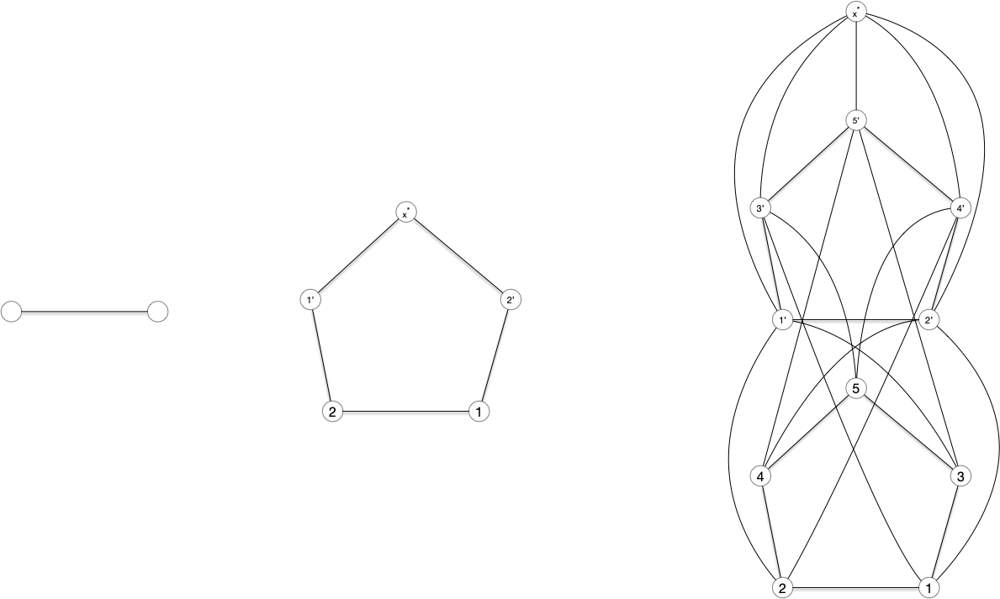

Cette famille de graphe es sans triangle :


Pour tout $k$, $M_k$ est sans triangle.



Clair par récurrence sur $k$. On a bien que $M_2$ est sans triangle, puis :

- deux sommets de $V'_k$ ne sont jamais lié par une arête, 
- les seules arêtes liant 2 sommets de $V_k$ sont des arêtes de $M_{k-1}$ qui par hypothèse de récurrence ne contient pas de triangle.

Les seuls triangles possible de $M_k$ on donc 2 sommets de $V_k$ et 1 sommet de ${V_k}'$ mais la méthode de construction impliquerait que ce triangle existe aussi dans $M_{k-1}$ ce qui est impossible par hypothèse de récurrence.


On a donc $\omega(M_k) = 2$ pour tout $k$ mais :


Pour tout $k$, $\chi(M_k) = k$.



Par récurrence. On a bien $\chi(M_2) = 2$. Si $\chi(M_k) = k$ alors comme $M_k$ est un sous graphe de $M_{k+1}$ on a clairement $\chi(M_{k+1}) \geq \chi(M_{k}) = k$. Comme il est facile de vérifier que donner la même couleur qu'une coloration de $M_k$ aux sommets  $V_k$ et $V_{k+1}$ et une nouvelle couleur à $x^\star$, on a $\chi(M_{k+1}) \leq k+1$.

Pour conclure on remarque que $\chi(M_{k+1}) \neq k$ car  sinon on pourrait supposer sans perte de généralité que la couleur de $x^\star$ soit $k$ et que par conséquent toutes les couleurs de ${V_k}'$ soient entre 1 et $k-1$. On peut alors recolorer les sommets $x$ de $V_k$ de couleur $k$ par la couleur de $x'$ de ${V_k}'$ dans la coloration de $M_{k+1}$. Cette coloration des sommets de $V_k$ donne une coloration acceptable de $M_{k}$ puisque tous les voisins de $x$ dans $M_{k}$ sont des voisins de $x'$ dans $M_{k+1}$.

On a donc $k < \chi(M_{k+1}) \leq k+1$ ce qui conclut la preuve.



Donner une coloration optimale des graphes $M_2$, $M_3$ et $M_4$.


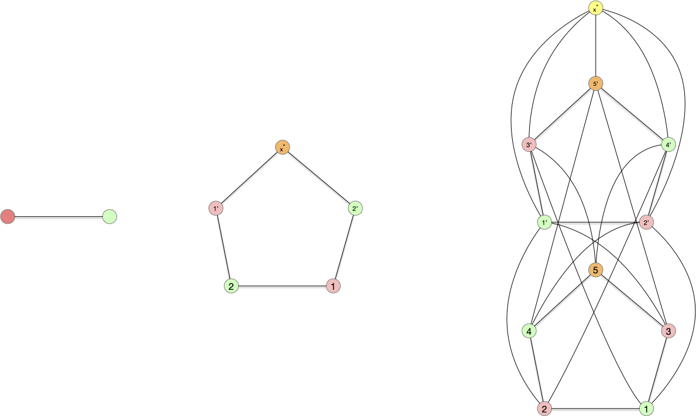



Coller plusieurs graphes ensemble pour en former un plus gros peut se faire de multiples façons. Nous allons en montrer trois, classiques, mais il doit en exister bien d'autres.

### $G_1 + G_2$

Commençons par la plus simple, qui ne rajoute aucune arête entre les deux graphes que l'on compose :


Soient $G_1 = (V_1, E_1)$ et $G_2 = (V_2, E_2)$ deux graphes. On note $G_1 + G_2$ le graphe :

<div>
$$
G_1 + G_2 = (V_1 \cup V_2, E_1 \cup E_2)
$$
</div>





Que vaut :
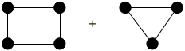


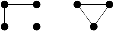



Pour deux graphes $G_1=(V_1, E_1)$ et $G_2=(V_2, E_2)$ on a :

<div>
$$
\chi(G_1 + G_2) = \max(\{\chi(G_1), \chi(G_2) \})
$$
</div>



Les graphes $G_1$ et $G_2$ étant dans des parties connexes différentes de $G_1 + G_2$ la proposition est évidente.



À vous pour le coloriage :


Donnez une coloration optimale de 



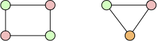


### $G_1 \vee G_2$

On peut aussi utiliser l'approche opposée, qui consiste à ajouter toutes les arêtes possibles entre les deux graphes :


Soient $G_1 = (V_1, E_1)$ et $G_2 = (V_2, E_2)$ deux graphes. On note $G_1 \vee G_2$ la **liaison forte** entre $G_1$ et $G_2$. C'est le graphe :

<div>
$$
G_1 \vee G_2 = (V_1 \cup V_2, E_1 \cup E_2 \cup \{ xy \mid x \in V_1, y \in V_2\})
$$
</div>



Que vaut :
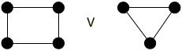


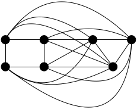



Pour deux graphes $G_1=(V_1, E_1)$ et $G_2=(V_2, E_2)$ on a :

<div>
$$
\chi(G_1 \vee G_2) = \chi(G_1) + \chi(G_2)
$$
</div>




Comme tout sommet de $G_1$ est lié à tous les sommets de $G_2$ dans $G_1 \vee G_2$ il est clair que les couleurs des sommets $V(G_1)$ sont différents des couleurs des sommets de $G(V_2)$ dans $G_1 \vee G_2$.



À vous pour le coloriage :


Donnez une coloration optimale de 



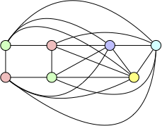


### $G_1 \square G_2$

Enfin, de façon plus subtile :


Soient $G_1 = (V_1, E_1)$ et $G_2 = (V_2, E_2)$ deux graphes. On note $G_1 \square G_2$ le **produit cartésien** entre $G_1$ et $G_2$. C'est le graphe :

<div>
$$
G_1 \square G_2 = (V_1 \times V_2, E)
$$
</div>

Avec $((x_1, x_2), (y_1, y_2)) \in E$ si :

- $x_2 = y_2$ et $x_1y_1 \in E_1$
- $x_1 = y_1$ et $x_2y_2 \in E_2$



Que vaut :
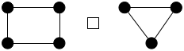







Pour deux graphes $G_1=(V_1, E_1)$ et $G_2=(V_2, E_2)$ on a :

<div>
$$
\chi(G_1 \square G_2) = \max(\{\chi(G_1), \chi(G_2) \})
$$
</div>


Soient $c_1$ et $c_2$ des colorations de $G_1$ et $G_2$ respectivement et on pose $m = \max(\\{\chi(G_1), \chi(G_2) \\})$.

La fonction $c: V_1 \times V_2 \to \\{0, \dots, m-1\\}$ telle que $c((x, y)) = c_1(x) + c_2(y) \bmod m$ est une coloration de $G_1 \square G_2$. En effet si $\\{(x_1, y_1), (x_2, y_2)\\}$ est une arête de $G_1 \square G_2$ on a soit :

- $x_1 = y_1$ et $\vert c((x_1, y_1)) - c((x_2, y_2)) \vert = \vert c_2(x_2) - c_2(y_2) \vert > 0$ puisque $x_2y_2$ est une arête de $G_2$
- $x_2 = y_2$ et $\vert c((x_1, y_1)) - c((x_2, y_2)) \vert = \vert c_1(x_1) - c_1(y_1) \vert > 0 $ puisque $x_1y_1$ est une arête de $G_1$



À vous pour le coloriage :


Donnez une coloration optimale de 






Cette décomposition se révèle puissante pour la coloration en décomposant un graphe donné en _"patterns"_. Commençons par un petit échauffement :


La grille 2D est le produit cartésien de deux graphes, lesquels ?
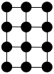


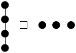


En déduire une coloration optimale.






Pour aborder une composition un peu plus dure :


Le graphe suivant est le produit cartésien de deux cycles de longueurs 3. Montrez-le.
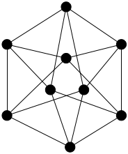


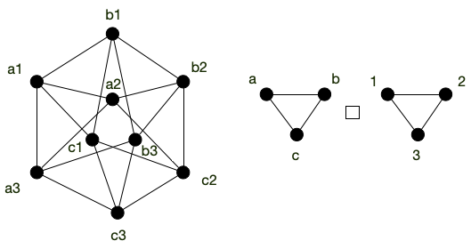

Pour le trouver on commence par prendre un triangle que l'on note (1, 1), (2, 1) et (3, 1). Puis on propage ensuite les notations pour voir comment on peut associer un label à chaque sommet.




Donnez une coloration optimale de 



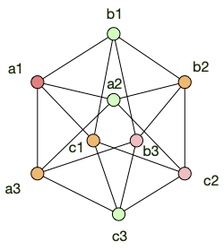

 

Pour finir, la composition $\times$ des graphes (le produit tensoriel) a fait l'objet d'une grosse conjecture qui est maintenant prouvée fausse :


Conjecture de Hedetniemi :

<https://www.youtube.com/watch?v=Tnu_Ws7Llo4> et <https://arxiv.org/pdf/1905.02167>



## Applications


Cette modélisation est très pratique lorsque l'on a des ressources partagées dont on veut maximiser l'utilisation et pour résoudre des problèmes ou l'on cherche à minimiser les incompatibilités.


### Résoudre des sudoku


[le graphe du sudoku](https://fr.wikipedia.org/wiki/Graphe_du_sudoku)


### Faire des plans de table

> TBD ou résoudre des problèmes d'emploi du temps.
> p45 <https://mathweb.ucsd.edu/~gptesler/154/slides/154_graphcoloring_20-handout.pdf>

### Optimiser la compilation de programmes

> p4 <http://o.togni.u-bourgogne.fr/CMGraphesCh3.pdf>
> et p49 <https://mathweb.ucsd.edu/~gptesler/154/slides/154_graphcoloring_20-handout.pdf>

### Attention

> TBD à ne pas tout modéliser par des couleurs.
> à 5min45 <https://www.youtube.com/watch?v=y4RAYQjKb5Y>
>
> On le verra le problème général de la coloration est NP-complet donc ne modélisez pas par un problème NP-complet un problème simple. Les taxis, on l'a vu se résolvent facilement par un algorithme glouton !
> Ca arrive plus souvent qu'pon ne le pense, doc faite attention lorsque vous modélisez votre problème : essayez d'être le plus précis possible.

