


Un graphe (_resp._ graphe dirigé) admet un **_cycle_** (_resp._ **_circuit_**) **_hamiltonien_** s'il existe un cycle (_resp._ un circuit) élémentaire passant par tous les sommets.

Un **_graphe est hamiltonien_** s'il possède un cycle hamiltonien.


On doit ce problème au mathématicien [Hamilton](https://en.wikipedia.org/wiki/William_Rowan_Hamilton) qui a proposé de le résoudre [sous la forme d'un casse tête](https://en.wikipedia.org/wiki/Icosian_game) qu'il commercialisa et correspond à l'exercice suivant :


Montrer que le graphe suivant possède un cycle hamiltonien
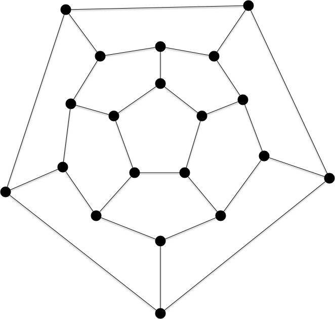


Il existe plusieurs moyen de trouver un cycle hamiltonien. Le plus simple est de décomposer le graphe en parties qu'il faudra traverser un nombre paire de fois. Dans le cas du dodécaèdre on peut par exemple séparer le graphe en 3 :
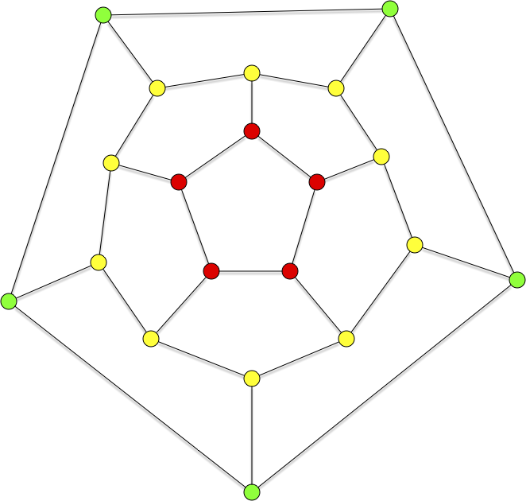

Ici ça va aller vite. On commence par essayer de renter et sortir qu'une seule fois pour les sommets verts. On est alors que le cas suivant :

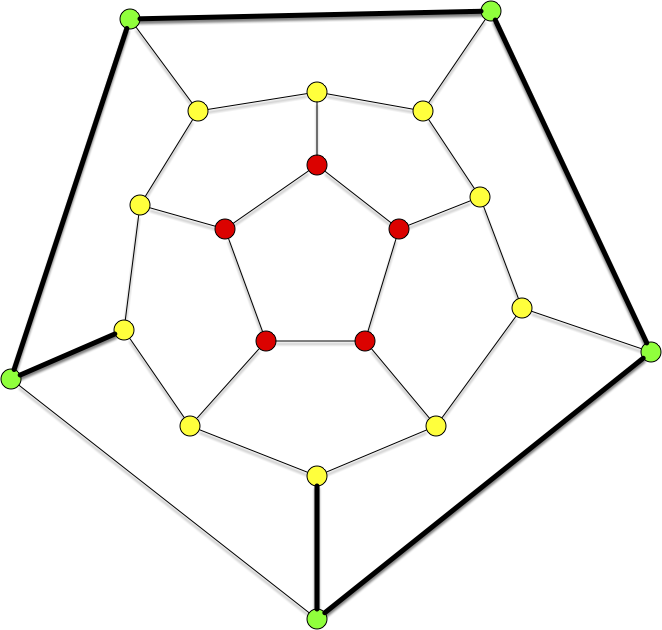

Il nous reste à connecter les jaunes et les rouges, c'est la seule configuration possible à 2 arêtes :

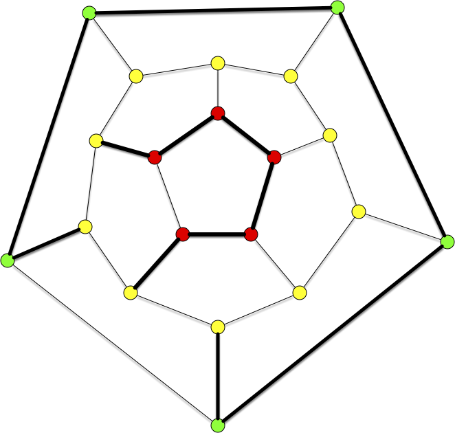

Et au final le cycle hamiltonien :

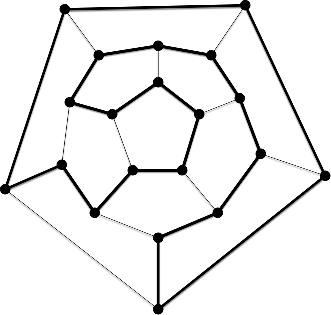


La définition suivante est également très utilisée :


Un graphe (_resp._ graphe dirigé) admet un **_chemin hamiltonien_** s'il existe un chemin élémentaire passant par tous les sommets.



Tous les graphes ne possèdent cependant pas de cycle hamiltonien. Par exemple le graphe suivant, appelé [graphe de Petersen](https://fr.wikipedia.org/wiki/Graphe_de_Petersen) (que l'on est amené à revoir), n'en possède pas :

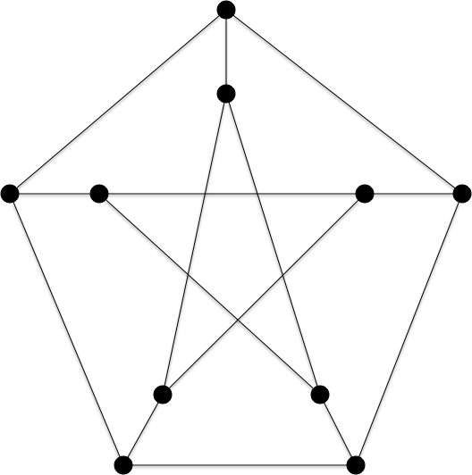


Donald Knuth explique dans The Art of Computer Programming que le graphe de Petersen est _«une configuration remarquable qui sert de contre-exemple à de nombreuses prédictions optimistes sur ce qui devrait être vrai pour tous les graphes3 »_.


Montrez que le graphe de Petersen ne possède pas de cycle hamiltonien.


S'il suffit d'exhiber un exemple pour montrer qu'un graphe est hamiltonien, pour montrer qu'il ne l'est pas il faut en démontrer l'impossibilité.

On peut utiliser pour cela séparons les sommets du graphe en deux parties : les sommets rouges et les sommets verts :

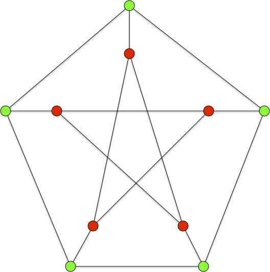

Supposons qu'il existe un cycle hamiltonien $x_1\dots x_n$. Soit $x_ix_{i+1}$ est une arête dont les sommets sont de couleurs différentes. Si $j>i$ est le plus petit entier tel que $x_jx_{j+1}$ est une arête dont les sommets sont de couleurs différentes, alors la couleur de $x_{i+1}$ est identique à celle de $x_j$ et donc il ne peut y avoir qu'un nombre pair d'arêtes dont les sommets sont de couleurs différentes. Soit 0, 2 ou 4 arêtes ce qui, par symétrie, suppose qu'un des quatre graphes ci-après possède aussi un cycle hamiltonien avec les arêtes vertes (jonction entre couleur et sommets de degré 2), ce qui est impossible :

| :-: | :-: |
|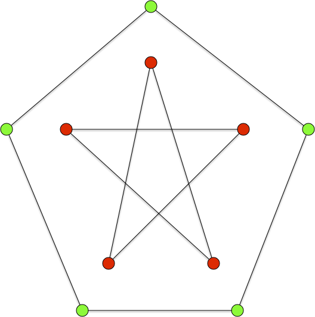|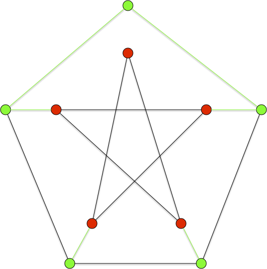|
|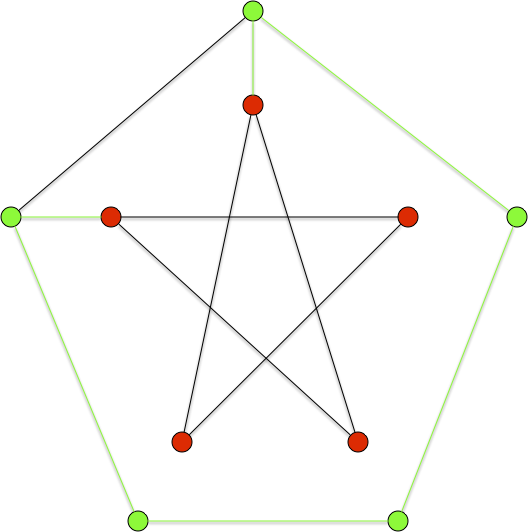|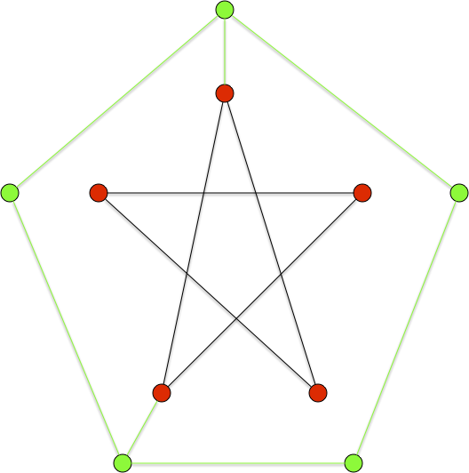|



Le problème du cycle ou du chemin hamiltonien est un problème classique en théorie des graphe et est présent dans nombre de problèmes concrets. C'est en particulier [le problème du voyageur de commerce](https://fr.wikipedia.org/wiki/Probl%C3%A8me_du_voyageur_de_commerce) qui est la base de toute optimisation de tournée ou de nombre de problèmes liés au transport.

## Chemin et cycles

Trouver un chemin ou un cycle hamiltonien sont deux problèmes similaires et que l'on peut résoudre l'un par l'autre. Montrons le en commençant par montrer que la recherche d'un chemin hamiltonion est quasi-identique à la recherche d'un cycle hamiltonien :


Trouver un chemin hamiltonien d'un graphe $G = (V, E)$ est équivalent à trouver un cycle hamiltonien du graphe $G' = (V \cup \\{\omega \\}, E \cup \\{ \omega x \mid x \in V\\})$.



- si $x_1 \dots x_n$ est un chemin hamiltonien de $G$ alors $\omega x_1 \dots x_n\omega$ est un cycle hamiltonien de $G'$
- si $\omega x_1 \dots x_n\omega$ est un cycle hamiltonien de $G'$ alors $x_1 \dots x_n$ est un chemin hamiltonien de $G$


La réciproque est également vrai :


Trouver un cycle hamiltonien d'un graphe $G = (V, E)$ est équivalent à trouver un chemin hamiltonien du graphe $G' = (V', E')$ avec :

- $V' = (V \backslash \\{x^\star\\}) \cup \\{x_1, x_2, p_1, p_2\\}$ avec $x^\star$ un sommet quelconque de $V$,
- $E' = (E \backslash \\{ x^\star y \mid x^\star y \in E \\}) \cup \\{ x_i y \mid 1\leq i \leq 2, x^\star y \in E \\} \cup \\{x_1p_1, x_2, p_2\\}$



- si $x^\star \dots x^\star$ est un cycle hamiltonien de $G$ alors $p_1 x_1 \dots x_2 p_2$ est un chemin hamiltonien de $G'$
- si $x_1 \dots x_{n'}$ est un chemin hamiltonien de $G'$ alors forcément $\\{x_1, x_{n'}\\} = \\{p_1, p_2\\}$ puisque $\delta(p_1) = \delta(p_2) = 1$. On peut alors sans perte de généralité suppose que le chemin hamiltonien est : $p_1 x_1 y_1 \dots y_{n-1} x_2 p_2$ et $x^\star y_1 \dots y_{n-1} x^\star$ est un cycle hamiltonien de $G$.


Ces résultats se transposent pour les graphes orientés :


Montrez que l'on peut résoudre le problème du chemin hamiltonien dans un graphe orienté par la recherche d'un circuit hamiltonien.


On peut comme dans la proposition pour les graphes non orienté ajouter un somment ayant un arc entrant et un arc sortant pour tous les autres sommets.

On peut aussi, si on ne veut pas ajouter d'arc dans les deux direction créer le graphe orienté $G' = (V', E')$ tel que :

- $V' = V \cup \\{x^+, x^- \\}$,
- $E' = E \cup \\{ x^+ y \mid y \in V \\} \cup \\{ x^- y \mid y \in V \\} \cup \\{x^-x^+\\}$

De là :

- au chemin hamiltonien $x_1\dots x_n$ sur $G$ correspondra un circuit hamiltonien $x^+x_1\dots x_nx^-x^+$ sur $G'$
- au cycle hamiltonien $x^-x^+ y_1 \dots y_{n} x^-$ sur $G'$ ($x^+$ et $x^-$ sont forcément voisins puisque $x^-x^+$ est l'unique arête sortante de $x^-$) correspondra le chemin hamiltonien $y_1 \dots y_{n}$ sur $G$  



Montrez que l'on peut résoudre le problème du circuit hamiltonien dans un graphe orienté par la recherche d'un chemin hamiltonien.



On procède de la même manière que pour le cas orienté en :

- associant à $x_1$ les arc sortant de $x^\star$ et à $x_2$ les arc entrant,
- ajoutant les sommets $p_1$ $p_2$ avec les arcs $p_1x_1$ et $x_2p_2$.



Selon les cas on préférera traiter un cas ou l'autre mais dans l'absolu ces problèmes sont de même complexité :


Les problèmes de recherche d'un chemin ou d'un cycle hamiltonien dans des graphes (orienté ou non) sont identiques : on peut de plus résoudre un problème par un algorithme résolvant l'autre via une transformation linéaire d'une entrée dans l'autre.


## Densité d'arêtes des graphes hamiltoniens

Lorsque le graphe a beaucoup d'arêtes, il va être facile de trouver des chemin ou cycles/circuit hamiltonien.


Si $G=(V, E)$ est un graphe tel que $\delta(x) \geq \vert V \vert / 2$ pour tout sommet $x\in V$, alors $G$ est hamiltonien (_ie._ admet un cycle Hamiltonien).



Le graphe $G$ est connexe car s'il ne l'était pas sa plus petite composante connexe serait de taille inférieure ou égale à $\vert V \vert / 2$ et donc les sommets de cette composante ont tous un un degré strictement plus petit que $\vert V \vert / 2$ (on pourrait aussi utiliser [cette propriété](../chemins-cycles-connexite/#prop-connexe){.interne} et le fait que $\vert E \vert = \frac{1}{2}\sum_x\delta(x) \geq \frac{1}{4}\vert V \vert^2>  \frac{1}{2}(\vert V \vert-1)(\vert V \vert-2)$ pour $\vert V \vert \geq 3$).

Soit $C=x_0\dots x_k$ un chemin le plus long dans $G$. Si $x_0x_k \in E$, le cycle est hamiltonien. Sinon en effet, par connexité, il existerait une arête $yx_j$ avec $y\notin C$ et le chemin suivant serait strictement plus long que $C$ : $yx_j\dots x_kx_0\dots x_{j-1}$.

On suppose alors que $x_0x_k \notin E$.

Tous les voisins de $x_0$ et $x_k$ sont dans $C$ sinon on pourrait le prolonger.
De plus si pour tout $x_i$ tel que $x_ix_k \in E$ on a $x_{i+1}x_0 \notin E$, $C$ contiendrait $x_0$, tous les successeurs des voisins de $x_k$ (dont $x_k$ puisque $x_{k-1}x_k$) et il y en a au moins $\vert V \vert / 2$, plus tous les voisins de $x_0$, c'est à dire encore au moins $\vert V \vert / 2$ : $C$ posséderait au moins $\vert V \vert + 1$ élément, ce qui est impossible.

Il existe donc $x_i$ ($0 < i <k$) tel que $x_ix_k \in E$ et a $x_{i+1}x_0 \in E$ : le chemin $x_0\dots x_ix_k\dots x_{i+1} = x'_0\dots x'_k$ est alors de longueur maximum et comme $x'_kx'_0 \in E$ on est ramené au cas précédent et $x'_0\dots x'_kx'_0$ est un cycle hamiltonien.



Et le pendant dirigé :


Si $G=(V, E)$ est un graphe orienté tel que $\delta^+(x) + \delta^-(x) \geq \vert V \vert$ pour tout sommet $x\in V$, alors $G$ est hamiltonien (_ie._ admet un circuit Hamiltonien).



Soit $C$ un circuit de taille maximum de $G$. Commençons par montrer que $l = v(G) \geq n/2 + 1$ (avec $n = v(G)$), en considérant un chemin $x_1\dots x_p$ le plus long dans $G$. Tous les voisins sortants de $x_p$ sont forcément sur ce chemin sinon il ne serait pas de longueur maximum et il y en a au moins $n/2$. le cycle $x_i \dots x_p x_i$ avec $x_i$ le plus petit successeur de $x_p$ sur le chemin possède donc au moins $n/2 +1$ sommet.

Soit maintenant $G'$ le graphe $G$ restreint aux sommets qui **ne sont pas** dans $C$ et $L$ un de ses chemins de longueur maximum. Si $C$ n'est pas hamiltonien $L$ existe et en notant $1 \leq k = v(L)$,  on a que $k \leq n/2 -1$ puisque $k + l \leq n$. De plus, puisque $L$ est un chemin de longueur maximum dans $G'$ : 

- l'ensemble $N^-(v_1)$ dans $G$ est contenu dans l'union $V(L) \cup V(C)$ avec $v_1$ le premier sommet du chemin,
- l'ensemble $N^+(v_k)$ dans $G$ est contenu dans l'union $V(L) \cup V(C)$ avec $v_k$ le dernier sommet du chemin.

On en conclut que les ensembles $S = N^-(v_1) \cap V(C)$ et $T = N^+(v_k) \cap V(C)$ contiennent chacun au moins $l - k + 1 > 0$ éléments.

Soient maintenant $s \in S$ et $t \in T$ :

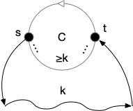

Le chemin allant de $s$ à $t$ dans $C$ possède au moins $k$ sommets différents de $s$ et de $t$ sinon il existerait un cycle strictement plus grand que $C$. Un sommet de $S$ bloque donc $k$ sommets pour les éléments de $T$. Le nombre minimal de sommet bloqué est atteint lorsque tous les sommets de $S$ se suivent sur $C$ et on bloque ainsi $\vert S\vert - 1 + k$ éléments pour $T$. On en déduit $\vert T\vert \leq l - (\vert S\vert - 1 + k) \leq l - (l-k+1 -1+k) = 0$ ce qui est impossible puisque $\vert T\vert> 0$ : $L$ n'existe pas et $C$ est hamiltonien.



Les deux propositions ne sont bien sur que des conditions suffisantes puisque $C_n$, le cycle/circuit à $n$ éléments, est un cycle/circuit hamiltonien est ne possède que $n$ arêtes/arc. 

## Tournois

Commençons par un résultat surprenant sur les graphes orientés. S'il est évident que les graphes complets ont tous des chemins hamiltoniens, c'est également le cas pour les tournois !


Montrez que tout [tournoi](../structure/#definition-tournoi) admet un chemin hamiltonien.



On peut le démontrer par récurrence. Un tournoi à 1 sommet admet un chemin hamiltonien. Si on suppose cela vrai pour tout tournoi à moins de $n$ sommets, soit $T = (V, E)$ un tournoi à $n+1$ sommets.

On prend $x$ un sommet de ce tournoi. Le graphe $T$ privé de $T$ est un tournoi à $n$ sommets. Il existe alors un chemin hamiltonien $c_0\dots c_{n-1}$ dans la restriction de $T$.

Si $xc_{0}$ est un arc de $T$, alors $xc_0\dots c_{n-1}$ est un chemin hamiltonien. Sinon si $c_{n-1}x$ est un arc de $T$, alors $c_0\dots c_{n-1}x$ est un chemin hamiltonien.

Si on est dans aucun des cas précédents, il existe $0 <i<n-1$ tel que $c_{i}x$ et $xc_{i+1}$ sont deux arcs de $T$ : $c_0\dots c_{i}xc_{i+1}\dots c_{n-1}x$ est un chemin hamiltonien de $T$.


Preuve un peu plus élégante que la précédente.

On peut le démontrer par récurrence. Un tournoi à 1 sommet admet un chemin hamiltonien. Si on suppose cela vrai pour tout tournoi à moins de $n$ sommets, soit $T = (V, E)$ un tournoi à $n+1$ sommets.

On prend $x$ un sommet de ce tournoi. On a alors que $N^+(x) \cup N^-(x) \cup \{ x \} = V$ et que les restrictions de $T$ à $N^+(x)$ ou à $N^-(x)$ restent des tournois et ont strictement moins de $n+1$ sommets.

Il existe alors :

- un chemin hamiltonien $c_0\dots c_k$ dans la restriction de $T$ à $N^+(x)$
- un chemin hamiltonien $c'_0\dots c'_l$ dans la restriction de $T$ à $N^-(x)$

On en conclut que le chemin $c'_0 \dots c'_l x c_0 \dots c_k$ est hamiltonien dans $T$, ce qui termine la preuve par récurrence.



Ce résultat ne se généralise pas aux circuits hamiltonien. Il suffit de considérer le tournoi $G = (\{x_1,\dots, x_n\}, E)$ avec $x_ix_j \in E$ si et seulement si $i< j$. Ce tournoi ne peut clairement posséder aucun circuit. On peut cependant caractériser les tournoi admettant un circuit hamiltonien :


Un tournoi admet un circuit hamiltonien si et seulement si il est fortement connexe.


Il est clair que tout graphe orienté admettant un circuit hamiltonien est fortement connexe puisque qu'on peut faire le tour de ce circuit pour aller de $x$ à $y$ puis de $y$ à $x$ pour tous sommets $x$ et $y$.

Réciproquement, soit $T$ un tournoi fortement connexe et supposons qu'il ne contienne pas de circuit hamiltonien. Soit alors $C = c_1\dots c_lc_1$ un circuit de longueur maximum et $v\notin V(C)$. Il y a plusieurs cas :

- il existe $x, y \in V(C)$ tels que $xv$ et $vy$ sont 2 arcs. On peut supposer sans perte de généralité que $x = c_1$ et $y = c_i$ et soit $c_j$ le plus petit élément tel que $c_jv \in E$. On a alors un cycle $c_1\dots c_{j-1}vc_{j}\dots c_l$ qui est strictement plus long que $C$ : contradiction.
- supposons qu'il n'existe pas $v\notin V(C)$ tel que $xv \in E$ avec $x \in V(C)$. Il est alors impossible d'atteindre un sommet du circuit à partir d'un sommet qui n'y est pas : contradiction puisque par hypothèse $T$ est fortement connexe
- le même argument nous montre qu'il est impossible que pour tout $v\notin V(C)$ $vx \in E$ avec $x \in V(C)$.

Il existe donc :

- $v\notin V(C)$ tel que  $xv \in E$  pour tout $x \in V(C)$,
- $v'\notin V(C)$ tel que  $v'x \in E$  pour tout $x \in V(C)$.

Or le tournoi est fortement connexe il existe donc un chemin $L$ de sommets non dans $V(C)$ qui rejoignent $v$ à $v'$. Ceci est cependant impossible puisque $c_1Lc_2\dots c_lc_a1$ forme un circuit strictement plus long que $C$.




Le nombre $t_n$ de tournois fortement connexe est :

$$
t_n = 2^{\binom{n}{2}} - \sum_{k=1}^{n-1}t_k\binom{n}{k}2^{\binom{n-k}{2}}
$$



Les composantes fortement connexes d'un graphe sont deux à deux disjointes. De plus pour un tournoi si $C_1$ et $C_2$ sont deux composantes connexes soit $xy \in E$ pour tout $x\in C_1$ et $y\in C_2$ soit $yx \in E$ pour tout $x\in C_1$ et $y\in C_2$ (sinon $C_1 \cup C_2$ formerait une composante connexe). De là, il existe forcément une composante connexe unique $C$ tel que pour toute autre composantes connexe $C'$, $xy \in E$ pour tout $x\in C$ et $y\in C'$.

La taille de cette composante fortement connexe peut aller de 1 à $n-1$ et pour une taille $k$ il y en a : $\binom{n}{k}t_k$. Le reste du graphe est un tournoi quelconque à $n-k$ sommets, il y en a donc $2^{\binom{n-k}{2}}$. Il y a donc en tout :$\sum_{k=1}^{n-1}t_k\binom{n}{k}2^{\binom{n-k}{2}}$ tournois non transitifs à $n$ sommets et comme il y a en tout $2^{\binom{n}{2}}$ tournois à $n$ sommet on en déduit la formule attendue.



La suite $t_n$ est [la suite A054946](https://oeis.org/A054946).


La probabilité qu'un tournoi aléatoire à $n$ sommets admette un circuit hamiltonien tend vers 1 lorsque $n$ tend vers l'infini.


La preuve de la proposition précédente montre qu'un tournoi $T$ n'est pas fortement connexe si et seulement si il existe un ensemble de sommets $A \subsetneq V(T)$ tel que $xy \in E(T)$ quelque soient $x\in A$ et $y\notin A$. Comme il y a $k \cdot(n-k)$ arcs entre $A$ et $V(T)\backslash A$ la probabilité qu'il existe un tel ensemble vaut :

$$
\frac{1}{2^{k \cdot(n-k)}}
$$

Comme il peut y avoir $\binom{n}{k}$ tels ensemble on a que la probabilité $\mathbb{P}_n$ qu'un tournoi à $n$ sommets ne soit pas fortement connexe est telle que  (les évènements ne sont pas indépendants) :

$$
\mathbb{P}_n \leq \sum_{k=1}^{n-1}\binom{n}{k}\frac{1}{2^{k \cdot(n-k)}}
$$

De là on peut continuer à approximer à la hache :

$$
\begin{cases}
\mathbb{P}_n &\leq \sum_{k=1}^{n-1}n^k\frac{1}{2^{k \cdot(n-k)}}\\
&\leq \sum_{k=1}^{n-1}n^k\frac{1}{2^{kn}}\\
&\leq \sum_{k=1}^{n-1}(\frac{n}{2^{n}})^k\\
&\leq \frac{n}{2^{n}}^n\\
&\leq \frac{n^n}{2^{n^2}}\\
&\leq \exp(n\ln(n)-\ln(2)n^2) \xrightarrow[n \to +\infty]{} 0\\
\end{cases}
$$



Si un tournoi est fortement connexe il admet au moins $n$ chemins hamiltonien. Par exemple pour le graphe ci-après ($231451$ est un circuit hamiltonien) :

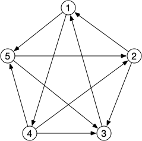

Mais il peut en avoir bien plus (notre exemple n'en possède qu'un de plus, $43152$), comme le montre la proposition ci-après dont la démonstration est un premier exemple de [la méthode probabiliste](https://fr.wikipedia.org/wiki/M%C3%A9thode_probabiliste) développée par Erdös :


Pour tout $n$, il existe des tournois à $n$ sommets ayant plus de $\frac{n!}{2^{n-1}}$ chemins hamiltoniens.


La probabilité d'existence d'un chemin hamiltonien donné $C = x_1\dots x_n$ pour un tournoi donné à $n$ sommets est $\mathbb{P}(T \text{ admette } C \text{ comme chemin hamiltonien }) = 1/2^{n-1}$ (probabilité de $1/2$ pour chaque arc $x_ix_{i+1}$, $1\leq i < n$).

Numérotons tous les chemins hamiltoniens possibles de $C_1$ à $C_{n!}$ et notons $N_i$ la variable aléatoire sur les tournois telle que $N_i(T) = 1$ si $T$ admet $C_i$ comme chemin hamiltonien et 0 sinon. Son espérance vaut :

$$
\begin{cases}
\mathbb{E}[N_i] &=\sum\limits_{k\geq 1} k \cdot \mathbb{P}(N_i = k) &\text{définition de l'espérance}\\
 & = 1 \cdot \mathbb{P}(N_i = 1)\\
&= 1/2^{n-1}& \text{remarque précédente}
\end{cases}
$$

De là, l'espérance de la variable aléatoire $N(T) = \sum_i N_i(T)$ comptant le nombre de chemins hamiltoniens dans un tournoi $T$ à $n$ sommets vaut :

$$
\begin{cases}
\mathbb{E}[N] & = \mathbb{E}[\sum\limits_{i} N_i]\\
 & = \sum\limits_{i}  \mathbb{E}[N_i] & \text{linéarité de l'espérance}\\
& = \sum\limits_{i}1/2^{n-1}\\
& = \frac{n!}{2^{n-1}}\\
\end{cases}
$$

On conclut que pour réaliser cette espérance il doit exister un tournoi qui en a au moins autant : il existe $T$ tel que $N(T) \geq \mathbb{E}[N] \geq \frac{n!}{2^{n-1}}$


Notez que la proposition précédente ne donne pas de preuve constructive d'un tel tournoi. Les preuves par la méthode probabiliste sont souvent existentielle on sait que ça existe mais c'est parfois dur à trouver. Faites en l'expérience avec l'exercice suivant :


Trouvez un tournoi à 5 sommets ayant au moins $5!/2^{4} = 15/2$ chemins hamiltoniens.


Le graphe ci après possède 8 chemins hamiltoniens :

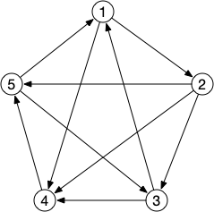

1. 12345
2. 23451
3. 34512
4. 45123
5. 51234
6. 23145
7. 31245
8. 12534



S'il existe des tournois avec de nombreux chemins hamiltoniens, il en existe aussi avec très peu :


Montrez que les tournois transitifs ($xy, yz \in E(T) \Rightarrow xz \in E(T)$) n'admettent qu'un seul chemin hamiltonien.



S'il existe un arc sortant et un arc entrant pour tout sommet, alors il existe un circuit et un circuit n'est pas transitif. Il existe donc un sommet ne possédant que des arcs entrant ou que des arcs sortants. Une récurrence immédiate nous montre ensuite que l'pn peut ordonner les sommets de tel sorte que si $i < j$ alors $x_ix_j |in E(T)$.

Le seul chemin hamiltonien est donc cet ordre.



Montrez que pour tout tournoi $T$ sa restriction à un ensemble de sommet contenant exactement 1 sommet par composante fortement connexe est transitif.



La preuve du théorème de Moon-Moser nous montre qu'il existe une composante fortement connexe qui ne possède aucun arc entrant avec comme départ un sommet qui n'est pas dans cette composante. Une récurrence triviale nous montre alors que pour tout tournoi on peut ordonner ses $K$ composantes fortement connexes $C_1, \dots C_K$ de tel sorte que pour tout sommet $x \in C_i$ et tout sommet $y \in C_j$ avec $i < j$ alors $xy \in E(T)$.



Déduire que les seul tournoi n'ayant qu'u seul chemin hamiltonien sont les tournois transitifs.



La preuve de l'exercice précédent nous montre que l'on peut ordonner ses $K$ composantes fortement connexes $C_1, \dots C_K$ de tel sorte que pour tout sommet $x \in C_i$ et tout sommet $y \in C_j$ avec $i < j$ alors $xy \in E(T)$.

Les seuls chemins hamiltoniens possibles sont alors ceux dont les éléments de $C_i$ forment des intervalles placés dans cet ordre et on en conclut qu'un tournoi a  autant de chemins hamiltoniens que le produit des cardinaux de ses parties fortement connexes. 

On conclut en remarquant que s'il n'est pas transitif il existe une composante fortement connexe à 3 sommets ou plus ce qui conclut la preuve.



## Algorithme

On ne connaît pas d'algorithmes polynomiaux pour trouver un cycle hamiltonien.
> TBD ce qu'on a fait avec ds arêtes pourquoi pas le faire avec des sommets ? Voir la suite du cours (c'est un problème NP complet)

### Exact


<https://en.wikipedia.org/wiki/Held%E2%80%93Karp_algorithm>


Savoir si un graphe donné possède un chemin hamiltonien nécessite a priori de vérifier **tous** les chemins possibles et il y en a beaucoup : $n!$. Comme chaque potentiel chemin hamiltonien se vérifie en $\mathcal{O}(n)$ opérations (il faut vérifier l'existence de $n-1$ arêtes) l'algorithme naïf est de complexité $\mathcal{O}(n \cdot n!) = \mathcal{O}((n+1)!)$

L'algorithme de Bellman-Held-Karp permet de réduire cette complexité au prix d'un stockage intensif de résultats intermédiaires.

> TBD ajouter algo en $n^22^n$ qui est mieux que n! 

### Approché sans performance garantie

> TBD parler de 2-opt (dirigé ou pas) et de la 2-approximation si distance sur graphe complet.

### À performance garantie dans un cas particulier

> TBD ALM puis parcours DFS dessus : le parcours DFS et une 2-approximation.

