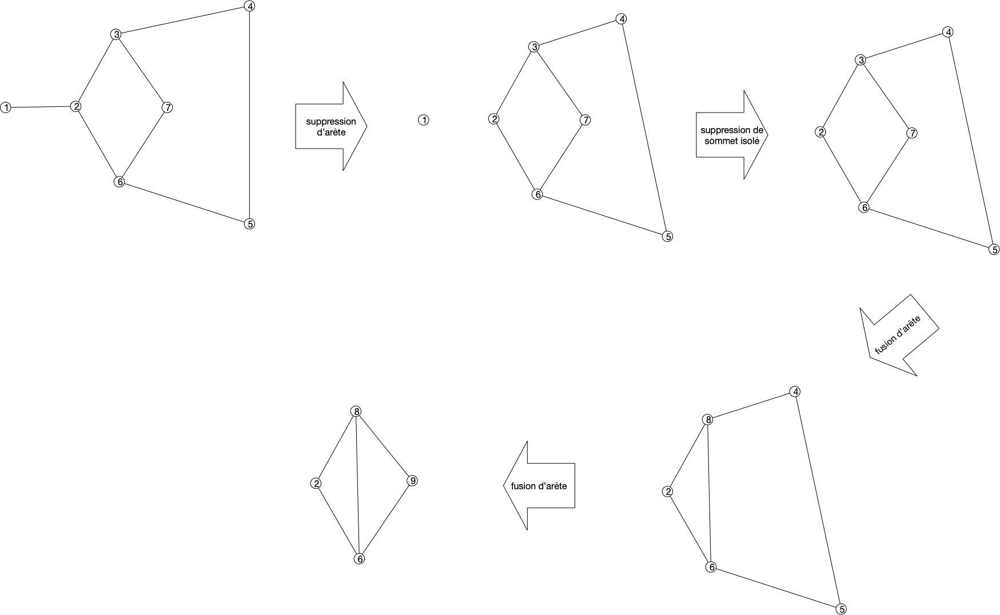
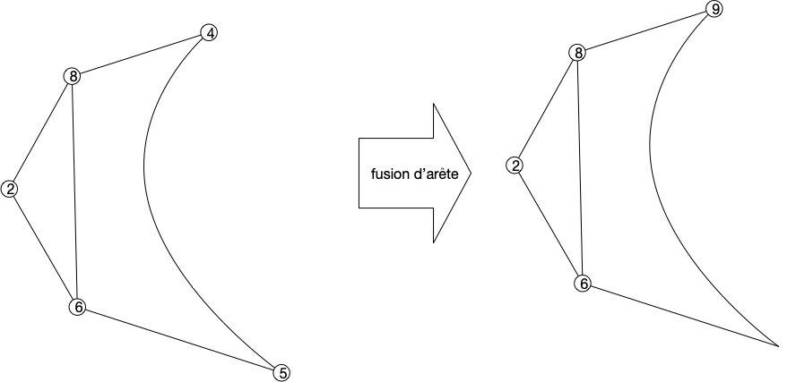
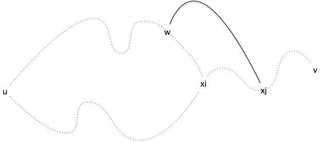
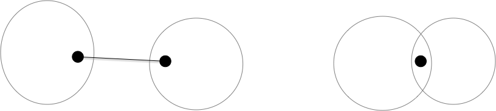


[Théorème de Kuratowski](https://fr.wikipedia.org/wiki/Graphe_planaire#Caract%C3%A9risation_de_Kuratowski_et_de_Wagner)


## Preuve d'un théorème de Jordan simplifié

> TBD suffisant pour les graphes où les sommets sont dénombrables.
> TBD si courbe alors polygone alors droites
> TBD Diesel théorème 4.1.1 (p83 et suivantes)
> TBD <https://minerve.ens-rennes.fr/images/Le_Th%C3%A9or%C3%A8me_de_Jordan_S.Quayle_V.Le_Gruiec..pdf>
> TBD - topologie et courbe fermée Jordan  : <https://pagesperso.g-scop.grenoble-inp.fr/~lazarusf/Enseignement/graphesPlans.pdf>
## Mineurs

La caractérisation des graphes planaire se fait par "_mineur exclu_". C'est à dire caractériser les graphes qui vont nous empêcher de réussir un dessin planaire


Soit $G$ un graphe. Un graphe $H$ est un mineur de $G$ s'il peut être obtenu par un nombre quelconque des opérations suivantes :

- suppression d'un sommet sans voisin
- suppression d'une arête
- contraction d'un arête: on fusionne l'arête en un nouveau sommet $z$ dont les voisins sont les voisins des anciens sommets formant l'arête


[mineurs de graphes](https://fr.wikipedia.org/wiki/Mineur_(th%C3%A9orie_des_graphes))


En deux mots, les mineurs sont les graphes cachés dans un graphe plus gros :


<https://fr.wikipedia.org/wiki/Mineur_(th%C3%A9orie_des_graphes)>


La notion de mineur rend  compte de l'intrication locale de chemins entre sommets. Ils ont donné lieu à un des plus joli théorème de théorie des graphes (et pourtant il y en a !), [le théorème de Roberston-Seymour](https://fr.wikipedia.org/wiki/Th%C3%A9or%C3%A8me_de_Robertson-Seymour). Ce théorème indique en effet que : 

- toute famille close par mineur peut être caractérisée par un nombre fini de mineurs exclu,
- Quelque soit le graphe $M$, il existe un algorithme en $\mathcal{O}(n^2)$ pour savoir si un graphe $G$ admet $M$ comme mineur.

En revanche, le théorème ne caractérise pas les algorithmes et ils ont une constante multiplicatives exponentielle en la taille du mineur à rechercher. Il n'est donc pas utilisé en pratique, mais la planarité fait partie de ces familles puisque :


Si est $G$ un graphe planaire alors tous ses mineurs le sont aussi.


Les trois opérations pour créer un mineur d'un graphe fonctionnent aussi sur son dessin :

- la suppression d'un sommet ou d'une arête ok
- la contraction d'un arête se fait en concaténant les courbes des arêtes supprimées, comme sur le dessin ci dessous.



## Caractérisation

On a déjà établi la proposition suivante :


Si $G$ est planaire, il ne peut avoir ni $K_5$ ni $K_{3,3}$ comme mineur


Clair puisque l'on a montré que ni $K_5$ ni $K_{3,3}$ ne peuvent être planaire.


Il nous reste à faire la réciproque. Initialement faire par Kuratowski en 1930 dans le cadre des subdivisions de graphes, il a été ré-ecrit par Wagner en 1937 avec les mineurs. 


Voir [la page Wikipedia](https://fr.wikipedia.org/wiki/Graphe_planaire#Caract%C3%A9risation_de_Kuratowski_et_de_Wagner)


On va avoir besoin de quelques propriétés des graphes 2-connexes pour cette démonstration, donc commençons par ça.

### 2-connexité



Un graphe est dit $k$-connexe si la suppression d'un ensemble quelconque de $k-1$ de ses sommets ne déconnecte pas $G$.

On appelle **_connectivité_** de $G$ et la note $\kappa(G)$, le plus grand $k$ tel que $G$ soit $k$-connexe.



Par exemple :

- un chemin est 1-connexe, si on supprime un sommet qui n'est pas une de ses extrémités on le déconnecte,
- un cycle est 2-connexe puisque supprimer un de ses sommets le transforme en chemin.

La $k$-connexité est bien une généralisation directe de la connexité puisqu'un graphe est connexe si et seulement si il est $1$-connexe.


Montrez que le degré d'un sommet d'un graphe $k$-connexe est forcément supérieur au égal à $k$


S'il existait un sommet avec un degré strictement plus petit que $k$, supprimer tous ses voisin le déconnecterait du reste du graphe ce qui est impossible pour un graphe $k$-connexe.


 Nous aurons uniquement besoin ici de la 2-connexité et de cette propriété en particulier :


Soit $G$ un graphe 2-connexe de strictement plus de 2 sommets. Quels que soient $u \neq v$ deux de ses sommets, il existe un cycle élémentaire dans $G$ passant par $u$ et $v$.



Le graphe étant connexe, il existe un chemin élémentaire entre $u$ et $v$. Notons le $u = x_1\dots x_p = v$.

Soit $x_i$ le plus grand $i\geq 1$ tel qu'il existe un cycle élémentaire contenant $x_1\dots x_i$. On a $1 < i \leq p$ car le graphe est 2-connexe, il existe donc un chemin  $u = y_1\dots y_q = v$ entre $u$ et $v$ dans le graphe privé de $x_1$. En notant $y_j$ le premier élément de ce chemin qui soit dans l'ensemble $\\{x_2, \dots x_p\\}$ (comme $y_q = v$, $y_j$ existe), disons $y_j = x_k$, on a un cycle élémentaire $x_1\dots x_k y_{j-1} \dots y_1$.

Si $i=p$ on a gagné, donc on peut supposer sans perte de généralité que $1< i < p$. Notez que ce cycle ne peut contenir de sommets du chemin $x_{i+1}\dots x_p$

En supprimant $x_i$ du graphe, il reste connexe et donc il existe un chemin entre $u$ et $v$. Dans ce chemin considérons le plus grand élément, disons $w$, qui fait parti du cycle et $x_j$ le premier élément après $w$ qui fait parti du chemin $x_{i+1}\dots x_p$. Comme $v=x_p$, $w$ et $x_j$ existent. Or la portion de chemin entre $w$ et $x_j$ ne contient aucun élément ni du cycle ni du chemin $x_{i+1}\dots x_p$. On peut donc construire un cycle élémentaire entre $u$ et $x_j$ en allant de $u$ à $w$ puis de de $w$ à $x_j$ et en revenant à $u$ par $x_i$ et l'autre bout du cycle :

Comme $j>i$ on a une contradiction.



### Preuve

> TBD la démo.

Les deux démonstrations sont
- relation d'équivalence entre arêtes donne les composantes 2-connexes e R f si e = f ou s'il existe un cycle élémentaire contenant e et f
- [composantes 2-connexes](https://en.wikipedia.org/wiki/Biconnected_component)

Séparation par arêtes (déconnecte le graphe) ou par point d'articulation (via algorithme DFS et retour).

> TBD composantes 2-connexes ~ arbre : il existe feuille.


Si $G$ est planaire si et seulement si ses composantes 2-connexes le sont


Les composantes 2-connexes sont liées uniquement par un sommet d'articulation ou une arêtes.

Le graphe dont les sommet sont les composantes 2-connexe et une arête si connexion est un arbre (sinon il existe un cycle et du coup plus gros)



> TBD preuve Kuratowski juste avec 2-connexité: <https://www.math.cmu.edu/~mradclif/teaching/228F16/Kuratowski.pdf>

- définitions et propriétés + Kuratowsky : <https://perso.ens-lyon.fr/eric.thierry/Graphes2009/theophile-trunck.pdf> ou <https://perso.ens-lyon.fr/eric.thierry/Graphes2007/vincent-nivoliers.pdf> On a besoin de :

  
