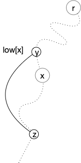
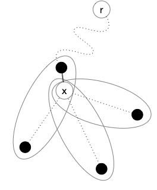
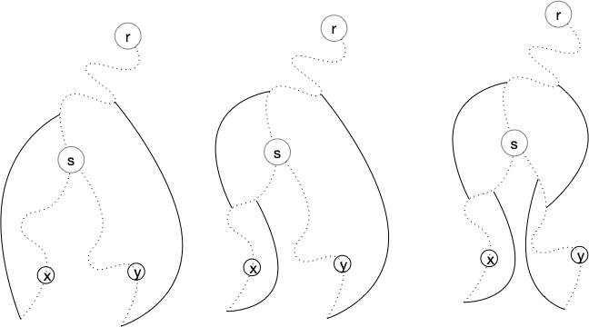
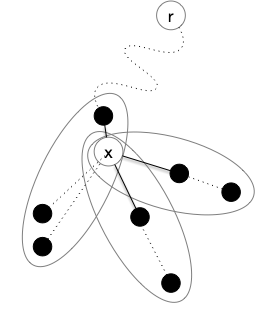


[Théorème de Kuratowski](https://fr.wikipedia.org/wiki/Graphe_planaire#Caract%C3%A9risation_de_Kuratowski_et_de_Wagner)


## Preuve d'un théorème de Jordan simplifié

> TBD suffisant pour les graphes où les sommets sont dénombrables.
> TBD si courbe alors polygone alors droites
> TBD Diesel théorème 4.1.1 (p83 et suivantes)
> TBD <https://minerve.ens-rennes.fr/images/Le_Th%C3%A9or%C3%A8me_de_Jordan_S.Quayle_V.Le_Gruiec..pdf>
> TBD - topologie et courbe fermée Jordan  : <https://pagesperso.g-scop.grenoble-inp.fr/~lazarusf/Enseignement/graphesPlans.pdf>

## Mineurs


La caractérisation des graphes planaire se fait par "_mineur exclu_". C'est à dire caractériser les graphes qui vont nous empêcher de réussir un dessin planaire


Soit $G$ un graphe. Un graphe $H$ est un mineur de $G$ s'il peut être obtenu par un nombre quelconque des opérations suivantes :

- suppression d'un sommet sans voisin
- suppression d'une arête
- contraction d'un arête: on fusionne l'arête en un nouveau sommet $z$ dont les voisins sont les voisins des anciens sommets formant l'arête


[mineurs de graphes](https://fr.wikipedia.org/wiki/Mineur_(th%C3%A9orie_des_graphes))


En deux mots, les mineurs sont les graphes cachés dans un graphe plus gros :



<https://fr.wikipedia.org/wiki/Mineur_(th%C3%A9orie_des_graphes)>



La notion de mineur rend  compte de l'intrication locale de chemins entre sommets. Ils ont donné lieu à un des plus joli théorème de théorie des graphes (et pourtant il y en a !), [le théorème de Roberston-Seymour](https://fr.wikipedia.org/wiki/Th%C3%A9or%C3%A8me_de_Robertson-Seymour). Ce théorème indique en effet que : 

- toute famille close par mineur peut être caractérisée par un nombre fini de mineurs exclu,
- Quelque soit le graphe $M$, il existe un algorithme en $\mathcal{O}(n^2)$ pour savoir si un graphe $G$ admet $M$ comme mineur.

En revanche, le théorème ne caractérise pas les algorithmes et ils ont une constante multiplicatives exponentielle en la taille du mineur à rechercher. Il n'est donc pas utilisé en pratique, mais la planarité fait partie de ces familles puisque :



Si est $G$ un graphe planaire alors tous ses mineurs le sont aussi.


Les trois opérations pour créer un mineur d'un graphe fonctionnent aussi sur son dessin :

- la suppression d'un sommet ou d'une arête ok
- la contraction d'un arête se fait en concaténant les courbes des arêtes supprimées, comme sur le dessin ci dessous.




On a déjà établi la proposition suivante :


Si $G$ est planaire, il ne peut avoir ni $K_5$ ni $K_{3,3}$ comme mineur


Clair puisque l'on a montré que :

- ni $K_5$ ni $K_{3,3}$ ne peuvent être planaire,
- un graphe n'est planaire que si ses mineurs le sont.



Il nous reste à faire la réciproque. Initialement faire par Kuratowski en 1930 dans le cadre des subdivisions de graphes, il a été ré-ecrit par Wagner en 1937 avec les mineurs. 


Voir [la page Wikipedia](https://fr.wikipedia.org/wiki/Graphe_planaire#Caract%C3%A9risation_de_Kuratowski_et_de_Wagner)


La caractérisation des graphes planaire est tres liée à la notion de 2-connexité. On va donc commencer par définir ce que c'est et démontrer des propriétés qui vont se révéler utiles en général et pour notre caractérisation en particulier.

## 2-connexité

<span id="définition-k-connexité"></span>



Un graphe est dit $k$-connexe si la suppression d'un ensemble quelconque de $k-1$ de ses sommets ne déconnecte pas $G$.

On appelle **_connectivité_** de $G$ et la note $\kappa(G)$, le plus grand $k$ tel que $G$ soit $k$-connexe.



Par exemple :

- un chemin est 1-connexe, si on supprime un sommet qui n'est pas une de ses extrémités on le déconnecte,
- un cycle est 2-connexe puisque supprimer un de ses sommets le transforme en chemin.

La $k$-connexité est bien une généralisation directe de la connexité puisqu'un graphe est connexe si et seulement si il est $1$-connexe.


Montrez que le degré d'un sommet d'un graphe $k$-connexe est forcément supérieur au égal à $k$


S'il existait un sommet avec un degré strictement plus petit que $k$, supprimer tous ses voisin le déconnecterait du reste du graphe ce qui est impossible pour un graphe $k$-connexe.


 Nous aurons uniquement besoin ici de la 2-connexité et de cette propriété en particulier :

<span id="2-connexité-cycle"></span>


Soit $G$ un graphe 2-connexe de strictement plus de 2 sommets. Quels que soient $u \neq v$ deux de ses sommets, il existe un cycle élémentaire dans $G$ passant par $u$ et $v$.



Le graphe étant connexe, il existe un chemin élémentaire entre $u$ et $v$. Notons le $u = x_1\dots x_p = v$.

Soit $x_i$ le plus grand $i\geq 1$ tel qu'il existe un cycle élémentaire contenant $x_1\dots x_i$. On a $1 < i \leq p$ car le graphe est 2-connexe, il existe donc un chemin  $u = y_1\dots y_q = v$ entre $u$ et $v$ dans le graphe privé de $x_1$. En notant $y_j$ le premier élément de ce chemin qui soit dans l'ensemble $\\{x_2, \dots x_p\\}$ (comme $y_q = v$, $y_j$ existe), disons $y_j = x_k$, on a un cycle élémentaire $x_1\dots x_k y_{j-1} \dots y_1$.

Si $i=p$ on a gagné, donc on peut supposer sans perte de généralité que $1< i < p$. Notez que ce cycle ne peut contenir de sommets du chemin $x_{i+1}\dots x_p$

En supprimant $x_i$ du graphe, il reste connexe et donc il existe un chemin entre $u$ et $v$. Dans ce chemin considérons le plus grand élément, disons $w$, qui fait parti du cycle et $x_j$ le premier élément après $w$ qui fait parti du chemin $x_{i+1}\dots x_p$. Comme $v=x_p$, $w$ et $x_j$ existent. Or la portion de chemin entre $w$ et $x_j$ ne contient aucun élément ni du cycle ni du chemin $x_{i+1}\dots x_p$. On peut donc construire un cycle élémentaire entre $u$ et $x_j$ en allant de $u$ à $w$ puis de de $w$ à $x_j$ et en revenant à $u$ par $x_i$ et l'autre bout du cycle :


Comme $j>i$ on a une contradiction.



Tout comme un graphe peut se décomposer en composantes connexes, on peut le décomposer en ses composantes 2-connexes


Un ensemble de sommet d'un graphe est 2-connexe si la restriction du graphe à cet ensemble est 2-connexe.



Un ensemble de sommets d'un graphe est une composante 2-connexe si :

- il est 2-connexe,
- il est maximal pour l'inclusion




Si $A$ et $B$ sont deux composantes 2-connexes d'un graphe connexe $G$, on a soit :

- $A \cap B = \emptyset$ et il existe au plus un unique couple $(x, y) \in A \times B$ tel que $xy \in E(G)$
- $\vert A \cap B \vert = 1$ et $xy \notin E(G)$ quelque soient $x \in A \backslash B$ et $y \in B \backslash A$




Comme $A$ et $B$ sont maximaux on peut supposer sans perte de généralité que $A \subsetneq A \cup B$. De là, si $\vert A \cap B \vert > 1$ alors $A \cup B$ serait connexe et supprimer n'importe quel élément de $A \cup B$ ne déconnecterait le graphe : $A$ n'est pas maximal ce qui est impossible.

Le même raisonnement s'applique ($A\cup B$ serait 2-connexe) :

- si $A \cap B = \emptyset$ et qu'il existait $x_1 \neq x_2$ tous deux dans $A$ avec chacun une arête vers un élément (pouvant être le même) de $B$
- si $\vert A \cap B \vert = 1$ et qu'il existait $x \in A \backslash B$ et $y \in B \backslash A$ avec $xy \in E(G)$.





Pour toute arête $xy$ d'un graphe il existe une unique composante 2-connexe contenant à la fois $x$ et $y$.




Comme $\\{x, y\\}$ est 2-connexe si $xy \in E(G)$, il fait partie d'une composante 2-connexe et la proposition précédente permet de conclure.



On appelle **_nœud d'articulation_** d'un graphe les sommets à l'intersection de deux composantes 2-connexes.





Soit $G$ un graphe connexe et $\mathcal{C}$ l'ensemble de ses composantes 2-connexes.

Le graphe $G' = (\mathcal{C}, E)$ tel que $xy$ est une arête si $x\cap y \neq \emptyset$ est un arbre.



Tout d'abord le graphe $G'$ est connexe. En effet si $A$ et $B$ sont deux composantes 2-connexe et $x \in A$, $y \in B$ alors il existe un chemin entre $x$ et $y$ dans $G$ et chaque arête est dans une composante connexe. cette succession de composantes connexe forme un chemin dans $G'$. 

De plus ce graphe est sans cycle car sinon le cycle dans $G'$ induirait un cycle dans $G$ dont les arêtes appartiendraient aux composantes 2-connexes du cycle de $G'$. Mais un cycle fait partie d'une unique composante 2-connexe ce qui est une contradiction puisque celle-ci aurait au moins 2 sommets en commun avec tous les éléments du cycle.




Trouver les composantes 2-connexes d'un graphe peut se faire linéairement en utilisant un DFS astucieux. C'est l'algorithme de Hopcroft et Tarjan (1973).

```pseudocode
fonction DFS(u: Sommet, t: entier, G: Graphe, 
             pos: *[]Sommet, pred: *[]Sommet, low: *[]Sommet, P: *Pile<(Sommet, Sommet)>) → [:]{Sommet}:

    pos[u] ← t
    low[u] ← t

    pour chaque voisin v de G[u]:
        si pos[v] == -1:                             # première fois que l'on voit v : uv est dans l'arbre
            pred[v] ← u
            P.empile((u, v))
            l ← DFS(v, t+1, G, &pos, &pred, &low, &P)

            low[u] ← min(low[u], low[v])             # mise à jour (1)

            si low[v] ≥ pos[u]:                      # on a trouvé une composante 2-connexe
                var s {Sommet} ← {}
                ajoute u et v à s

                (x, y) ← P.dépile()
                tant que (x, y) ≠ (u, v):
                    ajoute x et y à s
                    (x, y) ← P.dépile()
                
                ajoute s à la fin de l
        sinon si v ≠ pred[u]:                        # uv est un arc retour
            P.empile((u, v))
            low[u] ← min(low[u], pos[v])             # mise à jour (2)

    rendre l

algorithme 2_connexe(G: Graphe, r: Sommet):
    
    var pos []Sommet ← [-1 pour _ de [1 .. n]]
    var pred []Sommet ← [-1 pour _ de [1 .. n]]
    var low []Sommet ← [-1 pour _ de [1 .. n]]

    var P Pile<(Sommet, Sommet)> ← Pile<(Sommet, Sommet)>{}

    pred[r] ← r
    rendre DFS(r, 0, G, &pos, &pred, &low, &Pile)


```

Tout d'abord, il est clair que :

- le parcours est un DFS dont l'arbre associé est planté en $r$ et constitué des arêtes $\\{ \\{x, pred[x]\\} \mid x \neq r\\}$,
- la complexité totale de l'algorithme est en $\mathcal{O}(v(G) + e(G))$, 
- toute arête du graphe est soit une arête de l'arbre soit une arête $xy$ avec $y$ sur le chemin entre $x$ et $r$ (on les appelle des **_arêtes retours_**)
- `pos[x]`{.language-} est la distance entre $x$ et $r$ sur l'arbre du DFS

Commençons par caractériser les valeurs du tableau `low`{.language-} :


Pour tout sommet $s$, `low[s]`{.language-} correspond à la plus petite valeur `pos[x]`{.language} pour toute arête retour $xy$ avec :

- $x$ sur le chemin entre $s$ et $r$,
- $y$ dans le sous-arbre planté en $s$



pour tout $u$ on modifie `low[u]`{.language-} soit :

- en (2) lors de l'étude d'un arc retour partant de $u$
- en (1) après avoir examiné un de ses voisins pour la première fois.

On peut alors faire une récurrence partant des feuilles de l'arbres. Elles ne possèdent que des arêtes retour et donc `low[u]`{.language-} correspond au plus petit élément atteignable sur le chemin. Puis cette valeur est mise à jour après avoir examiné tout le sous arbre planté en $v$ qui est contenu dans le sous-arbre planté en $u$.



La proposition précédente montre que le chemin allant de $x$ à l'élément $y$ sur le chemin allant de $x$ à $r$ tel que `pos[y] = low[x]`{.language-} est dans la même composante 2-connexe puisqu'il existe un cycle élémentaire les reliant :



Utilisons cette propriété pour caractériser les composantes 2-connexes vis à vis d'un arbre DFS :


Les composantes 2-connexes de $G$ sont des sous-arbres partiels de l'arbre de DFS


Toute arête de $G$ est dans une unique composante 2-connexe. Cette arête est soit une arête de l'arbre DFS soit un arc retour et dans ce cas il forme un cycle avec le chemin allant d'une extrémité à l'autre dans le chemin. Dans les 2 cas, ceci prouve que tout le chemin allant d'une extrémité à l'autre de l'arête est dans la composante 2-connexe contenant l'arête.

Si $x$ et $y$ sont dans une composante 2-connexe $C$, il existe un chemin $x = z_1 \dots z_k = y$ avec $z_i \in C$. Ce qui précède montre que le chemin allant de $z_i$ à $z_{i+1}$ dans l'arbre est également dans $C$ pour tout $i$ donc le chemin entre $x$ et $y$ également.


Comme il n'y a qu'au plus seul sommet commun entre deux composantes 2-connexes, les composantes 2-connexes reliées à $x$ comme nœud d'articulation vont s'organiser comme dans la figure suivante dans l'arbre de DFS :




Mais pour que deux sommets qu ne sont pas sur le même chemin jusqu'à la racine puissent être dans une même composante connexe, il faut qu'ils soient liée par au dessus de leur jonction, par exemple comme une de ces façons :



 Il y en a d'autres, mais pour toutes on a `low[s] < pos[s]`. Ces éléments ne peuvent donc faire partie que d'une composante 2-connexe planté strictement plus haut que $s$. Pour un nœud d'articulation $x$ on peut affiner la représentation :



Seule la partie 2-connexe planté plus haut que $x$ peut être sur plusieurs branches, toutes les autres sont liées à $x$ par une seule arête. On a alors la proposition suivante qui fait fonctionner le tout :


Les composantes 2-connexes de $G$ sont des sous-arbres partiels de l'arbre de DFS. Si #u$ est la racine d'un tel sous-arbre , alors seule un de ses successeur y est également.


La conséquence précédente nous montre que l'algorithme fonctionne, si `low[v] ≥ pos[u]`{.language-} :

- $u$ est la racine d'une composante 2-connexe
- seul le successeur $v$ y est également

De là toutes les autres arêtes ajoutées et non encore supprimées après l'empilage de $(u, v)$ sont exactement toutes les arêtes de la composante 2-connexe.

> TBD exemple du cours papier

L'algorithme est donc à la fois très rapide (il est linéaire en la taille du graphe) et montre des propriétés insoupçonnée du DFS.



> TBD oreille



> TBD exemple
> 

Un graphe est 2-connexe si et seulement si il est décomposable en oreilles, c'est à dire que $G = (V(C) \cup_i V(P_i), E(C) \cup_i E(P_i))$ avec:

- $C$ un cycle élémentaire,
- $P_i$ est une oreille de $G_i = (V(C) \cup_{j <i} V(P_j), E(C) \cup_{j <i} E(P_j))$




un chemin $x^i_0\dots x^i_p$
- $E(P_i) \cap E(C) \cup_{j < i} E(P_j) = \emptyset$
- $V(P_i) \cap V(C) \cup_{j < i} V(P_j) = \\{x^i_0, x^i_p\\}$ (seuls les extrémités de $P_i$ sont dans l'union des graphes précédents)



> TBD exemple du cours

## Preuve de la réciproque

Commençons par nous restreindre aux graphes 2-connexes :


Si $G$ est planaire si et seulement si ses composantes 2-connexes le sont.



Si le graphe est planaire toute restriction de celui-ci l'est : $G$ planaire implique que ses composantes 2-connexes le soient.

Réciproquement on procède par récurrence sur le nombre de ses composantes 2-connexes. S'il y en a une c'est évident et s'il y en a plus, on peut décomposer le graphe en 2 :

- un graphe qui est la restriction de $G$ à une  composantes qui est une feuille dans l'arbre des composantes 2-connexes,
- un graphe qui est la restriction de $G$ à toutes les autres composantes

Ces deux graphes sont planaires par hypothèse de récurrence et on un unique sommet en commun. On peut les recoller en un seul graphe planaire via celui-ci puisque l'on peut s'arranger pour qu'il soit sur la face infinie d'un des deux graphes et l'insérer dans une des faces le contenant dans l'autre.



> TBD preuve Kuratowski juste avec 2-connexité: <https://www.math.cmu.edu/~mradclif/teaching/228F16/Kuratowski.pdf>

  
