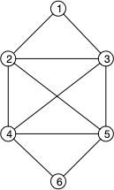

<!-- TBD 

- ajouter les tests 

-->

## Graphes Eulérien

On se concentre ici sur les graphes, on verra plus tard comment traiter (simplement) le cas des muli-graphes (orientés), en utilisant le graphe du cours comme exemple :



Nous allons le coder ainsi :

Nous allons le coder avec des dictionnaires et des ensembles :

```python
G = {
    "1": {"2", "3"},
    "2": {"1", "3", "4", "5"},
    "3": {"1", "2", "4", "5"},
    "4": {"2", "3", "5", "6"},
    "5": {"2", "3", "4", "6"},
    "6": {"4", "5"},
}
```


Pourquoi utiliser une telle structure ?


La complexité "utile" en code est souvent la complexité en moyenne puisque nous allons utiliser nos algorithmes pour de nombreux graphes différents. Donc si la complexité en moyenne de l'utilisation d'une structure est bonne (voir très bonne ici puisque toutes les complexités sont en $\mathcal{O}(1)$ en moyenne) et que sa manipulation est aisée on préférera l'utiliser même si sa complexité max peut être mauvaise ($\mathcal{O}(n)$ (avec $n$ le nombre de sommets) dans le pire des cas).


Attention cependant, cette structure est mutable : on peut modifier les sommets et les voisins. donc pour copier un graphe il faudra non seulement faire un nouveau dictionnaire mais aussi des nouveaux ensembles de voisins !

Pour tout copier en une seule fois on utilisera [le module copy](https://docs.python.org/fr/3.14/library/copy.html) de python :

```python
import copy

G2 = copy.deepcopy(G)
```



On aurait pu faire la copie en une ligne avec les [list comprehension](https://docs.python.org/3/tutorial/datastructures.html#list-comprehensions) de python : `G2 = {k: set(v) for k, v in G.items()}`{.language-}


### Algorithme de Hierholzer

1. Construction d'un premier cycle élémentaire : partir d'un sommet arbitraire et suivre des arêtes non encore utilisées jusqu'à revenir nécessairement à ce sommet (c'est garanti par la parité des degrés — chaque fois qu'on entre dans un sommet autre que le départ, il reste une arête pour en sortir).
2. Extension du circuit : tant qu'il existe un sommet du circuit courant ayant des arêtes non utilisées, on part de ce sommet, on construit un nouveau circuit avec les arêtes restantes (on pourra toujours retomber sur le sommet d'origine !), et on l'insère dans le circuit courant à cet endroit.
3. On répète jusqu'à épuisement de toutes les arêtes.


Faites l'algorithme. Ne vous posez pas trop de question d'optimisation. Faites le déjà fonctionner.



On peut épuiser tous les cycles avec le premier élément, puis recentrer le cycle syr le premier élément qui a des

### Tests

Générez aléatoirement des graphes eulériens (comme vu en cours) et mesurez le temps mis :

```python
import time

t1 = time.perf_counter()
# algorithme dont on veut mesurer le temps
t2 = time.perf_counter()

delta = t2 - t1
```

Pour un nombre de sommet donné, mesurer la moyenne du temps sur 10 générations aléatoires.

- Sortez la copie du graphe de l'algorithme elle ne fait que rajouter une constante.
- quelle est la forme de la courbe de complexité en fonction du nombre de sommets ?

```python
import matplotlib.pyplot as plt

fig, ax = plt.subplots(figsize=(20, 5))

ax.set_title("complexités temporelles")
ax.set_xlabel("valeur de l'exposant")
ax.set_ylabel("temps de calcul")

ax.plot(liste_nombre_sommets, mesures_temps, 'o-')

plt.show()
```

## Networkx

### Bases

- la bibliothèque : <https://networkx.org/documentation/stable/index.html>
- tuto : <https://networkx.org/documentation/stable/tutorial.html#nx-guides> (notez que l'on peut produire facilement un graphe de Networkx avec notre structure : `Gnx = nx.Graph(G)`{.language-} fonctionne)
- Dessiner : <https://networkx.org/documentation/stable/tutorial.html#drawing-graphs> et <https://networkx.org/documentation/stable/auto_examples/drawing/plot_labels_and_colors.html>
- graphe aléatoire :<https://networkx.org/documentation/stable/auto_examples/graph/plot_erdos_renyi.html>

### Euler

<https://networkx.org/documentation/stable/reference/algorithms/euler.html>

comparer avec votre implémentation ainsi que le temps mis pour résoudre.

## Mot de Bruijn


[Mots de Bruijn](../mots-bruijn/){.interne}


### Toutes les suites


Codez un algorithme permettant de générer tous les mots de longueurs $p$ d'un alphabet $A$ de $n$ lettres passé en paramètre sous la forme d'une liste.


### Résolution

Utilisez networkx pour générer des mots de Bruijn.

Attention, ce ne sont plus des graphes mais des multi-graphes orientés (des [`MultiDigraph`{.language-}](https://networkx.org/documentation/stable/reference/classes/multidigraph.html#networkx.MultiDiGraph)).
