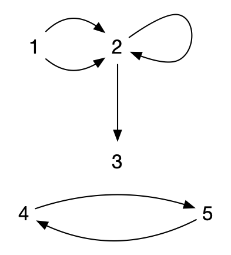
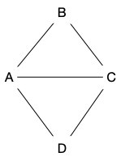
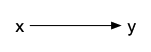
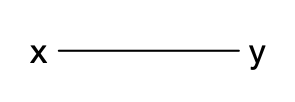
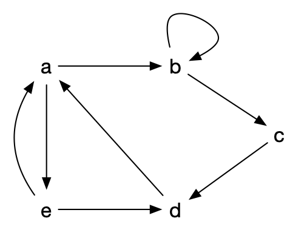
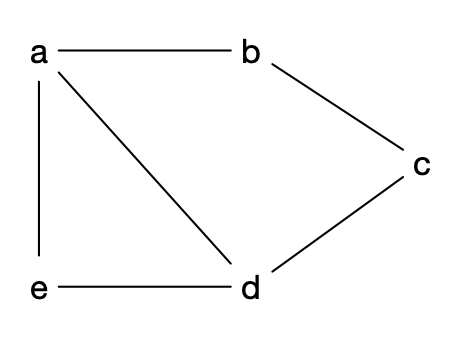

Définition de la structure de graphe et de ses composants (sommets et arêtes). On terminera cette partie en démontrant une première propriété fondamentale les liant.

Dans toute sa généralité, on peut définir un **_multi-graphe_** comme étant un triplet $G = (V, E, \phi)$ où :

- $V$ est un ensemble de **_sommets_** (**_vertices_**). 
- $E$ est un ensemble d'**_arcs_** (**_edges_**)
- $\phi: E \rightarrow V \times V$ une **_fonction d'incidence_** qui associe à chaque arête un couple (possiblement égaux) de sommets.

Cette définition permet de considérer des ensemble a priori non dénombrable, mais elle le fait au prix d'une grosse lourdeur de manipulation puisqu'il faut passer par une fonction d'incidence.

En pratique, on aura toujours un nombre fini de sommets et d'arêtes (ou au pire dénombrable), on choisit donc une définition plus restrictive, mais plus facilement manipulable en informatique :



Un **_multi-graphe_** est un couple $G = (V, E)$ où :

- $V$ est un ensemble fini de **_sommets_** (**_vertices_**)
- $E$ est une liste finie de d'éléments de $V \times V$ appelés **_arcs_** (**_edges_**)



Notez que la définition précédente s'étant sans problème aux ensemble infinis dénombrables.


Pour ne pas avoir à toujours rappeler l'ensemble des sommets et des arêtes d'une graphe, on utilisera parfois les notations suivantes :



Si $G$ est un multi-graphe, on note :

- $V(G)$ et $v(G)$ pour noter l'ensemble des sommets et leur nombre,
- $E(G)$ et $e(G)$ pour noter l'ensemble des arcs et leur nombre.



## Exemple

Le multi-graphe $G = (V, E)$ avec :

- $V = \\{1, 2, 3, 4, 5\\}$
- $E = ((1, 2), (2, 3), (2, 2), (1, 2), (4, 5), (5, 4))$

Peut se représenter graphiquement (sur le plan) :


Remarquez qu'un multi-graphe peur avoir :

- plusieurs fois le même arc : l'arc $(1, 2)$
- des _boucles_ : l'arc $(2, 2)$
  

## Utilité

Les multi-graphes sont des outils puissants de modélisation permettant de résoudre nombre de problèmes d'optimisation.

### Résolution de problème

Outre le problème évident de construction ou de maintien de réseaux (informatique, de transports ou encore sociaux), on peut aussi citer :

- [google maps](https://www.google.fr/maps/dir/). On cherche un itinéraire entre deux villes en ne connaissant à priori que ce qui se passe entre deux croisement consécutifs, mais on connaît tous les croisements,
- les contraintes d'allocations de ressources. Les sommets sont les antennes et les arêtes si il y a des interférences possibles, on cherche à trouver une [coloration du graphe](https://fr.wikipedia.org/wiki/Coloration_de_graphe),
- problèmes de transports où l'on veut distribuer le plus de ressources possibles dans un réseau routier/fluvial/informatique,

Les problèmes ci-dessus ont ceci de particulier qu'ils peuvent très facilement **se décrire localement** :

- le problème de la recherche d'itinéraire se décrit par une liste de croisement et, pour chaque croisement, une liste de ceux qu'il peut atteindre
- le problème d'allocation de ressources se décrit de même par une liste d'antenne et, pour chaque antenne, une liste de celles avec laquelle il y a interférence possible
- enfin, le problème de transport se décrit de la même manière que le problème d'itinéraire en ajoutant une capacité à chaque couple de croisement)

Mais la **solution cherchée est globale** :

- une suite de croisement pour le problème d'itinéraire
- une fréquence à associer à chaque antenne pour le problème d'allocation de ressources
- un flot sur chaque route pour le problème de transport

C'est une caractéristique générale :


Un problème pouvant se décrire localement mais dont la solution est globale peut **souvent** se modéliser puis se résoudre à l'aide de graphes.


### Modélisation

Ils permettent également de comprendre le réel en utilisant des classes particulières de multi-graphes. Par exemple :

- le modèle arboré des [arbres phylogénétique](https://fr.wikipedia.org/wiki/Arbre_phylog%C3%A9n%C3%A9tique) modélisent l'évolution des espèces
- des graphes aléatoire générés en utilisant par exemple [le modèle de Barabasi-Albert](https://fr.wikipedia.org/wiki/Mod%C3%A8le_de_Barab%C3%A1si-Albert) permettent de créer des graphes "_petit monde_" typiques des réseaux sociaux ou de l'internet.

### Esthétique

Enfin, ils procurent une satisfaction purement esthétique de part la grande beauté des démonstrations, de leurs théorèmes et de leurs algorithmes.

## Définition  d'un Graphe

Notre définition est tellement générale, qu'elle est très peu utilisée telle quelle. On utilisera souvent des cas particuliers selon le problème que l'on veut résoudre :



Un multi-graphe sera dit :
- **_sans boucles_** si es arcs commencent et finissent toujours sur nœuds différents.
- **_sans arcs multiples_** si une arête ne peut arriver qu'une seule fois (les arêtes sont un sous-ensemble de $V \times V$ : c'est une **relation**).
- **_non orienté_** si le sens d'une arête importe peu (une arête est alors un sous-ensemble à 2 éléments).



Ainsi, un **_multi-graphe non orienté sans boucle_** est un multigraphe tel que si $(x, y) \in E$ alors $(y, x) \in E$ et tel que $(x, x) \notin E$ pour tout $x \in V$.

Le cas le plus simple (et donc celui que l'on utilisera en priorité) est le multi-graphe sans boucle, sans arcs multiples et non orienté. On les appelle **_graphes_** et on peut les définir comme suit :


Un **graphe** est un couple $G = (V, E)$ où :

- $V$ est un ensemble fini. Ses éléments sont appelés **_sommets_**.
- $E$ est un sous-ensemble de $\\{ \\{x, y\\} \mid x \neq y \in V \\}$. Ses éléments sont appelés **_arêtes_**.



De cette définition minimale on pourra alors définir d'autres cas, comme le **_graphe orienté_** :



Un **_graphe orienté_** est un multi-graphe sans boucle et sans arcs multiples. C'est un couple $G = (V, E)$ où :

- $V$ est un ensemble fini
- $E$ est un sous-ensemble de $\\{ (x, y) \mid x \neq y \in V \\}$



Enfin, plus rarement, vous pourrez rencontrer des **graphes mixtes** qui permettent de rendre compte de situations réelles comme lorsque l'on modélise des réseaux routiers où il existe à la fois des routes à doubles sens et à sens unique et où l'on ne veut parcourir une route qu'une seule fois (pas une fois dans un sens et une fois dans l'autre pour les routes à double sens) :



Un **graphe mixte** est un triplet $G= (V, E, A)$ tel que $G_1=(V, E)$ soit un graphe non orienté et $G_2=(V, A)$ soit un graphe orienté.



Ou toutes les généralisations de ceux-ci comme :

- le **_graphe avec arêtes multiples_**
- le **_graphe avec boucles_**
- un **_multi-graphe mixte orienté_**
- ...

Il est important de connaître précisément de quels type de graphe on parle car les algorithmes ne fonctionnent pas toujours sur toutes les classes de graphes.

## Vocabulaire


Par abus de langage on écrira $xy$ pour designer une arête (_resp._ arc) plutôt que $\\{x, y\\}$ (_resp._ $(x, y)$).


### Parties de graphes

On a parfois envie de découper un graphe pour en étudier une partie (s'il est trop gros ou que certains sommet et/ou arêtes ne nous intéresse pas) ou au contraire de rabouter plusieurs graphes entres eux pour en former un plus gros. Il existe deux façons canonique de découper un graphe, supprimer soit des sommets, soit des arêtes :


Soit $G = (V, E)$ un (multi-)graphe (non) orienté. Si $V' \subsetneq V$ et $E' \subsetneq V' \times V' \cap E$, alors $\left.G\right|_{V'} = (V', E')$ est un **_sous-graphe_** de $G$.


Un sous-graphe admet deux cas particuliers :



Soit $G = (V, E)$ un (multi-)graphe (non) orienté, $V' \subsetneq V$ et $E' \subsetneq V' \times V' \cap E$.

- $G'=(V, E')$ est appelé **_graphe partiel_** ou encore un **_sous-graphe couvrant_** de $G$
- $G' = (V' , E' \cap V' \times V')$ est dit être un **_sous-graphe induit_** de $G$



Un cas d'intérêt particulier de sous-graphes induits pour les graphes sont les cliques et les stables :


Soit $G = (V, E)$ un graphe. L'ensemble $V' \subseteq V$ est dit être :

- une **_clique_** de $G$ si son sous-graphe induit par $V'$ est complet,
- un **_stable_** de $G$ si son sous-graphe induit par $V'$ est discret.



Par exemple pour le graphe $G$ suivant :

- $G' = (\\{A, B, C, D\\}, \\{ BC , CD\\} )$ est un graphe partiel de $G$
- $G'' = (\\{A, B, D\\}, \\{ AB , AD\\} )$ est un sous-graphe induit de $G$
- $\\{A, B, C\\}$ est une clique de $G$
- $\\{B, D\\}$ est un stable de $G$

### Taille et ordre



Pour un graphe (potentiellement orienté) $G = (V, E)$ on appellera :

- **_ordre_** le nombre de sommets d'un graphe et on le note $n$ par défaut
- **_taille_** le nombre d'arêtes d'un graphe et on le note $m$ par défaut



A ordre fixé, les graphes de taille maximum son dit **_complet_** :


Un graphe est **_complet_** s'il possède toutes les arêtes : pour tous $x, y \in V$ $xy$ est une arête. On le note $K_n$ et $m = n(n-1)/2$.


Réciproquement, un graphe sans arête est dit **_discret_** :


Un graphe est **_discret_** s'il ne possède aucune arête.


On peut noter qu'un graphe orienté ayant un nombre maximum d'arêtes est en fait un graphe (non orienté) complet. C'est pour cela que la définition d'un **_graphe orienté complet_** n'existe pas. On préfère parler de [tournoi](<https://fr.wikipedia.org/wiki/Tournoi_(th%C3%A9orie_des_graphes)>) :


Un **_tournoi_** est un graphe orienté $G=(V, E)$ tel que :

- si $xy \in E$ alors $yx \notin E$
- pour tous $x \neq y \in V$, soit $xy$ soit $yx$ est un arc de $G$.


### Arcs

Un **_arc_** $xy$ est un élément de $E$ pour les graphes orientés. On le représente graphiquement comme ça :

Quelques notations et définitions relatives aux arcs :



- $x$ est l'**_origine_** de l'arc,
- $y$ est la **_destination_** de l'arc.

On appelle **_voisinage sortant de $x$_** (**_neighbors_**) l'ensemble des arcs d'origine $x$ et on le note :

$$N^+(x) = \\{ y \mid xy \in E\\}$$

Son cardinal est appelé **_degré sortant_** de $x$ et est noté :

$$\delta^+(x) = \vert N^+(x) \vert$$

De la même manière, l'ensemble des arcs de destination $y$ est appelé **_voisinage entrant en $y$_** et est noté :

$$N^-(y) = \\{ x \mid xy \in E\\}$$

Son cardinal est appelé **_degré entrant_** de $y$ et on le note :

$$\delta^-(y) = \vert N^-(y) \vert$$



Lorsque l'on a besoin d'inclure l'élément dans le voisinage, on considère les voisinages fermés :



On appelle **_voisinage fermé de $x$_** l'ensemble des arcs d'origine $x$ plus $x$ et on le note :

$$N^+[x] =N^+(x) \cup \\{ x \\}$$

et

$$N^-[x] =N^-(x) \cup \\{ x \\}$$



### Arêtes

Une **_arête_** $xy$ est un élément de $E$ pour les graphes non orienté. On la représente graphiquement comme ça :

Contrairement aux arcs, il n'y a pas de distinction entre origine et destination :


Le **_voisinage_** d'un sommet $x$ est l'ensemble des sommets $y$ tels que $xy \in E$. On les notes :

$$N(x) = \\{ y \mid  xy \in E\\}$$

$$N[x] = N(x) \cup \\{ x \\}$$

Le cardinal d'un voisinage est appelé **_degré_**. On le note :

$$\delta(x) = \vert N(x) \vert$$



En remarquant que $0 \leq \delta(x) < n$ pour un sommet $x$ d'un graphe à $n$ sommets, prouvez la propriété suivante :



Montrez que dans tout graphe (à au moins 2 sommets) il existe au moins deux sommets différents ayant même degré.



C'est une application directe du [principe des tiroirs](https://fr.wikipedia.org/wiki/Principe_des_tiroirs).
Pour un graphe à $n$ sommet, le degré de tout sommet est entre 0 et $n-1$, soit $n$ possibilités. Si tous les sommets avaient des degrés différents il y en aurait 1 avec 0 voisins et un autre avec $n-1$, ce qui est impossible.



Enfin :


Si $G=(V, E)$  est un graphe, on note :

- $\Delta(G) = \max(\\{\delta(x) \vert x \in V\\})$
- $\delta(G) = \min(\\{\delta(x) \vert x \in V\\})$



Si tous les sommets ont mêmes degré, on les appelle régulier :


Un graphe $G$ est dit **k-_régulier_** (ou parfois juste **_régulier_**) si $\Delta(G) = \delta(G) = k$.


## Voisinages et arêtes

Nous allons présenter une première relation fondamentale pour les graphes. Cette propriété va lier une notion locale : les voisinages de sommets, à une notion globale : le nombre d'arêtes du graphe.

Avant d'énoncer la propriété, commençons par le visualiser. Considérons le graphe orienté avec boucles suivant :

On a par exemple :

- $N^+(a) = \\{ b, e \\}$,
- $\delta^+(b) = \delta^-(b) = 2$.



Calculez $\sum_x \delta^+(x)$ ? et $\sum_x \delta^-(x)$



$$\sum_x \delta^+(x) = \delta^+(a) + \delta^+(b) + \delta^+(c) + \delta^+(d) + \delta^+(e) = 2 + 2 + 1 + 1 + 2 = 8$$

$$\sum_x \delta^-(x) = \delta^-(a) + \delta^-(b) + \delta^-(c) + \delta^-(d) + \delta^-(e) = 2 + 2 + 1 + 2 + 1 = 8$$

On remarque que la boucle en $b$ est comptée pour $\delta^-(b)$ et pour $\delta^+(b)$.
On peut également remarquer que $\sum_x \delta^+(x) = \sum_x \delta^-(x) = \vert E \vert$.



On voit que $\sum_x \delta^+(x) = \sum_x \delta^-(x)$et vaut le nombre d'arcs du graphe orienté avec boucle.

Cette constatation va — peu ou prou — s'étendre aux graphes. Une version non orienté du graphe orienté avec boucles précédent pourrait être :

On a :

- $\delta(a) = 3$,
- $N(a) = \\{b, d, e \\}$.



Calculez $\sum_x \delta(x)$




$$\sum_x \delta(x) = \delta(a) + \delta(b) + \delta(c) + \delta(d) + \delta(e) = 3 + 2 + 2 + 3 + 2 = 12$$



On peut remarquer que $\sum_x \delta(x) = 2\vert E \vert$.

On peut maintenant démontrer :


Pour un graphe orienté avec boucle $G=(V, E)$, on a la propriété suivante :

$$ \sum_x \delta^+(x) = \sum_x \delta^-(x) = \vert E \vert$$

Pour un graphe $G=(V, E)$, on a :

$$ \sum_x \delta(x) = 2\vert E \vert$$




Pour un graphe orienté avec boucle, chaque arc $uv$ est unique. Il est compté exactement 1 fois dans la somme $\sum_x \delta^+(x)$ (pour $\delta^+(u)$), donc $\sum_x \delta^+(x) = \mid E \mid$.

Pour un graphe, chaque arête $uv$ est unique et est comptée 2 fois dans la somme $\sum_x \delta(x)$ (une fois pour $\delta(u)$ et une fois pour $\delta(v)$), donc $\sum_x \delta^+(x) = 2 \mid E \mid$.


