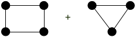
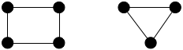
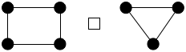
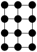
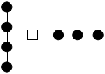
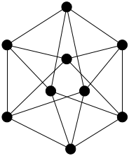
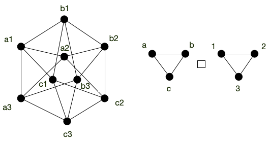
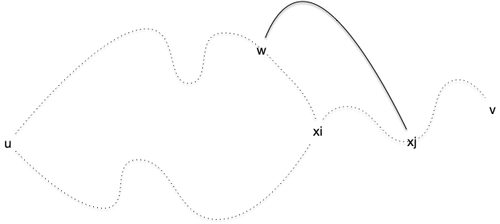

> TBD à recaser là où on en parle.

## Composition de graphes

Coller plusieurs graphes ensemble pour en former un plus gros peut se faire de multiples façons. Nous allons en montrer trois, classiques, mais il doit en exister bien d'autres.

Commençons par la plus simple, qui ne rajoute aucune arête entre les deux graphes que l'on compose :


Soient $G_1 = (V_1, E_1)$ et $G_2 = (V_2, E_2)$ deux graphes. On note $G_1 + G_2$ le graphe :

$$G_1 + G_2 = (V_1 \cup V_2, E_1 \cup E_2)$$



Que vaut :






On peut aussi utiliser l'approche opposée, qui consiste à ajouter toutes les arêtes possibles entre les deux graphes :


Soient $G_1 = (V_1, E_1)$ et $G_2 = (V_2, E_2)$ deux graphes. On note $G_1 \vee G_2$ la **liaison forte** entre $G_1$ et $G_2$. C'est le graphe :

$$G_1 \vee G_2 = (V_1 \cup V_2, E_1 \cup E_2 \cup \{ xy \mid x \in V_1, y \in V_2})$$



Que vaut :






Enfin, de façon plus subtile :


Soient $G_1 = (V_1, E_1)$ et $G_2 = (V_2, E_2)$ deux graphes. On note $G_1 \square G_2$ le **produit cartésien** entre $G_1$ et $G_2$. C'est le graphe :

$$G_1 \square G_2 = (V_1 \times V_2, E)$$

Avec $((x_1, x_2), (y_1, y_2)) \in E$ si :

- $x_2 = y_2$ et $x_1y_1 \in E_1$
- $x_1 = y_1$ et $x_2y_2 \in E_2$



Que vaut :






On peut aussi chercher l'approche inverse qui consiste à décomposer un graphe donné. C'est très efficace sur les graphes _"en pattern"_ :


La grille 2D est le produit cartésien de deux graphes, lesquels ?






Ce n'est cependant pas toujours aussi simple :

Le graphe suivant est le produit cartésien de deux cycles de longueurs 3. Montrez-le.




> TBD montrer comment le prouve. On commence par un triangle qu'on note (1, 1), (2, 1) et (3, 1) puis on propage pour voir comment on peut associer un label à chaque sommet.



## Graphes dérivés

A tout graphe on peut lui associer d'autres graphes, dérivés de celui-ci.

### Graphe complémentaire


<https://fr.wikipedia.org/wiki/Graphe_compl%C3%A9mentaire>


complémentaire de complémentaire = graphe

> TBD tout graphe est complémentaire d'un autre. le carré est identité

### Graphe adjoint


<https://fr.wikipedia.org/wiki/Line_graph>

Aussi appelé line graph

> TBD stable pour cycle, diminue pour chemin et augmente pour clique
> TBD tout graphe n'est pas adjoint d'un autre (exemple ?)
adjoint de adjoint = graphe

### Mineurs


<https://fr.wikipedia.org/wiki/Mineur_(th%C3%A9orie_des_graphes)>


> TBD très très important, a donné des caractérisation et des théorèmes extrêmement important en théorie des graphes.

> TBD rend compte de l'intrication locale de chemins entre sommets.
>

## Morphismes de graphes


[Les définitions d'une excellente chaîne d'informatique](https://www.youtube.com/watch?v=21bMUXO-QYQ)


Les notions définies dans cette partie le seront -- par commodité -- pour des graphes mais elles se généralisent directement à des graphes orienté ou à des multigraphes.

### Définitions


Soient $G = (V, E)$ et $G' = (V', E')$ deux graphes. Une fonction $f: V\to V'$ est un **_morphisme_** entre $G$ et $G'$ si $xy \in E$ implique $f(x)f(y) \in E'$.



> TBD exemple

On le voit dans l'exemple $f$ n'est pas forcément une bijection de $V$ dans $V'$ et l'implication n'est que dans un sens : l'arête  $f(x)f(y)$ peut exister dans $G'$ alors que $xy \notin E$. Pour avoir une correspondance parfaite entre $G$ et $G'$ il faut qu'il existe un **_isomorphisme_** entre eux :


Soient $G = (V, E)$ et $G' = (V', E')$ deux graphes.  Une fonction $f: V\to V'$ est un **_isomorphisme_** entre $G$ et $G'$ si :

- $f$ est une bijection
- $f$ est un morphisme entre $G$ et $G'$
- $f^{-1}$ est un morphisme entre $G'$ et $G$



Deux graphes isomorphes sont structurellement équivalents : il existe une bijection $f$ entre les deux ensembles de sommets tel que $xy$ est une arête du premier graphe si et seulement si $f(x)f(y)$ est une arête du second.

C'est à dire que les deux graphes ne diffèrent que par le nom de leurs sommets.

> TBD dire que c'est une relation d'équivalence et que les classes d'équivalences donnent les formes de graphes à $n$ sommets. Donner exemple à 3 ?

En ce sens, notez que le si et seulement si entre les arêtes n'est pas suffisant pour que les graphes soient équivalents

> TBD un chemin de longueur 3 dans une arête. On a bien le ssi mais les deux graphes ne sont clairement pas identiques.

L'identité est toujours un isomorphisme d'un graphe dans lui même, et certains graphes (les graphes complets par exemple) en admettent beaucoup d'autres. On appelle ces isomorphisme d'un graphe dans lui-même des automorphismes :


Un isomorphisme d'un graphe dans lui-même est appelé **_automorphisme_**.



> TBD exemple.


<https://www.bourbaki.fr/TEXTES/1125.pdf>


### Reconnaissance


<https://perso.ens-lyon.fr/eric.thierry/Graphes2009/jonas-lefevre.pdf>


Définissons le problème algorithmique associé :



- **nom** : isomorphisme de graphe
- **données** : deux graphes
- **question** : les deux graphes sont-ils isomorphes ?



Si on se donne une fonction $f$ allant de l'ensemble des sommets d'un graphe à un autre, il est facile de vérifier si c'est un isomorphisme entre les deux graphes ou non : le problème de l'isomorphisme de graphe est donc clairement dans NP.

En revanche, on ne connaît pas son status exact : on ne sait ni s'il est NPcomplet, ni s'il est polynomial. [Le meilleur algorithme connu](https://en.wikipedia.org/wiki/Graph_isomorphism_problem) est de complexité $2^{\mathcal{O}(\log^3(n))}$ ce qui est plus que polynomial mais moins qu'exponentiel. On verra que pour certaines classes de graphes, le problème est simple.

## $k$-connectivité

Finissons par définir la $k$-connexité :



Un graphe est dit $k$-connexe si la suppression de $k-1$ sommet de déconnecte pas $G$.



Il est clair qu'un graphe est connexe si et seulement si il est $1$-connexe. Les graphes 2-connexes vont avoir une certaine importance plus tard (lorsque l'on parlera de colorabilité et de planarité des graphes). Ils permettent d'avoir des graphes connexes qui résistent à la suppression d'un sommet. Les cycles sont un exemple canoniques de graphes 2-connexes :


Montrez que le degré d'un sommet d'un graphe $k$-connexe est forcément supérieur au égal à $k$


S'il existait un sommet avec un degré strictement plus petit que $k$, supprimer tous ses voisin le déconnecterait du reste du graphe ce qui est impossible pour un graphe $k$-connexe.


> TBD un peu compliqué comme premiere proposition.
> TBD transformer en série d'exercices :
> 1. il existe une cycle simple $x_1\dots x_k y_1 \dots y_p x_1$ car il existe $y_p$ voisin de $x_1$ car 2-connexe et on supprime $x_1$ puis chemin $c$ entre $y_p$ et $x_n$. On s'arrête à $y_1$ le premier de $c$ qui est un $x_i$
> 2. pour tout cycle simple qui s'arrête en $x_i$ il existe un chemin allant d'un élément du cycle à un $x_j$ avec aucun élément sur le cycle ou le chemin. On supprime $x_i$ puis même argument avec dernier du cycle et suivant sur le chemin.
> 3. en conclure qu'il existe un cycle entre $x$ et $y$
> 


Soit $G$ un graphe 2-connexe de strictement plus de 2 sommets. Quels que soient $u \neq v$ deux de ses sommets, il existe un cycle élémentaire dans $G$ passant par $u$ et $v$.



Le graphe étant connexe, il existe un chemin élémentaire entre $u$ et $v$. Notons le $u = x_1\dots x_p = v$.

Soit $x_i$ le plus grand $i>1$ tel qu'il existe un cycle élémentaire contenant $x_1\dots x_i$ ($i> 1$ existe car le degré de $u$ est strictement plus grand que 1. Soit un de ses voisins est un $x_i$ avec $i>1$ soit en supprimant $u$ le graphe reste connexe et il existe un chemin entre $x_1$ et le voisin non dans le chemin). Si $i=p$ on a gagné, donc on peut supposer sans perte de généralité que $1< i < p$. Notez que ce cycle ne peut contenir de sommets du chemin $x_{i+1}\dots x_p$

En supprimant $x_i$ du graphe, il reste connexe et donc il existe un chemin entre $u$ et $v$. Dans ce chemin considérons le plus grand élément, disons $w$, qui fait parti du cycle et $x_j$ le premier élément après $w$ qui fait parti du chemin $x_{i+1}\dots x_p$. Comme $v=x_p$, $w$ et $x_j$ existent. Or la portion de chemin entre $w$ et $x_j$ ne contient aucun élément ni du cycle ni du chemin $x_{i+1}\dots x_p$. On peut donc construire un cycle élémentaire entre $u$ et $x_j$ en allant de $u$ à $w$ puis de de $w$ à $x_j$ et en revenant à $u$ par $x_i$ et l'autre bout du cycle.

Comme $j>i$ on a une contradiction.

