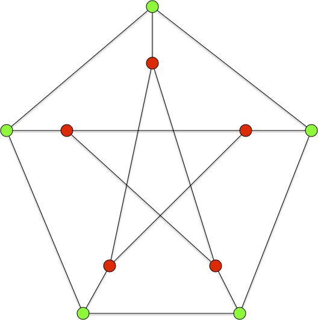
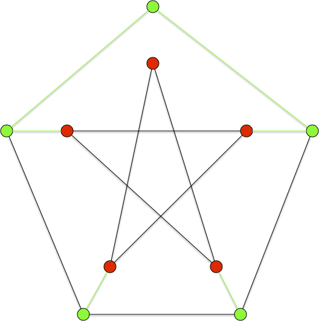
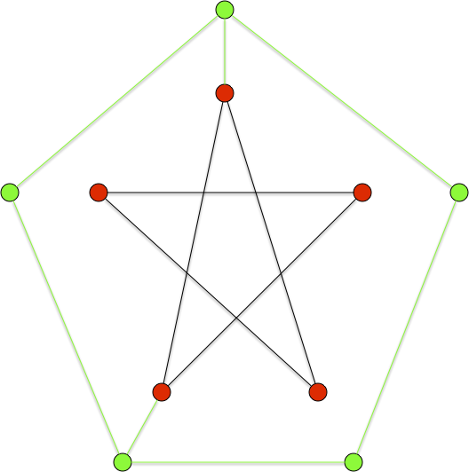
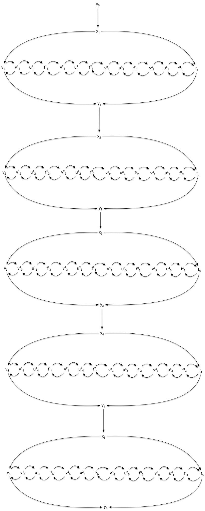
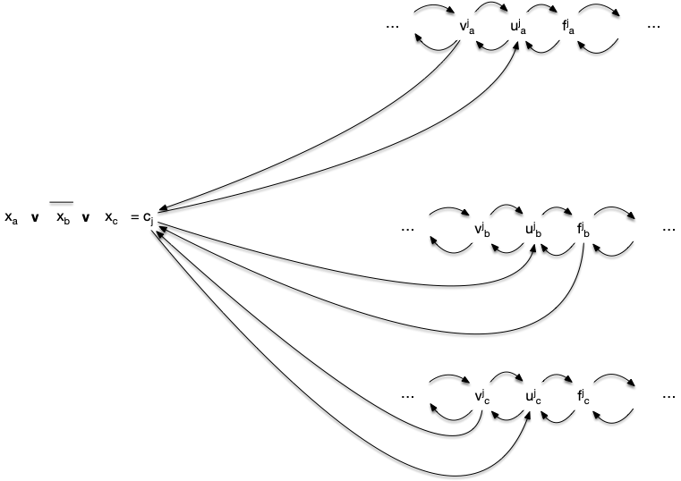
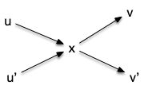

<div id="definition-graphe-hamiltonien"></div>

Un graphe (_resp._ graphe dirigé) admet un **_cycle_** (_resp._ **_circuit_**) **_hamiltonien_** s'il existe un cycle (_resp._ un circuit) élémentaire passant par tous les sommets.

Un **_graphe est hamiltonien_** s'il possède un cycle hamiltonien.


On doit ce problème au mathématicien [Hamilton](https://en.wikipedia.org/wiki/William_Rowan_Hamilton) qui a proposé de le résoudre [sous la forme d'un casse tête](https://en.wikipedia.org/wiki/Icosian_game) qu'il commercialisera et correspond à l'exercice suivant :


Montrer que le graphe suivant possède un cycle hamiltonien






La définition suivante est également très utilisée :


Un graphe (_resp._ graphe dirigé) admet un **_chemin hamiltonien_** s'il existe un chemin élémentaire passant par tous les sommets.



Tous les graphes ne possèdent cependant pas de cycle hamiltonien. Par exemple le graphe suivant, appelé [graphe de Petersen](https://fr.wikipedia.org/wiki/Graphe_de_Petersen) (que l'on est amené à revoir), n'en possède pas :



Donald Knuth explique dans The Art of Computer Programming que le graphe de Petersen est _«une configuration remarquable qui sert de contre-exemple à de nombreuses prédictions optimistes sur ce qui devrait être vrai pour tous les graphes3 »_.


Montrez que le graphe de Petersen ne possède pas de cycle hamiltonien.


S'il suffit d'exhiber un exemple pour montrer qu'un graphe est hamiltonien, pour montrer qu'il ne l'est pas il faut en démontrer l'impossibilité.

On peut utiliser pour cela séparons les sommets du graphe en deux parties : les sommets rouges et les sommets verts :



Supposons qu'il existe un cycle hamiltonien $x_1\dots x_n$. Soit $x_ix_{i+1}$ est une arête dont les sommets sont de couleurs différentes. Si $j>i$ est le plus petit entier tel que $x_jx_{j+1}$ est une arête dont les sommets sont de couleurs différentes, alors la couleur de $x_{i+1}$ est identique à celle de $x_j$ et donc il ne peut y avoir qu'un nombre pair d'arêtes dont les sommets sont de couleurs différentes. Soit 0, 2 ou 4 arêtes ce qui, par symétrie, suppose qu'un des quatre graphes ci-après possède aussi un cycle hamiltonien avec les arêtes vertes (jonction entre couleur et sommets de degré 2), ce qui est impossible :

| :-: | :-: |
|||
|||



Le problème du cycle pou du chemin hamiltonien est un problème classique en théorie des graphe et est présent dans nombre de problèmes concrets. C'est en particulier [le problème du voyageur de commerce](https://fr.wikipedia.org/wiki/Probl%C3%A8me_du_voyageur_de_commerce) qui est la base de toute optimisation de tournée ou de nombre de problèmes liés au transport.

## Propriétés

Lorsque le graphe a beaucoup d'arêtes, il va être facile de trouver des chemin ou cycles/circuit hamiltonien.

### Tournois

Commençons par un résultat surprenant sur les graphes orientés. S'il est évident que les graphes complets ont tous des chemins hamiltoniens, c'est également le cas pour les tournois !

<div id="tournoi-exercice"></div>

Montrez que tout [tournoi](../structure/#definition-tournoi) admet un chemin hamiltonien.



On peut le démontrer par récurrence. Un tournoi à 1 sommet admet un chemin hamiltonien. Si on suppose cela vrai pour tout tournoi à moins de $n$ sommets, soit $T = (V, E)$ un tournoi à $n+1$ sommets.

On prend $x$ un sommet de ce tournoi. Le graphe $T$ privé de $T$ est un tournoi à $n$ sommets. Il existe alors un chemin hamiltonien $c_0\dots c_{n-1}$ dans la restriction de $T$.

Si $xc_{0}$ est un arc de $T$, alors $xc_0\dots c_{n-1}$ est un chemin hamiltonien. Sinon si $c_{n-1}x$ est un arc de $T$, alors $c_0\dots c_{n-1}x$ est un chemin hamiltonien.

Si on est dans aucun des cas précédents, il existe $0 <i<n-1$ tel que $c_{i}x$ et $xc_{i+1}$ sont deux arcs de $T$ : $c_0\dots c_{i}xc_{i+1}\dots c_{n-1}x$ est un chemin hamiltonien de $T$.


Preuve un peu plus élégante que la précédente.

On peut le démontrer par récurrence. Un tournoi à 1 sommet admet un chemin hamiltonien. Si on suppose cela vrai pour tout tournoi à moins de $n$ sommets, soit $T = (V, E)$ un tournoi à $n+1$ sommets.

On prend $x$ un sommet de ce tournoi. On a alors que $N^+(x) \cup N^-(x) \cup \{ x \} = V$ et que les restrictions de $T$ à $N^+(x)$ ou à $N^-(x)$ restent des tournois et ont strictement moins de $n+1$ sommets.

Il existe alors :

- un chemin hamiltonien $c_0\dots c_k$ dans la restriction de $T$ à $N^+(x)$
- un chemin hamiltonien $c'_0\dots c'_l$ dans la restriction de $T$ à $N^-(x)$

On en conclut que le chemin $c'_0 \dots c'_l x c_0 \dots c_k$ est hamiltonien dans $T$, ce qui termine la preuve par récurrence.



Ce résultat ne se généralise pas aux cycle hamiltonien. Il suffit de considérer le tournoi $G = (\{x_1,\dots, x_n\}, E)$ avec $x_ix_j \in E$ si et seulement si $i< j$. Ce tournoi ne peut clairement posséder aucun circuit.

### Cycles et chemins

Bien que le problème général soit NP-complet, beaucoup d'instances sont polynomiales, en particulier lorsque l'on considère des graphes avec beaucoup d'arêtes.


Si $G=(V, E)$ est un graphe tel que $\delta(x) \geq \vert V \vert / 2$ pour tout sommet $x\in V$, alors $G$ est hamiltonien (_ie._ admet un cycle Hamiltonien).



Le graphe $G$ est connexe car s'il ne l'était pas sa plus petite composante connexe serait de taille inférieure ou égale à $\vert V \vert / 2$ et donc les sommets de cette composante ont tous un un degré strictement plus petit que $\vert V \vert / 2$ (on pourrait aussi utiliser [cette propriété](../chemins-cycles-connexite/#prop-connexe){.interne} et le fait que $\vert E \vert = \frac{1}{2}\sum_x\delta(x) \geq \frac{1}{4}\vert V \vert^2>  \frac{1}{2}(\vert V \vert-1)(\vert V \vert-2)$ pour $\vert V \vert \geq 3$).

Soit $C=x_0\dots x_k$ un chemin le plus long dans $G$. Si $x_0x_k \in E$, le cycle est hamiltonien. Sinon en effet, par connexité, il existerait une arête $yx_j$ avec $y\notin C$ et le chemin suivant serait strictement plus long que $C$ : $yx_j\dots x_kx_0\dots x_{j-1}$.

On suppose alors que $x_0x_k \notin E$.

Tous les voisins de $x_0$ et $x_k$ sont dans $C$ sinon on pourrait le prolonger.
De plus si pour tout $x_i$ tel que $x_ix_k \in E$ on a $x_{i+1}x_0 \notin E$, $C$ contiendrait $x_0$, tous les successeurs des voisins de $x_k$ (dont $x_k$ puisque $x_{k-1}x_k$) et il y en a au moins $\vert V \vert / 2$, plus tous les voisins de $x_0$, c'est à dire encore au moins $\vert V \vert / 2$ : $C$ posséderait au moins $\vert V \vert + 1$ élément, ce qui est impossible.

Il existe donc $x_i$ ($0 < i <k$) tel que $x_ix_k \in E$ et a $x_{i+1}x_0 \in E$ : le chemin $x_0\dots x_ix_k\dots x_{i+1} = x'_0\dots x'_k$ est alors de longueur maximum et comme $x'_kx'_0 \in E$ on est ramené au cas précédent et $x'_0\dots x'_kx'_0$ est un cycle hamiltonien.



La propriété se généralise même :


Si $G=(V, E)$ avec $\vert V \vert = n \geq 3$ est un graphe tel que $\delta(x) + \delta(y) \geq \vert V \vert$ pour tous sommets non adjacents $x, y \in V$, alors $G$ admet un chemin Hamiltonien.



On suppose que $G$ n'est pas hamiltonien. Comme le graphe complet est hamiltonien il va exister $G'=(V, E')$ tel que :

- $E \subseteq E'$
- $G'$ n'est pas hamiltonien (_ie._ pas de cycle hamiltonien)
- si on ajoute l'arête $uv$ à $G'$ il devient hamiltonien.

Il existe donc dans $G'$ un chemin hamiltonien $x_0\dots x_{n-1}$ tel que $u=x_0$ et $v=x_{n-1}$. Pour tout $0\leq i<n-1$, on ne peut avoir $x_ix_k \in E'$ et $x_{i+1}x_0 \in E'$ sinon, tout comme la preuve précédente, on peut construire le cycle hamiltonien $x_0\dots x_ix_{n-1}\dots x_{i+1}x_0$.

De là, $\delta(x_0) + \delta(x_{n-1}) < n$ dans $G'$ puisqu'au plus une des deux arêtes $x_ix_k$ ou $x_{i+1}x_0$ est dans $E'$ pour $0\leq i<n-1$.
Or comme $E \subseteq E'$ on aurait également $\delta(x_0) + \delta(x_{n-1}) < n$ dans $G$, ce qui est impossible.



On le voit, lorsque les graphes ont beaucoup d'arêtes ils vont posséder un cycle hamiltonien.

## NP-complétude

Formalisons les problèmes du cycle hamiltonien dans ses versions orienté et non orienté :



- **Nom** : cycle (_resp._ circuit) hamiltonien
- **Entrée** : Un graphe (_resp._ graphe orienté) $G$
- **Question** : $G$ possède-t-il un cycle hamiltonien ?



Et faisons de même pour les chemins hamiltonien dans ses versions orienté et non orienté :



- **Nom** : chemin (_resp._ chemin orienté) hamiltonien
- **Entrée** : Un graphe (_resp._ graphe orienté) $G$
- **Question** : $G$ possède-t-il un chemin hamiltonien ?



Les quatre problèmes ci-dessus sont clairement des problèmes de décisions de NP. Nous allons montrer qu'ils sont NP-complet par des réduction depuis [le problème 3-SAT](/cours/algorithmie/problème-SAT/#3-sat){.interne}.

### Chemin orienté hamiltonien

Pour transformer une instance de 3-SAT en une instance de recherche d'un chemin hamiltonien dans un graphe, il faut :

- encoder les différentes variables dans leur état 1 ou 0
- gérer les clause pour que tout ne soit pas possible
- s'assurer qu'il n'existe de chemin hamiltonien que si et seulement si le système est satisfiable.

Nous allons appliquer la réduction à [l'exemple du problème 3-SAT](/cours/algorithmie/problème-SAT/#3-sat-exemple).

#### Encodage des variables

Chaque variable est encodé par le sous-graphe suivant :


Il possède uniquement deux chemins passant par tous les sommets :

- $y_{i-1}x_iv_iv^1_iu^1_if^1_i\dots v^j_iu^j_if^j_i\dots v^m_iu^m_if^m_if_iy_i$ : le chemin vrai
- $y_{i-1}x_if_if^1_iu^1_iv^1_i\dots f^j_iu^j_iv^j_i\dots f^m_iu^m_iv^m_iv_iy_i$ : le chemin faux

Le graphe de toutes les variables est composé de l'union de tous ces graphes. Pour l'exemple cela donne :



Il possède $2^5$ chemin hamiltoniens selon que l'on passe par le chemin vrai ou le chemin faux pour chaque variable.

#### Encodage des clauses

On encode chaque clause $c_i = l_i^1 \lor l_i^2 \lor l_i^3$ par un sommet $c_i$ que l'on ajoute au graphe des variables et tels que ses voisins sont, pour $1\leq k \leq 3$ :

- $v^i_jc_i$ et $c_iu^i_j$ si $l_i^k = x_j$,
- $f^i_jc_i$ et $c_iu^i_j$ si $l_i^k = \overline{x_j}$,



Le graphe complet de l'exemple est :


#### Satisfiabilité

Si la conjonction de clause est satisfiable, il existe un chemin hamiltonien passant pas les chemins vrais des variables vraies, les chemins faux des variables fausses et passant par chaque clause pour un des littéral vrai de la clause. Pour l'exemple :


Réciproquement s'il existe un chemin hamiltonien :

- il passe par les chemins vrais ou les chemins faut de chaque variable
- il passe par une clause en passant par le vrai ou le faux

Notez que pour un chemin hamiltonien, si $v^j_ic_i$ est un arc (_resp._ $f^j_ic_i$), alors $c_iu^j_i$ en est un aussi, sinon $f^j_i$ (_resp._ $v^j_i$) ne peut être atteint. Cette construction justifie le fait que la clause est satisfaite pour un de ses littéraux (ceci montre qu'il faut 3 sommets v, f et u pour cette construction et qu'on ne peut s'en sortir qu'avec des sommets v et f).

On en conclut :


Le problème de recherche d'un chemin hamiltonien dans un graphe dirigé est NP-complet.


### Circuit orienté hamiltonien

La précédente preuve s'applique de manière identique pour la recherche d'un circuit hamiltonien en ajoutant un arc de $y_n$ à $y_0$. On en conclut :


Le problème de recherche d'un circuit hamiltonien dans un graphe dirigé est NP-complet.


### Cycle et chemins hamiltonien

On va montrer ici que la recherche d'un chemin (_resp._ circuit) hamiltonien dans un graphe orienté est équivalent à chercher un chemin (_resp._ cycle) hamiltonien dans un graphe. Pour cela on va associer à tout graphe dirigé un graphe.

On effectue la transformation suivante, pour chaque sommet du graphe orienté :



On en associe 3 dans le graphe non orienté associé, permettant de séparer les arcs entrant des arcs sortants :


Il est alors évident que si le graphe non orienté a un chemin (_resp._ cycle) hamiltonien, alors le graphe orienté possède également un chemin (_resp._ circuit) hamiltonien. La réciproque est aussi trivialement vrai ce qui montre que les problèmes orientés ou non orientés sont équivalent.


[exemple de la réduction](https://www.youtube.com/watch?v=5SaQa_wlel8)


### Chemin le plus long

La NP-complétude des chemins et cycles hamiltoniens nous permet de conclure qu'il est illusoire de tenter de trouver un algorithme efficace pour résoudre le problème du chemin le plus long :



- **Nom** : chemin le plus long
- **Entrée** : Un graphe (_resp._ graphe orienté) $G$
- **Sortie** : Un chemin élémentaire le plus long possible.



Résoudre ce problème revient en effet clairement à résoudre le problème du chemin hamiltonien.


Montrer que si l'on pouvait résoudre le problème d'un chemin le plus long dans un graphe, on pourrait résoudre le problème du chemin hamiltonien.


Le plus long chemin élémentaire possible dans un graphe passe par tous les sommets. Donc un chemin élémentaire de longueur $\vert V \vert -1$ est hamiltonien.


Notez comment une petite différence — remplacer sommet (hamiltonien) par arête (eulérien) — rend un problème soit très simple soit très compliqué à résoudre.

Il existe un cas où trouver un chemin le plu long est facile : dans les graphes orientés qui ne contiennent pas de circuit (souvent appelé _DAG_, _direct acyclic graph_).

On appelle **_tri topologique_** d'un graphe orienté $G = (V, E)$ un ordre total $<$ sur les sommets du graphe tel que $xy \in E$ implique $x < y$ dans l'ordre.


Montrer que :

1. un graphe orienté ne peut admettre de tri topologique que s'il n'a pas de cycle
2. pour un DAG, il existe toujours un sommet qui n'a pas de voisins entrant (_resp._ sortant)
3. en déduire qu'un DAG admet un tri topologique
4. conclure sur le fait qu'un graphe est un DAG si et seulement s'il admet un tri topologique
   
   
   1 :

Soit $c_0\dots c_k$ un cycle ($c_k = c_0$), quelque soit l'ordre total entre les sommets du graphe, il existe $i$ tel que $c_{i+1} < c_i$ ce qui est impossible si un tel ordre était topologique.

2 :

Supposons que tout sommet d'un DAG admette un voisin entrant et un voisin sortant, et prenons une arête $x_0x_1$ de ce graphe. Il existe donc une arête $x_1x_2$. Si $x_2 = x_0$ il existe un cycle dans le graphe, sinon il existe un chemin $x_0x_1x_2$. Il existe donc une arête $x_2x_3$. Si $x_3 \in \{x_0, x_1 \}$ il existe un cycle et sinon on a un chemin $x_0x_1x_2x_3$. On peut ainsi recommencer jusqu'à tomber sur un cycle par finitude du graphe. Ce n'est pas un DAG.

Le raisonnement est identique pour les voisins entrant.

3 :

en supprimant itérativement les sommets sans voisins rentrant d'un DAG (le graphe obtenu en supprimant un sommet d'un DAG est toujours un DAG puisque supprimer un sommet ne rajoute pas de cycle), on obtient un tri topologique.

4 :

On a montré que :

- cycle implique non tri topologique
- DAG (non cycle) implique tri topologique

On a donc bien l'équivalence : tri topologique est équivalent à DAG.




Utiliser le tri pour trouver un chemin élémentaire de longueur maximum dans un DAG.


algorithme sur tri topologique :

```text
Entrée :
    - un graphe orienté G = (V, E)
    - un tri topologique V0 < ... < Vn des éléments de V
Initialisation :
    longueur(x) = 0 pour tout sommet x
    predecesseur(x) = x pour tout sommet x
    V' = {}, E' = {}
Algorithme :
    pour v allant de V0 à Vn:
        pour chaque voisin sortant w de v:
            si longueur(w) < longueur(v) + 1:
                longueur(w) = longueur(v) + 1
                predecesseur(w) = v
    soit a l'élément de V ayant la plus grande longueur
    chemin = [a]
    x = a
    tant que x est différent de predecesseur(x):
        x = predecesseur(x)
        ajoute x au début de chemin
Retour :
    chemin
```

La complexité est de $\mathcal{O}(\vert E \vert + \vert V \vert)$, ce qui est optimal.

Pour prouver l'algorithme, on montre par récurrence sur $\vert V \vert$ que `longueur(x)` est la longueur d'un plus long chemin finissant en `x`.

Si $\vert V \vert = 1$, c'est Ok. On suppose la propriété vraie à $\vert V \vert = n$. Pour $\vert V \vert = n +1$ on remarque que `longueur(Vi)` est la même pour le graphe $G$ et pour le graphe $G$ auquel on a enlevé $v_{n+1}$ pour tout $i \neq n+1$. Comme tous les prédécesseurs de $v_{n+1}$ seront vus pour l'algorithme et que `longueur(Vi)` ne change pas après l'étape $i$ on en conclut que la récurrence est vraie à $\vert V \vert = n +1$.


## Applications

### Voyageur de commerce

Problème vu sous l'angle algorithmique dans le cours d'algorithmie :


[Chemins et cycle](../projet-chemins-cycles){.interne}


> TBD formaliser ça en graphe.
