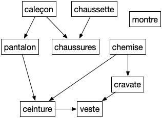

> TBD DFS et Problème d’ordonnancements
>
> TBD tri topologique dans un DAG avec un DFS + à la visite ajoute en fin de liste. Ensuite on regarde la liste à l'envers

Un [problème d'ordonnancement](https://fr.wikipedia.org/wiki/Th%C3%A9orie_de_l%27ordonnancement) peut se modéliser par un DAG nommé graphe de dépendances où si $xy$ est une arête alors il faut faire $x$ avant de pouvoir faire $y$.


Pourquoi ne doit-il pas y avoir de cycles dans un graphe de dépendance ?


Il est clair que s'il y a un cycle on ne peut réaliser le projet.


Vous résolvez des problèmes d'ordonnancement tous les jours comme par exemple comment s'habiller le matin (voir graphe ci-après)


Montrer que le tri topologique est une solution au problème d'ordonnancement. Appliquez le au problème de s'habiller le matin.


De plus un tri topologique fait que lorsque l'on s'attelle à la tache $v_i$ on a déjà fait tous ses prédécesseurs (ses prés-requis).


C'est encore un exemple où les contraintes sont locales et ou l'on cherche une solution globale.
