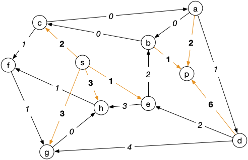

<!-- début résumé -->

Une série d'exercices pour s'entraîner à la modélisation par les flots.

<!-- end résumé -->

## Problème du transport de marchandise

Un problème de transport est une variation sur les flots.

On considère que l'on a un graphe orienté $G = (V, E)$ et que l'on a dans ce graphe deux sous ensembles :

* un ensemble $S \subsetneq V$ de sources qui ont une marchandise en excès
* un ensemble $P \subsetneq V$ de puits qui demandent cette marchandise

Les sommets qui ne sont ni dans $S$ ni dans $P$ sont dit sommets intermédiaires.

On a de plus une valuation $v(u)$ pour chaque arc de $G$ qui détermine le coût de transport d'une unité sur cet arc.

Le problème est alors de transporter les ressources des sommets de $S$ aux sommets de $P$ à coût minimum.


Montrer que l'on peut modéliser ce problème comme un problème de flot maximum à coût minimum.


On ajoute au graphe :

* un sommet $s$ et des arcs $sx$ pour $x \in S$ de coût 0 et de capacité l'excédent en $x$
* un sommet $p$ et des arcs $xp$ pour $x \in P$ de coût 0 et de capacité la demande en $x$

On considère que les capacités des autres arcs du graphe sont égales à $+\infty$.

Le problème du transport de marchandise revient à trouver le flot maximum à coût minimum.


Le graphe suivant est un problème de transport :

Le coût de transport est sur les arcs et les demandes (nombres négatifs)/excès (nombres positifs) de marchandises sont en gras à côté des nœuds.


Résoudre le problème de transport du graphe précédent.


Le graphe exemple transformé en problème de flot est :

Les capacités sont en gras (les arcs sans capacités sont considérés comme étant de capacité infini) et les coûts sont sur les arcs (les arcs sans coûts sont considérés comme étant de coût nul).

On peut redessiner le réseau sous cette forme :

Le flot étant nul au départ, le graphe d'écart pondéré est égal à :

Un chemin de poids min entre $s$ et $p$ pourra alors être : $scap$ de poids 0 et qui permet d'augmenter le flot de 2 :

On a de là le graphe d'écart :

Un chemin de poids min entre $s$ et $p$ pourra alors être : $sebp$ de poids 2 et qui permet d'augmenter le flot de 1 :

Le flot est maximum, l'algorithme de Ford et Fulkerson nous donnant une coupe min valant 3 :



## Problème du transport amoureux

Des héros littéraires ont décidé de se marier. On considère pour simplifier qu'ils sont tous hétérosexuels et qu'ils ont préétablis une matrice d'affinité : un cœur dans la case signifie que la ligne et la colonne sont intéressées l'une par l'autre.

|         |Cléopâtre|Iphigénie|Juliette|Fanny|Chimène|
|  :-:    |   :-:   |   :-:   |   :-:  |:-:  |  :-:  |
|Achille  |     ♥   |    ♥    |        |     |       |
|César    |     ♥   |         |        |  ♥  |       |
|Rodrigue |         |         |    ♥   |     |   ♥   |
|Roméo    |         |         |    ♥   |     |   ♥   |
|Marius   |         |         |    ♥   |  ♥  |       |

Pour un graphe simple $G = (V, E)$ un couplage $M$ est un un ensemble d'arêtes deux à deux disjointes (pour tout sommet $x$, il existe au plus 1 arête de $M$ telle que $x$ soit une de ses extrémités).


Montrez que ce problème peut s'écrire comme un problème de couplage maximum dans un graphe


On peut écrire le graphe suivant, en liant les affinités par une arête. Le graphe est bi-parti car les mariages sont ici hétérosexuels :

Comme on ne peut marier une personne qu'une seule fois, c'est bien un problème de couplage (l'arête choisie est le mariage).



Un graphe simple $G = (V, E)$ est biparti s'il existe $V_1$ et $V_2$ tels que $V = V_1 \cup V_2$, $V_1 \cap V_2 = \emptyset$ et tel que toute arête de $E$ a une extrémité dans $V_1$ et l'autre dans $V_2$.


Montrer que comme ce graphe est bi-parti, on peut modéliser le problème de couplage comme un problème de flot maximum.


Pour le transformer en problème de flot on peut créer le réseau suivant, avec des capacités de 1 partout :

Cela fonctionne car pour chaque chaîne augmentante, on va la saturer par un entier (donc 1) : on est assuré que le flot maximum sera entier, on ne va pas marier à moitié une personne.


Une fois le problème modélisé, résolvez le.


Il existe deux solutions où tout le monde est marié à la fin. Lesquelles ?


En résolvant le problème on trouve :

* Iphigénie - Achille
* Cléopâtre - César
* Juliette - Rodrigue
* Fanny - Marius
* Chimène - Roméo

Il y a aussi la solution classique où vous échangez les maris de Juliette et Chimène.



Notez que si l'on ne se restreint pas aux mariages hétérosexuels, le graphe n'est plus biparti. Le problème du couplage dans un graphe ne peut plus se résoudre comme un problème de flot, il faut utiliser [l'algorithme d'Edmonds](https://fr.wikipedia.org/wiki/Algorithme_d%27Edmonds_pour_les_couplages) pour le résoudre.


Si l'on veut rajouter des amants (chaque personne peut avoir un conjoint et/ou un amant), le problème devient NP-difficile.


Ce problème est un exemple pratique du fait que si les capacités sont entières, le flot sera lui aussi entier.

## Code

Utilisez les codes du cours pour résoudre informatiquement les deux problèmes précédents.