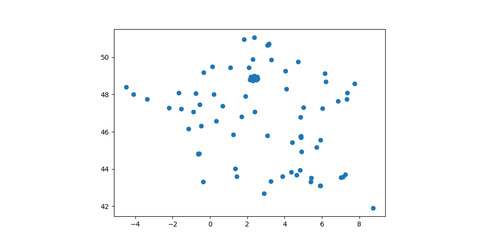

<!-- début résumé -->

On utilise un fichier de données pour créer un graphe de proximité géographique.

<!-- fin résumé -->

Nous allons dans ce projet utiliser deux bibliothèques d'analyse des données très utilisées :

* [pandas](https://pandas.pydata.org/) pour la gestion des données sous forme de matrices nommées [dataframe](https://pandas.pydata.org/docs/reference/api/pandas.DataFrame.html)
* [geopandas](https://geopandas.org/en/stable/) qui ajoute à pandas la gestion de données géographiques

Nous n'allons pas expliquer tous les tenants et aboutissants de ces bibliothèques mais j'espère que le fait de les utiliser vous donnera envie d'en savoir plus.



1. Créer un dossier nommé `projet-chemin-min`{.fichier}. C'est là que nous allons mettre tous les fichiers du projet.
2. Ouvrez le projet soit :
   * dans vscode (`menu fichier > ouvrir le dossier...`)
   * dans un notebook



## Les données

Nous utilisons le fichier [`villes_france_30000.csv`](./villes_france_30000.csv){.fichier} qui contient une liste des 30000 plus grandes villes françaises au format csv.


Téléchargez le fichier [`villes_france_30000.csv`](./villes_france_30000.csv){.fichier} et placez le dans votre projet.

Vous pouvez regarder le fichier dans vscode (Installez le plugin [Rainbow csv](https://marketplace.visualstudio.com/items?itemName=mechatroner.rainbow-csv) pour visualiser plus facilement les fichiers csv)



Si vous ouvrez ce fichier directement avec un excel français, cela ne fonctionnera pas correctement car le séparateur de champ est le `;` pour un excel en langue française (la `,` étant le séparateur de décimal). C'est en revanche bien la  `,` pour un excel en langue anglaise.

Ceci se produit également lorsque vous exportez des fichiers... Donc faites attention à ce que vos import/export soient correct.


### Installation des bibliothèques

Nous allons utiliser python pour lire et traiter ces données. Commençons donc par installer les bibliothèques qui nous serons nécessaires. Dans un terminal de vscode, tapez :

```
python -m pip install pandas geopandas
```

Dans les fichiers python utilisant pandas et geopandas, on commencera toujours par les importer avec les lignes suivantes :

```python
import pandas as pd
import geopandas as gpd
```


Créez un fichier `main.py` où l'on placera tout le code. Copiez/collez y les deux lignes précédentes.


### Lecture des données


Testez les codes suivants pour vérifier que vous avez bien lu les données


#### Lecture du fichier dans un data frame

```python
df = pd.read_csv("./villes_france_30000.csv", skipinitialspace=True)
```


On a créé un *dataframe* pandas qui contient nos données.

On a utilisé le paramètre `skipinitialspace`{.language-}  de la méthode [`read_csv`{.language-} de pandas](https://pandas.pydata.org/docs/reference/api/pandas.read_csv.html) pour avoir bien des villes qui ne commencent pas par des espaces.


#### Aperçu du contenu

```python
print(df)
```


Si vous voulez voir le fichier en entier `print(df.to_string())`{.language-}


#### Types des colonnes

Un dataframe est une sorte de tableau excel où chaque ligne a un type. Il est crucial de toujours vérifier que les types des colonnes sont bien ce qu'ils devraient être. Un type incorrect est souvent le signe d'un mauvais chargement ds données :

```python
print(df.columns)
print(df.dtypes)
```

Vous devez obtenir le fait que :

* les colonnes `idx`, `INSEE` et `population` doivent être des entiers,
* les colonnes `latitude` et `longitude` doivent être des réels,
* la colonne `nom` doit être une chaîne de caractère (nommé `object` en pandas)

```
idx              int64
 INSEE           int64
 nom            object
 latitude      float64
 longitude     float64
 population      int64
dtype: object
```



Le [code INSEE](https://fr.wikipedia.org/wiki/Code_officiel_g%C3%A9ographique) n'est pas le code postal. Voir [ce lien](http://www.bevernage.com/curiosites/cp_insee.htm) par exemple pour en saisir les différences (et, au passage, faire un voyage dans le temps au niveau du site web).




Quel est le code INSEE de la ville de Marseille ?




Solution par morceaux :

1. récupérer une colonne avec pandas : `df["nom"]`{.language-}
2. afficher un résumé de la colonne : `print(df["nom"])`{.language-} (si on veut tout afficher, il faut commencer par transformer la colonne en chaîne de caractère : `print(df["nom"].to_string())`{.language-})
3. récupérer les colonnes dont le com est marseille : `df["nom"] == "Marseille"`{.language-}. C'est une liste de booléen
4. récupérer les lignes dont le nom est marseille : `df[df["nom"] == "Marseille"]`{.language-}

Solution finale :

```python
print(df[df["nom"] == "Marseille"])
```



## Données géographiques

Nos données contiennent à la fois des données :

* *normales* comme le nom u la population pour chaque ville
* géographes avec la latitude et la longitude

Pour pouvoir utiliser les données géographiques de façon efficace, on a l'habitude de les regrouper en classes particulières. Toutes les classes et possibles et leurs utilisations sont décrites dans la bibliothèque [Shapely](https://shapely.readthedocs.io/). Citons en 3 parmi le plus utilisées :

* [des points](https://shapely.readthedocs.io/en/stable/manual.html#points) pour nos coordonnées GPS
* [des Polygones](https://shapely.readthedocs.io/en/stable/manual.html#polygons) pour des surfaces connexes comme des arrondissements (pour les pays non connexes comme la France on utilisera des [collections de polygone](https://shapely.readthedocs.io/en/stable/manual.html#collections-of-polygons))
* [lignes](https://shapely.readthedocs.io/en/stable/manual.html#linestrings) pour des chemins.

De plus, on utilise la bibliothèque GeoPandas (que vous avez déjà du installer) pour une utilisation aise de celle-ci.

### Points à partir des coordonnées

On va créer un *GeoDataFrame* qui contient nos données.

La différence avec un DataFrame pandas est l'ajout d'une colonne `geometry` (**obligatoire** en geopandas) qui contient... La géométrie de nos données. Dans notre cas :

* géométrie est un point (longitude, latitude)
* le système de coordonnée est le système gps : <https://epsg.io/4326>

Faisons ça :

```python
# ...

villes = gpd.GeoDataFrame(df, geometry=gpd.points_from_xy(df.longitude, df.latitude))
villes.set_crs("EPSG:4326")
```


Il est crucial de toujours bien renseigner le système de coordonnées ([CRS](https://www.youtube.com/watch?v=xJyJlKbZFlc&list=PLewNEVDy7gq3DjrPDxGFLbHE4G2QWe8Qh&index=8) pour Coordinate Reference Systems) lorsque l'on traite de données géographiques.


### Représentation graphique

On utilise le [tutoriel matplotlib]({{ "/tutoriels/matplotlib"  }}) pour représenter graphiquement nos villes :

```python
# ...

import matplotlib.pyplot as plt

fig, ax = plt.subplots(figsize=(10, 5))

villes.plot(ax=ax)

plt.show()
```


Représentez graphiquement les villes de plus de 50000 habitants.



```python
import matplotlib.pyplot as plt

fig, ax = plt.subplots(figsize=(10, 5))

villes[villes["population"] > 50000].plot(ax=ax)

plt.show()
```





Combien y en a-t-il ?



```python
print(len(villes[villes["population"] > 50000]))
```



### Supprimons l'île de France

On le voit sur la représentation graphique, l'île de France regroupe trop de granges villes par rapport au reste de la France métropolitaine : on va supprimer toutes les villes de l'île de France sauf Paris.

Pour cela, commençons par trouver l'île de France.


Utilisez [cet outil](http://norbertrenner.de/osm/bbox.html) pour déterminer un rectangle (une *bounding box*) englobant l'île de France




En très gros grain j'obtiens un polygone (avant dernier résultat) valant : `2.02,48.7,2.72,48.98`.




Il faut transcrire ce rectangle en coordonnées géographique. Ceci est facile avec la bibliothèque shapely. On peut utiliser [`shapely.geometry.box`{.language-}](https://shapely.readthedocs.io/en/stable/manual.html#shapely.geometry.box) dont les paramètres correspondant à la deuxième ligne du site déterminant les bounding box. Avec mes coordonnées ça fait :

```python
import shapely.geometry

île_de_France = shapely.geometry.box(2.02, 48.7, 2.72, 48.98)
```

On peut maintenant utiliser la puissance de GeoPandas et de ses outils de gestion géographique. Ces outils sont principalement des méthodes de la classe [`GeoSeries`{.language-}](https://geopandas.org/en/stable/docs/reference/api/geopandas.GeoSeries.html#geopandas.GeoSeries) qui correspond à la colonne geometry.



En utilisant la méthode [`GeoSeries.within()`](https://geopandas.org/en/stable/docs/reference/api/geopandas.GeoSeries.within.html), déterminez le nombre de villes de plus de 50000 habitants en île de France (ou tout du moins dans votre *bounding box*).



```python
print(len(villes[villes["geometry"].within(île_de_France)]))
```




En déduire le nombre (et les noms) des villes de plus de 50000 habitants de l'île de France.




On peut procéder de 2 façons. La plus simple est de commencer par extraire les villes de l'île de france, puis de ne garder que celle de plus de 50000 habitants :

```python
v2 = villes[villes["geometry"].within(île_de_France)]
print(v2[v2["population"] > 50000])
print(len(v2[v2["population"] > 50000]))

```

Mais on peut aussi faire mieux et combien les 2 requêtes par un ET logique (qui se dit `&`{.language-} en pandas et geopandas) :

```python
print(villes[villes["geometry"].within(île_de_France) & (villes["population"] > 50000)])
print(len(villes[villes["geometry"].within(île_de_France) & (villes["population"] > 50000)]))
```

On retrouve bien les même villes, ouf.


On finalise le tout en gardant Paris :

```python
v2 = villes[(~villes.geometry.within(île_de_France)) | (villes["nom"] == "Paris")]
grandes_villes = v2[v2["population"] > 50000]
```

En les représentant graphique, j'obtiens :


## Distance entre villes

Commençons par extraire une ville du tableau. Par exemple Marseille.

La ligne suivante :

```python
marseille_df = villes[villes["nom"] == "Marseille"]
```

Rend non pas une ville (une ligne du tableau), mais un dataFrame contenant toutes les lignes dont la colonne `"nom"`{.language-} vaut `"Marseille"`{.language-} (il n'y en a qu'une). Si on l'affiche avec `print(marseille_df)` :

```
   idx  INSEE        nom  latitude  longitude  population                  geometry
1    2  13200  Marseille      43.3        5.4      800550  POINT (5.40000 43.30000)
```


L'index d'une ligne est le 1er paramètre. Ici $1$. **Attention**, cet index ne correspond pas forcément au numéro de ligne du dataFrame.


Récupérer une ligne se fait avec les 2 méthodes :

* `.iloc[x]` : pour récupérer la $i$ème ligne du dataFrame
* `.loc[x]` : pour récupérer la ligne d'index `x` du dataFrame


On voit qu'en pandas et geoPandas, on peut accéder aux données en utilisant des crochets `[]`{.language-} de plusieurs manières. Supposons que l'on ait un dataFrame nommée `df`{.language-} :

* `df[nom]`{.language-} rend la colonne (qui est de type [Series](https://pandas.pydata.org/docs/reference/api/pandas.Series.html) ou [GeoSeries](https://geopandas.org/en/stable/docs/reference/geoseries.html) si c'est une géométrie) de nom `nom`{.language-}.
* `df.nom`{.language-} où nom est un nom de colonne fonctionne aussi, même si je suis moins fan de cette notation.
* `df.loc[index]`{.language-} rend la ligne d'index `index`{.language-}
* `df.iloc[i]`{.language-} rend la $i$ème ligne du dataFrame
* `df[vecteur_booléen]`{.language-} rend un dataDrame des lignes où `vecteur_booléen`{.language-} est vrai.
* `df.loc[index, nom]`{.language-} rend la colonne de nom `nom`{.language-} pour la ligne d'index `index`{.language-}
* `df.iloc[i, nom]`{.language-} rend la colonne de nom `nom`{.language-} pour la $i$ème ligne


Utilisons ceci pour trouver Marseille dans les données


En notant que l'index d'une ligne d'un dataFrame est le 1er paramètre, retrouvez la ligne marseille du dataFrame `marseille_df`{.language-}



Comme marseille est le 1ère ligne du dataFrame `grandes_villes`{.language-} :

```python
marseille = marseille_df.iloc[0]
```

En *affichant* le dataFrame `marseille_df`{.language-}, on voit que l'index de la ligne est 1 (le 1er paramètre). On peut aussi connaître la liste des index d'un dataFrame, ici `marseille_df`{.language-} avec la commande : `marseille_df.index.tolist()`{.language-}

```python
marseille = marseille_df.loc[1]
```



Déterminer la distance entre deux géométries se fait avec la méthode distance. Par exemple pour connaître la distance entre la première ville du dataFrame `grandes_villes`{.language-} et marseille :

```python
print(grandes_villes.iloc[0]["geometry"].distance(marseille["geometry"]))
```

Ce qui est pratique avec pandas, c'est qu'on peut aussi appliquer cette méthode à une colonne :

```python
print(grandes_villes["geometry"].distance(marseille["geometry"]))
```

La dataFrame que l'on affiche est une dataFrame à autant de lignes que le nombre de grandes villes (avec le même index) et une seule colonne, la distance avec Marseille.

Si l'on veut connaître la distance entre deux villes deux à deux, on peut utiliser la méthode `apply` des colonnes :

```python
d = grandes_villes["geometry"].apply(lambda x: grandes_villes["geometry"].distance(x))
print(d)
```

L'objet `d`{.language-} est une dataFrame où :

* les index de lignes correspondent aux index des lignes de `grande_villes`{.language-}
* les noms de colonnes correspondent aux index des lignes de `grande_villes`{.language-}
* chaque cellule est une distance.

Si on veut connaître la distance entre la ville d'index $i$ et celle d'index $j$ :

```python
i, j = 2, 91
print(d.loc[i, j])
```

Pour connaître l'index d'une ville, on peut procéder comme ça :

1. la dataFrame : `grandes_villes`{.language-}
2. la dataFrame avec une ligne : `grandes_villes[grandes_villes["nom"] == "Marseille"]`{.language-}
3. les index de cette dataFrame : `grandes_villes[grandes_villes["nom"] == "Marseille"].index`{.language-}, qui est une colonne
4. l'index de l'unique élément : `grandes_villes[grandes_villes["nom"] == "Marseille"].index[0]`{.language-}


Quelle est la distance entre Marseille et Rennes ?



```python
i = grandes_villes[grandes_villes["nom"] == "Marseille"].index[0]
j = grandes_villes[grandes_villes["nom"] == "Rennes"].index[0]

print(d.loc[i, j])
```



## Graphe des grandes villes

On va créer un graphe :

* dont les sommets sont les villes de Métropole (hors île de France) de plus de 50000 habitants
* il y a une arête entre la ville $x$ et la ville $y$ si la distance entre les deux est inférieure à `MAX_DIST`{.language-}

En utilisant ce qui précède :


Gréez un graphe orienté $G=(V, E)$ et une valuation $f$ en python tel que :

* $V$ est l'ensemble des noms des villes de plus de 50000 habitants
* $E$ est l'ensemble des couples $(u, v)$ tel que la distance entre les villes de noms $u$ et $v$ est plus petite que 2
* $f(u, v)$ est la distance les villes de noms $u$ et $v$



```python
MAX_DIST = 2
G = {}
f = {}
for i in grandes_villes.index:
    nom_i = grandes_villes.loc[i]["nom"]
    G[nom_i] = set()
    for j in grandes_villes.index:
        if d.loc[i, j] <= MAX_DIST:
            nom_j = grandes_villes.loc[j]["nom"]
            G[nom_i].add(nom_j)
            f[(nom_i, nom_j)] = d.loc[i, j]

```



On peut ensuite représenter graphiquement ce graphe :

```python
# ...
import matplotlib.lines as mlines

fig, ax = plt.subplots(figsize=(10, 5))

grandes_villes.plot(ax=ax)

for u in G:
    i = grandes_villes[grandes_villes["nom"] == u].index[0]
    point_i = grandes_villes.loc[i]["geometry"]
    for v in G[u]:
        j = grandes_villes[grandes_villes["nom"] == v].index[0]
        point_j = grandes_villes.loc[j]["geometry"]
        ax.add_line(mlines.Line2D((point_i.x, point_j.x), (point_i.y, point_j.y)))        
plt.show()

```

J'obtiens ce graphe là (essayez d'obtenir le même) :



Ce graphe est-il connexe ?

Vous utiliserez l'algorithme [connexité](../chemins-cycles-connexite#algorithme-connexe-toutes){.interne} du cours pour déterminer les composantes connexes.


Non, la corse n'est pas attachée au continent avec une distance de 2. Les deux composantes connexes que l'on obtient sont :

```python
{'Aix-en-Provence', 'Charleville-Mezieres', 'Rennes', 'Quimper', 'LaRochelle', 'Villeurbanne', 'Arles', 'Sarcelles', 'Orleans', 'Chambery', 'Montauban', 'Troyes', 'Laval', 'Brest', 'Calais', 'Nantes', 'Nice', 'Lorient', 'Saint-Etienne', 'Besancon', 'Strasbourg', 'Angers', 'Bordeaux', 'Caen', 'Rouen', 'Niort', 'Amiens', 'Mulhouse', 'Merignac', 'Tours', 'Pau', 'LeHavre', 'Grenoble', 'Limoges', 'Toulon', 'Beziers', 'LaSeyne-sur-Mer', 'Saint-Quentin', 'Antibes', 'Poitiers', 'Montpellier', 'Marseille', 'Venissieux', 'Metz', 'Nancy', 'Reims', 'Valence', 'Belfort', 'Toulouse', 'Nimes', 'Chateauroux', 'Bourges', 'Clermont-Ferrand', 'Saint-Nazaire', 'LeMans', 'Lyon', 'Lille', 'Paris', 'Dunkerque', 'Pessac', 'Avignon', 'Tourcoing', 'Chalon-sur-Saone', 'Cholet', "Villeneuve-d'Ascq", 'Cannes', 'Beauvais', 'Perpignan', 'Roubaix', 'Dijon', 'Colmar'}
```

et

```python
{'Ajaccio'}
```




Quelles est la distance minimale à utiliser pour qu'il le soit ?



Il faut trouver la distance minimale en partant d'Ajaccio.

```python
i = grandes_villes[grandes_villes["nom"] == "Ajaccio"].index[0]

print(d[i].sort_values())
```

C'est la ville d'index 4 ui est la plus proche :

```python
print(grandes_villes.loc[4])
```




Ajouter au graphe l'arête minimale nécessaire pour rendre le graphe connexe.



On ajoute l'arête `{Ajaccio, Nice}` ainsi que sa valuation.

```python
i = grandes_villes[grandes_villes["nom"] == "Ajaccio"].index[0]
proche = d[i].sort_values().index[1]

G['Ajaccio'].update({'Nice'})
G['Nice'].update({'Ajaccio'})

f[('Ajaccio', 'Nice')] = d.loc[i, proche]
f[('Nice', 'Ajaccio')] = d.loc[i, proche]
```



J'obtiens au final le graphe suivant :


## Graphe géographique

> TBD utilisation de networkx

