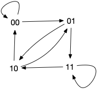

<!-- début résumé -->

Des graphes eulérien là où ne s'y attend pas. Une application qui montre encore une fois comme preuve d'existence et algorithme de création de structure sont intimement liés.

<!-- fin résumé -->

Commençons par motiver ce projet : **le problème du digicode**

> On a encore oublié ce fichu code de la porte d'entrée. Quel est le moyen le plus rapide de trouver le bon code ?

### Formalisation du problème

Il faut trouver un _mot_ de longueur $p$ d'un _alphabet_ $\mathcal{A}$ à $n$ caractères (un mot est une suite de $p$ caractère de $\mathcal{A}$).

**Exemple :**
Les mots de longueur $p=3$ de l'alphabet $\\{0, 1\\}$ à $n=2$ caractères. Il y a $n^p = 2^3 = 8$ mots de longueur 3 différents qui sont :

- $000$
- $001$
- $010$
- $011$
- $100$
- $101$
- $110$
- $111$

Si l'on veut trouver une chaîne de caractère qui contient tous les mots de longueur $p$ d'un alphabet à $n$ caractère on peut coller bout à bout tous les mots.

**Exemple :**
Dans l'exemple cela donne par exemple le mot : $000001010011100101110111$ de longueur $p \cdot n^p = 3 \cdot 2^3 = 24$.

### Tous les mots

Pour trouver tous les mots de longueur $p$ d'un alphabet $\mathcal{A} = [a_0, \dots, a_{q-1}]$, nous allons procéder par étapes.

Commencez par montrer que :

Si l'on possède l'ensemble $M$ de tous les mots de longueur $p$ de l'alphabet $\mathcal{N} = [0, 1, \dots, q-1]$, il est facile de trouver tous les mots de longueur $p$ de l'alphabet $\mathcal{A} = [a_0, \dots, a_{q-1}]$.



On utilise la bijection $f$ qui a un mot $m=n_0\dots n_{p-1}$ associe $f(m) = a_{n_0}\dots a_{n_{p-1}}$


On peut donc se focaliser sur l'énumération des mots de longueur $p$ de l'alphabet $\mathcal{N} = [0, 1, \dots, q-1]$. Soit $m = m_0\dots m_{p-1}$ un mot de longueur $p$ de l'alphabet $\mathcal{N} = [0, 1, \dots, q-1]$ tel qu'il existe $m_i \neq q-1$. On note : $\mbox{suivant}(m, q) = n_0 \dots  {n}_{p-1}$ le mot $n$ tel que :

- si $m_{p-1} < q-1$ alors :
  - $n_i = m_i$ pour $0 \leq i < p-1$
  - $n_{p-1}$ $= m_{p-1} + 1$
- si $m_{p-1} = q-1$ alors soit j le plus grand indice tel que $m_j \neq q-1$ :
  - $n_i = m_i$ pour $i < j$
  - $n_j = m_j + 1$
  - $n_i = 0$ pour $i > j$


Montrez que la fonction $\mbox{next}()$ permet d'énumérer tous les mots de longueur $p$ de l'alphabet $\mathcal{N} = [0, 1, \dots, q-1]$.


Codez la fonction `suivant(m, q)`{.language-} qui donne le successeur de $n$.



```python

def suivant(m, q):
    if m[-1] != q - 1:
        return m[:-1] + [m[-1] + 1]

    else:
        i = len(m) - 1

        while i > -1 and m[i] == q - 1:
            i -= 1

        if i == -1:
            return m
        else:
            return m[:i] + [m[i] + 1] + [0] * (len(m) - i - 1)
```

Les suites obtenues sont bien deux à deux différentes car elles sont ordonnées lexicographiquement.


En déduire un algorithme (que vous coderez), qui rend tous les mots de longueur $p$ d'un alphabet à $q$ caractères.



```python

n = [0] * p

print(n)
while n != [q-1] * p:
    n = suivant(n, q)
    print(n)
```

Les suites obtenues sont bien deux à deux différentes car elles sont ordonnées lexicographiquement.


### Le plus court

La longueur la plus petite possible d'une chaîne de caractères qui contiendrait tous les mots serait que les mots se chevauchent : les $p-1$ derniers caractères du i-ème mot seraient égaux aux $p-1$ derniers caractères du (i+1)-ème mot.


Montrez que la taille minimale théorique est de :

$$
1 \cdot p  + (n^p - 1) \cdot 1 = p - 1 + n^p
$$

caractères.


Dans le cas où les mots se chevauchent, chaque mot de compterait que pour 1 nouveau caractère dans la chaîne, à part le premier mot qu'il faudrait écrire entièrement : le 1er mot compte pour $p$ caractères les autres comptent uniquement pour 1 caractère, d'où la formule demandée.


Le gain serait de : $\frac{p-1 + n^p}{pn^p} \simeq \frac{1}{p}$, on diviserait donc la taille par $p$, ce qui n'est pas négligeable.

**Exemple :** La longueur minimale est de $3-1 + 2^3 = 10$, qui est bien plus petit que 24.

Sauf que l'on ne pas pas si une telle chaîne existe...

## Bruijn et Euler to the rescue

Considérons le graphe **orienté** suivant, appelé _graphe de Bruijn_ $B(n, p) = (V, E)$ où :

- $p > 2$
- $V$ est l'ensemble des mots de longueur $p-1$ de l'alphabet $[0 .. n[$
- $xy \in E$ si les $p-2$ derniers caractères de $x$ sont les $p-2$ premiers caractères de $y$


Donnez le graphe de Bruijn $B(2, 3)$






Codez l'algorithme qui crée le graphe $B(n, p)$.


Si vous codez le graphe par dictionnaire, il faudra que vos sommets soient des [tuples](https://docs.python.org/fr/3/tutorial/datastructures.html#tuples-and-sequences) et non des listes (qui ne peuvent être des clés de dictionnaires ou d'éléments d'ensembles).


### Propriétés

Si $xy$ est un arc du graphe, alors on a que $x = aX$ et $y= Xb$ où $X$ est un mot de longueur $p-2$ et $a$ et $b$ des caractères : l'arc correspond au mot de longueur $p$ = $aXb$ et **ce mot n'apparaît qu'une fois** (car à ce mot ne correspond qu'un unique $x$ et $y$).

Réciproquement chaque mot de longueur $p$ pouvant s'écrire sous la forme $aXb$ avec $X$ un mot de longueur $p-2$ et $a$ et $b$ des caractères, tout mot de longueur $p$ est associé à un arc.

Enfin, pour un sommet $x$ donné, il possède $n$ arc entrant (correspondant à tous les mots de longueur $p-1$ dont les $p-2$ derniers caractères correspondent aux $p-2$ premiers caractères de $x$) et $n$ arc sortant (correspondant à tous les mots de longueur $p$ dont les $p-2$ premiers caractères correspondent aux $p-2$ derniers caractères de $x$) :


Le graphe $B(n, p)$ est eulérien pour tout $p>2$ et tout $n>1$.

### Cycle eulérien

Un cycle eulérien du graphe $B(n, p)$ correspond à une suite comprenant tous les mots de longueur $p$. En analysant 3 sommets successifs de ce cycle $u_{i-1}u_iu_{i+1}$ on remarque que le mot correspondant à l'arc $u_{i-1}u_i$ et celui correspondant à l'arc $u_iu_{i+1}$ sont tels
que les $p-1$ derniers caractères de l'un sont les $p-1$ premiers caractères de l'autre.


Donnez le cycle eulérien associé a un graphe $B(n, p)$ donné. Vous pourrez vous inspirer de l'[algorithme du cours](../parcours-eulériens#principe-algorithme){.interne} en adaptant chaque fonction au fait que notre graphe est **orienté**. En particulier :

- la découverte du cycle se fera avec l'algorithme [`circuit(G, a)`{.language-}](../chemins-cycles-connexite#algo-cycle-oriente){.interne}
- la suppression du cycle dans le graphe (fonction [`supprime(G, c)`{.language-}](../parcours-euleriens#fonction-supprime){.interne}) doit être adaptée en ne supprimant pas l'arc réciproque dans la structure



### Mot de Bruijn

Un cycle eulérien $u_0\dots u_k$ (donc $u_k = u_0$) de $B(n, p)$ nous permet de construire les $n^p$ différents mots : c'est les mots correspondants aux arcs $u_iu_{i+1}$.

De là on construit le mot qui commence par le mot associé à $u_0u_1$ puis on ajoute itérativement le dernier caractère du sommet $u_i$ pour $i > 1$.


La construction ci-dessus est équivalente à commencer par le mot associé à $u_0$ et à ajouter itérativement les derniers caractères de tous les $u_i$, $i > 0$.


Ce mot, appelé **mot de Bruijn** a bien les propriétés suivantes :

- il contient tous les mots de longueur $p$ de l'alphabet à n caractères,
- il a une taille de $p +(n^p -1)$ caractères



Il existe bien un mot de taille minimale ($p +(n^p-1)$ caractères) contenant tous les mots de longueur $p$ d'un alphabet à $n$ lettres, et ce quelque soit $n>1$ et $p>2$.


### Exemple

Un cycle eulérien associé est alors **10**-0**1**-1**1**-1**1**-1**0**-0**0**-0**0**-0**1**-1**0** ce qui donne le mot de Bruijn associé : 1011100010.


Créez l'algorithme qui rend le mot de Bruijn associé à un cycle eulérien d'un graphe $B(n, p)$ donné.

