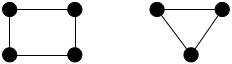
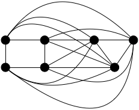
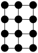
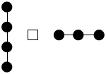
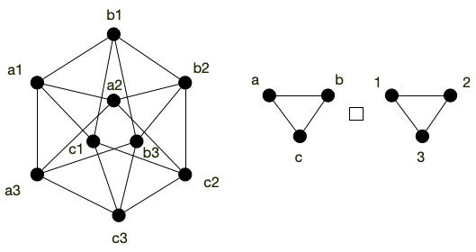

Définition de la structure de graphe et de ses composants (sommets et arêtes). On terminera cette partie en démontrant une première propriété fondamentale les liant.

## Définition générale

Dans toute sa généralité, on peut définir un **_multi-graphe_** comme étant un triplet $G = (V, E, \phi)$ où :

- $V$ est un ensemble de **_sommets_** (**_vertices_**)
- $E$ est un ensemble d'**_arcs_** (**_edges_**)
- $\phi: E \rightarrow V \times V$ une **_fonction d'incidence_** qui associe à chaque arête un couple (possiblement égaux) de sommets.

Cette définition permet de considérer des ensemble a priori non dénombrable, mais elle le fait au prix d'une grosse lourdeur de manipulation puisqu'il faut passer par une fonction d'incidence.

En pratique, on aura toujours un nombre fini de sommets et d'arêtes (ou au pire dénombrable), on choisit donc une définition plus restrictive, mais plus facilement manipulable en informatique :



Un **_multi-graphe_** est un couple $G = (V, E)$ où :

- $V$ est un ensemble fini de **_sommets_** (**_vertices_**)
- $E$ est une liste finie de d'éléments de $V \times V$ appelés **_arcs_** (**_edges_**)



Notez que la définition précédente s'étant sans problème aux ensemble infinis dénombrables.


Pour ne pas avoir à toujours rappeler l'ensemble des sommets et des arêtes d'une graphe, on utilisera parfois la notation :

- $V(G)$ et $v(G)$ pour noter l'ensemble des sommets et leur nombre d'un multi-graphe $G$,
- $E(G)$ et $e(G)$ pour noter l'ensemble des arcs et leur nombre d'un multi-graphe $G$.

### Exemple

Le multi-graphe $G = (V, E)$ avec :

- $V = \\{1, 2, 3, 4, 5\\}$
- $E = ((1, 2), (2, 3), (2, 2), (1, 2), (4, 5), (5, 4))$

Peut se représenter graphiquement (sur le plan) :


Remarquez qu'un multi-graphe peur avoir :

- plusieurs fois le même arc : l'arc $(1, 2)$
- des _boucles_ : l'arc $(2, 2)$
  

### Utilité

Les multi-graphes sont des outils puissants de modélisation permettant de résoudre nombre de problèmes d'optimisation.

#### Résolution de problème

Outre le problème évident de construction ou de maintien de réseaux (informatique, de transports ou encore sociaux), on peut aussi citer :

- [google maps](https://www.google.fr/maps/dir/). On cherche un itinéraire entre deux villes en ne connaissant à priori que ce qui se passe entre deux croisement consécutifs, mais on connaît tous les croisements,
- les contraintes d'allocations de ressources. Les sommets sont les antennes et les arêtes si il y a des interférences possibles, on cherche à trouver une [coloration du graphe](https://fr.wikipedia.org/wiki/Coloration_de_graphe),
- problèmes de transports où l'on veut distribuer le plus de ressources possibles dans un réseau routier/fluvial/informatique,

Les problèmes ci-dessus ont ceci de particulier qu'ils peuvent très facilement **se décrire localement** :

- le problème de la recherche d'itinéraire se décrit par une liste de croisement et, pour chaque croisement, une liste de ceux qu'il peut atteindre
- le problème d'allocation de ressources se décrit de même par une liste d'antenne et, pour chaque antenne, une liste de celles avec laquelle il y a interférence possible
- enfin, le problème de transport se décrit de la même manière que le problème d'itinéraire en ajoutant une capacité à chaque couple de croisement)

Mais la **solution cherchée est globale** :

- une suite de croisement pour le problème d'itinéraire
- une fréquence à associer à chaque antenne pour le problème d'allocation de ressources
- un flot sur chaque route pour le problème de transport

C'est une caractéristique générale :


Un problème pouvant se décrire localement mais dont la solution est globale peut **souvent** se modéliser puis se résoudre à l'aide de graphes.


#### Modélisation

Ils permettent également de comprendre le réel en utilisant des classes particulières de multi-graphes. Par exemple :

- le modèle arboré des [arbres phylogénétique](https://fr.wikipedia.org/wiki/Arbre_phylog%C3%A9n%C3%A9tique) modélisent l'évolution des espèces
- des graphes aléatoire générés en utilisant par exemple [le modèle de Barabasi-Albert](https://fr.wikipedia.org/wiki/Mod%C3%A8le_de_Barab%C3%A1si-Albert) permettent de créer des graphes "_petit monde_" typiques des réseaux sociaux ou de l'internet.

#### Esthétique

Enfin, ils procurent une satisfaction purement esthétique de part la grande beauté des démonstrations, de leurs théorèmes et de leurs algorithmes.

## Graphe

Notre définition est tellement générale, qu'elle est très peu utilisée telle quelle. On utilisera souvent des cas particuliers selon le problème que l'on veut résoudre :

- **_sans boucles_**. Les arcs commencent et finissent toujours sur nœuds différents.
- **_sans arcs multiples_**. On a alors que pour $G = (V, E)$, $E$ est un sous-ensemble de $V \times V$ : c'est une **relation**.
- **_non orienté_**. Si $(x, y) \in E$ alors $(y, x) \in E$.


Ainsi, un **_multi-graphe non orienté sans boucle_** est un multigraphe tel que si $(x, y) \in E$ alors $(y, x) \in E$ et tel que $(x, x) \notin E$ pour tout $x \in V$.


Le cas le plus simple (et donc celui que l'on utilisera en priorité) est le multi-graphe sans boucle, sans arcs multiples et non orienté. On les appelle **_graphes_** et on peut les définir comme suit :


Un **graphe** est un couple $G = (V, E)$ où :

- $V$ est un ensemble fini
- $E$ est un sous-ensemble de $\\{ \\{x, y\\} \mid x \neq y \in V \\}$. Ses éléments sont appelés **_arêtes_**.



De cette définition minimale on pourra alors définir d'autres cas, comme le **_graphe orienté_** :



Un **_graphe orienté_** est un multi-graphe sans boucle et sans arcs multiples. C'est un couple $G = (V, E)$ où :

- $V$ est un ensemble fini
- $E$ est un sous-ensemble de $\\{ (x, y) \mid x \neq y \in V \\}$



Enfin, plus rarement, vous pourrez rencontrer des **graphe mixte** qui permettent de rendre compte de situations réelles comme lorsque l'on modélise des réseaux routiers où il existe à la fois des routes à doubles sens et à sens unique et où l'on ne veut parcourir une route qu'une seule fois (pas une fois dans un sens et une fois dans l'autre pour les routes à double sens) :



Un **graphe mixte** est un triplet $G= (V, E, A)$ tel que $G_1=(V, E)$ soit un graphe non orienté et $G_2=(V, A)$ soit un graphe orienté.



Ou toutes les combinaisons de ceux-ci, comme :

- le **_graphe avec arêtes multiples_**
- le **_graphe avec boucles_**
- un **_multi-graphe mixte orienté_**
- ...

Il est important de connaître précisément de quels type de graphe on parle car les algorithmes ne fonctionnent pas toujours sur toutes les classes de graphes.

## Vocabulaire

Par abus de langage on écrira $xy$ pour designer une arête (_resp._ arc) plutôt que $\\{x, y\\}$ (_resp._ $(x, y)$).

### Taille et ordre

Pour un graphe (orienté ou non) $G = (V, E)$ on appelle :

- $\vert V\vert = n$ l'**_ordre_** de $G$.
- $\vert E \vert = m$ la **_taille_** de $G$.

A ordre fixe, les graphes de taille maximum son dit **_complet_** :


Un graphe est **_complet_** s'il possède toutes les arêtes : pour tous $x, y \in V$ $xy$ est une arête. On le note $K_n$ et $m = n(n-1)/2$.


Réciproquement, un graphe sans arête est dit **_discret_** :


Un graphe est **_discret_** s'il ne possède aucune arête.

On peut noter qu'un graphe orienté ayant un nombre maximum d'arêtes est en fait un graphe (non orienté) complet. C'est pour cela que la définition d'un **_graphe orienté complet_** n'existe pas. On préfère parler de [tournoi](<https://fr.wikipedia.org/wiki/Tournoi_(th%C3%A9orie_des_graphes)>) :


Un **_tournoi_** est un graphe orienté $G=(V, E)$ tel que :

- si $xy \in E$ alors $yx \notin E$
- pour tous $x \neq y \in V$, soit $xy$ soit $yx$ est un arc de $G$.


### Arcs

Un **_arc_** $xy$ est un élément de $E$ pour les graphes orientés. On le représente graphiquement comme ça :

Quelques notations et définitions relatives aux arcs :



- $x$ est l'**_origine_** de l'arc,
- $y$ est la **_destination_** de l'arc.

On appelle **_voisinage sortant de $x$_** (**_neighbors_**) l'ensemble des arcs d'origine $x$ et on le note :

$$N^+(x) = \\{ y \mid xy \in E\\}$$

Son cardinal est appelé **_degré sortant_** de $x$ et est noté :

$$\delta^+(x) = \vert N^+(x) \vert$$

De la même manière, l'ensemble des arcs de destination $y$ est appelé **_voisinage entrant en $y$_** et est noté :

$$N^-(y) = \\{ x \mid xy \in E\\}$$

Son cardinal est appelé **_degré entrant_** de $y$ et on le note :

$$\delta^-(y) = \vert N^-(y) \vert$$



Lorsque l'on a besoin d'inclure l'élément dans le voisinage, on considère les voisinages fermés :



On appelle **_voisinage fermé de $x$_** l'ensemble des arcs d'origine $x$ plus $x$ et on le note :

$$N^+[x] =N^+(x) \cup \\{ x \\}$$

et

$$N^-[x] =N^-(x) \cup \\{ x \\}$$



### Arêtes

Une **_arête_** $xy$ est un élément de $E$ pour les graphes non orienté. On la représente graphiquement comme ça :

Contrairement aux arcs, il n'y a pas de distinction entre origine et destination :


Le **_voisinage_** d'un sommet $x$ est l'ensemble des sommets $y$ tels que $xy \in E$. On les notes :

$$N(x) = \\{ y \mid  xy \in E\\}$$

$$N[x] = N(x) \cup \\{ x \\}$$

Le cardinal d'un voisinage est appelé **_degré_**. On le note :

$$\delta(x) = \vert N(x) \vert$$



En remarquant que $0 \leq \delta(x) < n$ pour un sommet $x$ d'un graphe à $n$ sommets, prouvez la propriété suivante :



Montrez que dans tout graphe (à au moins 2 sommets) il existe au moins deux sommets différents ayant même degré.



C'est une application directe du [principe des tiroirs](https://fr.wikipedia.org/wiki/Principe_des_tiroirs).
Pour un graphe à $n$ sommet, le degré de tout sommet est entre 0 et $n-1$, soit $n$ possibilités. Si tous les sommets avaient des degrés différents il y en aurait 1 avec 0 voisins et un autre avec $n-1$, ce qui est impossible.



Enfin :


Si $G=(V, E)$  est un graphe, on note :

- $\Delta(G) = \max(\\{\delta(x) \vert x \in V\\})$
- $\delta(G) = \min(\\{\delta(x) \vert x \in V\\})$



Un graphe $G$ est dit **k-_régulier_** (ou parfois juste **_régulier_**) si $\Delta(G) = \delta(G) = k$.

## Voisinages et arêtes

Nous allons présenter une première relation fondamentale pour les graphes. Cette propriété va lier une notion locale : les voisinages de sommets, à une notion globale : le nombre d'arêtes du graphe.

Avant d'énoncer la propriété, commençons par le visualiser. Considérons le graphe orienté avec boucles suivant :

On a par exemple :

- $N^+(a) = \\{ b, e \\}$,
- $\delta^+(b) = \delta^-(b) = 2$.



Calculez $\sum_x \delta^+(x)$ ? et $\sum_x \delta^-(x)$



$$\sum_x \delta^+(x) = \delta^+(a) + \delta^+(b) + \delta^+(c) + \delta^+(d) + \delta^+(e) = 2 + 2 + 1 + 1 + 2 = 8$$

$$\sum_x \delta^-(x) = \delta^-(a) + \delta^-(b) + \delta^-(c) + \delta^-(d) + \delta^-(e) = 2 + 2 + 1 + 2 + 1 = 8$$

On remarque que la boucle en $b$ est comptée pour $\delta^-(b)$ et pour $\delta^+(b)$.
On peut également remarquer que $\sum_x \delta^+(x) = \sum_x \delta^-(x) = \vert E \vert$.



On voit que $\sum_x \delta^+(x) = \sum_x \delta^-(x)$et vaut le nombre d'arcs du graphe orienté avec boucle.

Cette constatation va — peu ou prou — s'étendre aux graphes. Une version non orienté du graphe orienté avec boucles précédent pourrait être :

On a :

- $\delta(a) = 3$,
- $N(a) = \\{b, d, e \\}$.



Calculez $\sum_x \delta(x)$




$$\sum_x \delta(x) = \delta(a) + \delta(b) + \delta(c) + \delta(d) + \delta(e) = 3 + 2 + 2 + 3 + 2 = 12$$



On peut remarquer que $\sum_x \delta(x) = 2\vert E \vert$.

On peut maintenant démontrer :


Pour un graphe orienté avec boucle $G=(V, E)$, on a la propriété suivante :

$$ \sum_x \delta^+(x) = \sum_x \delta^-(x) = \vert E \vert$$

Pour un graphe $G=(V, E)$, on a :

$$ \sum_x \delta(x) = 2\vert E \vert$$




Pour un graphe orienté avec boucle, chaque arc $uv$ est unique. Il est compté exactement 1 fois dans la somme $\sum_x \delta^+(x)$ (pour $\delta^+(u)$), donc $\sum_x \delta^+(x) = \mid E \mid$.

Pour un graphe, chaque arête $uv$ est unique et est comptée 2 fois dans la somme $\sum_x \delta(x)$ (une fois pour $\delta(u)$ et une fois pour $\delta(v)$), donc $\sum_x \delta^+(x) = 2 \mid E \mid$.



## Parties de graphes

On a parfois envie de découper un graphe pour en étudier une partie (s'il est trop gros ou que certains sommet et/ou arêtes ne nous intéresse pas) ou au contraire de rabouter plusieurs graphes entres eux pour en former un plus gros.

### Découpage


[Définitions de Wikipédia](https://fr.wikipedia.org/wiki/Sous-graphe)


Il existe deux façons canonique de découper un graphe, supprimer soit des sommets, soit des arêtes :


Soit $G = (V, E)$ un (multi-)graphe (non) orienté. Si $V' \subsetneq V$ et $E' \subsetneq V' \times V' \cap E$, alors $\left.G\right|_{V'} = (V', E')$ est un **_sous-graphe_** de $G$.

Un sous-graphe admet deux cas particuliers :

- si $V' = V$ alors  $G'$ est dit être un **_sous-graphe couvrant_** (ou un **_graphe partiel_**) de $G$
- si $E' = V' \times V' \cap E$ alors $G'$ est dit être un **_sous-graphe induit_** de $G$



### Composition de graphes

Coller plusieurs graphes ensemble pour en former un plus gros peut se faire de multiples façons. Nous allons en montrer trois, classiques, mais il doit en exister bien d'autres.

Commençons par la plus simple, qui ne rajoute aucune arête entre les deux graphes que l'on compose :


Soient $G_1 = (V_1, E_1)$ et $G_2 = (V_2, E_2)$ deux graphes. On note $G_1 + G_2$ le graphe :

$$G_1 + G_2 = (V_1 \cup V_2, E_1 \cup E_2)$$



Que vaut :






On peut aussi utiliser l'approche opposée, qui consiste à ajouter toutes les arêtes possibles entre les deux graphes :


Soient $G_1 = (V_1, E_1)$ et $G_2 = (V_2, E_2)$ deux graphes. On note $G_1 \vee G_2$ la **liaison forte** entre $G_1$ et $G_2$. C'est le graphe :

$$G_1 \vee G_2 = (V_1 \cup V_2, E_1 \cup E_2 \cup \{ xy \mid x \in V_1, y \in V_2})$$



Que vaut :






Enfin, de façon plus subtile :


Soient $G_1 = (V_1, E_1)$ et $G_2 = (V_2, E_2)$ deux graphes. On note $G_1 \square G_2$ le **produit cartésien** entre $G_1$ et $G_2$. C'est le graphe :

$$G_1 \square G_2 = (V_1 \times V_2, E)$$

Avec $((x_1, x_2), (y_1, y_2)) \in E$ si :

- $x_2 = y_2$ et $x_1y_1 \in E_1$
- $x_1 = y_1$ et $x_2y_2 \in E_2$



Que vaut :






On peut aussi chercher l'approche inverse qui consiste à décomposer un graphe donné. C'est très efficace sur les graphes _"en pattern"_ :


La grille 2D est le produit cartésien de deux graphes, lesquels ?






Ce n'est cependant pas toujours aussi simple :

Le graphe suivant est le produit cartésien de deux graphes, lesquels ?




> TBD montrer comment le prouve. On commence par un triangle qu'on note (1, 1), (2, 1) et (3, 1) puis on propage pour voir comment on peut associer un label à chaque sommet.



## Graphes dérivés

A tout graphe on peut lui associer d'autres graphes, dérivés de celui-ci.

### Graphe complémentaire


<https://fr.wikipedia.org/wiki/Graphe_compl%C3%A9mentaire>


complémentaire de complémentaire = graphe

> TBD tout graphe est complémentaire d'un autre. le carré est identité

### Graphe adjoint


<https://fr.wikipedia.org/wiki/Line_graph>

Aussi appelé line graph

> TBD stable pour cycle, diminue pour chemin et augmente pour clique
> TBD tout graphe n'est pas adjoint d'un autre (exemple ?)
adjoint de adjoint = graphe

### Mineurs


<https://fr.wikipedia.org/wiki/Mineur_(th%C3%A9orie_des_graphes)>


> TBD très très important, a donné des caractérisation et des théorèmes extrêmement important en théorie des graphes.

> TBD rend compte de l'intrication locale de chemins entre sommets.
>

## Morphismes de graphes


[Les définitions d'une excellente chaîne d'informatique](https://www.youtube.com/watch?v=21bMUXO-QYQ)


Les notions définies dans cette partie le seront -- par commodité -- pour des graphes mais elles se généralisent directement à des graphes orienté ou à des multigraphes.

### Définitions


Soient $G = (V, E)$ et $G' = (V', E')$ deux graphes. Une fonction $f: V\to V'$ est un **_morphisme_** entre $G$ et $G'$ si $xy \in E$ implique $f(x)f(y) \in E'$.



> TBD exemple

On le voit dans l'exemple $f$ n'est pas forcément une bijection de $V$ dans $V'$ et l'implication n'est que dans un sens : l'arête  $f(x)f(y)$ peut exister dans $G'$ alors que $xy \notin E$. Pour avoir une correspondance parfaite entre $G$ et $G'$ il faut qu'il existe un **_isomorphisme_** entre eux :


Soient $G = (V, E)$ et $G' = (V', E')$ deux graphes.  Une fonction $f: V\to V'$ est un **_isomorphisme_** entre $G$ et $G'$ si :

- $f$ est une bijection
- $f$ est un morphisme entre $G$ et $G'$
- $f^{-1}$ est un morphisme entre $G'$ et $G$



Deux graphes isomorphes sont structurellement équivalents : il existe une bijection $f$ entre les deux ensembles de sommets tel que $xy$ est une arête du premier graphe si et seulement si $f(x)f(y)$ est une arête du second.

C'est à dire que les deux graphes ne diffèrent que par le nom de leurs sommets.

> TBD dire que c'est une relation d'équivalence et que les classes d'équivalences donnent les formes de graphes à $n$ sommets. Donner exemple à 3 ?

En ce sens, notez que le si et seulement si entre les arêtes n'est pas suffisant pour que les graphes soient équivalents

> TBD un chemin de longueur 3 dans une arête. On a bien le ssi mais les deux graphes ne sont clairement pas identiques.

L'identité est toujours un isomorphisme d'un graphe dans lui même, et certains graphes (les graphes complets par exemple) en admettent beaucoup d'autres. On appelle ces isomorphisme d'un graphe dans lui-même des automorphismes :


Un isomorphisme d'un graphe dans lui-même est appelé **_automorphisme_**.



> TBD exemple.


<https://www.bourbaki.fr/TEXTES/1125.pdf>


### Reconnaissance


<https://perso.ens-lyon.fr/eric.thierry/Graphes2009/jonas-lefevre.pdf>


Définissons le problème algorithmique associé :



- **nom** : isomorphisme de graphe
- **données** : deux graphes
- **question** : les deux graphes sont-ils isomorphes ?



Si on se donne une fonction $f$ allant de l'ensemble des sommets d'un graphe à un autre, il est facile de vérifier si c'est un isomorphisme entre les deux graphes ou non : le problème de l'isomorphisme de graphe est donc clairement dans NP.

En revanche, on ne connaît pas son status exact : on ne sait ni s'il est NPcomplet, ni s'il est polynomial. [Le meilleur algorithme connu](https://en.wikipedia.org/wiki/Graph_isomorphism_problem) est de complexité $2^{\mathcal{O}(\log^3(n))}$ ce qui est plus que polynomial mais moins qu'exponentiel. On verra que pour certaines classes de graphes, le problème est simple.
