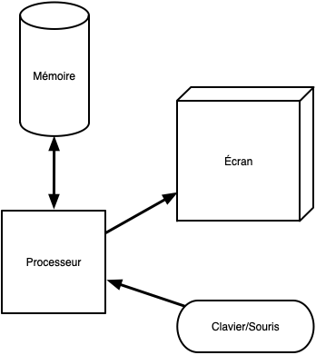

## OS

Vision utilisateur débutant

> TBD screenshot avec un écran (windows/max) et une appli steam/word

3 OS : doz/mac/Linux/Ubuntu

> TBD : but os :
>
> * exécuter des programmes
> * interagir : clavier/souris
> * gérer des données (fichiers / stocker sur disque dur)
> * communiquer (réseau / IO)

Exécutions d'applications en cliquant et via le terminal (bases).

Installation d'applications :

* windows : store et install, lisez les paramètres !
* brew : applications Linux sous mac
* snap/apt : Linux/Ubuntu

## Fichiers

Vision utilisateur éclairé

> TBD : système de fichier pour structurer son travail et retrouver des données (exemple de MyApp)

path des applications et modifications de celles-ci

## Développeur

> TBD terminal + vscode + python

## Archi

Un ordinateur est composé de plusieurs composants qui interagissent entre eux :

* le [processeur](https://fr.wikipedia.org/wiki/Processeur) : exécute des instructions sur des variables. Instructions et variables sont prisent et manipulées dans la mémoire.
* [mémoire](https://fr.wikipedia.org/wiki/M%C3%A9moire_(informatique)) :
  * RAM : se vide lorsque l'on éteint l'ordinateur (volatile), mais rapide
* périphériques, appelés ***device***
  * stockage
    * disques durs : plus lent que la mémoire mais reste même sans courant
    * USB : encore plus lent qu'un disque dur mais déplaçable facilement
    * réseau : encore plus lent que l'USB mais accessible de partout
  * [interfaces](https://fr.wikipedia.org/wiki/Interactions_homme-machine) :
    * entrée : clavier/souris
    * sortie : écran/imprimante
    * entrée/sortie : volant avec retour de force



* composants
* utilité de chaque composant

### Carte mère

<https://fr.wikipedia.org/wiki/Format_ATX>


Vous allez trouver plein de vieilles choses sur internet :

* [BIOS](https://fr.wikipedia.org/wiki/BIOS_(informatique)) : n'existe plus depuis 2006
* [northbridge/southbridge](https://en.wikipedia.org/wiki/Northbridge_(computing)). Depuis 2019, remplacé par le [system agent](https://en.wikipedia.org/wiki/Uncore).


* <https://fr.wikipedia.org/wiki/UEFI>
* Barrette de RAM : <https://fr.wikipedia.org/wiki/Dual_Inline_Memory_Module>
* <https://fr.wikipedia.org/wiki/Disque_dur>
* horloge : permet la synchronisation des devices. Chaque device soit fonctionner à une fréquence qui est un multiple de la fréquence d'horloge de la carte mère
* bus

Exemple de signal à la fréquence de l'horloge. On regarde à chaque *front montant* de l'horloge le signal, qui est convertit en bit :

```
           front montant     front descendant 
           v                 v
horloge : _/⎺\_/⎺\_/⎺\_/⎺\_/⎺\_/⎺\_/⎺\
signal  : __/⎺⎺⎺⎺⎺\_____/⎺⎺⎺⎺⎺⎺⎺\_____
bits    :  0   1   0   0   1   1   0
```

1. nécessité d'une horloge pour transmettre un message : Sans une horloge, il nous est uniquement possible de connaître les changements de bits (de 0 à 1 ou réciproquement), pas une succession de bit identique.
2. il faut que les horloges de chaque device soient synchronisées. De plus, si les horloges des différents devices (disques dur, ram, etc) ne sont pas synchronisées il est impossible de savoir quand et quel est le message transmis. C'est le rôle de l'horloge de la carte mère.
3. Enfin, pour que des devices de vitesse différentes puissent communiquer sans perte de temps, il faut que le device le plus rapide puisse communiquer à la vitesse du plus lent : il faut que toutes leurs horloges soient des multiples de l'horloge de la carte mère.


[transmission de données](https://www.youtube.com/watch?v=ZQ-Jb__HTyo)


### *Device*

Communication en série via un protocole. On lit bit à bit la donnée.

C'est paradoxalement plus rapide que de passer les données de façon parallèle car il n'y a pas de synchronisation à avoir. Les trois protocoles de transmissions actuels sont en série :

* USB
* PCIe
* Ethernet



* [parallèle vs série](https://www.youtube.com/watch?v=-iDaeZt-pYM)
* [protocoles séries basiques](<https://www.youtube.com/watch?v=IyGwvGzrqp8>)
* [protocole USB](https://www.youtube.com/watch?v=F7NlCaaL3yU)
* [PCIe](https://fr.wikipedia.org/wiki/PCI_Express). Chaque *lane* est une communication en série sous la forme d'un [differential signaling](https://en.wikipedia.org/wiki/Differential_signalling)



## Bus de communication

Le [bus](https://fr.wikipedia.org/wiki/Bus_informatique) est le moyen de faire entrer et sortir des données d'un processeur :


Un bus doit pouvoir véhiculer 3 types d'informations :

* adresse : où est la donnée
* donnée : la donnée à faire sortir ou entrer dans le processeur
* contrôle : que veut-on faire : lire (faire entrer dans le processeur)/écrire (faire sortir la donnée)

L'adresse peut être plusieurs choses :

* un byte de la mémoire RAM
* un accès série à un device :
  * disque dur,
  * écran,
  * clavier,
  * etc


L'adresse sur le bus est donc une **abstraction** pour que les données qui entre ou sortent du processeur soient toutes traitées de la même manière.

Cette unification est appelée [IO memory mapping](https://en.wikipedia.org/wiki/Memory-mapped_I/O_and_port-mapped_I/O)


Certains systèmes spécifiques (ou vieux) possèdent plusieurs bus (un pour la mémoire et un pour les devices par exemple), le processeur doit alors avoir des jeux d'instructions différents pour traiter ces différents cas, ce qui complexifie le code et l'architecture du processeur.


Si le processus d'accès à la donnée est unifié du point du vue du processeur, on ne peut cependant pas faire la même chose selon qu'on accède à la RAM ou à un device.

On peut en effet accéder directement à tout byte de la mémoire en donnant directement son adresse en mémoire, ce qui est impossible avec un autre device ou la communication se fait en série, bit à bit.


[Explication physique du process](https://www.youtube.com/watch?v=2Cbcb2yGjiM)


Pour écrire une donnée d'un device en mémoire il faut alors :

1. commencer par envoyer au device l'adresse du byte que lon aimerait avoir
2. une fois la demande traitée par le device, la valeur est retournée au processeur
3. cette valeur est ensuite usuellement re-écrite en mémoire RAM.

Pour accélérer ce processus et ne pas repasser à chaque fois par le processeur pour chaque byte, on a coutume de récupérer ou d'envoyer au device plus de données (usuellement par paquet de c4kb) et de laisser le device accéder directement à la mémoire par un procédé appelé [Direct Memory Access](https://en.wikipedia.org/wiki/Direct_memory_access) et laisser le processeur faire d'autres opérations pendant ce temps. Une fois ce transfert terminé le device génère une [Interruption](https://fr.wikipedia.org/wiki/Interruption_(informatique)) pour prévenir le processeur de la fin du traitement.


Ue série de vidéos explicatives :

1. [I/O](https://www.youtube.com/watch?v=nnO2OfSTVbA&list=RDCMUCOPmCMY3ROyg04_y5bYPyyw&index=7)
2. [I/O memory mapping](https://www.youtube.com/watch?v=xNH1e5snIEY&list=RDCMUCOPmCMY3ROyg04_y5bYPyyw&index=1)
3. [les interruptions](https://www.youtube.com/watch?v=dDA3PUr16As&list=RDCMUCOPmCMY3ROyg04_y5bYPyyw&index=4)
4. [Direct memory Access](https://www.youtube.com/watch?v=M16l_ymlfcs&list=RDCMUCOPmCMY3ROyg04_y5bYPyyw&index=8)


## Processeur

Modèle de Von Neumann. :

* registres
* ALU et FPU
* communication via un bus

C'est toujours le même principe actuellement, voir [WikiChip](https://en.wikichip.org/wiki/WikiChip) pour les processeurs et leurs caractéristiques.

Deux grandes familles de processeurs sur le même principe :

* [CISC](https://fr.wikipedia.org/wiki/Microprocesseur_%C3%A0_jeu_d%27instruction_%C3%A9tendu) (intel et AMD)
* [RISC](https://fr.wikipedia.org/wiki/Processeur_%C3%A0_jeu_d%27instructions_r%C3%A9duit) (ARM, et Apple)


[Risc vs cisc](https://www.youtube.com/watch?v=a4kgtygCZBc) et [ARM vs x86](https://www.youtube.com/watch?v=AADZo73yrq4). Et une comparaison avec le petit dernier [RISC-V](https://www.youtube.com/watch?v=Ps0JFsyX2fU)


Un processeur n'a pas de mémoire proprement dite. De nombreux caches sont mis en oeuvre pour accélérer les I/O ([Memory hierarchy](https://computationstructures.org/lectures/caches/caches.html#20). Plus on va vite plus c'est cher.)

Les CPU actuels ont plusieurs CORE qui sont autant de processeur partageant la mémoire mémoire.


## Version détaillée


