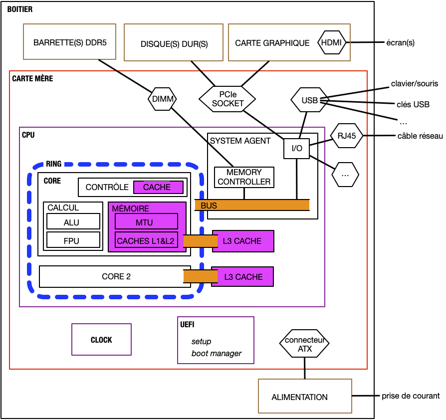

## Carte mère


[Carte mère](./carte-mère){.interne}


## Mémoire


[Mémoire](./mémoire){.interne}


## Processeur


[Processeur](./processeur){.interne}


## Périphériques

On y accède via des protocoles d'accès. Ensuite chaque type de périphérique aura un ou plusieurs protocoles permettant son utilisation.

Exemple du réseau :

- protocole d'accès à la carte : PCie
- protocole d'utilisation :
  - TCP
  - UDP
  - ...

Les périphériques présents sur tous les ordinateurs sont les périphériques de stockage, dont nous allons parler plus précisément :


[Disques durs et autres périphériques de stockage](./device-stockage){.interne}


## Version détaillée

> TBD : à refaire.

