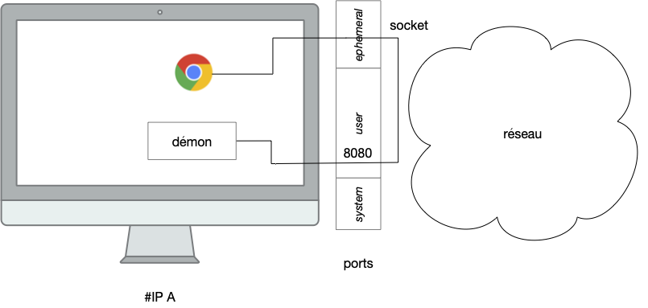

## Principes


[Principes](./principe){.interne}


## URL


[Anatomie d'une URL](./anatomie-url/){.interne}


## Serveur web

### Schema général

### local

> TBD tout ce qu'on a vu fonctionne sur la même machine. localhost

> TBD avec python et http pour un serveur bête en localhost
> TBD <https://realpython.com/python-http-server/>
