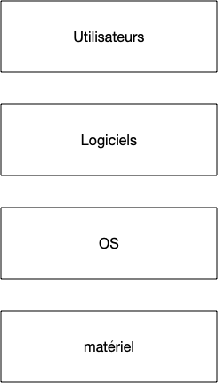

Le but d'un [ordinateur](https://fr.wikipedia.org/wiki/Ordinateur) est de permettre à des utilisateurs d'exécuter des logiciels. Pour que chaque logiciel n'ait pas à tout gérer (accès au processeur, à la mémoire, au disque dur, au réseau, ...) comme on le ferait avec un circuit imprimé par exemple, on utilise un [système d'exploitation](https://fr.wikipedia.org/wiki/Syst%C3%A8me_d%27exploitation) (ou ***OS*** pour *operating system*) comme intermédiaire :



## Matériel et logiciel

Le but premier d'un système d'exploitation est ainsi de faire le lien entre le [matériel](https://fr.wikipedia.org/wiki/Mat%C3%A9riel_informatique) (*hardware*) et le [logiciel](https://fr.wikipedia.org/wiki/Logiciel) (*software*).

### Matériel

Le **_matériel_** comporte tous les éléments physique d'une machine :

- processeur
- mémoire
- disques dur
- clavier, souris, écran
- carte réseau
- ...

Que l'on peut regrouper en trois grandes catégories :

- processeur
- mémoire
- les [périphériques](https://en.wikipedia.org/wiki/Peripheral) ou *devices* qui regroupent tout le reste. C'est ce qui se branche sur la [carte mère](https://fr.wikipedia.org/wiki/Carte_m%C3%A8re)



Chaque device va avoir son fonctionnement propre (un clavier ne fonctionne pas pareil qu'un disque  dur et deux cartes réseaux de constructeurs différents vont fonctionner différemment). Pour permettre une utilisation simple de ces périphériques, un logiciel demande l'accès au matériel via des fonctions données par le système d'exploitation, nommés [appel système](https://fr.wikipedia.org/wiki/Appel_syst%C3%A8me) qui sont tout le temps le même pour une catégorie de périphérique donné. Le système d'exploitation accède quand à lui accède directement au matériel via des [drivers](https://fr.wikipedia.org/wiki/Pilote_informatique) propre à chaque device.



### Logiciel

Les logiciels, que d'un point de vue système on appelle [**process**](https://fr.wikipedia.org/wiki/Processus_(informatique)) ou **processus** auront besoin pour fonctionner d'accéder au matériel mais également de cohabiter entre eux : un ordinateur va toujours avoir plusieurs logiciels en fonctionnement en même temps. C'est aussi le rôle d'un système d'exploitation que de faire en sorte que cette cohabitation se passe bien :


Un système d'exploitation permet l'exécution de process :
  - de façon [concurrente](https://fr.wikipedia.org/wiki/Programmation_concurrente) (on peut écrire dans un gdoc tout en écoutant de la musique)
  - de façon sécurisée : le gdoc ne peut accéder aux variables de l'application jouant de la musique


Il n'y aura toujours qu'un seul processus actif à chaque instant, mais comme on change souvent de processus actif, on a l'impression qu'ils s'exécutent en même temps.


[Parallèle vs concurrent](https://www.youtube.com/watch?v=r2__Rw8vu1M) :

- concurrent : le début d'un process est entre la début et la fin de l'autre
- parallèle : en même temps. Ceci est possible si on a plusieurs cœur ou plusieurs processus sur la machine


Que les processus soient concurrent ou parallèle, c'est le rôle du système d'exploitation de gérer cela.

## Couches Systèmes

Un système d’exploitation n'est pas monolithique, il est constitué de multiples parties qui forment un tout cohérent. L'organisation logicielle d'un ordinateur (ou plus généralement tout système logiciel assez important) est constitué de *couches*, comme le stipule le



On peut régler tous les problèmes en ajoutant une couche d'indirection



```
       compliqué
A --------------------> B
   simple      simple
A --------> C --------> B
```

 Ce principe universel est une instanciation de la [deuxième partie du discours de la méthode](https://fr.wikipedia.org/wiki/Discours_de_la_m%C3%A9thode#Deuxi%C3%A8me_partie) : il faut diviser chaque difficulté en autant de parties facile à résoudre séparément.
D'un point de vue ingénierie, ceci permet en plus de  clairement les responsabilités de chaque couche, une maintenance plus aisée.

Un ordinateur et son utilisation peut être séparé quatre couches :

1. Matériel
   - mémoire RAM
   - devices
2. Noyau
   - drivers matériels
   - gestion de la mémoire
   - ordonnancement des processus
3. process
   - interface graphique
   - terminal
   - ...
4. utilisateurs
   - qui à le droit de faire quoi



Seul le noyau a accès au matériel et a un contrôle total de la machine. On distingue deux états d'une machine :

- le *kernel mode* : le noyau travail
- le *user mode* : un process travaille


[User et Kernel mode sous windows 11](https://learn.microsoft.com/fr-fr/windows-hardware/drivers/gettingstarted/user-mode-and-kernel-mode)


La machine doit tourner le plus souvent possible en *user mode* car toute mauvaise action en kernel mode peut potentiellement être désastreux (plantage de la machine, effacement de données, etc). Un système d'exploitation ne peut être uniquement composé d'un noyau, ce serait inefficace (rien ne pourrait être exécuté en parallèle) et dangereux (le moindre bug logiciel ou matériel ferait tout planter) :



Un système d'exploitation est constitué de 3 couches :

- **le** [noyau](https://fr.wikipedia.org/wiki/Noyau_de_syst%C3%A8me_d%27exploitation)
- **des** [interfaces logicielles](https://en.wikipedia.org/wiki/Interface_(computing)#Software_interfaces) qui permettent d'accéder aux devices (comme accéder à une clé usb)
- **des** [démons](https://fr.wikipedia.org/wiki/Daemon_(informatique)) qui gèrent l'environnement (le fait de réagir à l'insertion d'une clé usb dans l'ordinateur par exemple)



Les démons et les interfaces sont des process comme les autres. Ils sont cependant exécutés par un utilisateur spécial, souvent nommé [`root`](https://fr.wikipedia.org/wiki/Utilisateur_root), qui est le [super-utilisateur](https://fr.wikipedia.org/wiki/Utilisateur_root) et est le représentant utilisateur du système.

<span id="démarrage"></span>

La distinction entre user et kernel mode se fait directement au démarrage de la machine :

1. boot de l'ordinateur en kernel mode
2. exécution d'un [chargeur d'amorçage (*bootloader*)](https://fr.wikipedia.org/wiki/Chargeur_d%27amor%C3%A7age) 
3. charge le noyau
   1. vérification du matériel
   2. vérification des sous-systèmes : réseau, ...
4. passage en user mode puis charge les démons et les interfaces
5. login

À partir de l'étape 4, l'ordinateur est en user mode. Il ne passe en kernel que :

- via un appel système d'un processus
- lorsque l'on change de processus actif


La partie noyau du système d'exploitation ne fonctionne pas tout le temps, elle ne s'active **que** lors d'un appel système ou lors du changement de processus actif.


Si tous les process du user mode pouvaient effectuer tous les appels systèmes sans restriction cela poseraient d'énormes problèmes de sécurité (un process pourrait accéder à toute la mémoire, en particulier celle réservée à d'autres process par exemple) c'est pourquoi chaque process n'a qu'un nombre restreint de possibilités (on appelle ceci [des droits](https://fr.wikipedia.org/wiki/Droit_d%27acc%C3%A8s_(informatique))) gérés via la notion d'utilisateurs.

## Utilisateurs et groupes

Du point de vue du système d'exploitation un utilisateur est une entité permettant d'exécuter des processus. L'utilisateur qui se connecte à l'ordinateur au login est donc un parmi beaucoup d'autres, la plupart n'étant pas associé à une personne physique. Les utilisateurs sont ensuite placés dans des groupes, chaque groupe ayant des droits particuliers.


Un utilisateur peut utiliser uniquement les éléments (logiciel, fichier, dossier, ...) qui lui appartiennent ou qui appartiennent à ses groupes.


Il existe de nombreux groupes et utilisateurs utilisés par le système pour segmenter (et donc sécuriser) les utilisations. Parmi eux, un utilisateur et un groupe se détachent car ils ont plus de droit que les autres.

### Utilisateur `root`

L'utilisateur `root` est l'utilisateur lié au système d'exploitation. Il est le propriétaire des process (démons) et interfaces du système d'exploitation. Cet utilisateur a ainsi tous les droits (peut aller partout, réserver autant de mémoire qu'il veut, etc).

Comme **Tout** processus a un propriétaire, l'existence de cet utilisateur est garantie.

### Groupe des administrateurs systèmes


[administrateur système](https://fr.wikipedia.org/wiki/Administrateur_syst%C3%A8me)


Le groupe des administrateurs systèmes permet de modifier des paramètres systèmes d'exécuter ou stopper des démons et d'installer de nouveaux logiciels. Ces utilisateurs ont moins de pouvoirs que root qui peut tout faire mais permettent d'administrer le système au quotidien.

Cela permet, si nécessaire, d'installer ou de configurer son système sans être connecté en tant que root en utilisant [la commande sudo](https://www.linuxtricks.fr/wiki/sudo-utiliser-et-parametrer-sudoers) sous Linux par exemple.
