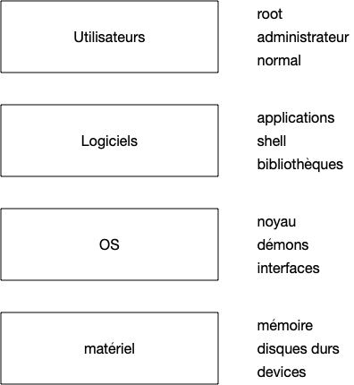

Le but d'un [ordinateur](https://fr.wikipedia.org/wiki/Ordinateur) est d'exécuter des [processus](https://fr.wikipedia.org/wiki/Processus_(informatique)). Pour que chaque processus n'ait pas à tout gérer (accès au processeur, à la mémoire, au disque dur, au réseau, ...) comme on le ferait avec un circuit imprimé par exemple, on utilise un [système d'exploitation](https://fr.wikipedia.org/wiki/Syst%C3%A8me_d%27exploitation) (ou ***OS*** pour *operating system*).

Son but est de faire le lien entre le [matériel](https://fr.wikipedia.org/wiki/Mat%C3%A9riel_informatique) (*hardware*) et le [logiciel](https://fr.wikipedia.org/wiki/Logiciel) (*software*).


Le matériel comporte tous les éléments physique d'une machine :

- processeur
- mémoire
- disques dur
- clavier, souris, écran
- carte réseau
- ...

Que l'on peut regrouper en trois grandes catégories :

- processeur
- mémoire
- les [périphériques](https://en.wikipedia.org/wiki/Peripheral) ou *devices* qui regroupent tout le reste. C'est ce qui se branche sur la [carte mère](https://fr.wikipedia.org/wiki/Carte_m%C3%A8re).

Les logiciels, que d'un point de vue système on appellera [process](https://fr.wikipedia.org/wiki/Processus_(informatique)) ou processus auront besoin pour fonctionner d'accéder :

- au processeur pour effectuer les différentes opérations de leur code,
- à la mémoire pour stocker leurs variables
- souvent à des devices comme un disque dur (pour lire un fichiers), à la carte réseau (pour aller lire le contenu du site [hacker news](https://news.ycombinator.com/)), en encore au clavier


Le but d'un système d'exploitation est double :

- il doit permettre d'utiliser les devices de l'ordinateur grâce à des [drivers](https://fr.wikipedia.org/wiki/Pilote_informatique)
- il permet l'exécution de process :
  - de façon [concurrente](https://fr.wikipedia.org/wiki/Programmation_concurrente) (on peut écrire dans un gdoc tout en écoutant de la musique)
  - de façon sécurisée : le gdoc ne peut accéder aux variables de l'application jouant de la musique



[Parallèle vs concurrent](https://www.youtube.com/watch?v=r2__Rw8vu1M) :

- concurrent : le début d'un process est entre la début et la fin de l'autre
- parallèle : en même temps


## Couches Systèmes

Un système d’exploitation n'est pas monolithique, il est constitué de multiples parties qui forment un tout cohérent.

L'organisation logicielle d'un ordinateur (ou plus généralement tout système logiciel assez important) est constitué de *couches*, comme le stipule le



On peut régler tous les problèmes en ajoutant une couche d'indirection



```
       compliqué
A --------------------> B
   simple      simple
A --------> C --------> B
```

Un autre exemple célèbre de couches en ingénierie système est le découpage en [couches d'un réseau](https://fr.wikipedia.org/wiki/Suite_des_protocoles_Internet). Ce principe universel est une instanciation de la [deuxième partie du discours de la méthode](https://fr.wikipedia.org/wiki/Discours_de_la_m%C3%A9thode#Deuxi%C3%A8me_partie) : il faut diviser chaque difficulté en autant de parties facile à résoudre séparément.
D'un point de vue ingénierie, ceci permet en plus de  clairement les responsabilités de chaque couche, une maintenance plus aisée.

Un ordinateur et son utilisation peut être séparé quatre couches :

1. Matériel
   - mémoire RAM
   - devices
2. Noyau
   - drivers matériels
   - gestion de la mémoire
   - ordonnancement des processus
3. process
   - interface graphique
   - terminal
   - ...
4. utilisateurs
   - qui à le droit de faire quoi

Les utilisateurs lancent les process. Ceux-ci s'exécutent de façon parallèle grâce au noyau et utilisent les ressources matériels via des [appels systèmes](https://fr.wikipedia.org/wiki/Appel_syst%C3%A8me).

## Système d'exploitation

Seul le noyau a accès au matériel et a un contrôle total de la machine. Il doit donc être le plus petit possible car le moindre bug fait planter la machine. C'est pourquoi on distingue deux états d'une machine :

- le *kernel mode* : le noyau travail
- le *user mode* : un process travaille


[User et Kernel mode sous windows 11](https://learn.microsoft.com/fr-fr/windows-hardware/drivers/gettingstarted/user-mode-and-kernel-mode)


> TBD le noyau et son utilité en 2 mots

Un système d'exploitation ne peut donc être uniquement composé d'un noyau, ce serait inefficace (rien ne pourrait être exécuté en parallèle) et dangereux (le moindre bug logiciel ou matériel ferait tout planter). On sépare habituellement un système d'exploitation en 3 parties :

- **le** [noyau](https://fr.wikipedia.org/wiki/Noyau_de_syst%C3%A8me_d%27exploitation) (*kernel*) dont le but est de gérer :
  - les appels systèmes
  - l'ordonnancement des process
  - communications entre les 3 entités d'un ordinateur (process, matériel, noyau)
- **des** [interfaces logicielles](https://en.wikipedia.org/wiki/Interface_(computing)#Software_interfaces) qui permettent d'accéder aux devices (comme accéder à une clé usb)
- **des** [démons](https://fr.wikipedia.org/wiki/Daemon_(informatique)) qui gèrent l'environnement (le fait de réagir à l'insertion d'une clé usb dans l'ordinateur par exemple)

Les démons et les interfaces sont des process comme les autres. Ils sont cependant exécutés par un utilisateur spécial, souvent nommé [`root`](https://fr.wikipedia.org/wiki/Utilisateur_root), qui est le [super-utilisateur] qui est le représentant utilisateur du système.




## Démarrage de l'ordinateur

Les différentes étapes du chargement d'un système d'exploitation

1. boot de l'ordinateur
2. exécution d'un [chargeur d'amorçage (*bootloader*)](https://fr.wikipedia.org/wiki/Chargeur_d%27amor%C3%A7age)
3. charge le noyau
   1. vérification du matériel
   2. vérification des sous-systèmes : réseau, ...
4. passage en user mode puis charge les démons et les interfaces
5. login

## Process et programmes

> TBD montrer les programmes et les process avec le finder.

Un process est l'unité de base d'un programme. Un process est un ensemble d'instructions exécutées par le système d'exploitation. Tout process est la propriété le l'utilisateur du système qui l'a exécuté.

## Utilisateurs

On peut séparer les utilisateurs d'un système en trois grandes catégorie.

### `root`

L'utilisateur `root` est l'utilisateur lié au système d'exploitation. Il est le propriétaire des process (démons) et interfaces du système d'exploitation. Cet utilisateur a ainsi tous les droits (peut aller partout, réserver autant de mémoire qu'il veut, etc).

Comme **Tout** processus a un propriétaire, l'existence de cet utilisateur est garantie.

> TBD sous windows ?

### Administrateurs systèmes


[administrateur système](https://fr.wikipedia.org/wiki/Administrateur_syst%C3%A8me)


Ces utilisateurs ont des droits particulier, ils peuvent modifier des paramètres systèmes et exécuter ou stopper des démons. Ces utilisateur ne sont pas forcément root, en effet,  souvent l'utilisateur principal d'une machine est administrateur.

Cela permet, si nécessaire, d'installer ou de configurer son système sans être connecté en tant que root.

### Simple utilisateur

Enfin, il existe la foule des autres utilisateurs (vous sur les ordinateurs de l'école ou la fac par exemple) qui ne peuvent pas administer la machine, ni lancer de démons. Vous avez en revanche le droit d'exécuter la plupart des process et d'installer vos propres programme dans l'espace disque qui vous est réservé.

> TBD sous windows mono-utilisateur, aussi admin.
