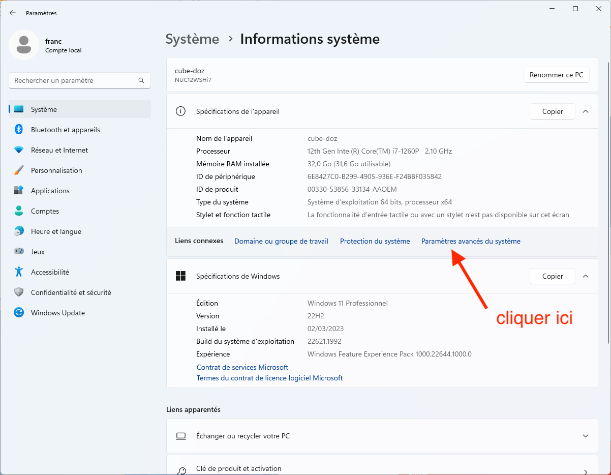
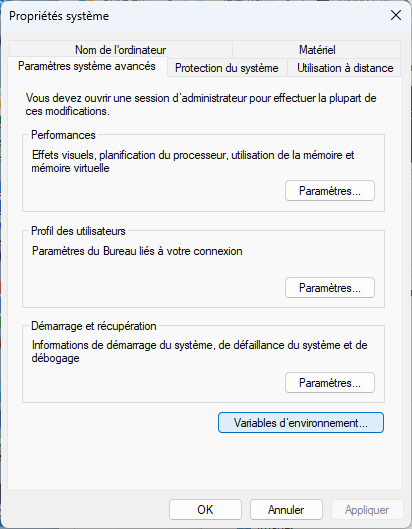
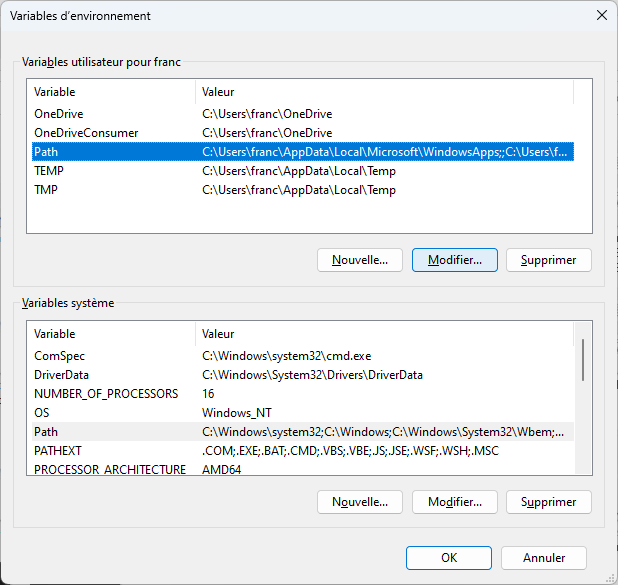

Une fois l'utilisation du terminal comprise (cela ne prend pas beaucoup de temps), cela vous fera gagner un temps fou.


Ouvrez un terminal et tapez les différentes commandes pour se les mettre dans les doigts.


Le corrigé des exercices montrent les résultat sur :

- un terminal d'une machine Linux où mon login est `fbrucker`
- un powershell d'une machine Windows 11 où mon login est `fbrucker`



## Prompt

Lorsque l'on ouvre un terminal, on se retrouve devant [un prompt](<https://fr.wikipedia.org/wiki/Prompt_(variable_d%27environnement)>).


Dans tous les exemples d'utilisation du terminal, on fera commencer la commande par le prompt :

- `$ ` si le terminal utilisé est un shell unix (linux/wsl/macos)
- `> ` si le terminal est un powershell windows
- `$> ` si le terminal utilisé peut être indifféremment un powershell ou un unix



Ce prompt sera différent selon le terminal utilisé, mais il aura toujours la même fonction : on tape une [**_ligne de commande_**](./#ligne-commande) à la suite du prompt et on appuie sur entrée pour l'exécuter. Par exemple :

```shell
$> ls
```

Qui est uniquement composée de [la commande `ls`](./#ls) et qui liste les fichiers du dossier courant, ou encore :

```shell
$> cd /
```

Qui est une ligne composée :

- de [la commande `cd`](./#cd)
- d'un paramètre `/`

Les instructions sous différentes entre les systèmes Unix (Linux et Mac) qu'on appelle **_shell_** et le système Windows appelé **_powershell_**, mais il existe presque toujours un equivalent entre les instruction unix/mac et powershell. Nous ne verrons que les commandes de bases du terminal utilisable sur les deux plateformes mais il en existe de nombreuses autres, n'hésitez pas à expérimenter (on ira bien plus loin dans la partie Linux de ce cours) :



- [liste des instructions powershell](https://devblogs.microsoft.com/scripting/table-of-basic-powershell-commands/)
- [Commandes terminal Linux courantes](https://blog.stephane-robert.info/docs/admin-serveurs/linux/commandes/)



### <span id="pwd"></span>Dossier courant

De plus un terminal est **toujours** positionné dans un dossier précis de votre arborescence de fichiers. C'est le **dossier courant**.


Un terminal est **toujours** positionné dans un dossier, appelé **_dossier courant_**.


L'exécution d'une ligne de commande se fera **toujours** par rapport à cet endroit.


Pour connaître le dossier courant d'un terminal, on utilise la commande `pwd`{.language-}.



- [`pwd` du powershell](https://learn.microsoft.com/en-us/powershell/module/microsoft.powershell.management/get-location) alias vers la commande `Get-Location`{.language-}
- [`pwd` Linux](https://manpages.debian.org/trixie/manpages-fr/pwd.1.fr.html)



Lorsque l'on ouvre un terminal, son dossier courant est souvent le dossier principal de l'utilisateur. Mais on a aussi vu que l'on pouvait aussi directement ouvrir un terminal [dans un dossier spécifique](../bases/#explorateur){.interne}.



Tapez la commande suivante dans un terminal nouvellement ouvert :

```shell
$> pwd
```




```shell
 $ pwd
/home/fbrucker

```

```shell
> pwd

Path
----
C:\Users\fbrucker

```



### <span id="whoami"></span>Utilisateur courant

Enfin, un terminal dépend toujours d'un utilisateur. Par défaut c'est celui qui a ouvert la session, mais il est possible (et on le fera intensivement plus tard) de changer d'utilisateur voir de se connecter sur des ordinateurs distant via le terminal. Il est alors crucial de connaître le login de l'utilisateur exécutant ce terminal.


Pour connaître l'utilisateur du terminal, on utilise la commande `whoami`{.language-}.



- [`whoami` du powershell](https://learn.microsoft.com/fr-fr/windows-server/administration/windows-commands/whoami)
- [`whoami` Linux](https://manpages.debian.org/trixie/manpages-fr/whoami.1.fr.html)





Tapez la commande suivante dans un terminal :

```shell
$> whoami
```




```shell
 $ whoami
fbrucker

```

```shell
> whoami
franoisbruca7be\fbrucker

```



## <span id="ligne-commande"></span>Ligne de commande

Une ligne de commande sera toujours composée de mots séparé par des espaces :


Une **_ligne de commande_** est une chaîne de caractères composées de mots séparés par un ou plusieurs espaces tes que :

- le premier mot est la commande et sera :
  - soit un fichier exécutable
  - soit une instructions compréhensible par le terminal, comme `ls`{.language-} par exemple.
- les mots suivants sont optionnels et sont les paramètres de la commande.



### Commande

Le premier élément d'une ligne de commande est un fichier qui doit être exécuté. Par exemple :

```shell
$> python mon_script.py
```

Comme le mot _python_ n'est pas une instruction c'est **forcément** un fichier exécutable. Le système d'exploitation cherche alors un fichier s'appelant `python`{.fichier} (ou `python.exe`{.fichier} si on est sous windows) dans un ensemble de dossiers qu'on appelle le [path](./#path) :

- Si le fichier `python`{.fichier} (ou `python.exe`{.fichier} si on est sous windows) n'est pas trouvé, le terminal rend une erreur.
- S'il est trouvé, il est exécuté.


Souvent `.`{.fichier} (le répertoire courant) n'est pas dans le path. Il faut donc taper `./truc`{.fichier} si on veut exécuter le fichier s'appelant truc dans le dossier courant.


### Paramètres

Tout Ce qui suit l'instruction ou le fichier exécutable dans une ligne de commande sont les **_paramètres_**.

```shell
$> python mon_script.py
```

Dans la ligne de commande précédente on a :

- un fichier à exécuter : `python`{.fichier}
- ses paramètres : `mon_script.py` (que `mon_script.py`{.fichier} soit également un fichier n'a aucune importance ici)


Les paramètres peuvent être très simple (comme ci-dessous) comme très compliqué. Par exemple : `pandoc --mathjax --standalone --metadata pagetitle="titre page" --metadata charset="UTF-8"  page.md -o page.html`{.language-} (tiré du [tutorial pandoc](/tutoriels/pandoc#pandoc-html){.interne})


Pour savoir quelles sont les paramètres possible, il faut regarder la documentation du fichier exécutable. Dans notre exemple [documentation de la commande python](https://docs.python.org/3/using/cmdline.html) nous indique que le paramètre `mon_script.py`{.fichier} correspond à un chemin relatif au dossier courant vers un fichier python à interpréter.


Pour que notre commande `python mon_script.py`{.language-} soit exécutée sans erreur il faut donc :

1. qu'un fichier exécutable nommé `python`{.fichier} (ou `python.exe`{.fichier} sous windows) soit présent dans un des dossiers du path
2. qu'il existe un fichier nommé `mon_script.py`{.fichier} dans le dossier courant du terminal


### <span id="which"></span> Quelle commande ?

La commande exécutée d'une ligne de commande est un fichier présent dans une liste de dossiers prédéfini ([le path](./#path)). S'il existe plusieurs possibilités, c'est la 1ère rencontrée qui est utilisée. Il existe une commande pour déterminer le chemin absolu de la commande utilisée :



- [`get-command`{.language-} du powershell](https://docs.microsoft.com/en-us/powershell/module/microsoft.powershell.core/get-command?view=powershell-7.2)
- [`which`{.language-} Linux](https://manpages.debian.org/trixie/gnu-which/which.1.en.html)



Ainsi `which python`{.language-} sous Linux/mac et `get-command python`{.language-} sous powershell vont donner le chemin absolu vers le python utilisé.



Tapez la commande suivante dans un terminal (pour un système ayant python d'installé) :

- sous linux/macos : `$ which python`
- sous windows : `> get-command python`




```shell
 $ which python
/usr/bin/python

```

```shell
> get-command python

CommandType     Name                                               Version    Source
-----------     ----                                               -------    ------
Application     python.exe                                         0.0.0.0    C:\Users\fbrucker\AppData\Local\Micros...

```



## Opérations sur les dossiers/fichiers

### Opérations sur le dossier courant

On a déjà vu comment connaître [l'utilisateur](./#whoami) et [le dossier courant](./#pwd) et d'un terminal.

#### <span id="ls"></span>Liste


La commande `$> ls`{.language-} donne le contenu du dossier courant.


- [`ls` du powershell](https://docs.microsoft.com/en-us/powershell/module/microsoft.powershell.management/get-childitem) alias vers la commande `Get-ChildItem`{.language-}
- [`ls` Linux](https://manpages.debian.org/trixie/manpages-fr/ls.1.fr.html)




Tapez la commande suivante dans un terminal nouvellement ouvert :

```shell
$> ls
```

Puis vérifiez avec un explorateur de fichier que les fichiers correspondent avec ceux de votre maison.


Il se peut que l'explorateur de fichier traduisent les noms des dossiers du système (`Bureau`{.fichier} à la place de `Desktop`{.fichier} par exemple), le **vrai** nom des fichiers est celui issu de la commande `ls`.

Pour vous en rendre compte, changez la langue de votre système d'exploitation en anglais pour voir que les noms de l'explorateur ont changé.



```shell
$ ls
Desktop  Documents  Downloads  Music  Pictures  Public  Templates  Videos

```

```shell

> ls


    Répertoire : C:\Users\fbrucker


Mode                 LastWriteTime         Length Name
----                 -------------         ------ ----
d-r---        03/12/2025     07:14                Contacts
d-r---        03/12/2025     10:38                Desktop
d-r---        03/12/2025     07:14                Documents
d-r---        01/04/2024     10:45                Downloads
d-r---        03/12/2025     07:14                Favorites
d-r---        03/12/2025     07:14                Links
d-r---        01/04/2024     10:45                Music
d-r---        01/04/2024     10:45                Pictures
d-r---        03/12/2025     07:14                Saved Games
d-r---        03/12/2025     09:18                Searches
d-r---        01/04/2024     10:45                Videos

```



La commande `ls`{.language-} est en fait plus générale car on peut l'utiliser avec un paramètre qui est un chemin absolu ou relatif où lister les fichiers/dossiers :



Tapez la commande suivante dans un terminal :

```shell
$> ls /
```




```shell
$ ls /
bin   cdrom  etc   lib         media  opt   root  sbin  srv       sys  usr
boot  dev    home  lost+found  mnt    proc  run   snap  swapfile  tmp  var

```

```shell

r> ls /


    Répertoire : C:\


Mode                 LastWriteTime         Length Name
----                 -------------         ------ ----
d-----        07/06/2025     17:41                inetpub
d-r---        23/12/2025     08:16                Mac
d-----        01/04/2024     10:45                PerfLogs
d-r---        03/12/2025     07:20                Program Files
d-r---        03/12/2025     07:19                Program Files (x86)
d-r---        03/12/2025     09:18                Users
d-----        23/12/2025     08:45                Windows

```



La commande `ls`{.language-} admet beaucoup de paramètres. Dans le monde du terminal, une commande va faire une unique chose mais de plein de façons possibles. C'est souvent ce qui fait peur, mais au final on utilisera jamais toutes les possibilités. Par exemple la documentation de la commande ls nous permet :

- afficher toutes les informations :
  - Linux/mac : `$ ls -l`{.language-}
  - powershell : `> ls`{.language-}. L'instruction `ls`{.language-} sous powershell est équivalente à [`Get-ChildItem`{.language-}](https://docs.microsoft.com/en-us/powershell/module/microsoft.powershell.management/get-childitem)
- voir les fichiers cachés :
  - Linux/mac : `$ ls -a`{.language-}
  - powershell : `> ls -Force`{.language-}
- voir tous les fichiers et récursivement :
  - `$ ls -R`{.language-}. Si je veux voir tous les fichiers depuis la racine, je peux taper : `s -R /`{.language-} (attention ça va prendre du temps...)
  - `> ls -Depth 3`{.language-}. Sous powershell, il faut donner le nombre de récursion que 'on peut faire. Ici 3.
- ...

#### <span id="cd"></span>Changer le dossier courant

Pour changer de dossier courant, on utiliser la commande `cd`{.language-} suivi d'un chemin absolu ou relatif vers un autre dossier.

Par exemple, sur mon mac, je crée un nouveau terminal. Par défaut, son dossier courant est la maison. La commande `pwd`{.language-} me rend en effet : `/Users/fbrucker`{.fichier}.

Si je veux aller dans le dossier contenant ma plus belle photo d'Ada Lovelace, je peux taper :

- un chemin absolu : `cd /Users/fbrucker/Desktop`{.language-}
- un chemin relatif : `cd Desktop`{.language-}, ou encore `cd ./Desktop`{.language-}

Notez que je ne peux pas aller dans un fichier.

Si j'avais tapé `/Users/fbrucker/Desktop/ada_lovelace.png`{.language-} j'aurais eu une erreur. Sur mon mac, ça dit : `cd: not a directory: /Users/fbrucker/Desktop/ada_lovelace.png`


La commande `$> cd`{.language-} permet de changer le dossier courant du terminal.




- [`cd` du powershell](https://docs.microsoft.com/en-us/powershell/module/microsoft.powershell.management/get-childitem) alias vers la commande `Get-ChildItem`{.language-}
- [`cd` Linux](https://manpages.debian.org/trixie/tcl9.0-doc/cd.3tcl.en.html)




Tapez les commandes suivantes dans un terminal nouvellement ouvert :

```shell
$> cd /
$> pwd
$> cd ~
$> pwd
```




```shell
$ cd /
$ pwd
/
$ cd ~
$ pwd
/home/fbrucker

```

```shell
> cd /
> pwd

Path
----
C:\


> cd ~
> pwd

Path
----
C:\Users\fbrucker


```



Sous unix, taper la commande `cd` sans argument permet de revenir à la maison.


### Création et suppression de fichiers/dossiers

#### Créer un dossier


La commande `$> mkdir <chemin absolu ou relatif vers le dossier à créer>`{.language-} permet de créer un dossier.




- [`mkdir` du powershell](https://docs.microsoft.com/en-us/powershell/module/microsoft.powershell.management/new-item) qui est un alias vers la commande `new-item`{.language-}
- [`mkdir` Linux](https://manpages.debian.org/trixie/manpages-fr/mkdir.1.fr.html)



Par exemple : `mkdir truc/chose`{.language-} crée le dossier chose dans le dossier truc lui même placé dans le dossier courant (si le dossier _"./truc"_ n'existe pas, il y a une erreur).

#### Copier des fichiers/dossiers


La commande `cp`{.language-} permet de copier un dossier ou un fichier :

```shell
$> cp <chemin absolu ou relatif du dossier ou fichier à copier> <chemin absolu ou relatif vers le fichier/dossier copié>
```




- [`cp` du powershell](https://learn.microsoft.com/fr-fr/powershell/module/microsoft.powershell.management/copy-item) qui est un alias vers la commande `copy-item`{.language-}
- [`cp` Linux](https://manpages.debian.org/trixie/manpages-fr/cp.1.fr.html)



Par exemple : `cp truc/machin chose`{.language-} copie le fichier `machin`{.fichier} dans le dossier relatif `truc/`{.fichier} vers le fichier `chose`{.fichier} du dossier courant.

Notez qu'on ne peut par copier de dossier par défaut sous unix :


En regardant la documentation, trouver comment faire pour copier un dossier ainsi que ses sous dossiers sous unix et windows.



- sous unix on utilise le paramètre `-R`
- sous unix on utilise le paramètre `-recurse`



#### Déplacer/renommer des fichiers/dossiers


La commande `mv`{.language-} permet de déplacer un fichier :

```shell
$> mv <chemin absolu ou relatif du le fichier à déplacer> <chemin absolu ou relatif vers le fichier/dossier déplacé>
```




- [`mv` du powershell](https://learn.microsoft.com/fr-fr/powershell/module/microsoft.powershell.management/move-item) qui est un alias vers la commande `move-item`{.language-}
- [`mv` Linux](https://manpages.debian.org/trixie/manpages-fr/mv.1.fr.html)



Par exemple : `mv truc/machin chose`{.language-} déplace le fichier `machin`{.fichier} dans le dossier relatif `truc/`{.fichier} vers le fichier `chose`{.fichier} du dossier courant.

#### Supprimer un fichier/dossier


La commande `rm`{.language-} permet de supprimer un fichier ou un dossier :

```shell
$> rm <chemin absolu ou relatif vers le fichier à supprimer>
$ rm -r <chemin absolu ou relatif vers le dossier à supprimer>
> rm -Recurse <chemin absolu ou relatif vers le dossier à supprimer>
```




- [`rm` du powershell](https://learn.microsoft.com/fr-fr/powershell/module/microsoft.powershell.management/remove-item) redirige vers la commande `remove-item`{.language-}
- [`rm` Linux](https://manpages.debian.org/trixie/manpages-fr/rm.1.fr.html)



## Texte et fichiers texte

Il existe de nombreux moyens de manipuler des fichiers texte avec le terminal. Nous allons voir les plus simples, qui sont aussi les plus utilisés pour créer et manipuler des fichiers de configurations.

### Affichage d'un texte


La commande `echo`{.language-} permet d'afficher une chaîne de caractères à l'écran :

```shell
$> echo <chaîne de caractères>
```




- [`echo` du powershell](https://docs.microsoft.com/en-us/powershell/module/microsoft.powershell.management/write-output) redirige vers la commande `write-output`{.language-}
- [`echo` Linux](https://manpages.debian.org/trixie/manpages-fr/echo.1.fr.html)



Par exemple :

```shell
$> echo 'Bonjour du terminal !'
```

Va afficher la chaîne de caractères `Bonjour du terminal !` puis aller à la ligne.


Les chaînes de caractères dans un terminal est représenté par un texte entouré de quotes `'`.

Vous verrez parfois aussi utilisé des doubles-quotes `"` va interpréter les variables (voir ci-après).



### Création d'un fichier avec du texte

On peut utiliser une redirection `>` pour dévier la sortie de la commande `echo` dans un fichier. Par exemple :

```shell
$> echo 'Bonjour du terminal !' > bonjour.txt
```

Va envoyer le résultat de la commande écho dans le fichier `bonjour.txt`{.fichier}.

Vous pouvez exécuter la commande précédente puis utiliser la commande `ls` pour vérifier que le fichier est bien créé.

### Visualisation


La commande `cat`{.language-} permet d'afficher une chaîne de caractères à l'écran :

```shell
$> cat <chemin vers le fichier texte à afficher>
```




- [`cat` du powershell](https://learn.microsoft.com/fr-fr/powershell/module/microsoft.powershell.management/get-content) redirige vers la commande `write-output`{.language-}
- [`cat` Linux](https://man7.org/linux/man-pages/man1/cat.1.html)



Par exemple, en utilisant le fichier que l'on vient de créer :

```shell
$> cat bonjour.txt
```


Utiliser la commande cat et une redirection pour copier le fichier `bonjour.txt` en le fichier `bonjour2.txt`



```shell
$> cat bonjour.txt > bonjour2.txt
```



### Ajout de texte à un fichier

La redirection recrée à chaque fois un nouveau fichier. Ainsi :

```shell
$> echo 'Bonjour' > bonjour.txt
$> cat bonjour.txt
```

Va recréer le fichier `bonjour.txt`. Pour ajouter du texte **à la fin d'un fichier texte** on utilise la redirection `>>`. Par exemple :

```shell
$> echo 'du terminal' >> bonjour.txt
```

Qui va ajouter la chaîne `du terminal` puis un retour à la ligne à la fin du fichier `bonjour.txt`{.fichier}. Vérifiez le avec un `cat bonjour.txt`.

## On vérifie qu'on a compris

Faite le jeu ci-après (c'est un genre de [MUD](https://fr.wikipedia.org/wiki/Multi-user_dungeon) solitaire), fait pour comprendre et utiliser le terminal unix :


[Perdu dans un monde étrange](http://luffah.xyz/bidules/Terminus/)


Les commandes que vous verrez sont toutes utilisables avec les terminaux Linux et Macos et la plupart fonctionnent également sous powershell (ou possèdent des équivalent, comme la commande `cat`{.language-} qui est la commande `Get-Content`{.language-} par exemple)

## <span id="path"></span> Path

Le **path** regroupe un ensemble de dossiers où le système ira regarder pour savoir quelle commande exécuter.

### Connaître le path

Dans un terminal, tapez :


```shell
> echo "$env:Path"
```





```shell
$ echo "$PATH"
```



Cela affichera les différents dossiers du path séparé par des :

- `:` sous Unix
- `;` sous Windows


On a utilisé ici les doubles-quotes `"` qui interprètes les variables dans une chaîne de caractères. On a donc ici affiché sous la forme d'une chaîne de caractères le contenu de la variables path.

Vous pouvez voir la différence avec de _vraies_ chaines en remplaçant les doubles quotes par des simples quotes.


### Modification du path

Dan un terminal, on peut modifier la variable contenant le path pour ajouter un dossier.

Par exemple, pour ajouter le dossier `/users/franc/bin`{.fichier} au début du path :



On suppose que le shell est celui par défaut ([bash](https://www.gnu.org/software/bash/) sous Linux/Ubuntu et [zsh](https://www.zsh.org/) sous Macos) :

```shell
$ export PATH="/users/franc/bin:$PATH"
```





```shell
> $env:Path = "C:\users\franc\bin;" + $env:Path
```



Ces modifications ne sont pas permanentes, elles ne sont valable que dans la fenêtre du terminal. Ouvrez une nouvelle fenêtre terminal et votre modification ne sera pas effectuée.

### <span id="modification-permanente-path"></span> Modification permanente du path

On a parfois besoin de modifier de façon permanente le path. Les méthodes utilisées pour cela sont différentes sous unix/mac et windows.

Pour ceci, Il faut faire la modification précédente à chaque fois que l'on ouvre un terminal. Pour éviter de devoir taper la commande à chaque fois, on va l'ajouter au fichier de configuration du terminal.s


Ce ne sont pas des modifications courantes, on peut très bien essayer de s'en passer si la modification de fichiers de configuration fait un peu peur.




Depuis le menu démarrer, allez dans les `paramètres` puis dans `informations système`. Il faut ensuite cliquer sur `Paramètres avancés du système` :



Pour arriver à cette fenêtre :



En cliquant sur `variables d'environnement` vous pourrez modifier la variable `PATH` :






Par défaut le shell utilisé est [zsh](https://www.zsh.org/). Son fichier de configuration lu au login est un fichier nommé `.zprofile`{.fichier} qui est dans votre dossier personnel (la maison). Vous pouvez éditer ce fichier et ajouter la ligne de modification à la fin de celui-ci.

On peut aussi le faire directement avec la commande :

```shell
$ echo 'export PATH="/users/franc/bin:$PATH"' >> $HOME/.zprofile
```

Qui ajoute la ligne `export PATH="/users/franc/bin:$PATH"`{.language-} à la fin du fichier `.zprofile`{.fichier} de la maison (remarquez les imbrications des doubles-quotes à l'intérieur des quotes pour éviter l'interprétation de la variable `PATH`).


<https://www.zerotohero.dev/zshell-startup-files/>






Par défaut le shell utilisé est [bash](https://www.gnu.org/software/bash/). Son fichier de configuration lu au login est un fichier nommé `.bash_profile{.fichier} qui est dans votre dossier personnel (la maison). Vous pouvez éditer ce fichier et ajouter la ligne de modification à la fin de celui-ci.

On peut aussi le faire directement avec la commande :

```shell
$ echo 'export PATH="/users/franc/bin:$PATH"' >> $HOME/.profile
```

Qui ajoute la ligne `$ export PATH="/users/franc/bin:$PATH"`{.language-} à la fin du fichier `.profile`{.fichier} de la maison (remarquez les imbrications des doubles-quotes à l'intérieur des quotes pour éviter l'interprétation de la variable `PATH`).



- <https://opensource.com/article/17/6/set-path-linux>
- <http://mywiki.wooledge.org/DotFiles>




## Pour aller plus loin



- [tutoriel Linux/Ubuntu : terminal pour les débutants](https://ubuntu.com/tutorials/command-line-for-beginners#1-overview)
- [tutos windows powershell](https://docs.microsoft.com/fr-fr/powershell/scripting/overview?view=powershell-7.1)
- [propriétés du l'application terminal sous mac](https://support.apple.com/fr-fr/guide/terminal/welcome/mac)


