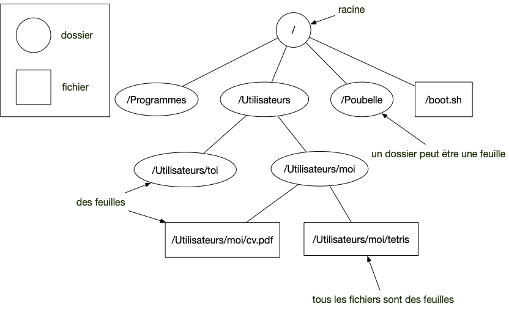
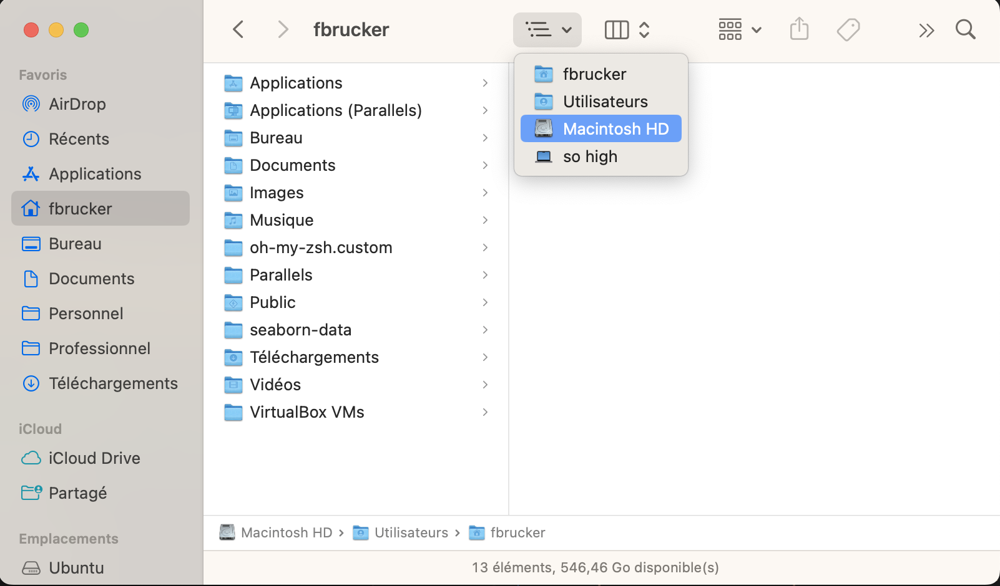
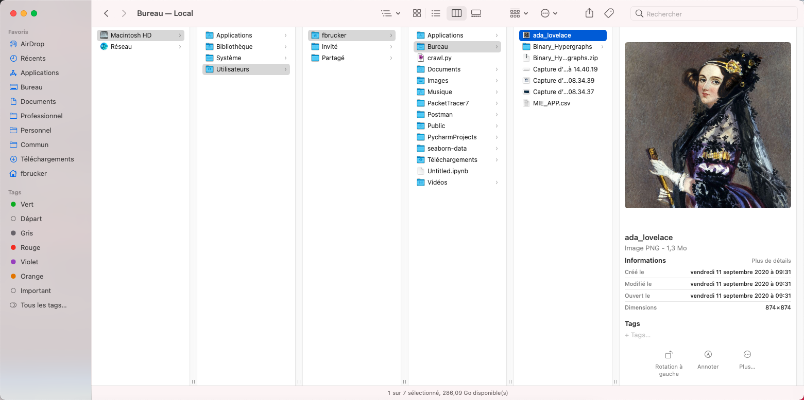
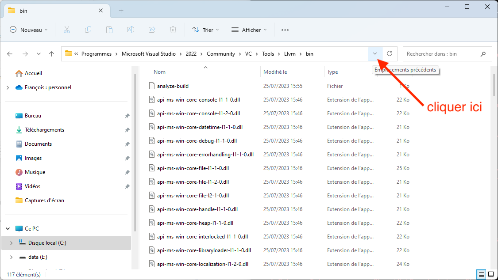
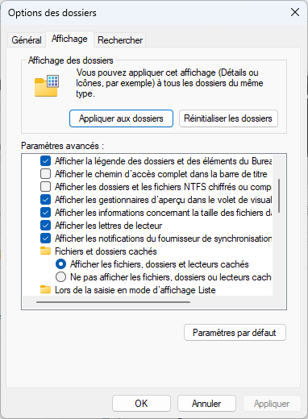
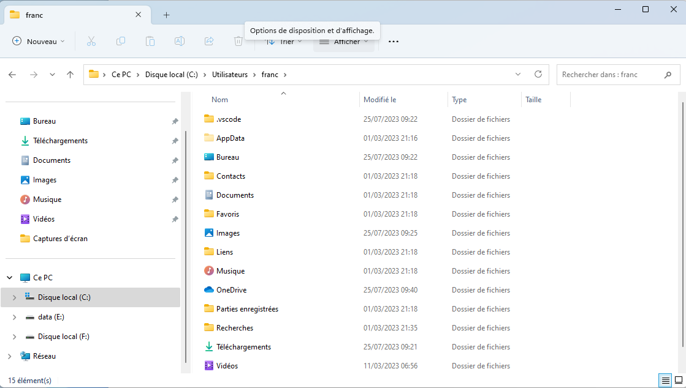
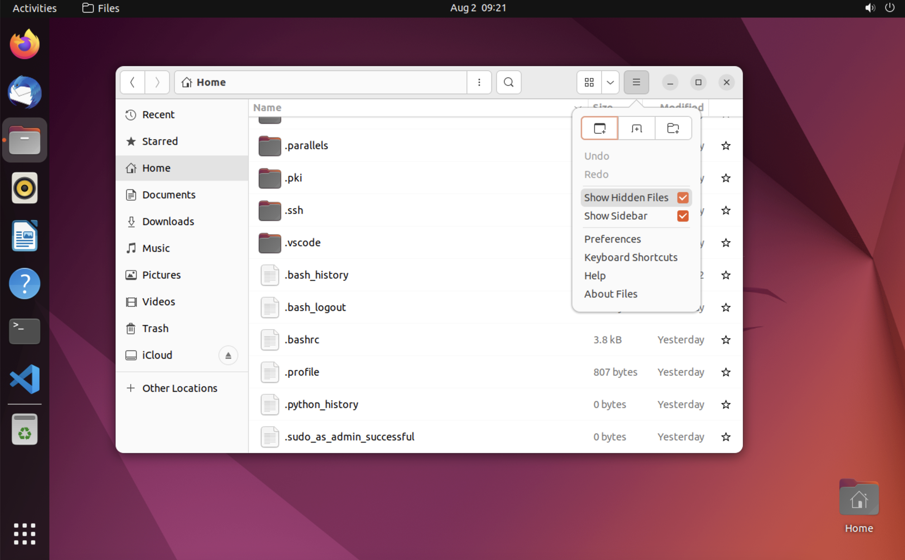

Qu'est-ce qu'un fichier ? Un dossier ? Comment naviguer dans un système de fichier avec le terminal ou l'explorateur de fichier.


Votre ordinateur est composé de ***fichiers*** et de ***dossiers*** (aussi appelé ***répertoire***) :

* un ***dossier*** est un conteneur qui peut contenir soit d'autres dossiers, soit des fichiers
* un ***fichier*** est ce que vous pouvez utiliser. C'est une image, du texte, ou encore un programme.

Il existe un dossier spécial, appelé ***racine*** qui est le départ : on peut atteindre tous les fichiers/dossiers de votre ordinateur à partir de celui-ci.


Cette organisation est appelée [arborescence de fichiers](https://fr.wikipedia.org/wiki/R%C3%A9pertoire_(informatique)) et ressemble à [un arbre enraciné](https://fr.wikipedia.org/wiki/Arbre_enracin%C3%A9) où les fichiers sont des feuilles, comme dans la figure ci-dessous :



## <span id="explorateur"></span>Explorateur de fichiers

Chaque système d'exploitation fournit un ***explorateur de fichiers***  qui est une application permettant de naviguer dans l'arborescence des fichiers.



[L'explorateur de fichiers](https://support.microsoft.com/fr-fr/windows/rechercher-et-ouvrir-explorateur-de-fichiers-ef370130-1cca-9dc5-e0df-2f7416fe1cb1) permet de naviguer dans l'arborescence de vos disque durs.



L'explorateur de fichier sous mac s'appelle [le finder](https://support.apple.com/fr-fr/HT201732).

Le finder est l'outil principal qui vous permettra de naviguer dans les fichiers. Pour qu'il soit un peu plus facile d'y naviguer :

* `menu présentation > personnaliser la barre d'outils...` ajoutez le "chemin" (trois barres horizontales) aux outils du finder en le glissant/déposant.
* ajoutez le dossier "*Départ*", aussi appelé "*maison*" (le dossier principal de l'utilisateur) et le dossier "*applications*" aux éléments à la gauche du finder. Pour cela, choisissez le dossier dans le menu *Aller* puis  avec l'outils chemin que l'on vient d'ajouter sélectionnez le dossier parent(Par exemple pour la maison, le dossier parent est "Utilisateurs" et pour application, le dossier parent est “Macintosh HD"). Vous pouvez ensuite glisser/déposer le dossier à gauche du finder.






Sous Ubuntu, il  existe [plusieurs explorateurs de fichiers](https://doc.ubuntu-fr.org/gestionnaire_de_fichiers). Par défaut c'est l'application files :




Utilisons un peu cet explorateur. Ouvrez une fenêtre de l'explorateur de fichiers et placez vous à la racine de votre système de fichier :



Le panel de gauche de l'explorateur permet d'aller à des endroit spécifiques de votre disque dur. Dans la partie *Ce PC*, vous devriez avoir un item nommé *Disque local (C:)* : c'est la racine.

Si vous cliquez sur la barre de chemin, vous voyez le chemin (si c'est pas un dossier spécial)



Ouvrez une nouvelle fenêtre du *Finder* et choisissez le mode d'affichage des fichiers en colonne. Ensuite, choisissez dans le menu : *aller > ordinateur* et cliquez sur *"Macintosh HD"*, qui est la racine de votre système de fichier.



Pour aller à la racine, choisissez `other Locations > Computer` en bas du panel de gauche.



Vous pourrez ensuite naviguer de dossiers en dossiers, jusqu'à arriver à un fichier d'où vous ne pourrez plus avancer.

Dans l'exemple ci-après, j'ai navigué sur mon mac jusqu'à ma photo [d'Ada Lovelace](https://fr.wikipedia.org/wiki/Ada_Lovelace) :



On voit bien le chemin parcouru de la racine (appelé *"Macintosh HD"* sur un mac et le fichier).


Le nom des dossiers sur le disque dur et celui qui apparaît dans l'explorateur de fichier peuvent être différents selon la langue du système d'exploitation.
Ainsi, le nom *Bureau* dans l'explorateur correspondra au dossier `Desktop`{.fichier} sur le disque dur.


## <span id="absolu-relatif"></span> Chemin

Le chemin vers un fichier depuis la racine s'écrit en séparant tous les dossiers parcourus par un `/`{.fichier}. Dans l'image de la navigation vers Ada Lovelace, son chemin est :

```shell
/Users/fbrucker/Desktop/ada_lovelace.png 
```

Tout fichier ou dossier de l'arborescence de fichiers possède un chemin unique depuis la racine, c'est donc un moyen de l'identifier.


Le chemin du dossier racine est `/`{.fichier}.


Un chemin qui commence par `/`{.fichier} est dit ***chemin absolu***, puisqu'il part de la racine. On a aussi souvent coutume de parler de ***chemin relatif*** lorsqu'il part d'un dossier particulier. Dans l'exemple précédent, en partant du dossier `/Users/fbrucker`{.fichier}, le chemin relatif vers l'image d'Ada est : `Desktop/ada_lovelace.png`{.fichier}.


Un chemin absolu commence **toujours** par `/`{.fichier}. Un chemin qui ne commence **pas** par `/`{.fichier} est **toujours** un chemin relatif.

Le chemin absolu commence à la racine du disque dur, le chemin relatif commence au dossier **courant** (qui dépend du contexte)



Sous Windows, on utilise souvent `\`{.fichier} à la place de `/`{.fichier}.


### Plusieurs racines

On considère parfois que chaque disque dur, chaque clé usb constitue sa propre racine. Il y a alors une *racine des racines*, qui contient le départ vers les racines particulières des différents périphériques de stockages de l'ordinateur comme les disques durs, clés usb, etc.

C'est en réalité une vue de l'esprit. Il n'existe qu'une seule racine et chaque disque dur est [monté](https://fr.wikipedia.org/wiki/Point_de_montage).


Souvent sous windows ces racines sont explicites, c'est `c:`{.fichier} par exemple pour le disque dur principal.


### <span id="block-.-.."></span> Dossiers `.`{.fichier} et `..`{.fichier}

Les dossiers `.`{.fichier} et `..`{.fichier} sont des dossiers spéciaux qui signifient :

* le dossiers courant pour `.`{.fichier}
* le dossiers précédent du dossiers `.`{.fichier} pour `..`{.fichier}.

De là les 4 chemins suivants sont identiques :

* `/Users/fbrucker/Desktop/ada_lovelace.png`{.fichier}
* `/Users/fbrucker/./Desktop/./ada_lovelace.png`{.fichier}
* `/Users/fbrucker/../fbrucker/Desktop/ada_lovelace.png`{.fichier}
* `/Users/fbrucker/../fbrucker/./Desktop/ada_lovelace.png`{.fichier}


On fait souvent commencer un chemin relatif par `.`{.fichier} pour bien montrer sa différence par rapport à un chemin absolu qui commence par `/`{.fichier}.


L'intérêt principal de ces dossiers est qu'ils permettent de naviguer dans l'arborescence à partir d'un dossier. Par exemple dans un projet, si l'on n'utilise que des chemins relatifs, on pourra facilement déplacer le dossier du projet (voire le donner à une autre personne) sans casser les liens.


Dans un projet, utilisez **toujours** des chemins relatifs lorsque vous donnez des chemins, cela permet de déplacer le dossier sans casser les liens.


## Copier le chemin absolu



Dans explorateur de fichier cliquez sur le dossier, puis *copier le chemin d'accès* dans le menu *accueil*. Par exemple le dossier :



En cliquant sur le `v` on obtient le chemin :





Dans le finder cliquez droit sur le dossier, puis copiez. Collez ensuite dans un [terminal](../terminal){.interne}.




Dans l'explorateur de fichiers cliquez droit sur le dossier et copiez le. Puis, dans un [terminal](../terminal){.interne}, cliquez droit et choissez `Paste as Filenames`



## Dossier Maison

La *maison* est le dossier principal d'un utilisateur. C'est à partir de ce dossier qu'il pourra créer et ranger ses données.


Il est recommandé que ce dossier ne comporte ni espace ni accent.


## <span id="fichier-cache"></span> Dossiers et fichiers spéciaux

Pour qu'un ordinateur fonctionne, il a besoin d'avoir des dossiers spéciaux contenant le système d'exploitation, les données, etc. Ces dossiers sont souvent [cachés](https://fr.wikipedia.org/wiki/Fichier_et_r%C3%A9pertoire_cach%C3%A9) et nécessitent d'être administrateur pour y accéder.

Dans le monde unix (Linux et macos) les fichiers cachés sont ceux qui commencent par un `.`{.fichier} et dans le monde windows, ils sont déterminés par une propriété.

On peut cependant les afficher dans un explorateur de fichier en effectuant quelques manipulations :



Dans un explorateur, allez dans le menu `Affichage > options` puis de choisir d'afficher les fichier caché dans la fenêtre suivant :



Après avoir activé l'affichage des fichiers cachés, le dossier `AppData`{.fichier} est maintenant visible :






[dans le finder](https://www.ionos.fr/digitalguide/serveur/configuration/mac-afficher-les-fichiers-et-dossiers-caches/).


Pour que la manipulation de touche décrite dans la page fonctionne, il faut également d'appuyer sur la touche `fn` en plus.


Si vous voulez aller dans un dossier particulier, vous pouvez utiliser : `menu Aller > Aller au dossier...`





Il pourra parfois être utile de voir les fichiers cachés (des fichiers qui commencent par un `.`{.fichier}) en cochant une case d'un menu :





## Fichiers

Les fichiers sont les terminaisons (feuilles) de l'arborescence. Ils sont les éléments utiles de l'arborescences et peuvent être des applications, des fichiers de données, des programmes python, etc.

### Extension de fichier

Un nom de fichier comporte souvent un texte, suivi d'un `.`{.fichier} puis de deux ou trois lettres qui forme [***une extension***](https://fr.wikipedia.org/wiki/Extension_de_nom_de_fichier).

Cette extension ne sert à rien pour l'ordinateur, c'est seulement une aide pour l'utilisateur et certaines applications. Cela permet à priori de catégoriser un fichier.

Ainsi, même si l'extension d'un fichier texte est *".txt"*, rien ne vous empêche de la changer en *".exe"* par exemple. Cela ne change en rien la nature du fichier. Cela cependant apporte de la confusion car certaines applications vont penser que c'est un fichier exécutable et cela va planter quand elles vont tenter de le faire. Enfin, dans un éditeur de texte, l'extension d'un fichier permet de charger une coloration syntaxique par défaut : *".py"* pour les fichiers python par exemple, *".md"* pour les fichier markdown.


Ne soyez pas créatifs dans les extensions de fichiers, utilisez celle par défaut selon le type de fichier que vous utilisez.


### Fichiers exécutables

Les ***fichiers exécutables*** sont des programmes, ils sont exécutés directement par le système d'exploitation. C'est ce qui fait qu'un exécutable windows ne peut pas être directement lancé sur un mac ou un Linux, même s'ils ont le même processeur.


Un fichier python n'est **pas** un fichier exécutable. C'est un fichier texte qui est est lu — on dit **interprété** — par l'*interpréteur python* qui lui est un fichier exécutable.

