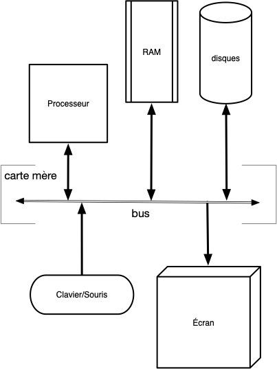

Le but d'un [ordinateur](https://fr.wikipedia.org/wiki/Ordinateur) est de permettre à des utilisateurs d'exécuter des applications. Il est composé de multiples composants qui interagissent entre eux :

- le [processeur](https://fr.wikipedia.org/wiki/Processeur) : exécute des instructions sur des variables appelés registre (64bits). Instructions et variables sont prisent et manipulées dans la mémoire.
- [mémoire vive](https://fr.wikipedia.org/wiki/M%C3%A9moire_vive) : un espace de stockage rapide, mais volatile (se vide lorsque l'on éteint l'ordinateur). Peut-être vu comme un grand tableau ou chaque case contient 1 [Byte](https://fr.wikipedia.org/wiki/Byte). Comme on peut accéder à tout élément sans contrainte, cette mémoire est appelée _RAM_ (pour Random Access Memory)
- périphériques, appelés **_device_**
  - mémoire non volatile (stockage) : On ne peut pas toujours accéder à tout byte du tableau de stockage indépendamment. Il faut utiliser un protocole. Ces devices sont plus lent que la RAM mais sont non volatiles. Par exemple :
    - disques durs : plus lent que la mémoire mais non volatile
    - USB : encore plus lent qu'un disque dur mais déplaçable facilement
  - réseau : encore plus lent que l'USB mais accessible de partout
  - [interfaces](https://fr.wikipedia.org/wiki/Interactions_homme-machine) :
    - entrée : clavier/souris
    - sortie : écran/imprimante
    - entrée/sortie : volant avec retour de force

En regroupant tous [les types de mémoires](<https://fr.wikipedia.org/wiki/M%C3%A9moire_(informatique)>), on obtient le schéma (très) simplifié suivant :

> tbd ajouter carte mère qui fait communiquer tout ça ensemble via un [bus](https://fr.wikipedia.org/wiki/Bus_informatique)

- programme = numéro de l'instruction instruction processeur
- au démarrage on charge un endroit du disque dur en mémoire et on exécute ces instructions (codées sur 8 bytes, 64 bits) une à une
- l'instruction sur un endroit du disque dur : montrer liste x86
- 
Pour que chaque application n'ait pas à tout gérer (accès au processeur, à la mémoire, au disque dur, au réseau, ...) comme on le ferait avec un circuit imprimé par exemple, on utilise un [système d'exploitation](https://fr.wikipedia.org/wiki/Syst%C3%A8me_d%27exploitation) (ou **_OS_** pour _operating system_) comme intermédiaire :

On suppose ici que vous savez minimalement interagir avec votre système d'exploitation en exécutant des applications via un menu ou l'explorateur de fichiers.

L'architecture d'un ordinateur et les systèmes d'exploitations ont co-évolué. Les besoins des uns modifiant l'architecture des autres et réciproquement.

L'élément central qui permet à tous les composants d'un ordinateur de communiquer entre eux est la [carte mère](https://fr.wikipedia.org/wiki/Carte_m%C3%A8re).

## Principes


[Principes d'un système](principes){.interne}


## Système de fichiers

Quel que soit le système d'exploitation que vous utilisez, les données (ainsi que les applications) sont stockées sous la forme de **_fichiers_** organisé en arbre. Il est crucial de savoir y naviguer.

### Dossiers et fichiers


[Naviguer dans un système de fichiers](fichiers-navigation){.interne}


### Dossiers et fichiers système

Le système d'exploitation a besoin de ses propres fichiers pour fonctionner correctement. Selon le système d'exploitations, ils sont rangés différemment :


[Hiérarchie système](fichiers-système){.interne}

