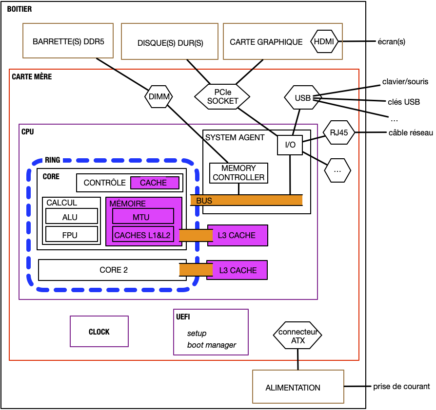

> TBD mettre de l'ordre

Un ordinateur est composé de plusieurs composants qui interagissent entre eux :

* le [processeur](https://fr.wikipedia.org/wiki/Processeur) : exécute des instructions sur des variables. Instructions et variables sont prisent et manipulées dans la mémoire.
* [mémoire](https://fr.wikipedia.org/wiki/M%C3%A9moire_(informatique)) :
  * RAM : se vide lorsque l'on éteint l'ordinateur (volatile), mais rapide
* périphériques, appelés ***device***
  * stockage
    * disques durs : plus lent que la mémoire mais reste même sans courant
    * USB : encore plus lent qu'un disque dur mais déplaçable facilement
    * réseau : encore plus lent que l'USB mais accessible de partout
  * [interfaces](https://fr.wikipedia.org/wiki/Interactions_homme-machine) :
    * entrée : clavier/souris
    * sortie : écran/imprimante
    * entrée/sortie : volant avec retour de force


* composants
* utilité de chaque composant

### Carte mère

<https://fr.wikipedia.org/wiki/Format_ATX>


Vous allez trouver plein de vieilles choses sur internet :

* [BIOS](https://fr.wikipedia.org/wiki/BIOS_(informatique)) : n'existe plus depuis 2006
* [northbridge/southbridge](https://en.wikipedia.org/wiki/Northbridge_(computing)). Depuis 2019, remplacé par le [system agent](https://en.wikipedia.org/wiki/Uncore).


* <https://fr.wikipedia.org/wiki/UEFI>
* Barrette de RAM : <https://fr.wikipedia.org/wiki/Dual_Inline_Memory_Module>
* <https://fr.wikipedia.org/wiki/Disque_dur>
* horloge : permet la synchronisation des devices. Chaque device soit fonctionner à une fréquence qui est un multiple de la fréquence d'horloge de la carte mère
* bus

Exemple de signal à la fréquence de l'horloge. On regarde à chaque *front montant* de l'horloge le signal, qui est convertit en bit :

```
           front montant     front descendant 
           v                 v
horloge : _/⎺\_/⎺\_/⎺\_/⎺\_/⎺\_/⎺\_/⎺\
signal  : __/⎺⎺⎺⎺⎺\_____/⎺⎺⎺⎺⎺⎺⎺\_____
bits    :  0   1   0   0   1   1   0
```

1. nécessité d'une horloge pour transmettre un message : Sans une horloge, il nous est uniquement possible de connaître les changements de bits (de 0 à 1 ou réciproquement), pas une succession de bit identique.
2. il faut que les horloges de chaque device soient synchronisées. De plus, si les horloges des différents devices (disques dur, ram, etc) ne sont pas synchronisées il est impossible de savoir quand et quel est le message transmis. C'est le rôle de l'horloge de la carte mère.
3. Enfin, pour que des devices de vitesse différentes puissent communiquer sans perte de temps, il faut que le device le plus rapide puisse communiquer à la vitesse du plus lent : il faut que toutes leurs horloges soient des multiples de l'horloge de la carte mère.


[transmission de données](https://www.youtube.com/watch?v=ZQ-Jb__HTyo)


### *Device*

Communication en série via un protocole. On lit bit à bit la donnée.

C'est paradoxalement plus rapide que de passer les données de façon parallèle car il n'y a pas de synchronisation à avoir. Les trois protocoles de transmissions actuels sont en série :

* USB
* PCIe
* Ethernet



* [parallèle vs série](https://www.youtube.com/watch?v=-iDaeZt-pYM)
* [protocoles séries basiques](<https://www.youtube.com/watch?v=IyGwvGzrqp8>)
* [protocole USB](https://www.youtube.com/watch?v=F7NlCaaL3yU)
* [PCIe](https://fr.wikipedia.org/wiki/PCI_Express). Chaque *lane* est une communication en série sous la forme d'un [differential signaling](https://en.wikipedia.org/wiki/Differential_signalling)



## Bus de communication

Le [bus](https://fr.wikipedia.org/wiki/Bus_informatique) est le moyen de faire entrer et sortir des données d'un processeur :


Un bus doit pouvoir véhiculer 3 types d'informations :

* adresse : où est la donnée
* donnée : la donnée à faire sortir ou entrer dans le processeur
* contrôle : que veut-on faire : lire (faire entrer dans le processeur)/écrire (faire sortir la donnée)

L'adresse peut être plusieurs choses :

* un byte de la mémoire RAM
* un accès série à un device :
  * disque dur,
  * écran,
  * clavier,
  * etc


L'adresse sur le bus est donc une **abstraction** pour que les données qui entre ou sortent du processeur soient toutes traitées de la même manière.

Cette unification est appelée [IO memory mapping](https://en.wikipedia.org/wiki/Memory-mapped_I/O_and_port-mapped_I/O)


Certains systèmes spécifiques (ou vieux) possèdent plusieurs bus (un pour la mémoire et un pour les devices par exemple), le processeur doit alors avoir des jeux d'instructions différents pour traiter ces différents cas, ce qui complexifie le code et l'architecture du processeur.


Si le processus d'accès à la donnée est unifié du point du vue du processeur, on ne peut cependant pas faire la même chose selon qu'on accède à la RAM ou à un device.

On peut en effet accéder directement à tout byte de la mémoire en donnant directement son adresse en mémoire, ce qui est impossible avec un autre device ou la communication se fait en série, bit à bit.


[Explication physique du process](https://www.youtube.com/watch?v=2Cbcb2yGjiM)


Pour écrire une donnée d'un device en mémoire il faut alors :

1. commencer par envoyer au device l'adresse du byte que lon aimerait avoir
2. une fois la demande traitée par le device, la valeur est retournée au processeur
3. cette valeur est ensuite usuellement re-écrite en mémoire RAM.

Pour accélérer ce processus et ne pas repasser à chaque fois par le processeur pour chaque byte, on a coutume de récupérer ou d'envoyer au device plus de données (usuellement par paquet de c4kb) et de laisser le device accéder directement à la mémoire par un procédé appelé [Direct Memory Access](https://en.wikipedia.org/wiki/Direct_memory_access) et laisser le processeur faire d'autres opérations pendant ce temps. Une fois ce transfert terminé le device génère une [Interruption](https://fr.wikipedia.org/wiki/Interruption_(informatique)) pour prévenir le processeur de la fin du traitement.


Ue série de vidéos explicatives :

1. [I/O](https://www.youtube.com/watch?v=nnO2OfSTVbA&list=RDCMUCOPmCMY3ROyg04_y5bYPyyw&index=7)
2. [I/O memory mapping](https://www.youtube.com/watch?v=xNH1e5snIEY&list=RDCMUCOPmCMY3ROyg04_y5bYPyyw&index=1)
3. [les interruptions](https://www.youtube.com/watch?v=dDA3PUr16As&list=RDCMUCOPmCMY3ROyg04_y5bYPyyw&index=4)
4. [Direct memory Access](https://www.youtube.com/watch?v=M16l_ymlfcs&list=RDCMUCOPmCMY3ROyg04_y5bYPyyw&index=8)


## Processeur

Suit le [modèle de Von Neumann](https://fr.wikipedia.org/wiki/Architecture_de_von_Neumann) :

* registres
* [ALU](https://fr.wikipedia.org/wiki/Unit%C3%A9_arithm%C3%A9tique_et_logique) et [FPU](https://fr.wikipedia.org/wiki/Unit%C3%A9_de_calcul_en_virgule_flottante)
* [MMU](https://fr.wikipedia.org/wiki/Unit%C3%A9_de_gestion_de_m%C3%A9moire) (caches, et translation d'adresses)
* communication via un bus avec la mémoire et les devices

C'est toujours le même principe actuellement, voir [WikiChip](https://en.wikichip.org/wiki/WikiChip) pour les processeurs et leurs caractéristiques.

Le processeur n'a pas de mémoire. Son état est déterminé par :

* la valeur de ses registres
* la table des addresses de la MMU

> TBD facile de changer de contexte. On vide le cache, puis on remet la table et les valeurs des registres.


<https://en.wikipedia.org/wiki/X86-64>


> TBD : ordre
>
> 1. archi de von neuman
> 2. amélioration : dma pour unifier le tout
> 3. gestion mémoire :
>     * mode protégé : sécurité
>     * paging : multi-process

### Architecture de commandes

Deux grandes familles de processeurs sur le même principe :

* [CISC](https://fr.wikipedia.org/wiki/Microprocesseur_%C3%A0_jeu_d%27instruction_%C3%A9tendu) (intel et AMD)
* [RISC](https://fr.wikipedia.org/wiki/Processeur_%C3%A0_jeu_d%27instructions_r%C3%A9duit) (ARM et Apple)


[RISK vs CISC](https://www.youtube.com/watch?v=a4kgtygCZBc) et [ARM vs x86](https://www.youtube.com/watch?v=AADZo73yrq4). Et une comparaison avec le petit dernier [RISC-V](https://www.youtube.com/watch?v=Ps0JFsyX2fU)


Un processeur n'a pas de mémoire proprement dite. De nombreux caches sont mis en oeuvre pour accélérer les I/O ([Memory hierarchy](https://computationstructures.org/lectures/caches/caches.html#20). Plus on va vite plus c'est cher.)

Les CPU actuels ont plusieurs CORE qui sont autant de processeur partageant la mémoire mémoire.

### Registres

Des registres à tout faire et des registres spécifiques

<https://fr.wikipedia.org/wiki/Registre_de_processeur>

<https://en.wikibooks.org/wiki/X86_Assembly/X86_Architecture>

<https://en.wikipedia.org/wiki/X86#Purpose>

### Instructions


[Instructions x86_64](https://www.felixcloutier.com/x86/)


Les instructions de l'assembleur sont des aides pour les homme. En vrai, c'est juste de mots en mémoire :

* pour une explication : <http://www.c-jump.com/CIS77/CPU/x86/lecture.html>
* pour la liste complète : <http://ref.x86asm.net/>
  
Puis décodé dans la partie "instruction du processeur".

Une instruction est lue de la mémoire (un registre dit où lire l'instruction), puis exécutée, puis on passe à la suite (on incrémente le registre).

On peut désassembler du code

### Mémoire

Une partie du processeur est dédiée à la gestion de la mémoire.

#### Caches

Accès et cache L1 et L2 à cause des rapidités.

Deux sorte de caches L1 :

* instructions
* mémoire

#### mode noyau / utilisateur

<https://en.wikipedia.org/wiki/Protection_ring>
<https://en.wikipedia.org/wiki/Protected_mode>

La mémoire est séparée en 4 cercles : du 0 au 3.

* Le ring 0, qui a tout les droit est souvent appelé noyau
* Le ring 3, qui en a le moins est souvent appelé utilisateur.

Une instruction prise dans une mémoire utilisateur ne peut accéder à une case mémoire noyau. Ceci permet de sécuriser les accès.

Passer d'un mode à l'autre se fait avec un instruction nommée [SYSCALL](https://www.felixcloutier.com/x86/syscall).

#### Paging

<https://en.wikipedia.org/wiki/Global_Descriptor_Table>

Conversion d'une adresse en une autre. Adresse valide ou pas, si pas valide interruption

Si pas valide : [exception page-fault](https://wiki.osdev.org/Exceptions#Page_Fault).

permettant d'être multi-tâche.

<https://wiki.osdev.org/Paging>

On (le noyau) peut changer la table pour changer tout le mapping

### interruptions

<https://wiki.osdev.org/Interrupt>

* pour le matériel
* pour la sécurité : ces appels se font en mode noyau
* pour le multi-tache : mapping/rappel le noyau sous les k cycle pour gérer l'ordonnancement

## UEFI

L'[UEFI](https://fr.wikipedia.org/wiki/UEFI) est un logiciel sur la carte mère permettant de :

1. vérifier et configurer si nécessaire le matériel installé sur la carte
2. déterminer sur quel disque démarrer pour exécuter le système d'exploitation.

### UEFI manager

Pour accéder au manager, il faut au boot de l'ordinateur appuyer sur une touche. Cette touche dépend de votre ordinateur et sera affichée au boot. Cela peut être `F2`, mais aussi `ESC` ou encore `F11`. Sur le [NUC](https://www.intel.fr/content/www/fr/fr/products/details/nuc.html) de la maison, c'est `F2` au démarrage, et voici le manager qu'on obtient :


On y voit les caractéristiques du processeur (onglet de départ  `main`).

Le deuxième onglet (`advanced`) montre les différents matériels branché sur la carte mère :


Pour ma part 3 disques dur :

* Un disque SSD de 1TB sur le port [SATA](https://fr.wikipedia.org/wiki/Serial_ATA) (qui contient les données)
* deux disques un sur chaque port [M2](https://fr.wikipedia.org/wiki/M.2) :
  * un de 1TB (contient un système Linux/ArchLinux)
  * un de 240GB (contient un système Windows 11)

Le troisième onglet permet d'overclocker le processeur si on est joueur :


Le dernier onglet, `boot` permet de gérer le boot :


On voit que j'ai désactivé le [secure boot](https://fr.wikipedia.org/wiki/UEFI#Lancement_s%C3%A9curis%C3%A9_(secure_boot)) car il ne permet pas d'exécuter tous les logiciel libres (secure signifiant approuvé par microsoft... qui [refuse de signer des logiciels sous licence GPLv3](https://www.fsf.org/campaigns/secure-boot-vs-restricted-boot/whitepaper-web)) et vous aurez aussi à le faire pour booter certains disque d'installation Linux.


Lisez [ce document](https://www.rodsbooks.com/efi-bootloaders/secureboot.html) qui explique ce qu'est le secure boot.

Plus généralement vous pouvez lire [l'article complet](https://www.rodsbooks.com/efi-bootloaders/index.html) sur l'UEFI et Linux)


En cliquant sur `boot priority` on voit l'ordre de boot que j'ai choisi pour l'ordinateur :


1. Le disque LEXAR SSD de 1TB contenant ma distribution Linux/ArchLinux
2. Le disque de 240GB contenant le système Windows 11
3. l'[UEFI shell](https://papy-tux.legtux.org/doc1249/index.html) qui est un programme permettant de faire des opérations très bas niveaux sur la carte mère et les disques.

On voit de plus que si une clé USB bootable est présente dans l'ordinateur au démarrage, on boot d'abord sur elle (c'est ce que genre de chose qu'il faudra faire lorsque vous voudrez installer Linux à partir d'une clé USB par exemple)

### Boot

Le [processus de démarrage UEFI](https://wiki.archlinux.org/title/Arch_boot_process_(Fran%C3%A7ais)#Avec_un_UEFI) est le suivant :

1. mise sous tension de l'ordinateur
2. Procédure [POST](https://fr.wikipedia.org/wiki/Power-on_self-test_(informatique)) qui vérifie que tout est Ok sur la carte et reconnaît les appareils qui lui sont connectés
3. Pour chaque disque dans l'ordre de démarrage des disques :
   1. s'il possède une [partition EFI](https://en.wikipedia.org/wiki/EFI_system_partition)
   2. on exécute le fichier `\EFI\BOOT\BOOTx64.EFI`{.fichier} dont l'exécution charge le système d'exploitation
   3. si le fichier ou la partition EFI n'existe pas on passe au disque suivant

> TBD :
>
> * <https://wiki.archlinux.org/title/Unified_Extensible_Firmware_Interface>
> * [partition GPT](https://en.wikipedia.org/wiki/GUID_Partition_Table). FAT32 pour la partition EFI
> * [executable EFI](https://uefi.org/specifications) <https://uefi.org/sites/default/files/resources/UEFI_Spec_2_10_Aug29.pdf> un doc de 2150 pages

## Version détaillée


