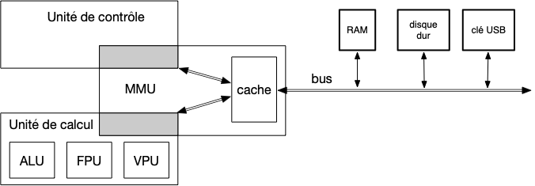

## adressage

<https://en.wikipedia.org/wiki/Long_mode>

Pas tout utilisable : <https://en.wikipedia.org/wiki/X86-64#Virtual_address_space_details>

### Protection ring

> TBD adresse accessible en lecture/ écriture/exécution
> TBD et pour qui : kernel /user

> TBD pour la sécurité. A priori uniquement syscall de la table d'interruption. Le reste est géré par le noyau lors des pages fault.

<https://en.wikipedia.org/wiki/Protection_ring> On en utilise souvent que 2 :

- kernel (ring 0)
- user (ring 3)

Le user n'a pas accès au code du noyau ni le droit de modifier la table des interruptions par exemple.

### Interruptions et appels systèmes

permet à un utlilisation d'exécuter du code kernel.

[SYSCALL](https://www.felixcloutier.com/x86/syscall).

<https://linux-kernel-labs.github.io/refs/heads/master/lectures/interrupts.html>
> TBD : interruption table

Liste des entrées :
<https://wiki.osdev.org/Interrupt_Descriptor_Table#Structure_on_x86-64>
<https://fr.wikipedia.org/wiki/Interrupt_Descriptor_Table>


<https://wiki.osdev.org/Interrupt>

- pour le matériel
- pour la sécurité
- pour le multi-tache : mapping/rappel le noyau sous les k cycle pour gérer l'ordonnancement

## Instructions

Les instructions que peuvent exécuter un processeur va dépendre de son modèle. Il existe deux grandes familles de processeurs qui se distinguent par le choix des opérations qu'elles permettent :

- [architecture CISC](https://fr.wikipedia.org/wiki/Microprocesseur_%C3%A0_jeu_d%27instruction_%C3%A9tendu) (intel et AMD). Possèdent un grand nombre d'instructions, chaque instruction étant complexe. Ceci permet de dédier de la circuiterie à chaque instruction pour en accélérer son exécution.
- [architecture RISC](https://fr.wikipedia.org/wiki/Processeur_%C3%A0_jeu_d%27instructions_r%C3%A9duit) (ARM et Apple). Un petit nombre d'instructions simples. Le petit jeu d'instruction uniformisé en [pipeline](https://en.wikipedia.org/wiki/Classic_RISC_pipeline) permet théoriquement d'avoir une instruction par cycle. De plus la simplicité de chaque opération rend ces processeurs économe en énergie.

On s'accorde à dire que le RISC est plus rapide mais consomme plus que le RISC :

- le CISC est l'architecture reine des ordinateurs de bureaux
- le RISC est présent dans quasi tous les téléphones portables et tablettes

Les développement récents des deux architectures tend à brouiller un peu ces différences, chaque architecture empruntant à l'autre ses points forts (le CISC scinde certaines de ses instructions pour gagner en consommation et le RISC propose quelques instructions complexes pur les optimiser).


[RISK vs CISC](https://www.youtube.com/watch?v=a4kgtygCZBc) et [ARM vs x86](https://www.youtube.com/watch?v=AADZo73yrq4). Et une comparaison avec le petit dernier [RISC-V](https://www.youtube.com/watch?v=Ps0JFsyX2fU)


Pour la suite de ce cours, nous allons uniquement nous occuper d'architecture [x86-64](https://en.wikipedia.org/wiki/X86-64), donc CISC.


[Instructions x86_64](https://www.felixcloutier.com/x86/)


### Registres

Que l'architecture soit RISC ou CISC les instructions fonctionnent sur le même principe.

Chaque instruction possède un certain nombre de paramètres et une sortie qui sont placés dans des [registres](https://fr.wikipedia.org/wiki/Registre_de_processeur). Ces registres, en nombre et en taille fixés correspondent aux variables du processeur.

Par exemple l'instruction :

```
ADD RAX, 42
```

Va ajouter 42 à la valeur du registre `RAX` puis placer le résultat dans le registre `RAX`.

On peut aussi :

```
ADD RAX, RDX
```

Qui va ajouter la valeur du registre `RDX` à la valeur du registre `RAX` puis placer le résultat dans le registre `RAX`.

Ou encore :

```
ADD RAX, [RDX]
```

Qui va ajouter la valeur (64bits) à l'adresse du registre `RDX` à la valeur du registre `RAX` puis placer le résultat dans le registre `RAX`.

Toutes les façon de faire ADD sont décrite : [commande ADD](https://www.felixcloutier.com/x86/add).

Les registres font office d'entrées/sortie des instructions du processeur. Pour [un processeur x86-64 il y a](https://en.wikibooks.org/wiki/X86_Assembly/X86_Architecture#x86_Architecture) :

- 16 registres généraux de 64bits, plus ou moins à tout faire, nommés : RAX (accumulateur), RCX (compteur), RDX (données), RBX (adresse donnée), RSP (adresse pile courante), RBP (adresse pile base), RSI (adresse source), RDI (adresse destination), R8 à R15 (registres fourre-tout). Ces registres se divisent en bouts plus petits. Par exemple le registre RAX se décompose en :
  - EAX (les 32 premiers bits)
  - AX (les 16 premiers bits)
  - AL (les 8 premiers bits) et AH (les 8 suivants)
- 1 registre d'état de 32bits. Utilisé pour stocker des résultats annexes d'une opérations. Par exemple s'il y a eu une retenue, une comparaison qui a fait 0, un résultat négatif, etc.
- 1 registre d'instruction EIP qui contient l'adresse de la **prochaine** instruction à exécuter
- 2 registres utilisés par le système d'exploitation FS et GS.

> TBD registres vectoriels de 128bit et registres pour les calculs flottants.


Il existe également des registres de segments qui ne sont plus utilisés : SS, CS, DS et ES.  Ils restent présent pour des raisons de compatibilité mais valent tout le temps 0.


### opcode

> TBD : Comme on a vu dans la parte OS :
>
> - une même commande (en ASM) peut avoir plusieurs significations, ex MOV, et sera donc des instructions d'opcode différents
> - registres servent partout
>

Un ordinateur ne comprend par l'instruction `ADD RAX, 42`, il ne comprend que des nombres. L'instruction précédente, en assembleur, est donc une abstraction pour être lue par des humains. Le processeur lie des [opcodes](http://ref.x86asm.net/), c'est à dire des traduction des instructions en nombres.


<https://cs.brown.edu/courses/cs033/docs/guides/x64_cheatsheet.pdf>



Utilisez le site ci-après pour connaître l'opcode de l'instruction `ADD RAX, 42` :
<https://defuse.ca/online-x86-assembler.htm>

Attention au fait qu'il faut que vous soyez en x64, RAX n'étant pas défini en 32bits.



[Documentation des opcodes](https://wiki.osdev.org/X86-64_Instruction_Encoding)


Que fait l'instruction : `MOV RAX, 0` ? Et celle ci : `XOR RAX, RAX` ?

Quel est l'instruction à privilégier ?


Les deux instructions font la même chose, elles place 0 dans `RAX`. Mais la seconde à un opcode plus court que la première, c'est pourquoi vous verrez souvent la seconde instruction lorsque vous décompilez du code.


## Interruptions

> TBD
>
> - <https://wiki.osdev.org/Interrupt>
> - <https://linux-kernel-labs.github.io/refs/heads/master/so2/lec4-interrupts.html>
> 

## Caches

> TBD <https://en.wikipedia.org/wiki/CPU_cache>

Pour la même raison que les échange entre devices et processeurs se font par page (lenteur relative du device par rapport au processeur), on tente de limiter les accès à la mémoire RAM pour le traitement des instructions (lecture des opcode et des données).
[Les temps d'accès aux ressources](https://fr.wikipedia.org/wiki/Hi%C3%A9rarchie_de_m%C3%A9moire)  sont en effet très différents selon le device, ce qui peut créer des ralentissement si on n'y fait pas attention.

Pour cela, on utilise la technique de la [mémoire cache](https://fr.wikipedia.org/wiki/M%C3%A9moire_cache), qui est un intermédiaire entre la mémoire et le processeur :




Un cours sur les [caches et la hiérarchie de la mémoire](https://computationstructures.org/lectures/caches/caches.html). Va du transistor au *dirty bit*.


### Principe

Le principe est le suivant. Pour accéder à une case mémoire, on commence par regarder si la case demandée est dans le cache. Si oui, on rend la case depuis le case, si non on la cherche en mémoire, la met dans le cache et la rend.

Utiliser un intermédiaire fonctionne si l'intermédiaire :

- est plus rapide
- possède souvent la ressource demandée

Prenons un exemple pour se fixer les idées (exemple tirée de [Real-Time Systems Design and Analysis: Tools for the Practitioner](https://staff.emu.edu.tr/alexanderchefranov/Documents/CMSE443/CMSE443%20Spring2020/Laplante2012%20Real-Time%20Systems%20Design%20and%20Analysis.pdf), 2.2.3). On suppose que :

- l'accès à la ressource via la mémoire coûte 100ns
- l'accès à la ressource via le cache coûte 20ns
- le pourcentage de chance que le cache ait la ressource (*hit ratio*) est de 73%.

Le temps moyen d'accès à une ressource est alors :

$$
.73 \cdot 20\text{ns} + (1-.73) \cdot 100\text{ns} \simeq 42\text{ns}
$$

On gagne du temps !

Ce gain est dépendant du *hit ratio*. Plus il est proche de 1, mieux c'est. Le *hit ratio* minimal est atteint lorsque le temps d'accès moyen est égal au temps d'accès sans cache, $100-20=80\text{ns}$, obtenu pour 25%.

Pour que cette technique fonctionne, il faut des connaissances a priori sur la structuration mémoire des informations dont aura besoin le processeur (opcodes et données). Cette information est [le principe de localité](https://fr.wikipedia.org/wiki/Principe_de_localit%C3%A9_(informatique)) (*locality of reference*) :

- **localité spatiale** : les adresses proche en mémoire auront tendance à être accédée ensemble : c'est le cas pour les instructions, la prochaine instruction est contiguë à l'adresse de l'instruction précédente (s'il n'y a pas d'appel de fonction ou de boucle)
- **localité temporelle** une adresse déjà accédée aura tendance à être re-accédée : pensez aux itérateurs de boucles par exemple.

Des deux constatations précédentes on en déduit que :

1. la lecture de donnée de la mémoire en cache doit lire plusieurs adresses contiguës en une fois
2. on doit conserver le plus longtemps possible les données stockées dans le cache.

Par exemple si à la place de lire 8B (64b, la taille d'un registre) par 8b de la mémoire, on en lit 32B (soit 4 fois plus), le premier principe de localité nous assure un *hit ratio* de 75% environ (1 miss nous assure 3 hits consécutifs si on accède successivement à chaque case) !

```
Mémoire : 12345678
Lecture : X        -> miss
Cache   : 1234     -> on remplit le cache
Lecture    X       -> hit
Lecture     X      -> hit
Lecture      X     -> hit
Lecture       X    -> miss
Cache   :     5678 -> on remplit le cache
```

On ne peut bien sur par remplacer la totalité de la mémoire par le cache car cela coûterait trop cher (le coût d'une mémoire augment exponentiellement avec sa vitesse...), mais on peut ajouter un level de cache (niveau L2) avec de la mémoire plus rapide que la RAM mais moins rapide que le premier cache (niveau L1), pour accélérer encore le processus (le vitesse de la mémoire cache L2 étant moins rapide que celle du cache L1, on peut en mettre plus ce qui augmente le hit ratio).

Reprenons l'exemple précédent et supposons qu'on ajoute un cache de temps d'accès $60\text{ns}$ et de hit ratio 89%. Le temps moyen d'accès à une ressource devient :

$$
.73 \cdot 20\text{ns} + (1-.73)\cdot .89 \cdot 60\text{ns} (1-.73)\cdot (1- .89) \cdot 100\text{ns} \simeq 32\text{ns}
$$

On gagne du temps !

C'est ce qui se fait en vrai, avec un cache spécifique pour les instructions et un autre pour les données :



<https://en.wikipedia.org/wiki/Cache_hierarchy>


### Exemple réel

Le [core sunny cove](https://en.wikichip.org/wiki/intel/microarchitectures/sunny_cove#Block_diagram) de l'architecture Ice lake vu précédemment possède deux caches L1 :

- Un cache de 32KiB pour les instructions
- Un cache de 42KiB pour les données

Et un cache de niveau L2 de 512KiB en entrée de core.


Attentions aux [unités multiples des bytes](https://fr.wikipedia.org/wiki/Mod%C3%A8le:Unit%C3%A9s_de_bytes) :


Il y a deux caches L1 car les instructions auront tendance à avoir une plus forte localité spatiale que temporelle alors que c'est le contraire pour les données. La mise en œuvre des deux caches peut donc être différente pour améliorer le *hit ratio*.

Les systèmes actuels ont même un cache L3, à l'extérieur du [core](https://fr.wikipedia.org/wiki/Core_(microarchitecture)) (mais à l'intérieur du processeur).


On le voit sur le [diagramme du processeur](https://en.wikichip.org/wiki/intel/microarchitectures/ice_lake_(client)#Block_Diagram).

### Mise en œuvre

L'idée principale est découper le cache en lignes, chaque ligne correspondant à une lecture. Pour savoir à quelle adresse correspond une ligne, il faut lui associer un index.

Pour expliquer les diverses implémentations, prenons une [NES](https://fr.wikipedia.org/wiki/Nintendo_Entertainment_System), d'adressage 8b, et supposons qu'elle possède un cache fictif de 32B et une lecture de 4B par cycle.

Commençons par montrer l'implémentation la plus simple : l'accès direct.

> TBD : <https://en.wikipedia.org/wiki/Cache_placement_policies>
> TBD refaire en mettant tag/index/offset

#### Accès direct

Si on lit 4B par 4B, notre cache
Il peut donc contenir $32 / 4 = 8$ lignes de 4B. , on peut décomposer une adresse en 3 :

```
IIILLLXX
```

La lecture d'une ligne du cache correspond à lire 4B pour une adresse multiple de 4, c'est à dire une adresse de la forme : `IIILLL00`. Comme 4B sont lues, on aura directement toutes les valeurs allant jusqu'à l'adresse : `IIILLL11`.

Comme il y a 8 lignes, cette lecture peut être rangée à la ligne correspondant au numéro binaire `LLL`. Enfin, pour se rappeler de l'adresse complète, on ajoute un index à la ligne de numéro `LLL` valant `III`.

Prenons un cache dans cette configuration :

```
index ligne cache
                  11      10      01      00       
 000   000  00000000000000000000000000000000
       001
       010
       011
       100
       101 
       110
       111
```

Seule la première ligne est renseignée. Elle correspond aux 4B de l'adresse `00000000`.

Supposons que l'on cherche à obtenir le byte à l'adresse `11010110`.

1. On Cherche si l'index de la ligne `101` vaut `110`.
2. Ce n'est pas le cas. On procède alors à la lecture de 4B à partir de l'adresse `11010100`. Disons que ça fait : `11000111000111001111000111010001`
3. on remplit le cache
4. on récupère la valeur

Après le remplissage du cache on a :

```
index ligne cache
                  11      10      01      00       
 000   000  00000000000000000000000000000000
       001
       010
       011
       100
 110   101  11000111000111001111000111010001 
       110
       111
```

Récupérer la valeur dans le cache est très rapide :

- on se place à la cinquième ligne du cache (101 en binaire) et on vérifie son index, stocké dans le type de mémoire utilisée pour stocker la valeurs des registres, donc d'accès extrêmement rapide.
- on récupère les 8 bits allant du 17ème au 24ème (pour l'adresse 10) : `00011100`

On va remplir le cache ainsi jusqu'à ce que l'on cherche à trouver la valeur à l'adresse `00010110`, qui remplacera la ligne existante du cache.

L'intérêt de cette méthode est qu'elle maximise la localité spatiale : On charge ds données puis on en lit 4 à la suite. De plus, cette façon de procéder est très rapide, on a qu'un index à vérifier.

En revanche, la localité temporelle est pauvre : on ne stocke pas longtemps nos données.

#### Full associatif

Pour maximiser la localité temporelle, il faut conserver nos données le plus longtemps possible. Pour ceci, on va augmenter l'index de chaque ligne pour qu'il soit égal à toute l'adresse sans les bit lus. En reprenant l'exemple précédant, on obtient un cache, après la première lecture :

```
index ligne cache
                  11      10      01      00       
000000 000  00000000000000000000000000000000
110101 001  11000111000111001111000111010001 
       010
       011
       100
       101  
       110
       111
```

L'intérêt est que la lecture de la valeur à l'adresse `00010110`, ne va pas nécessairement supprimer notre ligne de cache. On pourrait obtenir quelque chose du genre, si c'est la lecture suivante :

```
index ligne cache
                  11      10      01      00       
000000 000  00000000000000000000000000000000
110101 001  11000111000111001111000111010001 
001101 010  11111010101011111111111111101001
       011
       100
       101  
       110
       111
```

Si le cache est plein et que l'on doit ajouter une ligne, il faut remplacer une ligne de cache par la nouvelle, mais laquelle ?
Plusieurs stratégies existent, chacune ayant ses pour et ses contre :

- la moins récemment lue
- la plus ancienne ajoutée (remarquez que ce n'est pas forcément la moins récemment lue)
- random

La moins récemment lue serait la stratégie qui maximiserait la localité temporelle, mais elle peut-être compliquée à implémenter et donc ralenti le temps d'accès.

Cette stratégie pleinement associative n'est pas utilisée telle quelle car vérifier toute les lignes à chaque lecture est trop coûteux. On utilise une méthode hybride, la n-way.

#### n-way

C'est cette stratégie qui est utilisée en vrai. C'est ue approche hybride entre l'accès direct et l'associatif.

On utilise une numérotation comme pour l'accès direct, mais on se garde plusieurs lignes, n (qui est une puissance de 2), pour cette numérotation.

Reprenons notre exemple et supposons que l'on veuille obtenir un cache 2-way. On a donc 8 lignes en tout mais que 4 numérotation possibles. Notre adresse se décompose donc en :

```
IIIILLXX
```

Ce qui donne un cache initial :

```
index ligne cache
                  11      10      01      00       
 0000   00  00000000000000000000000000000000
        00
        01
        01
        10
        10
        11
        11
```

Après la première lecture :

```
index ligne cache
                  11      10      01      00       
 0000   00  00000000000000000000000000000000
        00
 1101   01  11000111000111001111000111010001 
        01
        10
        10
        11
        11
```

Et après la seconde lecture :

```
index ligne cache
                  11      10      01      00       
 0000   00  00000000000000000000000000000000
        00
 1101   01  11000111000111001111000111010001 
 0011   01  11111010101011111111111111101001
        10
        10
        11
        11
```

La encore la deuxième lecture n'a pas effacé le cache puisqu'il y avait deux possibilités.

La vitesse d'exécution diminue drastiquement avec l'augmentation de n, il faut donc trouver pour chaque cache une valeur adaptée à la localité des données qu'il devra lire

### Caches L1 du sunny cove core

Le [sunny cove core](https://en.wikichip.org/wiki/intel/microarchitectures/ice_lake_(client)#Block_Diagram)e à deux cache L1 :

- pour les instructions. C'est un cache de 32KiB 8-way
- pour les données. C'est un cache de 48KiB 12-way

On voit bien l'adaptation à la localité des instruction (plus spatiale que temporelle) ou des données (plus temporelle que spatiale).

Le cache d'instruction peut contenir $32 \cdot 1024 /64 = 512$ lignes de 64B. Comme c'est un cache 8-way, la numérotation est de $512/8 = 64 = 2^6$, le découpage est donc :

- les 6 derniers bit pour la lecture
- les 6 précédents pour la numérotation du paquet de 8 lignes
- les $64-6-6=52$ premiers bits comme index.

### Écrire en mémoire

> TBD : <https://en.wikipedia.org/wiki/Cache_replacement_policies>

Lorsque l'on écrit des données en mémoire, ce sont des données initialement dans le cache.

On commence par écrire la donnée modifiée dans le cache pour un usage future, mais en faisant ça on perd la cohérence entre la mémoire et le cache. Les deux valeur ne sont plus égale.

On pourrait re-écrire directement en mémoire mais c'est à la fois coûteux et inutile (on a modifié la donnée dans le cache).

Il est plus malin de mettre à jour la mémoire lorsque la ligne contenant la donnée modifiée est supprimée. Pour cela, on ajoute au cache un bit de contrôle nommé *dirty bit* :

- lorsqu'une donnée en cache est modifiée on place le dirty bit de sa ligne à 1
- lorsqu'une ligne est supprimée du cache, si son dirty bit est à un, on recopie les données en mémoire.

### hiérarchie

L1, l2 et L3

- même taille de ligne
- L3 inclusive si dans l1 alors dans l2 et si dans l2 alors dans l3

si écrire dans cache L1, le supprimer du cache L2 et dire dans L3 qu'il est modifié dirty bit

si supprime dans L1/2 et plus dans L2/1 on écrit en mémoire si dirty bit et on supprime de L3

### cache et I/O mapping

> TBD <https://stackoverflow.com/questions/38366109/managing-cache-with-memory-mapped-i-o>

1. masque pour déterminer ce qui est cachable de ce qui ne l'est pas
2. DMA : les pages sont invalidées à l'écriture.

### Cache et cores

> TBD à faire bien.

> soucis que si plusieurs core écrivent sur des données identique. Doit quasi pas arriver si process différents
L3 inclusive : donc permet de vérifier que tout est ok.

Les différents caches L1 et L2 sont privé à chaque core. Tant que la mémoire n'est pas modifiée ces caches sont indépendants, mais lorsqu'une donnée contenue dans plusieurs caches est modifiée, il faut [maintenir la cohérence entre tous les caches](https://en.wikipedia.org/wiki/Cache_coherence).


> TBD cohérence uniquement en L3. Qui est sur le ring. Puis descente invalidation. en L2 et L1 dans le core.

Les cores sont liées entre eux par le ring qui permet de faire transiter des informations :

- depuis la mémoire via le bus
- entre chaque core pour maintenir la cohérence de chaque cache

Maintenir la cohérence entre les caches de chaque core nécessite deux actions pour chaque cache :

- il faut qu'il surveille les demandes de lecture/écriture des autres cache. Ceci s'appelle le [bus snooping](https://en.wikipedia.org/wiki/Bus_snooping).
- il faut qu'il s'adapte aux données présentes dans les autres caches :
  - lorsqu'il demande une donnée modifiée dans un autre cache :
    1. il demande au cache ayant la donnée modifiée de l'écrire en mémoire
    2. une fois la donnée écrite, on charge la donnée depuis la mémoire
  - lorsqu'il écrit une donnée présente dans plusieurs cache, il demande aux autres caches d'invalider la ligne contenant cette donnée s'ils la possède (demander aux autres cache de modifier leurs valeurs causerait trop d'écritures inutiles, il n'est en effet pas sur qu'ils auraient encore eu besoin de cette ligne)

Notez que l'on ne modifie la valeur en mémoire que si plusieurs caches ont la ligne. Si seulement un cache à la donnée et qu'il la modifie, elle n'est pas envoyée en mémoire.

La mise en œuvre de cette technique peut être faite de façon plus optimisée en utilisant le protocole [MOESI](https://en.wikipedia.org/wiki/MOESI_protocol) qui ne force pas la réécriture en mémoire à chaque demande de donnée modifiée (le cache ayant la donnée modifiée la passe au cache demandeur). Sa mise en œuvre est cependant plus complexe car il faut des moyens de se partager des données entre caches.


Il en existe une [foule d'autres protocoles](https://en.wikipedia.org/wiki/Cache_coherency_protocols_(examples)#MESI_protocol)


### Conséquences

> TBD conséquence sur les données dans le code, avec exemple de la matrice stockée en colonne et accédée en ligne. (multiplication avec mieux d'abord faire la transposée).

> TBD : aussi utile pour le DMA, comme c'est en cache, le processeur peut travailler sans avoir accès au device qui pendant ce temps la peut tranquillement faire du dma

> Ex du tableau d'entier en python ou avec numpy. exemple des matrices en ligne ou colonne

Conséquence :Attention au défaut de cache : données et code dans des mémoires contiguë pour limiter les défaut de cache au maximum.

## Exécution parallèle de process

### hyper-threading

Un core peut passer beaucoup de temps à attendre des données du cache. L'[hyper-threading](https://en.wikipedia.org/wiki/Hyper-threading) permet de mettre cette attente à profit pour exécuter le code d'un autre thread.

Ceci est possible puisque les threads se partagent tout sauf les registres.

Chaque core peut ainsi exécuter deux thread *quasiment* en parallèle.

> TBD : comment ça marche.
> TBD rappelle process et thread

### Adresse logique vs adresse physique

<https://wiki.osdev.org/Paging>

changement d'adresse. Chaque process doit être organisé de la même manière mais on veut pouvoir avoir plusieurs process en mémoire.

On ajoute une indirection

Chaque process a une table de conversion en mémoire tenue à jour par l'OS. A chaque demande d'adresse, la MMU consulte cette table et rend une nouvelle adresse.

Impossible de faire ça byte à byte : on sépare la mémoire en page. Habituellement de 4KiB = $2^{12}$

On a vu que l'adressage logique ne pouvait dépasser les 48b. L'adressage physique c'est 52b. Il faut donc pouvoir convertir des adresses de $48-12 = 36b$ en adresses de $52-12=40b$. A ceci s'ajoute des méta-data pour savoir si on peut avoir accès à cette page ou pas :

- lecture
- écriture
- exécutable
- user ou kernel
- ...

Par convention on donne 64b pour cette entrée de cette table nommée [Page table](https://en.wikipedia.org/wiki/Page_table).

#### Page table

Si on voulait tout conserver il nous faudrait $2^{36} * 8B = 512GiB$ juste pour la table ! On aurait plus de place pour stocker effectivement les données.

Alors qu'un gros programme qui prend plein de mémoire, disons un chrome qui prend 1GiB=$2^{30}B$ a besoin de $2^{30-12} *8B = 2MiB$.

Il faut trouver un moyen de *pouvoir* tout représenter sans le faire. On utilise une [structure arborée qui découpe les adresses](https://en.wikipedia.org/wiki/X86-64#Page_table_structure).

> TBD un exemple

Remarquez que chaque nœud de l'arbre faire 4KiB, la taille de la page !

Le soucis est que le moindre appel nécessite 4 accès mémoire pour parcourir l'arbre. C'est pourquoi la MMU possède un cache, la [TLB](https://fr.wikipedia.org/wiki/Translation_lookaside_buffer) qui possède habituellement 16 entrées, assez pour la plupart des process. Le [sunny cove core](https://en.wikichip.org/wiki/intel/microarchitectures/sunny_cove#Architecture) possède ainsi deux TLB, un pour les instructions et un pour les données de 16 entrées chacune.

#### Et le cache dans tout ça ?

Le problème de cette transformation est que les caches L1 et L2 sont a priori avant la MMU et travaillent donc sur des adresses logiques. Ceci est fâcheux car :

- des adresses logiques différentes peuvent appartenir à la même adresse physique
- en changeant de processus la table change et invalide tous les caches

C'est pourquoi les caches sont en fait stocké avec le tag de l'adresse physique. La taille de page fait que que tag sera identique pour l'adresse logique et physique.

On accélère le processus en faisant un appel à la page (le tag) en même temps que l'on cherche l'index.
> TBD à faire bien

> <https://stackoverflow.com/questions/4666728/why-is-the-size-of-l1-cache-smaller-than-that-of-the-l2-cache-in-most-of-the-pro/38549736#38549736>
> TBD : <https://stackoverflow.com/questions/19039280/physical-or-virtual-addressing-is-used-in-processors-x86-x86-64-for-caching-in-t> : cache forcément physique car 1 meme adresse peut avoir 2 adresses virtuelles
> <https://stackoverflow.com/questions/32979067/what-will-be-used-for-data-exchange-between-threads-are-executing-on-one-core-wi>
>

Paging et caches : <https://stackoverflow.com/questions/19039280/physical-or-virtual-addressing-is-used-in-processors-x86-x86-64-for-caching-in-t> L1 virtual et L2 physical c'est lui qui est snoopé

#### Multi-process

La page se remplit petit à petit par l'OS. Lorsque le process tente d'accéder à une page qui n'existe pas, une exception est levée : [exception page-fault](https://wiki.osdev.org/Exceptions#Page_Fault).

L'OS tente de la résoudre soit :

- en faisant la correspondance avec la mémoire réelle
- en recherchant un bloc mis de côté par manque de place. C'est le [mécanisme de swap](https://fr.wikipedia.org/wiki/Espace_d%27%C3%A9change)
- en interdisant l'accès

### Context Switching

> TBD changer :
>
> - si thread juste registre.
> - si processus :
>      - proc : la lookup table et les registres.
>      - OS : changer aussi la page table (un pointeur à changer)
>
> Pas besoin de changer le cache puisque VIPT
> exécution context : un process/thread

Ceci doit se faire vite pour simuler le parallèlisme.


Le processeur n'a pas de mémoire. Son état est déterminé par :

- la valeur de ses registres
- la table des addresses de la MMU

> TBD facile de changer de contexte. On vide le cache, puis on remet la table et les valeurs des registres.

