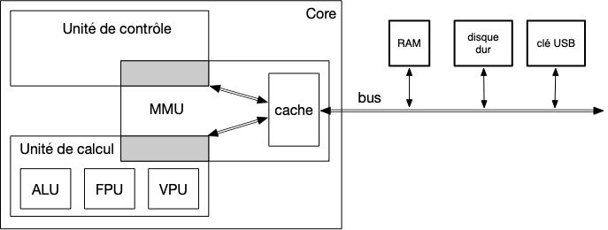
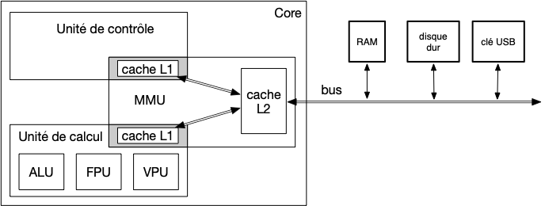

Le [cache](https://en.wikipedia.org/wiki/CPU_cache) est une technique permettant d'accélérer l'accès à la mémoire, bien plus lent que le core.

Pour cela, on utilise la technique de la [mémoire cache](https://fr.wikipedia.org/wiki/M%C3%A9moire_cache), qui est un intermédiaire entre la mémoire et le processeur :



Cette [hiérarchie de mémoire](https://fr.wikipedia.org/wiki/Hi%C3%A9rarchie_de_m%C3%A9moire) allant de la mémoire la plus lente (et donc la plus abondante car la moins chère) à la mémoire la plus rapide (et donc peu nombreuse car très chère) permet d'accélérer les accès sous certaines conditions d'utilisation.


Un cours sur les [caches et la hiérarchie de la mémoire](https://computationstructures.org/lectures/caches/caches.html). Va du transistor au *dirty bit*.


## Principe

Le principe est le suivant. Pour accéder à une case mémoire, on commence par regarder si la case demandée est dans le cache. Si oui, on rend la case depuis le case, si non on la cherche en mémoire, la met dans le cache et la rend.

Utiliser un intermédiaire fonctionne si l'intermédiaire :

- est plus rapide
- possède souvent la ressource demandée

Prenons un exemple pour se fixer les idées (exemple tirée de [Real-Time Systems Design and Analysis: Tools for the Practitioner](https://staff.emu.edu.tr/alexanderchefranov/Documents/CMSE443/CMSE443%20Spring2020/Laplante2012%20Real-Time%20Systems%20Design%20and%20Analysis.pdf), 2.2.3). On suppose que :

- l'accès à la ressource via la mémoire coûte 100ns
- l'accès à la ressource via le cache coûte 20ns
- le pourcentage de chance que le cache ait la ressource (*hit ratio*) est de 73%.

Le temps moyen d'accès à une ressource est alors :

$$
.73 \cdot 20\text{ns} + (1-.73) \cdot 100\text{ns} \simeq 42\text{ns}
$$

On gagne du temps !

Ce gain est dépendant du *hit ratio*. Plus il est proche de 1, mieux c'est. Le *hit ratio* minimal est atteint lorsque le temps d'accès moyen est égal au temps d'accès sans cache, $100-20=80\text{ns}$, obtenu pour 25%.

Pour que cette technique fonctionne, il faut des connaissances a priori sur la structuration mémoire des informations dont aura besoin le processeur (opcodes et données). Cette information est [le principe de localité](https://fr.wikipedia.org/wiki/Principe_de_localit%C3%A9_(informatique)) (*locality of reference*) :

- **localité spatiale** : les adresses proche en mémoire auront tendance à être accédée ensemble : c'est le cas pour les instructions, la prochaine instruction est contiguë à l'adresse de l'instruction précédente (s'il n'y a pas d'appel de fonction ou de boucle)
- **localité temporelle** une adresse déjà accédée aura tendance à être re-accédée : pensez aux itérateurs de boucles par exemple.

Des deux constatations précédentes on en déduit que :

1. la lecture de donnée de la mémoire en cache doit lire plusieurs adresses contiguës en une fois
2. on doit conserver le plus longtemps possible les données stockées dans le cache.

Par exemple si à la place de lire 8B (64b, la taille d'un registre) par 8b de la mémoire, on en lit 32B (soit 4 fois plus), le premier principe de localité nous assure un *hit ratio* de 75% environ (1 miss nous assure 3 hits consécutifs si on accède successivement à chaque case) !

```
Mémoire : 12345678
Lecture : X        -> miss
Cache   : 1234     -> on remplit le cache
Lecture    X       -> hit
Lecture     X      -> hit
Lecture      X     -> hit
Lecture       X    -> miss
Cache   :     5678 -> on remplit le cache
```

On ne peut bien sur par remplacer la totalité de la mémoire par le cache car cela coûterait trop cher (le coût d'une mémoire augment exponentiellement avec sa vitesse...), mais on peut ajouter un level de cache (niveau L2) avec de la mémoire plus rapide que la RAM mais moins rapide que le premier cache (niveau L1), pour accélérer encore le processus (le vitesse de la mémoire cache L2 étant moins rapide que celle du cache L1, on peut en mettre plus ce qui augmente le hit ratio).

Reprenons l'exemple précédent et supposons qu'on ajoute un cache de temps d'accès $60\text{ns}$ et de hit ratio 89%. Le temps moyen d'accès à une ressource devient :

$$
.73 \cdot 20\text{ns} + (1-.73)\cdot .89 \cdot 60\text{ns} (1-.73)\cdot (1- .89) \cdot 100\text{ns} \simeq 32\text{ns}
$$

On gagne du temps !

C'est ce qui se fait en vrai, avec un cache spécifique pour les instructions et un autre pour les données :




<https://en.wikipedia.org/wiki/Cache_hierarchy>


## Exemple réel

Le [core sunny cove](https://en.wikichip.org/wiki/intel/microarchitectures/sunny_cove#Block_diagram) de l'architecture Ice lake vu précédemment possède deux caches L1 :

- Un cache de 32KiB pour les instructions
- Un cache de 42KiB pour les données

Et un cache de niveau L2 de 512KiB en entrée de core.

Il y a deux caches L1 car les instructions auront tendance à avoir une plus forte localité spatiale que temporelle alors que c'est le contraire pour les données. La mise en œuvre des deux caches peut donc être différente pour améliorer le *hit ratio*.

Les systèmes actuels ont même un cache L3, à l'extérieur du [core](https://fr.wikipedia.org/wiki/Core_(microarchitecture)) (mais à l'intérieur du processeur).


On le voit sur le [diagramme du processeur](https://en.wikichip.org/wiki/intel/microarchitectures/ice_lake_(client)#Block_Diagram).

## Mise en œuvre


<https://en.wikipedia.org/wiki/Cache_placement_policies>


L'idée principale est découper le cache en lignes, chaque ligne correspondant à une lecture. Pour savoir à quelle adresse correspond une ligne, il faut lui associer un index.

Pour expliquer les diverses implémentations, prenons une [NES](https://fr.wikipedia.org/wiki/Nintendo_Entertainment_System), d'adressage 8b, et supposons qu'elle possède un cache fictif de 32B et une lecture de 4B par cycle.

Cette lecture va constituer une entrée du cache, un cache de 32B peut en contenir 8. Ler cache est un tableau de 8 lignes de 4B.

On peut de plus considérer sans perte de généralité que chaque lecture se fait à une adresse multiple de 4, ce qui fait qu'il y a $2^6$ lectures possibles. On peut découper une adresse 8b en 2 partie :

- l'offset (O): qui correspond à la position de l'adresse dans un  paquet de 4B et est codé sur les deux derniers bits de l'adresse
- le tag (T) : les 6 premiers bits de l'adresse qui détermine une lecture possible

```
 tag    offset
TTTTTT    OO
```

Ainsi, l'adresse `10110011` :

- de tag `101100`
- d'offset `11`
- sera présent dans la lecture de l'adresse `10110000`

Il existe plusieurs manières de gérer le cache. Commençons par montrer celle qui va maximiser la localité temporelle.

### Cache "full associatif"

Pour maximiser la localité temporelle, il faut conserver nos données le plus longtemps possible. Pour ceci, on va associer à chaque ligne du cache le tag de l'adresse stockée.

Commençons par un cache vide.

```
  tag  | indice |      ligne du cache (offset)
       |        |       11      10      01      00       
--------------------------------------------------       
       |    0   | 
       |    1   | 
       |    2   |
       |    3   |
       |    4   |
       |    5   | 
       |    6   |
       |    7   |
```

Après une lecture, supposons que l'on ai lu l'adresse `00000000` dans laquelle il y avait les bits `10000000000010000000100011100000`, cache est devenu :

```
  tag  | indice |      ligne du cache (offset)
       |        |       11      10      01      00
--------------------------------------------------              
000000 |    0   | 10000000000010000000100011100000
       |    1   | 
       |    2   |
       |    3   |
       |    4   |
       |    5   | 
       |    6   |
       |    7   |
```

On peut ensuite lire les deux autres adresses :

- `11010100` : `11000111000111001111000111010001`
- `00110100` : `11111010101011111111111111101001`

Et notre cache est :

```
  tag  | indice |      ligne du cache (offset)
       |        |       11      10      01      00
--------------------------------------------------              
000000 |    0   | 10000000000010000000100011100000
110101 |    1   | 11000111000111001111000111010001
001101 |    2   | 11111010101011111111111111101001
       |    3   |
       |    4   |
       |    5   | 
       |    6   |
       |    7   |
```

A chaque nouvelle entrée dans le cache, il faut vérifier qu'il n'y est pas déjà en regardant le tag de chaque entrée. Lorsque le cache grossi, cette opération devient de plus en plus importante. 

On ne peut mettre en œuvre cette stratégie sur des caches réels car la vérification de toutes les lignes de cache avant lecture est prohibitive en temps

### Cache à accès direct

La stratégie opposée au cache full associatif est de ne laisser qu'une seule possibilité de ligne par lecture. La stratégie classiquement utilisé pour cela est de scinder les lectures possibles en autant de lignes du cache et d'associer à chaque lecture une ligne spécifique au cache. Comme on s'arrange pour que le nombre de ligne du cache soit une puissance de 2, ceci se fait simplement en scindant l'adresse de lecture en trois :

- l'offset (O): l'emplacement dans la ligne qui correspond aux 2 derniers bit de l'adresse
- l'index (I): la ligne dans laquelle ranger la lecture. Comme il y a 8 lignes, ceci correspond à 3 bit. On prend ceux qui suivent l'offset
- le tag (T) : les autres bits qui permettrons de distinguer une adresse d'une autre dans le cache

```
tag index offset
TTT  III    OO
```

Ainsi, l'adresse `10110011` :

- de tag `101`
- d'index `100` sera à la 5ème ligne du cache
- d'offset `11`
- sera lue pour la lecture de l'adresse `10110000`

Le cache à accès direct vide est de la même forme qu'un cache full associatif. Seule le tag est plus petit :

```
  tag  | indice |      ligne du cache (offset)
       |        |       11      10      01      00       
--------------------------------------------------       
       |    0   | 
       |    1   | 
       |    2   |
       |    3   |
       |    4   |
       |    5   | 
       |    6   |
       |    7   |
```

Après une lecture, supposons que l'on ai lu l'adresse `00000000` dans laquelle il y avait les bits `10000000000010000000100011100000`. Puisque `00000000` est de :

- tag `000`
- d'index `000` (d'indice 0)

Le cache est devenu :

```
  tag  | indice |      ligne du cache (offset)
       |        |       11      10      01      00       
--------------------------------------------------       
  000  |    0   | 10000000000010000000100011100000
       |    1   | 
       |    2   |
       |    3   |
       |    4   |
       |    5   | 
       |    6   |
       |    7   |
```

Remarquez que l'on retrouve l'adresse en écrivant l'indice de ligne en binaire sur 3 bit :

- tag : `000`
- indice : `0 = 000`

Faisons le pour se fixer les idées :

```
  tag  | index | indice |      ligne du cache (offset)
       |       |        |       11      10      01      00       
----------------------------------------------------------
  000  |  000  |    0   | 10000000000010000000100011100000
       |  001  |    1   | 
       |  010  |    2   |
       |  011  |    3   |
       |  100  |    4   |
       |  101  |    5   | 
       |  110  |    6   |
       |  111  |    7   |
```

On ajoute au cache l'adresse `11010110`. On a :

- tag : `110`
- indice : `101 = 5`
- offset : `10`
- lecture de l'adresse `11010100`

Après le remplissage du cache on a :

```
  tag  | index | indice |      ligne du cache (offset)
       |       |        |       11      10      01      00       
----------------------------------------------------------
  000  |  000  |    0   | 10000000000010000000100011100000
       |  001  |    1   | 
       |  010  |    2   |
       |  011  |    3   |
       |  100  |    4   |
  110  |  101  |    5   | 11000111000111001111000111010001
       |  110  |    6   |
       |  111  |    7   |
```

Remarquez ue vérifier si une ligne est déjà dans le cache est automatique, il suffit de regarder le tag de la ligne d'indice l'index de l'adresse.

Enfin, la lecture de l'adresse `00110100` va remplacer une ligne du cache puisque l'index `101` est déjà pris. On obtient :

```
  tag  | index | indice |      ligne du cache (offset)
       |       |        |       11      10      01      00       
----------------------------------------------------------
  000  |  000  |    0   | 10000000000010000000100011100000
       |  001  |    1   | 
       |  010  |    2   |
       |  011  |    3   |
       |  100  |    4   |
  001  |  101  |    5   | 11111010101011111111111111101001
       |  110  |    6   |
       |  111  |    7   |
```

L'intérêt de cette méthode est qu'elle est très rapide, on a qu'un tag à vérifier. En revanche, la localité temporelle est pauvre : on ne stocke pas longtemps nos données.

La solution adopté dans les cache réel est un mix des deux méthodes précédentes

### Cache $n$-way

Cette stratégie utilise de façon local un cache associatif. Plutôt que de laisser une unique possibilité de placement pour chaque adresse, on en laisse $n$.

Si par exemple on veut créer un cache 2-way :

- chaque adresse doit avoir deux emplacements possibles
- on a 8 lignes de cache au total

Il faut donc séparer toutes les adresse en 4 parties. En reprenant le découpage du cache à accès direct cela donne :

- un tag sur 4 bits
- un index sur 2 bits (4 possibilités)
- un offset sur 2b (4B de lue par lecture)

```
tag  index offset
TTTT   II    OO
```

Le cache s'organise alors :

```
  tag  | index | indice |      ligne du cache (offset)
       |       |        |       11      10      01      00       
----------------------------------------------------------
       |   00  |    0   | 
       |   00  |    1   | 
       |   01  |    2   |
       |   01  |    3   |
       |   10  |    4   |
       |   10  |    5   | 
       |   11  |    6   |
       |   11  |    7   |
```

Après la lecture de l'adresse `00000000` on a le cache : 

```
  tag  | index | indice |      ligne du cache (offset)
       |       |        |       11      10      01      00       
----------------------------------------------------------
 0000  |   00  |    0   | 10000000000010000000100011100000
       |   00  |    1   | 
       |   01  |    2   |
       |   01  |    3   |
       |   10  |    4   |
       |   10  |    5   | 
       |   11  |    6   |
       |   11  |    7   |
```

Après la lecture de l'adresse `11010100` :


```
  tag  | index | indice |      ligne du cache (offset)
       |       |        |       11      10      01      00       
----------------------------------------------------------
 0000  |   00  |    0   | 10000000000010000000100011100000
       |   00  |    1   | 
 1101  |   01  |    2   | 11000111000111001111000111010001
       |   01  |    3   |
       |   10  |    4   |
       |   10  |    5   | 
       |   11  |    6   |
       |   11  |    7   |
```


Et après la lecture de `00110100` :

```
  tag  | index | indice |      ligne du cache (offset)
       |       |        |       11      10      01      00       
----------------------------------------------------------
 0000  |   00  |    0   | 10000000000010000000100011100000
       |   00  |    1   | 
 1101  |   01  |    2   | 11000111000111001111000111010001
 0011  |   01  |    3   | 11111010101011111111111111101001
       |   10  |    4   |
       |   10  |    5   | 
       |   11  |    6   |
       |   11  |    7   |
```

On remarque que cette dernière lecture n'a pas effacé la ligne de cache, il restait une possibilité !

La vitesse d'exécution diminue drastiquement avec l'augmentation de $n$, puisqu'il faut vérifier $n$ tag pour un index donné, il est nécessaire de trouver pour chaque cache une valeur adaptée à la localité des données qu'il devra lire.

C'est pourquoi les caches réels (voir le sunny cove core) vont avoir un $n$ plus petit pour le cache des instructions que celui des données, de plus forte localité temporelle.

### Stratégie de remplacement des caches $n$-way

Si le cache est plein et que l'on doit ajouter une ligne, il faut remplacer une ligne de cache par la nouvelle. Mais laquelle ?

Plusieurs stratégies existent, chacune ayant ses pour et ses contre :

- la moins récemment lue
- la plus ancienne ajoutée (remarquez que ce n'est pas forcément la moins récemment lue)
- random
- ...


[Stratégies de remplacement du cache](https://en.wikipedia.org/wiki/Cache_replacement_policies)


La moins récemment lue serait la stratégie qui maximiserait la localité temporelle, mais elle est compliquée à implémenter puisqu'il faut garder en mémoire l'ordre d'écriture en cache de toute les lignes. On utilise alors une approximation, plus rapide à calculer :


[Stratégies pseudo-moins récemment lu](https://en.wikipedia.org/wiki/Pseudo-LRU)


## Caches L1 du sunny cove core

Le [sunny cove core](https://en.wikichip.org/wiki/intel/microarchitectures/ice_lake_(client)#Block_Diagram)e à deux cache L1 :

- pour les instructions. C'est un cache de 32KiB 8-way
- pour les données. C'est un cache de 48KiB 12-way

On voit bien l'adaptation à la localité des instruction (plus spatiale que temporelle) ou des données (plus temporelle que spatiale).

Le cache d'instruction peut contenir $32 \cdot 1024 /64 = 512$ lignes de 64B. Comme c'est un cache 8-way, la numérotation est de $512/8 = 64 = 2^6$, le découpage est donc :

- les 6 derniers bit pour la lecture
- les 6 précédents pour la numérotation du paquet de 8 lignes
- les $64-6-6=52$ premiers bits comme index.

## Écrire en mémoire


<https://en.wikipedia.org/wiki/Cache_replacement_policies>


Lorsque l'on écrit des données en mémoire, ce sont des données qui étaient initialement dans le cache.

On commence par écrire la donnée modifiée dans le cache pour un usage future, mais en faisant ça on perd la cohérence entre la mémoire et le cache. Les deux valeur ne sont plus égale.

On pourrait re-écrire directement en mémoire mais c'est à la fois coûteux et inutile (on a modifié la donnée dans le cache).

Il est plus malin de mettre à jour la mémoire lorsque la ligne contenant la donnée modifiée est supprimée. Pour cela, on ajoute au cache un bit de contrôle nommé *dirty bit* :

- lorsqu'une donnée en cache est modifiée on place le dirty bit de sa ligne à 1
- lorsqu'une ligne est supprimée du cache, si son dirty bit est à un, on recopie les données en mémoire.

### Hiérarchie des caches

> TBD ici

L1, L2 et L3

> TBD on peut supprimer de L2 sans supprimer de L1 et réciproquement
> mais pas pour L3. Sert pour le dirty bit chacune des lignes de L1 et L2 est dans L3.
>
> 
- même taille de ligne
- L3 inclusive si dans l1 alors dans l2 et si dans l2 alors dans l3

si écrire dans cache L1, le supprimer du cache L2 et dire dans L3 qu'il est modifié dirty bit

si supprime dans L1/2 et plus dans L2/1 on écrit en mémoire si dirty bit et on supprime de L3

Une adresse supprimée du cache L3 est automatiquement supprimée du cache L2 et/ou L1 auquel il appartient.

Sinon, snoop. pour supprimer/invalider les cache pas ok.

### cache et I/O mapping

Il ne faut pas garder en cache des adresses servant à communiquer avec un device (IO mapping). En effet, chaque appel à cette adresse va donner un résultat différent.

Le core met en place un [masque](https://fr.wikipedia.org/wiki/Masquage) pour ne pas mettre ces adresses dans le cache. On peut par exemple supposer que seules les adresse IO mappées ont un bit précis d'adresse à 1.

Le deuxième cas où les adresse de caches sont invalides est lorsqu'il y a eu accès à la mémoire par DMA. Toute adresse modifiée par DMA est marquée invalide au niveau du cache L3. Ceci déclenche le mécanisme de suppression des caches L1 et/ou L2

### Conséquences

Lorsque l'on code, il faut éviter les défaut de cache. Il faut donc maximiser les localité temporelles et spatiales. S'il est difficile de contrôler les localité temporelles, on peut s'attacher à respecter les localités temporelles.

Par exemple : si on lit une matrice ligne à ligne il ne faut pas la stocker colonne par colonne.

Le cache aide aussi à la DMA : si le core peur travailler en cache, il peut laisser les accès disques s'effectuer.
