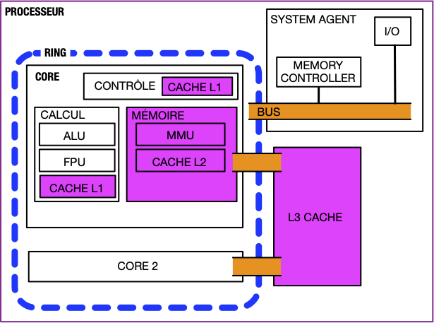

Un processeur est composé de deux parties :

- les cores
- le system agent


Certains processeur possèdent également une carte graphique intégrée.


Ces deux éléments communiquent via des bus permettant de transmettre 64b en parallèle (parfois plus).


[Anatomie d'un bus](./bus){.interne}


Chaque core est une unité dont le but est de procéder à des calculs.


[core](./core){.interne}


Les cores travaillent indépendamment mais nécessitent d'être au courant des voisins pour que tout fonctionne :


[Interaction entre cores](./core){.interne}


> TBD redécouper [CPU](./CPU){.interne} ce qui précède.
