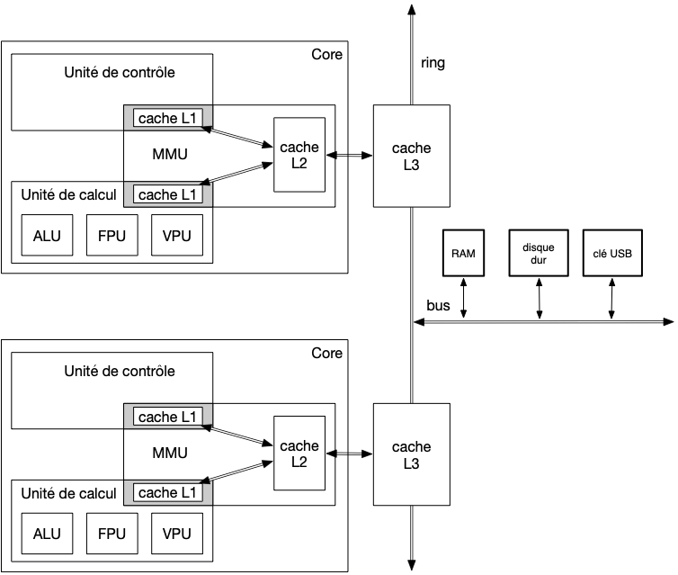

Un processeur possède plusieurs core qui s'exécutent de façon parallèle. Le l'[architecture ice lake (client)](https://en.wikichip.org/wiki/intel/microarchitectures/ice_lake_(client)) possède 4 cœurs par exemple.

Pour que tout se passe au mieux, il faut garantir que les ressources partagées comme les disques et la mémoires soient parfaitement accessibles et cohérente pour chaque core.

## Organisation des cores

### ring

Le ring est un bus spécial faisant le lien :

- entre les core et le matériel
- entre les cores entre eux

### Cache L3

Le cache L3 est partagé entre tous les cores. Il possède plusieurs accès répartis en *slice*, se répartissant l'adressage physique. Si chaque core fait tourner des process ayant une plage de mémoire physique différente, ils pourront accéder au cache en parallèle.

## Multi-process

La gestion des process multiples est essentiellement traitées par le noyau ou les thread eux-même.

Pour éviter tout soucis de [race condition](https://en.wikipedia.org/wiki/Race_condition), il **faut** utiliser des mécanismes de protection des données partagées en écriture côté code.

Le processeur doit juste faire attention à la cohérence des données traitées par chaque core, c'est à dire essentiellement le cache. Ceci se fait habituellement :

- en élargissant le *snoop filter* aux lignes de caches de tous les core. 
- en propageant les invalidations à tous les caches, via le cache L3 partagé (ses enfants sont les caches L2 de chaque core)

Ceci ajoute un overhead, mais il est compensé par le gain d'exécution en parallèle des thread, en particulier si les cores se partitionnent (via l'OS) la mémoire physique utilisées (minimise les lignes communes dans deux cache de core différent)
